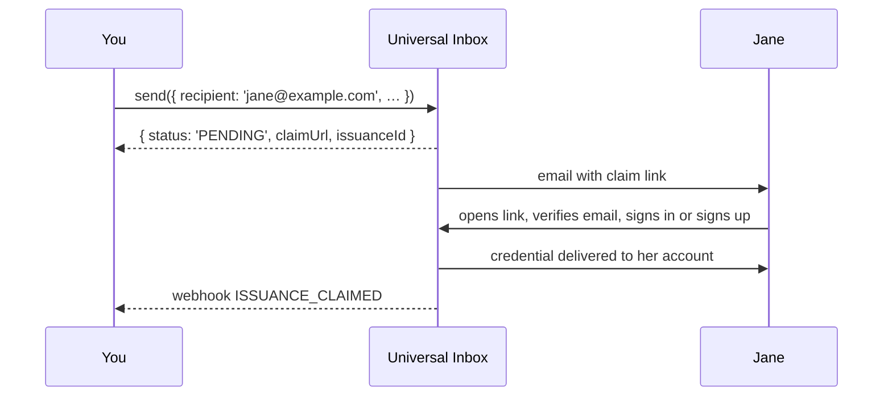

# Universal Inbox

The Universal Inbox is what lets you send a credential to an **email address or phone number** instead of a LearnCard account. It's why `send({ recipient: 'jane@example.com' })` works even when Jane has never heard of LearnCard.

## What it does

When the recipient isn't a LearnCard profile, the network:

1. Holds the credential in an inbox keyed to that email or phone.
2. Sends the recipient a message — your name, what they've received, and a claim link.
3. When they follow the link, walks them through signing in or creating an account.
4. Delivers the credential into the account they just proved they own, and tells you it was claimed.

If the recipient **already** has a LearnCard account with that email or phone verified, steps 2–3 are skipped: the credential goes straight to their account and your `send()` comes back with `status: 'ISSUED'` instead of `'PENDING'`.

## What it doesn't do

It never creates an account for the recipient. The person proves they control the address, then creates or unlocks their own account with their own key. You get an inbox record and a claim status; you never get their account or their key. The invitation is centralized (an email), the result is not.

## Things you'll rely on

- **`claimUrl`** — returned on every `PENDING` send. Pass `suppressDelivery: true` to skip the email and deliver the link yourself (in your own email, on a receipt, in a QR code).
- **`issuanceId`** — the handle for this send. Webhooks reference it; use it to reconcile.
- **Guardian gating** — add `options.guardianEmail` and a parent must approve before the recipient can claim. Once a guardian has a LearnCard account managing the child, every future send to that child is gated automatically. See [Guardian-Gated Credentials](../../how-to-guides/send-credentials.md#guardian-gated-credentials).
- **Phone delivery** is limited to issuers listed in the [trusted registry](../identities-and-keys/trust-registries.md).

## Build with it

- [Send & Issue Credentials](../../how-to-guides/send-credentials.md) — the `send()` call and its response
- [Know When a Credential Is Claimed](../../tutorials/listen-to-webhooks.md) — the webhooks
- [Universal Inbox API](../../sdks/learncard-network/universal-inbox-api.md) — the lower-level REST surface
