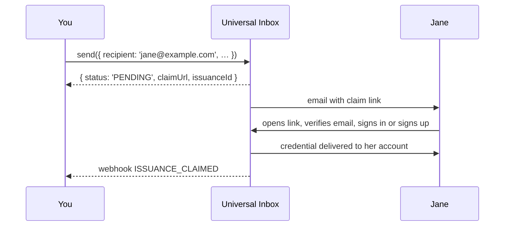

# Universal Inbox

The Universal Inbox is what lets you send a credential to an **email address or phone number** instead of a LearnCard account. It's why `send({ recipient: 'jane@example.com' })` works even when Jane has never heard of LearnCard.

## What it does

When the recipient isn't a LearnCard profile, the network:

1. Holds the credential in an inbox keyed to that email or phone.
2. Sends the recipient a message — your name, what they've received, and a claim link.
3. When they follow the link, walks them through signing in or creating an account.
4. Delivers the credential into the account they just proved they own, and tells you it was claimed.

If the recipient **already** has a LearnCard account with that email or phone verified, steps 2–3 are skipped: the credential goes straight to their account and your `send()` comes back with `status: 'ISSUED'` instead of `'PENDING'`.



## What it doesn't do

It never creates an account for the recipient. The person proves they control the address, then creates or unlocks their own account with their own key. You get an inbox record and a claim status; you never get their account or their key. The invitation is centralized (an email), the result is not.

## Things you'll rely on

- **`claimUrl`** — returned on every `PENDING` send. Pass `suppressDelivery: true` to skip the email and deliver the link yourself (in your own email, on a receipt, in a QR code).
- **`issuanceId`** — the handle for this send. Webhooks reference it; use it to reconcile.
- **Guardian gating** — add `options.guardianEmail` and a parent must approve before the recipient can claim. Once a guardian has a LearnCard account managing the child, every future send to that child is gated automatically. See [Guardian-Gated Credentials](../../how-to-guides/send-credentials.md#guardian-gated-credentials).
- **Phone delivery** is limited to issuers listed in the [trusted registry](../identities-and-keys/trust-registries.md).

## Security and retention

Until the recipient has an account there is no recipient key to encrypt to, so the network holds the waiting credential encrypted to itself. At claim time it decrypts once, saves a copy encrypted only to the claimant's DID, marks the claim issued, and deletes the service-readable copy — all in one transaction. After that, neither the network nor you can read it.

- **Claim window.** `send()` and `/inbox/issue` hold a credential for **30 days** by default; embedded claim buttons default to 720. Set `options.expiresInDays` on `send()` (or `configuration.expiresInDays` on the inbox routes), 1–720, to shorten it. Use the shortest practical window for transcripts, CLRs, and other sensitive learner records. This controls how long the payload is claimable, not the credential's own validity dates.
- **Claims are single-use.** Once delivered, re-running the claim returns nothing new. Clients should persist what they receive immediately.
- **Recovery.** If the claiming client loses the response, the same DID can fetch its deliveries for **seven days** via `POST /inbox/deliveries` (`inbox:read` scope) or `learnCard.invoke.recoverInboxCredentials()`. Records come back as `{ id, credential, expiresAt }` with `credential` as a JWE the holder decrypts locally; use `id` to deduplicate.
- **Issuer routes return metadata only.** `/inbox/issued`, `/inbox/credentials/{id}`, and the `/inbox/claim` tracking record never include the credential body. Content is only available through the claim response or recovery.

Direct deliveries to existing accounts don't go through this escrow; they are stored to the recipient before the inbox receipt is written and remain readable to both parties.

## Build with it

- [Send & Issue Credentials](../../how-to-guides/send-credentials.md) — the `send()` call and its response
- [Know When a Credential Is Claimed](../../tutorials/listen-to-webhooks.md) — the webhooks
- [Universal Inbox API](../../sdks/learncard-network/universal-inbox-api.md) — the lower-level REST surface

## Batch Issuance

Use `POST /inbox/issue-batch` (tRPC `inbox.issueBatch`) or
`learnCard.invoke.sendCredentialsViaInbox(batch)` to queue 1–100 credentials.
Submission requires `inbox:write`; polling requires `inbox:read` and the submitting
issuer profile. Single issuance stays synchronous.

```typescript
const receipt = await learnCard.invoke.sendCredentialsViaInbox({
    requestId: 'semester-2026-chunk-001',
    configuration: {
        signingAuthority: { endpoint: 'https://issuer.example/sign', name: 'default' },
    },
    items: [
        {
            recipient: { type: 'email', value: 'student@example.com' },
            credential: transcript,
            idempotencyKey: 'semester-2026-student-001',
        },
    ],
});

const deadline = Date.now() + 10 * 60 * 1000;
let batch = await learnCard.invoke.getInboxCredentialBatch(receipt.batchId);
while (batch.summary.pending > 0 && Date.now() < deadline) {
    await new Promise(resolve => setTimeout(resolve, 2000));
    batch = await learnCard.invoke.getInboxCredentialBatch(receipt.batchId);
}
// A polling timeout does not cancel work. Keep batchId to check again later.
const failedItems = batch.items.filter(item => item.result?.success === false);
```

Submission returns HTTP **202** with `batchId`, `status: 'QUEUED'`, and `createdAt`.
Replaying a `requestId` returns the original batch ID with its current processing state.
Poll `GET /inbox/batches/{batchId}` for ordered `items`, each with an `index`,
processing `state`, and a `result` when available. Results retain their `success`
flag and issuance details or error. The summary reports `total`, `succeeded`,
`failed`, `deduplicated`, `completed`, `pending`, and `unconfirmed`.
Results remain available for 30 days after all items finish processing, including
items marked `NEEDS_RECONCILIATION`.

Batch states are `QUEUED`, `PROCESSING`, `COMPLETED`, and `NEEDS_RECONCILIATION`.
The last state can coexist with unfinished items; use `summary.pending` to check
for work remaining. Credential status `PENDING` means waiting for a claim, which is
separate from queue processing.

Batch configuration supplies defaults. Item configuration overrides it with a
deep merge; arrays replace defaults. The existing signing, claiming, webhook,
guardian, and tenant-branding behavior applies. Both single and batch issuance
accept `configuration.guardianEmail`; it must differ from the recipient email,
ignoring case. Batches validate this after configuration merging.

### Retries and recovery

An optional `requestId` (1–256 characters) makes submission retries safe for 24 hours.
The same issuer, payload, and tenant context return the original receipt without
another quota charge. Reusing it with changed input returns HTTP 409.

An optional item `idempotencyKey` (up to 256 characters) durably stores a successful
result for 24 hours per issuer. Reusing it returns the same issuance with
`deduplicated: true`, without another credential, email, or webhook. Changed input
or an overlapping attempt returns a per-item `CONFLICT`. Within a batch, only the
first occurrence of a key is attempted; later occurrences always conflict.

Validation, preparation, and explicitly side-effect-free preflight failures release
the key. Correct the input and resubmit that item under the same item key, using a
new batch request ID. Transient preparation and signing failures retry up to five
worker attempts before delivery begins. Signing retries can leave unused credential-status
allocations, but do not repeat delivery. Worker retries do not consume additional quota.

If a worker fails after delivery or inbox persistence may have started, it does not automatically issue
again. The item is flagged for reconciliation and its reservation remains blocked
until resolved, beyond the normal 24-hour replay window. If known, `issuanceId`
and `claimUrl` accompany the failure. Check the issuer's sent inbox records and
contact support; do not work around uncertainty with a new key. This is not an
exactly-once transaction across credential storage, email, and webhooks.

Jobs, quotas, results, replay reservations, and dispatch records live in Neo4j.
Payloads and results are encrypted at rest. Once no items remain queued or processing,
the original batch payload is removed. Job metadata and results are pruned after
30 days, even when an outcome is unconfirmed; unresolved client-keyed replay reservations
remain blocked until reconciliation. Internal reservations for unkeyed items are collected
after their batch items are pruned. Save any returned reconciliation IDs before results expire.
Redis is still used by other inbox features, but is not the batch
job store.

### Limits and background processing

Each request supports at most **100 items** and **4 MiB (4,194,304 bytes)** of JSON.
Oversized requests return 413. Keep margin for the Lambda invocation envelope and
split large CLR batches by bytes as well as item count.

The default quota is **10,000 admitted items per hour per issuer**, including
item replays and failures. Rejected batches consume no units: at 9,950/10,000, a
rejected 100-item batch still leaves room for 50 items. Admission is atomic.
Operators can set `INBOX_BATCH_ITEMS_PER_HOUR`; on HTTP 429, wait for the current
window to expire (at most 3,600 seconds).

The HTTP request persists admission without waiting for signing or delivery.
A dedicated SQS queue runs up to ten inbox workers independently of notifications.
The dispatcher normally publishes work within one minute and retries publication
failures using durable dispatch records. After SQS accepts a message, the durable
outbox schedules a 30-minute fallback publication in case delivery never occurs.
Each worker has a five-minute timeout.
Interrupted preparation can retry; interrupted issuance may require reconciliation.
Queue redelivery does not repeat a completed item.

### Local development and operations

From `services/learn-card-network/brain-service`, run
`docker compose -f compose.inbox.yml up -d`. Set:

```bash
INBOX_QUEUE_ENDPOINT=http://localhost:9324
INBOX_QUEUE_URL=http://localhost:9324/000000000000/inbox
INBOX_DEAD_LETTER_QUEUE_URL=http://localhost:9324/000000000000/inbox-dlq
```

Run `bun run inbox:worker` alongside the existing backend and its usual dependencies.
There is no inline fallback when queue configuration is missing. Restarting the
worker leaves accepted jobs intact.

Run `bun run test:inbox:e2e` for isolated Neo4j, Redis, and SQS emulator tests.
Monitor queue age, dead-letter depth, dispatcher failures, and unconfirmed items.
Worker concurrency is configured on the dedicated queue in Serverless. The queues
are isolated, but inbox workers still share database and signing-service capacity.
