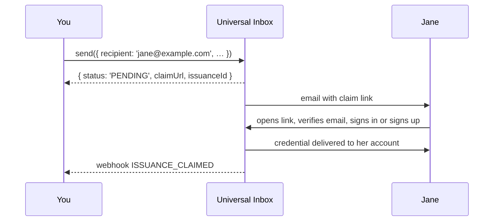

# Universal Inbox

The Universal Inbox is what lets you send a credential to an **email address or phone number** instead of a LearnCard account. It's why `send({ recipient: 'jane@example.com' })` works even when Jane has never heard of LearnCard.

## What it does

When the recipient isn't a LearnCard profile, the network:

1. Holds the credential in an inbox keyed to that email or phone.
2. Sends the recipient a message — your name, what they've received, and a claim link.
3. When they follow the link, walks them through signing in or creating an account.
4. Delivers the credential into the account they just proved they own, and tells you it was claimed.

If the recipient **already** has a LearnCard account with that email or phone verified, steps 2–3 are skipped: the credential goes straight to their account and your `send()` comes back with `status: 'ISSUED'` instead of `'PENDING'`.



## What it doesn't do

It never creates an account for the recipient. The person proves they control the address, then creates or unlocks their own account with their own key. You get an inbox record and a claim status; you never get their account or their key. The invitation is centralized (an email), the result is not.

## Things you'll rely on

- **`claimUrl`** — returned on every `PENDING` send. Pass `suppressDelivery: true` to skip the email and deliver the link yourself (in your own email, on a receipt, in a QR code).
- **`issuanceId`** — the handle for this send. Webhooks reference it; use it to reconcile.
- **Guardian gating** — add `options.guardianEmail` and a parent must approve before the recipient can claim. Once a guardian has a LearnCard account managing the child, every future send to that child is gated automatically. See [Guardian-Gated Credentials](../../how-to-guides/send-credentials.md#guardian-gated-credentials).
- **Phone delivery** is limited to issuers listed in the [trusted registry](../identities-and-keys/trust-registries.md).

## Security and retention

Until the recipient has an account there is no recipient key to encrypt to, so the network holds the waiting credential encrypted to itself. At claim time it decrypts once, saves a copy encrypted only to the claimant's DID, marks the claim issued, and deletes the service-readable copy — all in one transaction. After that, neither the network nor you can read it.

- **Claim window.** `send()` and `/inbox/issue` hold a credential for **30 days** by default; embedded claim buttons default to 720. Set `options.expiresInDays` on `send()` (or `configuration.expiresInDays` on the inbox routes), 1–720, to shorten it. Use the shortest practical window for transcripts, CLRs, and other sensitive learner records. This controls how long the payload is claimable, not the credential's own validity dates.
- **Claims are single-use.** Once delivered, re-running the claim returns nothing new. Clients should persist what they receive immediately.
- **Recovery.** If the claiming client loses the response, the same DID can fetch its deliveries for **seven days** via `POST /inbox/deliveries` (`inbox:read` scope) or `learnCard.invoke.recoverInboxCredentials()`. Records come back as `{ id, credential, expiresAt }` with `credential` as a JWE the holder decrypts locally; use `id` to deduplicate.
- **Issuer routes return metadata only.** `/inbox/issued`, `/inbox/credentials/{id}`, and the `/inbox/claim` tracking record never include the credential body. Content is only available through the claim response or recovery.

Direct deliveries to existing accounts don't go through this escrow; they are stored to the recipient before the inbox receipt is written and remain readable to both parties.

## Build with it

- [Send & Issue Credentials](../../how-to-guides/send-credentials.md) — the `send()` call and its response
- [Know When a Credential Is Claimed](../../tutorials/listen-to-webhooks.md) — the webhooks
- [Universal Inbox API](../../sdks/learncard-network/universal-inbox-api.md) — the lower-level REST surface

## Batch Issuance

Use `POST /inbox/issue-batch` (tRPC `inbox.issueBatch`) or
`learnCard.invoke.sendCredentialsViaInbox({ items, configuration })` to issue up to
100 credentials per request. The same `inbox:write` permission and signing,
claiming, guardian approval, webhook, and tenant email behavior apply as for single issuance.

```typescript
const batch = await learnCard.invoke.sendCredentialsViaInbox({
    configuration: {
        signingAuthority: { endpoint: 'https://issuer.example/sign', name: 'default' },
        webhookUrl: 'https://issuer.example/events',
    },
    items: [
        {
            recipient: { type: 'email', value: 'student@example.com' },
            credential: transcript,
            idempotencyKey: 'semester-2026-student-001',
        },
    ],
});

const failedItems = batch.results.filter(result => !result.success);
```

Batch configuration supplies defaults. Per-item configuration overrides it with a
deep merge; arrays in template data replace the corresponding default array.
Results preserve input order and include an `index`, a `success` flag, and either
issuance details or an error code and message. The summary counts total, successful,
failed, and deduplicated items. Individual failures still return HTTP 200. Invalid
batch input, authentication failure, an exceeded quota, or an oversized request
fail the whole request before issuance.

An optional `idempotencyKey` (up to 256 characters) caches a successful result for
24 hours per issuer. Reusing it returns `deduplicated: true` without another
credential, email, or webhook. Use a unique key for each intended issuance and reuse
it when retrying that issuance. The server atomically reserves each key before
issuance. Overlapping attempts return a per-item `CONFLICT`; once the first attempt
completes, a retry returns the cached success. Reusing a key with different input
also returns `CONFLICT`.

Validation and template-preparation failures release the key. If an error or process
termination occurs after issuance starts, the outcome may be uncertain: a credential
or email may already exist. The reservation remains for up to 24 hours to prevent
automatic duplicate issuance, and retries return `CONFLICT` until a successful
result is recorded. Check the issuer's sent inbox records and contact support to
reconcile an unconfirmed outcome; do not retry with a new key or assume expiry means
the original attempt failed. This is retry protection, not an exactly-once transaction
across credential storage, email, and webhooks. Production requires shared Redis;
batch issuance fails closed when it is not configured.

For 20,000 transcripts, send approximately 200 requests of 100 items, reducing the
chunk size when needed to keep each serialized JSON request at or below **4 MiB
(4,194,304 bytes)**. Oversized requests return HTTP 413. This conservative application
limit accounts for the Lambda deployment's
[6 MB synchronous invocation limit](https://docs.aws.amazon.com/lambda/latest/api/API_Invoke.html);
20 MB batches are not supported by that deployment. Gateway envelope overhead can
further reduce the usable size, so keep margin below the limit in clients.

The default quota is **10,000 submitted items per hour per issuer**, including
replays and failed attempts. A 20,000-item run must therefore span at least two quota
windows. On HTTP 429, wait for the hourly window to expire (at most 3,600 seconds).
Retry failed items with their original keys; after an uncertain transport failure,
retry the original chunk with the same keys. Internal concurrency defaults to 10.
Operators can set `INBOX_BATCH_ITEMS_PER_HOUR` and `INBOX_BATCH_CONCURRENCY` to
positive integers. Rate limiting the single-issue endpoint remains a separate follow-up.
