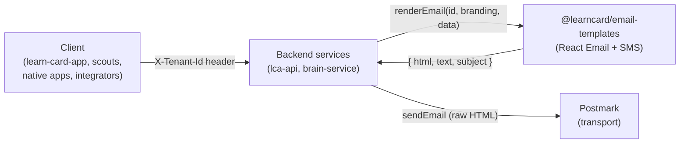
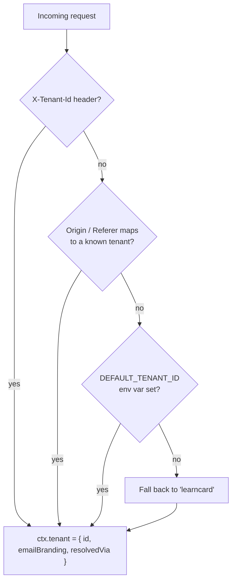
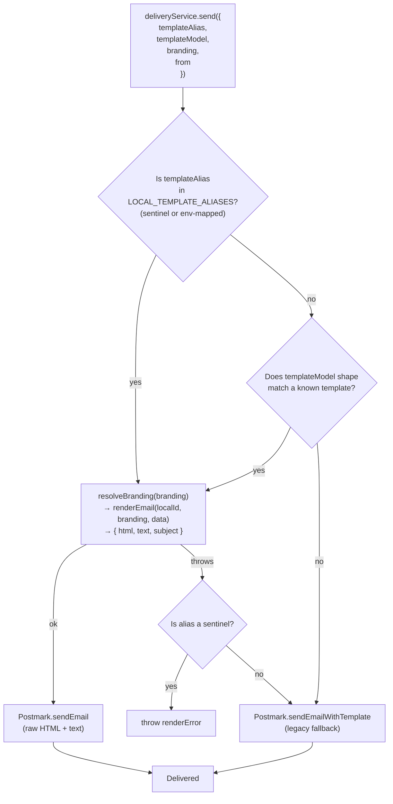

# Tenant-Branded Emails

LearnCard runs multiple products (LearnCard, VetPass, and partner tenants) from the same backend services. Every transactional email — login OTP, recovery key, inbox claim, endorsement request, guardian approval — is rendered **at send time** with the active tenant's branding so each product feels native, not like a generic LearnCard notification with a partner logo glued on.

This page explains how that works end-to-end. For operator-facing setup, see [Configure Tenant-Branded Emails](../how-to-guides/configure-tenant-branded-emails.md).

## The three moving parts



1. **The client** (web or native) tells the server which tenant it's acting on behalf of via the `X-Tenant-Id` request header.
2. **The backend service** (`lca-api` or `brain-service`) resolves that header into a `ResolvedTenant` in `createContext`, and passes its `emailBranding` into every `deliveryService.send()` call.
3. **`@learncard/email-templates`** renders a React Email template with the branding applied, returns `{ html, text, subject }`, and the service hands the raw HTML to Postmark.

Postmark's template engine is **not used** for any email that has a local template — it's only a fallback for legacy aliases that haven't been migrated yet.

## Tenant resolution (server-side)

Every request to `lca-api` and `brain-service` runs through `resolveTenantFromRequest(headers)` in `@learncard/email-templates`:



The resolution order is deliberate:

- **`X-Tenant-Id`** is explicit and wins over everything else. Native apps and any SSS client with `tenantId` configured always send it.
- **`Origin` / `Referer`** covers web browsers, which send the page origin but can't inject custom headers for all requests. Hostnames are looked up in `ORIGIN_MAP` with progressive subdomain stripping — `alpha.vetpass.app` matches the `vetpass.app` entry.
- **`DEFAULT_TENANT_ID`** env var is for server-to-server callers: cron jobs, webhooks, and per-tenant deploys that have no meaningful request headers.
- **`'learncard'`** is the final fallback.

`resolveTenantFromRequest()` returns a `ResolvedTenant`:

```typescript
interface ResolvedTenant {
    id: string;                              // 'vetpass' | 'learncard' | ...
    emailBranding: Partial<TenantBranding>;  // registry entry, or {} for unknown IDs
    resolvedVia: 'header' | 'origin' | 'env' | 'default';
}
```

In `lca-api`, this is attached to `ctx.tenant` in `@/services/learn-card-network/lca-api/src/routes/index.ts`. In `brain-service`, the same pattern.

## The branding registry

Tenant branding overrides live in `@/packages/email-templates/src/tenant-registry.ts`:

```typescript
const TENANT_EMAIL_BRANDING: Record<string, Partial<TenantBranding>> = {
    learncard: {},  // uses DEFAULT_BRANDING everywhere

    vetpass: {
        brandName: 'VetPass',
        logoUrl: 'https://vetpass.app/assets/icon/icon.png',
        primaryColor: '#1B5E20',
        // ...
    },
};
```

Every field is optional. `resolveBranding(partial)` in `@/packages/email-templates/src/branding.ts` fills in any missing fields from `DEFAULT_BRANDING`, so an unknown tenant renders as LearnCard rather than breaking.

This registry is the **single source of truth** for server-side branding today. The `email` section of `apps/learn-card-app/environments/<tenant>/config.json` is validated by `tenantEmailConfigSchema` but is **not yet wired** into the backend — tenants register branding via a PR to the package. Future work will let the config drive the registry.

## Render pipeline

Once `ctx.tenant.emailBranding` reaches `deliveryService.send()`, the `PostmarkAdapter`:



Key points:

- **Sentinel aliases** (`'recovery-key'`, `'recovery-email-code'`, `'login-verification-code'`, etc.) are pre-registered in `LOCAL_TEMPLATE_ALIASES` so callers can pass them directly without needing an env var override. This is the default path.
- **Heuristic matching** kicks in when a caller passes a real Postmark alias (e.g. from `POSTMARK_LOGIN_CODE_TEMPLATE_ALIAS`) and the adapter infers the local template from the `templateModel` shape.
- **When local render fails for a sentinel**, the adapter re-throws rather than falling through to `sendEmailWithTemplate`, because the sentinel alias doesn't exist in Postmark. You see the real rendering error instead of a confusing "template not found" from Postmark.
- **Fallback to Postmark's template engine** is reserved for legacy aliases that haven't been migrated yet. All currently-sent emails go through local rendering.

## Template IDs

Every transactional email has a stable local template ID that routes use as its `templateAlias`:

| Template ID | Service | Component |
|---|---|---|
| `login-verification-code` | lca-api | `VerificationCode` (login variant) |
| `recovery-email-code` | lca-api | `VerificationCode` (recovery variant) |
| `recovery-key` | lca-api | `RecoveryKey` |
| `endorsement-request` | lca-api | `EndorsementRequest` |
| `embed-email-verification` | brain-service | `VerificationCode` (embed variant) |
| `contact-method-verification` | brain-service | `EmailVerification` (link-based) |
| `inbox-claim` | brain-service | `InboxClaim` |
| `guardian-approval` | brain-service | `GuardianApproval` |
| `guardian-email-otp` | brain-service | `VerificationCode` (guardian variant) |
| `guardian-credential-approval` | brain-service | `GuardianCredentialApproval` |
| `guardian-approved-claim` | brain-service | `GuardianApprovedClaim` |
| `guardian-rejected-credential` | brain-service | `GuardianRejectedCredential` |
| `credential-awaiting-guardian` | brain-service | `CredentialAwaitingGuardian` |
| `account-approved` | brain-service | `AccountApproved` |

The full catalog, plus legacy Postmark alias mappings, lives in the [`@learncard/email-templates` README](https://github.com/learningeconomy/LearnCard/tree/main/packages/email-templates#template-ids).

## SSS strategy & the `X-Tenant-Id` header

Client-side, `createSSSStrategy({ tenantId })` in `@learncard/sss-key-manager` forwards `X-Tenant-Id` on every request to `lca-api`. This is what ensures recovery-email OTPs and recovery-key emails are branded for the tenant the user is signed into — even before any session cookie or Origin hint is established.

In `learn-card-app`, `tenantId` is resolved at SSS factory construction time from `getResolvedTenantConfig().tenantId`:

```typescript
registerKeyDerivationFactory('sss', () => {
    const sss = getSSSConfig();
    let tenantId: string | undefined;

    try {
        tenantId = getResolvedTenantConfig().tenantId;
    } catch {
        tenantId = undefined;  // test / edge-case safety
    }

    return createSSSStrategy({
        serverUrl: sss.serverUrl,
        storage: Capacitor.isNativePlatform() ? createNativeSSSStorage() : createAdaptiveStorage(),
        enableEmailBackupShare: sss.enableEmailBackupShare,
        tenantId,
    });
});
```

Integrators embedding the SSS client directly pass `tenantId` themselves.

## What this means for callers

If you're writing a route handler that sends email:

1. **Always pass `branding: ctx.tenant?.emailBranding`** to `deliveryService.send()`. Forget this and your email renders as LearnCard regardless of the caller's tenant.
2. **Always pass `from: getFrom({ mailbox, branding: ctx.tenant?.emailBranding })`** so the sender domain matches the tenant.
3. **Use the local template ID as `templateAlias`** (e.g. `'recovery-key'`). Env-var overrides exist but are not required for any current template.
4. **Do not write plain-text fallbacks.** The adapter always renders locally; fallback branches are dead code.

If you're writing a client that talks to `lca-api` or `brain-service`:

1. **Send `X-Tenant-Id: <tenant>`** on every request, or rely on `Origin` if you're in a browser on a mapped hostname.
2. **Don't assume `'learncard'`** — if you're building for a specific tenant, be explicit.

## What this doesn't solve (yet)

- **`config.json` → `TENANT_EMAIL_BRANDING` wiring.** The schema field exists; the backend wiring does not. Today, adding a tenant requires a PR to `@learncard/email-templates`.
- **Scouts.** The scouts app has no tenant config system, so it doesn't send `X-Tenant-Id`. Emails sent on behalf of scouts users use LearnCard defaults. This is intentional — scouts is single-tenant.
- **Per-user branding overrides.** Branding is resolved per-tenant, not per-user. A user who claims a VetPass credential while signed into LearnCard gets LearnCard branding on the resulting notification, because the request carries the LearnCard tenant header.

## Related

- [Configure Tenant-Branded Emails](../how-to-guides/configure-tenant-branded-emails.md) — operator-facing how-to
- [SSS Key Management Configuration](../how-to-guides/deploy-infrastructure/sss-key-management-config.md) — env vars for deployers
- [`@learncard/email-templates` README](https://github.com/learningeconomy/LearnCard/tree/main/packages/email-templates) — package-level reference
- [`@learncard/sss-key-manager`](../sdks/sss-key-manager.md) — client-side SSS + `tenantId`
