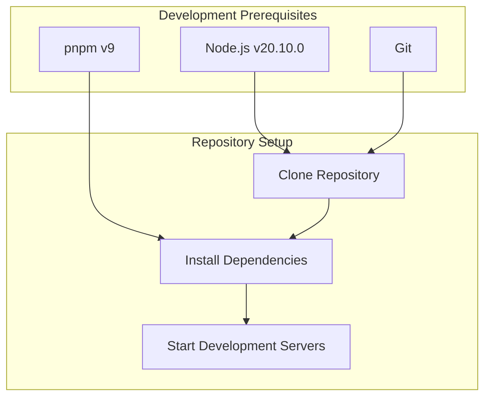
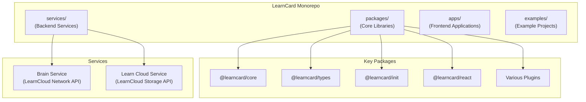
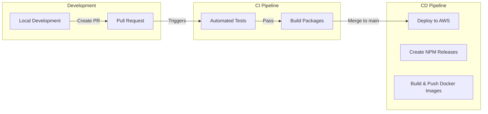
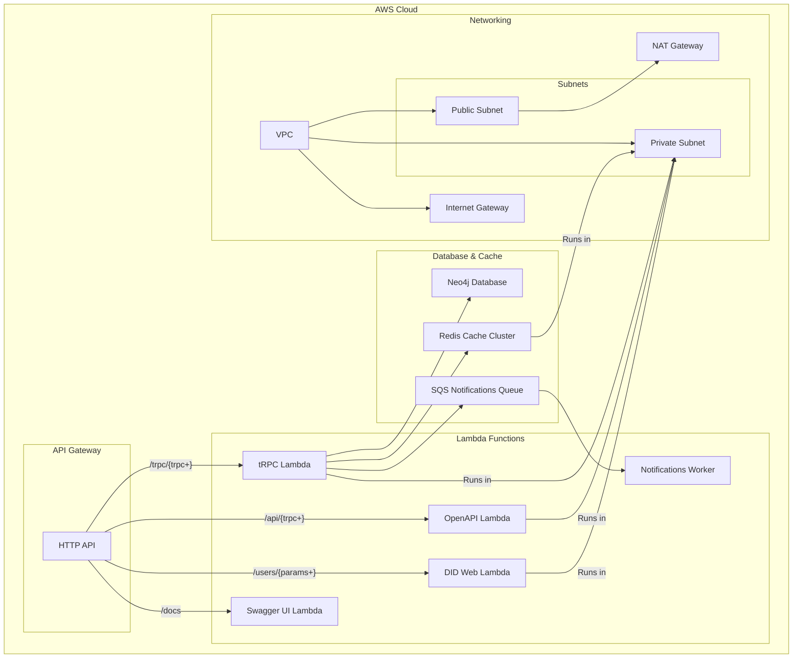
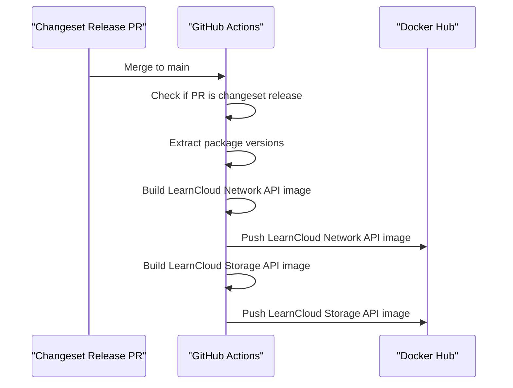

# Contributing

This document provides comprehensive guidance for developers working on the LearnCard ecosystem, covering local development setup, testing procedures, continuous integration/deployment pipelines, and production deployment strategies. It serves as a technical reference for contributors and maintainers of the LearnCard codebase.

## Development Environment Setup <a href="#development-environment-setup" id="development-environment-setup"></a>

To contribute to the LearnCard codebase, you'll need the following prerequisites:

### Prerequisites <a href="#prerequisites" id="prerequisites"></a>

* **Node.js**: Version 20.10.0 (as specified in `.nvmrc`)
* **pnpm**: Version 9 (package manager)
* **Git**: For version control



### Repository Structure <a href="#repository-structure" id="repository-structure"></a>

The LearnCard repository is organized as a monorepo managed with NX. This structure allows for efficient management of multiple packages and services while sharing dependencies and build configurations.



## Local Development Workflow <a href="#local-development-workflow" id="local-development-workflow"></a>

1.  **Clone the repository**:

    ```bash
    git clone https://github.com/learningeconomy/LearnCard.gitcd LearnCard
    ```
2.  **Set up Node.js version**:

    ```bash
    nvm use # Uses the version specified in .nvmrc
    ```
3.  **Install dependencies**:

    ```bash
    pnpm install
    ```
4.  **Run tests for affected packages**:

    ```bash
    pnpm exec nx affected --target=test --base=HEAD~1 --head=HEAD
    ```
5.  **Build packages**:

    ```bash
    pnpm exec nx run-many --target=build --exclude docs
    ```

## Continuous Integration and Deployment

LearnCard uses GitHub Actions for automated testing, deployment, and releases. The CI/CD pipeline handles testing for all pull requests and manages deployments to AWS when changes are merged to the main branch.

### CI/CD Workflow <a href="#cicd-workflow" id="cicd-workflow"></a>



### Automated Testing <a href="#automated-testing" id="automated-testing"></a>

All pull requests trigger a test workflow that runs tests for affected packages. The workflow:

1. Checks out the repository
2. Sets up Node.js and pnpm
3. Installs dependencies
4. Runs tests with retries in case of flaky tests
5. Reports test results

### Deployment Process <a href="#deployment-process" id="deployment-process"></a>

When changes are merged to the main branch, the deploy workflow:

1. Runs tests to verify the changes
2. Determines which services are affected
3. Deploys updated services to AWS using the Serverless Framework
4. Environment variables are securely provided through GitHub Secrets

The deployment targets two main services:

* Brain Service: "LearnCloud Network API"
* LearnCloud Service: "LearnCloud Storage API"

### Release Process <a href="#release-process" id="release-process"></a>

The release workflow:

1. Runs after successful deployment
2. Builds all libraries
3. Uses Changesets to create a release PR or publish to npm
4. When a Changeset release PR is merged, triggers Docker image builds

## Infrastructure Architecture <a href="#infrastructure-architecture" id="infrastructure-architecture"></a>

LearnCard backend services are deployed as serverless applications on AWS, primarily using Lambda functions, API Gateway, and various supporting services.



### Serverless Configuration <a href="#serverless-configuration" id="serverless-configuration"></a>

The services are configured using the Serverless Framework, which manages the AWS resources. Key features:

* **Functions**: Multiple Lambda functions serve different endpoints
* **VPC Configuration**: Services run in a private subnet with NAT gateway access
* **ElastiCache**: Redis cache for improved performance
* **Security Groups**: Control network access between components

### Environment Variables <a href="#environment-variables" id="environment-variables"></a>

The deployment process uses numerous environment variables to configure the services securely. These include:

| Category      | Variables                                       | Purpose                       |
| ------------- | ----------------------------------------------- | ----------------------------- |
| AWS Access    | `AWS_ACCESS_KEY_ID`, `AWS_SECRET_ACCESS_KEY`    | AWS authentication            |
| Database      | `NEO4J_URI`, `NEO4J_USERNAME`, `NEO4J_PASSWORD` | Neo4j database access         |
| Redis         | `REDIS_HOST`, `REDIS_PORT`                      | Redis cache configuration     |
| Cryptographic | `SEED`, `LEARN_CLOUD_SEED`, `JWT_SIGNING_KEY`   | Secure key material           |
| Monitoring    | `SENTRY_DSN`, `DD_API_KEY`                      | Error tracking and monitoring |

### Docker Images <a href="#docker-images" id="docker-images"></a>

LearnCard services are also published as Docker images to Docker Hub, making them easier to deploy in containerized environments.

#### Docker Release Process <a href="#docker-release-process" id="docker-release-process"></a>



The Docker release process:

1. Triggered when a Changeset release PR is merged to main
2. Extracts version information from package.json files
3. Builds Docker images for Brain Service and LearnCloud Service
4. Tags images with semantic version numbers
5. Pushes images to Docker Hub

Available images:

* `welibrary/lcn-brain-service`: LearnCloud Network API container
* `welibrary/lcn-cloud-service`: LearnCloud Storage API container

### Maintenance <a href="#maintenance" id="maintenance"></a>

The repository includes a "Maid Service" workflow that automatically cleans up the codebase when necessary. This workflow:

1. Runs after pushes to the main branch
2. Checks for unintended file changes that weren't committed
3. Creates an automated PR to clean up the worktree if necessary

This helps maintain a clean repository state, especially when automation scripts modify files.
