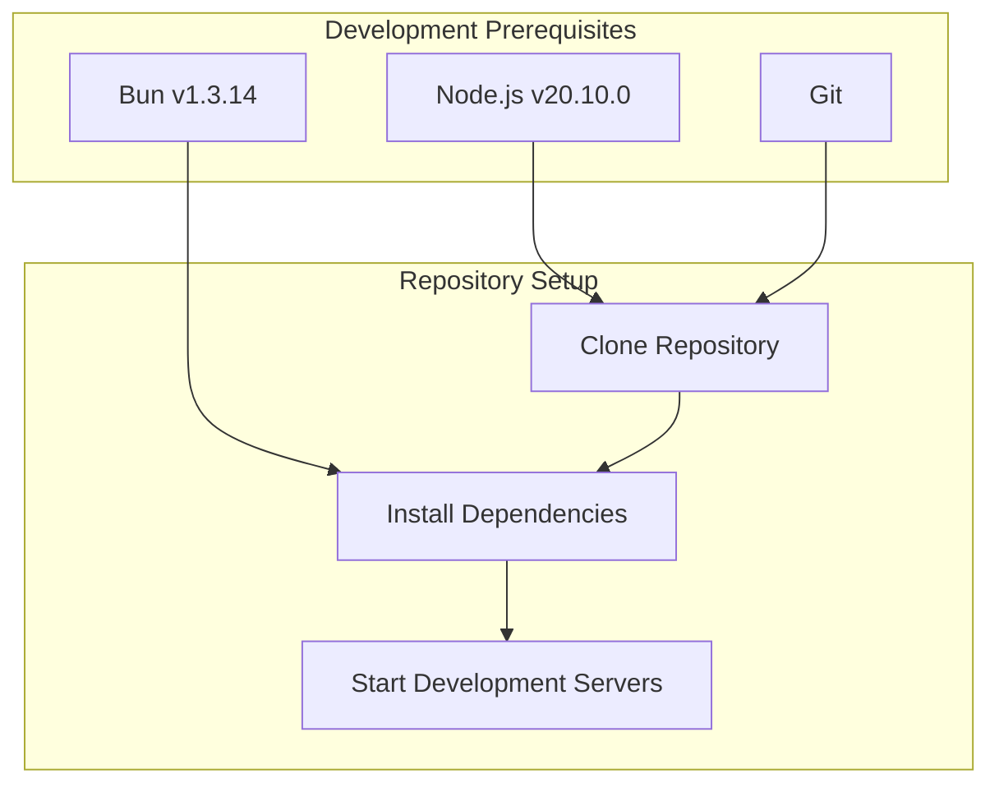
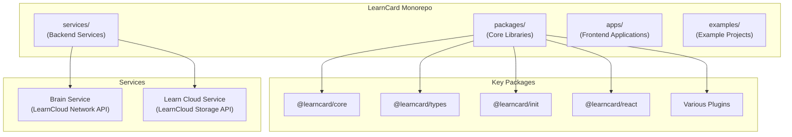
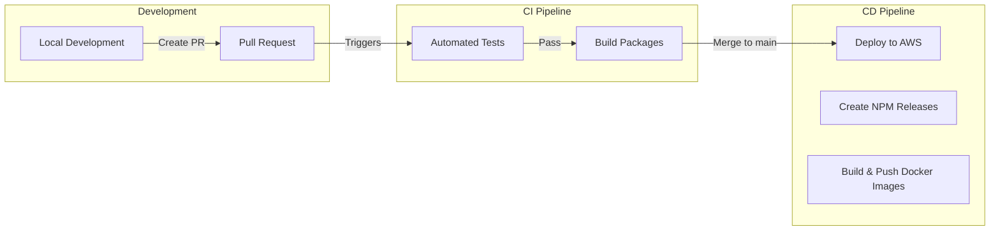

# Contributing

LearnCard is open source ([github.com/learningeconomy/LearnCard](https://github.com/learningeconomy/LearnCard)). This page covers what you need to work on the codebase: local setup, the repository layout, the day-to-day development workflow, and how tests and releases run on pull requests.

## Development Environment Setup <a href="#development-environment-setup" id="development-environment-setup"></a>

To contribute to the LearnCard codebase, you'll need the following prerequisites:

### Prerequisites <a href="#prerequisites" id="prerequisites"></a>

- **Node.js**: Version 20.10.0 (as specified in `.nvmrc`)
- **Bun**: Version 1.3.14 (package manager)
- **Git**: For version control


```mermaid
flowchart TD
    subgraph "Development Prerequisites"
        node["Node.js v20.10.0"]
        bun["Bun v1.3.14"]
        git["Git"]
    end

    subgraph "Repository Setup"
        clone["Clone Repository"]
        install["Install Dependencies"]
        dev["Start Development Servers"]
    end

    node --> clone
    bun --> install
    git --> clone
    clone --> install
    install --> dev
```

### Repository Structure <a href="#repository-structure" id="repository-structure"></a>

The LearnCard repository is organized as a monorepo managed with NX. This structure allows for efficient management of multiple packages and services while sharing dependencies and build configurations.


```mermaid
flowchart TD
    subgraph "LearnCard Monorepo"
        packages["packages/<br/>(Core Libraries)"]
        services["services/<br/>(Backend Services)"]
        apps["apps/<br/>(Frontend Applications)"]
        examples["examples/<br/>(Example Projects)"]
    end

    subgraph "Key Packages"
        core["@learncard/core"]
        types["@learncard/types"]
        init["@learncard/init"]
        react["@learncard/react"]
        plugins["Various Plugins"]
    end

    subgraph "Services"
        brain["Brain Service<br/>(LearnCloud Network API)"]
        learncloud["Learn Cloud Service<br/>(LearnCloud Storage API)"]
    end

    packages --> core
    packages --> types
    packages --> init
    packages --> react
    packages --> plugins

    services --> brain
    services --> learncloud
```

## Local Development Workflow <a href="#local-development-workflow" id="local-development-workflow"></a>

1.  **Clone the repository**:

    ```bash
    git clone https://github.com/learningeconomy/LearnCard.gitcd LearnCard
    ```

2.  **Set up Node.js version**:

    ```bash
    nvm use # Uses the version specified in .nvmrc
    ```

3.  **Install dependencies**:

    ```bash
    bun install
    ```

4.  **Run tests for affected packages**:

    ```bash
    bunx nx affected --target=test --base=HEAD~1 --head=HEAD
    ```

5.  **Build packages**:

    ```bash
    bunx nx run-many --target=build --exclude docs
    ```

## Continuous Integration and Deployment

LearnCard uses GitHub Actions for automated testing, deployment, and releases. The CI/CD pipeline handles testing for all pull requests and manages deployments to AWS when changes are merged to the main branch.

### CI/CD Workflow <a href="#cicd-workflow" id="cicd-workflow"></a>


```mermaid
flowchart LR
    subgraph "Development"
        dev["Local Development"]
        pr["Pull Request"]
    end

    subgraph "CI Pipeline"
        test["Automated Tests"]
        build["Build Packages"]
    end

    subgraph "CD Pipeline"
        deploy["Deploy to AWS"]
        release["Create NPM Releases"]
        docker["Build & Push Docker Images"]
    end

    dev -->|"Create PR"| pr
    pr -->|"Triggers"| test
    test -->|"Pass"| build
    build -->|"Merge to main"| deploy
```

### Automated Testing <a href="#automated-testing" id="automated-testing"></a>

All pull requests trigger a test workflow that runs tests for affected packages. The workflow:

1. Checks out the repository
2. Sets up Node.js and Bun
3. Installs dependencies
4. Runs tests with retries in case of flaky tests
5. Reports test results

### Deployment Process <a href="#deployment-process" id="deployment-process"></a>

When changes are merged to the main branch, the deploy workflow:

1. Runs tests to verify the changes
2. Determines which services are affected
3. Deploys updated services to AWS using the Serverless Framework
4. Environment variables are securely provided through GitHub Secrets

The deployment targets two main services:

- Brain Service: "LearnCloud Network API"
- LearnCloud Service: "LearnCloud Storage API"

### Release Process <a href="#release-process" id="release-process"></a>

The release workflow:

1. Runs after successful deployment
2. Builds all libraries
3. Uses Changesets to create a release PR or publish to npm
4. When a Changeset release PR is merged, triggers Docker image builds
