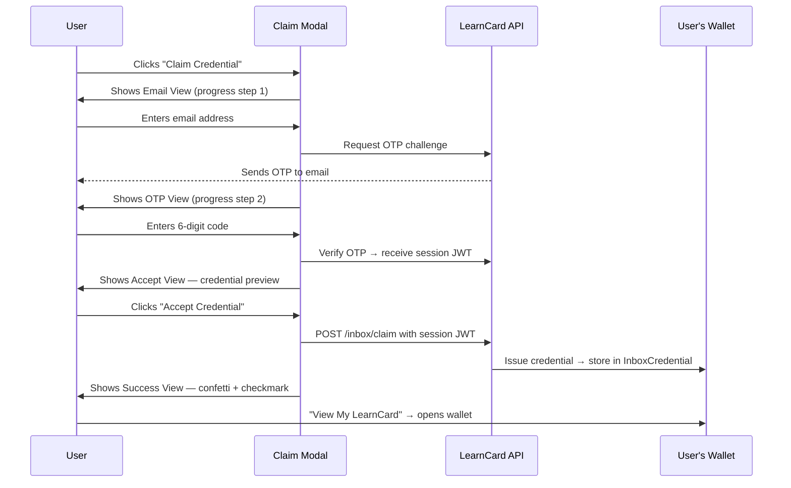

# Embed a Claim Button

Add a "Claim Credential" button to any webpage — a course completion page, an event landing page, an onboarding flow. When a user clicks it, a polished modal walks them through email verification and deposits the credential directly into their LearnCard wallet.


This is for **external websites** that want to award credentials to visitors. If you're building an app that runs _inside_ the LearnCard App Store, see [Connect an Embedded App](connect-an-embedded-app.md) instead.


## Prerequisites

- A LearnCard developer account with an **Embed** integration created in the [Developer Dashboard](https://learncard.app)
- At least one **credential template** attached to that integration
- Your integration's **publishable key** (`pk_...`)

## Step 1: Create Your Integration & Template

1. Go to the Developer Dashboard → **New Integration** → choose **Embed Claim Button**
2. Follow the setup guide: set your partner name, create a credential template
3. Copy your **publishable key** from the Embed Code tab

## Step 2: Add the SDK



```html
<script src="https://cdn.learncard.com/sdk/v1/learncard.js"></script>
```


```bash
npm install @learncard/embed-sdk
```
```js
import { init } from '@learncard/embed-sdk';
```



## Step 3: Initialize the SDK

Add a target element and call `init()`:

```html
<!-- Where the button should appear -->
<div id="claim-credential"></div>

<script>
  LearnCard.init({
    publishableKey: 'pk_your_key_here',
    target: '#claim-credential',
    credential: { name: 'Your Template Name' },
    partnerName: 'Your Organization Name',
  });
</script>
```

The credential name must match a template you created in the dashboard. The SDK resolves it server-side — you don't need to embed the full credential JSON.

## Step 4: Customize Branding (Optional)

```js
LearnCard.init({
  publishableKey: 'pk_your_key_here',
  target: '#claim-credential',
  credential: { name: 'Course Completion' },
  partnerName: 'Learning Economy Academy',
  branding: {
    primaryColor: '#1F51FF',        // Button + stepper color
    accentColor: '#0F3BD9',         // Hover states
    partnerLogoUrl: 'https://your-org.com/logo.png',
    walletUrl: 'https://app.learncard.com',
  },
});
```

## Step 5: Handle Success (Optional)

By default, after claiming, the modal shows a success screen with a "View My LearnCard" button that opens the wallet. You can override this with `onSuccess`:

```js
LearnCard.init({
  publishableKey: 'pk_your_key_here',
  target: '#claim-credential',
  credential: { name: 'Course Completion' },
  onSuccess: ({ credentialId, handoffUrl }) => {
    // Show your own success UI
    document.getElementById('success-message').style.display = 'block';
  },
});
```

When `onSuccess` is provided, the SDK skips the automatic wallet redirect — you control what happens next.

## Complete Example

```html
<!DOCTYPE html>
<html>
  <head>
    <title>Course Complete</title>
  </head>
  <body>
    <h1>Congratulations! You finished the course.</h1>
    <p>Claim your credential to add it to your LearnCard wallet.</p>

    <div id="claim-credential"></div>
    <div id="success" style="display:none; color: green;">
      ✅ Credential claimed! Check your LearnCard wallet.
    </div>

    <script src="https://cdn.learncard.com/sdk/v1/learncard.js"></script>
    <script>
      LearnCard.init({
        publishableKey: 'pk_your_key_here',
        target: '#claim-credential',
        credential: { name: 'Intro to Digital Credentials — Course' },
        partnerName: 'Learning Economy Academy',
        branding: {
          primaryColor: '#2EC4A5',
          partnerLogoUrl: 'https://your-org.com/logo.png',
        },
        onSuccess: () => {
          document.getElementById('success').style.display = 'block';
        },
      });
    </script>
  </body>
</html>
```

## Claim Flow



## Whitelisted Domains

For security, the API only accepts claims from domains you've whitelisted in the Embed Code tab of your dashboard. Add your production domain before going live.

During local development, `localhost` is allowed automatically.

## Testing Locally

Use the included embed example to test without a real backend:

```bash
# From repo root
pnpm --filter @learncard/embed-sdk build
cd examples/embed-example && pnpm dev
```

| URL | Mode |
|-----|------|
| `http://localhost:4321` | Stub mode — no backend, flows all the way to success |
| `?pk=pk_xxx` | Live network |
| `?pk=pk_xxx&template=My+Template` | Live network + template by name |
| `?pk=pk_xxx&api=http://localhost:4000/api&template=My+Template` | Fully local |

## Troubleshooting

**"This integration could not be found"**
Your `publishableKey` doesn't match any active integration on the network. Double-check the key from your dashboard Embed Code tab and ensure your domain is whitelisted.

**Credential not appearing after claim**
The credential lands in the user's inbox and is finalized when they next open their wallet. If you need to verify immediately, check the dashboard's activity tab.

**OTP not arriving**
In local dev, check your brain-service logs — OTP codes are printed there when no email provider is configured.

## See Also

- [Embed SDK Reference](../../sdks/embed-sdk.md)
- [Embed Code Tab (Dashboard)](../../how-to-guides/connect-systems/connect-a-website.md)
- [Connect an Embedded App](connect-an-embedded-app.md) — for apps inside LearnCard
