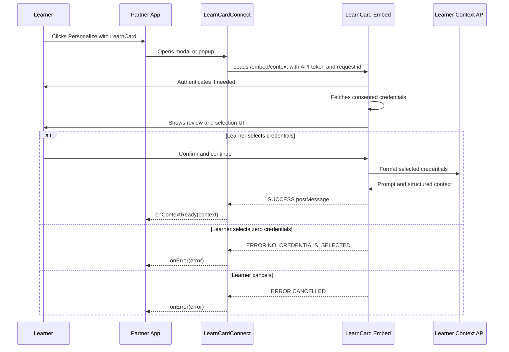

# Embed LearnCard Connect

Add a “Personalize with LearnCard” button to an external React application. When a learner clicks it, LearnCard opens in an iframe modal, authenticates the learner, shows the credentials they have consented to share, and returns formatted learner context to your app.


This guide is for **external partner applications** that want to receive learner context from LearnCard. If your goal is to award a credential from a normal website, see [Embed a Claim Button](embed-a-claim-button.md). If your app runs inside the LearnCard App Store, see [Connect an Embedded App](connect-an-embedded-app.md).


## Prerequisites

- A React application where you want to render the LearnCard Connect button.
- A LearnCard partner or integration wallet that can create an Auth Grant API token.
- A consent-flow contract that allows your app to read the learner data you need.
- Learners who have consented to that contract.
- A LearnCard App host origin:
    - Production: `https://learncard.app`
    - Local development: `http://localhost:3000`

## Step 1: Create an Auth Grant API Token

`LearnCardConnect` expects an API token that can read consent-flow data. For the current learner-context flow, create an Auth Grant with the `contracts-data:read` scope.

```ts
const grantId = await partnerWallet.invoke.addAuthGrant({
    name: 'my-learncard-connect-key',
    scope: 'contracts-data:read',
});

const apiKey = await partnerWallet.invoke.getAPITokenForAuthGrant(grantId);
```

Store this token securely. In production, generate and manage it server-side, then pass it to the React integration that renders the button.

## Step 2: Install `@learncard/react`



```bash
npm install @learncard/react
```



```bash
pnpm add @learncard/react
```



```bash
yarn add @learncard/react
```



## Step 3: Render the Button

```tsx
import { useState } from 'react';
import { LearnCardConnect } from '@learncard/react';

export function LearnerContextPanel({ apiKey }: { apiKey: string }) {
    const [prompt, setPrompt] = useState('');
    const [error, setError] = useState('');

    return (
        <section>
            <LearnCardConnect
                apiKey={apiKey}
                hostOrigin="https://learncard.app"
                buttonText="Personalize with LearnCard"
                detailLevel="compact"
                onContextReady={context => {
                    setPrompt(context.prompt);
                    setError('');
                }}
                onError={err => {
                    setError(`${err.code}: ${err.message}`);
                    setPrompt('');
                }}
            />

            {prompt && <pre>{prompt}</pre>}
            {error && <p role="alert">{error}</p>}
        </section>
    );
}
```

For local development, set `hostOrigin="http://localhost:3000"` while LearnCard App is running locally.

## Step 4: Handle User Choices

Your app should treat successful context generation and user-decline states differently.

```ts
function handleError(error: { code: string; message: string }) {
    switch (error.code) {
        case 'NO_CREDENTIALS_SELECTED':
            // The learner intentionally declined to share data.
            showMessage('No LearnCard data was shared. You can continue manually.');
            break;

        case 'CANCELLED':
            // The learner closed or cancelled the request.
            showMessage('LearnCard personalization was cancelled.');
            break;

        default:
            // Something prevented the flow from completing.
            showError(error.message);
    }
}
```

`NO_CREDENTIALS_SELECTED` is a graceful decline signal. It means the learner reached the review step and chose not to share any credentials.

## Step 5: Use the Returned Context

The returned context includes a formatted prompt and metadata. If requested, it can also include the raw selected credentials.

```ts
type ContextData = {
    prompt: string;
    metadata: {
        did: string;
        name?: string;
        [key: string]: unknown;
    };
    structuredContext?: unknown;
    credentials?: unknown[];
};
```

Common usage patterns:

- Add `context.prompt` to an AI tutor system prompt.
- Use `context.metadata.did` to correlate the personalization request with your own learner record.
- Use `structuredContext` for machine-readable profile or credential summaries when available.
- Set `includeRawCredentials` only when your app truly needs the selected VC payloads.

## Complete Example

```tsx
import { LearnCardConnect } from '@learncard/react';

export function App() {
    return (
        <LearnCardConnect
            apiKey={import.meta.env.VITE_LEARNCARD_CONNECT_API_KEY}
            hostOrigin={import.meta.env.DEV ? 'http://localhost:3000' : 'https://learncard.app'}
            instructions="Create a concise learner profile for an AI tutor."
            detailLevel="expanded"
            includeRawCredentials={false}
            theme={{
                primaryColor: '#047857',
                accentColor: '#065f46',
                borderRadius: '9999px',
            }}
            onContextReady={context => {
                sendContextToTutor(context.prompt, context.structuredContext);
            }}
            onError={error => {
                if (error.code === 'NO_CREDENTIALS_SELECTED') {
                    continueWithoutPersonalization();
                    return;
                }

                reportLearnCardConnectError(error);
            }}
        />
    );
}
```

## Flow Diagram



## Testing Locally

This repository includes a full local example app.

```bash
# Terminal 1: from the monorepo root
cd apps/learn-card-app
pnpm dev

# Terminal 2: from the monorepo root
cd examples/learn-card-connect-test
pnpm dev
```

Then:

1. Open `http://localhost:4321`.
2. Click **Generate Test Data**.
3. Open `http://localhost:3000` and sign in as `demo@learningeconomy.io`.
4. Verify generated credentials appear in the Achievements wallet section.
5. Return to `http://localhost:4321`.
6. Click **Personalize with LearnCard**.
7. Review selected credentials in the embedded LearnCard modal.
8. Confirm, cancel, or deselect all credentials to test each host callback path.

## Troubleshooting

**The modal opens but never returns context**

Check that `hostOrigin` exactly matches the LearnCard origin that is hosting `/embed/context`. The SDK ignores `postMessage` responses from other origins.

**The learner sees no credentials**

Confirm that the learner consented to the relevant contract and that the credential URIs were synced to the contract terms. For demo data, rerun the example app generator after resetting local data.

**The host receives `NO_CREDENTIALS_SELECTED`**

The learner explicitly chose not to share credentials. Treat this like a graceful decline and let the user continue without personalization or ask them to try again.

**The host receives `REQUEST_TIMEOUT`**

Increase `requestTimeout` for slow local development environments, and confirm that the LearnCard App and learner-context services are reachable.

## See Also

- [LearnCard Connect SDK Reference](../../sdks/learncard-connect.md)
- [ConsentFlow Overview](../../core-concepts/consent-and-permissions/consentflow-overview.md)
- [Accessing Consented Data](../../core-concepts/consent-and-permissions/accessing-consented-data.md)
- [Auth Grants and API Tokens](../../core-concepts/architecture-and-principles/auth-grants-and-api-tokens.md)
- [`examples/learn-card-connect-test`](../../../examples/learn-card-connect-test/README.md)
