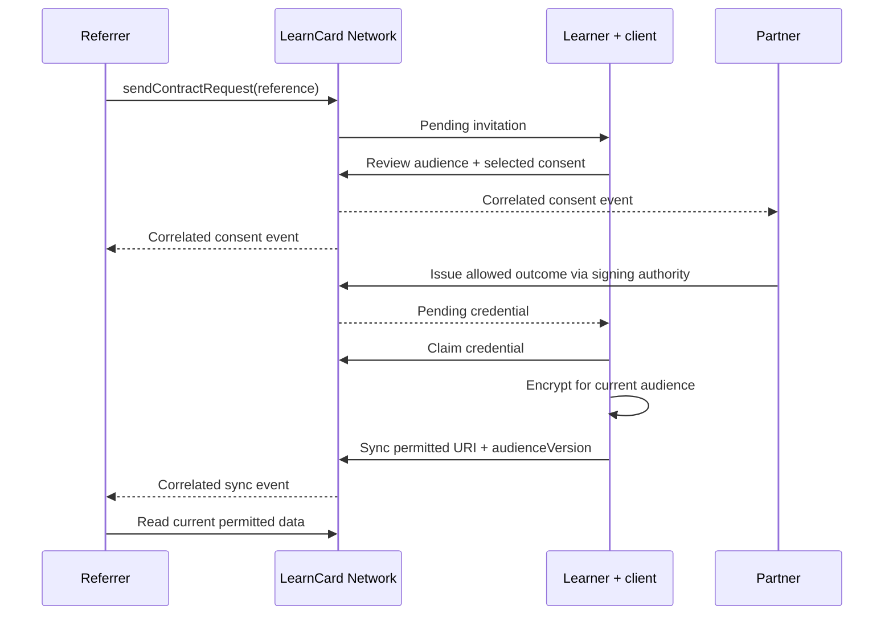

# Connect a learner to a partner through a referral

This workflow uses an existing LearnCard network profile for each partner, referrer, and learner. An email address alone cannot receive a generic request. The Salesforce Data Mediator is an external client of this workflow.

## Configure the audience and request

The partner owns the contract. Include the referrer as a data recipient when it should receive approved outcomes. A writer can issue outcomes but does not automatically receive data. Use a separate contract for each partner's audience.

```typescript
import { initLearnCard } from '@learncard/init';

// Use credentials configured securely by your application.
const partner = await initLearnCard({ seed: partnerSeed, network: networkUrl });
const referrer = await initLearnCard({ seed: referrerSeed, network: networkUrl });

const contractUri = await partner.invoke.createContract({
    name: 'Career support',
    reasonForAccessing: 'To provide career support and return approved outcomes.',
    recipients: [referrerProfileId],
    contract: {
        read: {
            personal: {},
            credentials: { categories: { Achievement: { required: false } } },
        },
        write: {
            personal: {},
            credentials: { categories: { Achievement: { required: false } } },
        },
    },
});

await referrer.invoke.sendContractRequest({
    contractUri,
    targetProfileId: learnerProfileId,
    externalReferenceId: 'referral-123',
    message: 'Career support is available through this partner.',
});
```

The owner manages recipients before the first consent. Additions freeze after that point; removals revoke future data discovery and require clients to review the new audience version. Sending a request does not authorize data access.

The owner and explicit writers can manage all referrals for the contract. A referrer that is only a data recipient can list and inspect only the requests it sent; the learner can inspect its own invitations. Other recipients cannot see those requests, including after acceptance. Request status returns `null` for both inaccessible and missing requests.

## Review and consent

The learner opens the invitation, reviews its purpose, requested permissions, and every receiving organization, then selects data through the consent flow. Accept & Connect opens review. Closing or dismissing leaves the request pending; Decline records a denial. Pending invitations remain accessible in Privacy & Data even after an alert is archived.

Compatible SDK clients fetch current details, display the audience, and pass `audienceVersion` to consent, update, and sync mutations. When accepting an invitation, include its `requestId` as `expectedRequestId` in the consent options. The server verifies that request is still pending when recording consent, so cancellation during review cannot accept the cancelled referral. New consent and re-consent reject expired contracts. Direct consent links omit this option and remain independent of invitation decisions. Owner-only legacy contracts continue to accept the existing version-free calls.

“Share all” applies to the selected **category**, including credentials from other sources. Separate audiences do not impose a credential-origin filter. For partner-specific outcome isolation, use distinct categories or individually selected credentials. The external client and learner must agree on categories and selection before rollout.

## Issue an outcome, then claim and synchronize

Register a signing authority using the LCA plugin before using the signing-authority API. Keep the authority's registered name at 15 characters or fewer. The caller must be the owner or an explicit writer and have `contracts-data:write` when using an auth grant. The current consent must permit the issued category.

```typescript
const response = await fetch(`${brainApiUrl}/consent-flow-contract/write/via-signing-authority`, {
    method: 'POST',
    headers: {
        'Content-Type': 'application/json',
        Authorization: `Bearer ${writerApiToken}`,
    },
    body: JSON.stringify({
        contractUri,
        did: learnerDid,
        boostUri,
        signingAuthority: { endpoint: authorityEndpoint, name: authorityName },
    }),
});
if (!response.ok) throw new Error('Outcome issuance failed');
const credentialUri: string = await response.json();
```

Issuance sends a pending credential. It does not put an encrypted outcome into the consent audience's data view. The learner claims the credential; the compatible app stores the personal copy, encrypts a sharing copy for the current audience, and syncs the permitted URI. Reporting therefore depends on learner claim and client activity, rather than being instantaneous after issuance.

The following SDK equivalent explicitly synchronizes one selected outcome. A custom client must also persist its personal index/cache consistently and respect its selected live-sync settings.

```typescript
const details = await learner.invoke.getContract(contractUri);
// Display this fresh audience and confirm the user's selected permissions first.
await learner.invoke.acceptCredential(credentialUri);
const credential = await learner.read.get(credentialUri);
if (!credential) throw new Error('Outcome could not be loaded');
const sharedUri = await learner.store.LearnCloud.uploadEncrypted(credential, {
    recipients: [details.owner.did, ...(details.recipients ?? []).map(profile => profile.did)],
});
await learner.invoke.syncCredentialsToContract(
    termsUri,
    { Achievement: [sharedUri] },
    details.audienceVersion
);
const permitted = await referrer.invoke.getConsentFlowData(contractUri);
```

The app retains shared URIs using the entire audience as the cache key. When membership changes, it creates a new audience-specific copy rather than reusing a removed recipient's ciphertext.

## Consume correlated events

Verify the webhook's bearer JWT against the sending brain service's DID document. Persist events before acknowledging `true` (or `{ "success": true }`) and deduplicate by `data.metadata.deliveryKey`. Deliveries are at least once. Use `eventId`, `contractUri`, and `requestId` to correlate events. The owner, original referrer, and explicit writers with data access can also use `externalReferenceId` to reconcile with the external referral record. Never use display text as a correlation key.

Declines and cancellations notify only the owner and original referrer, excluding whoever performed the action. Owners and current recipients receive consent and permitted sync events, but other recipients do not receive the private referral reference or invitation message. This filtering covers both event metadata and the transaction's referral fields. A requester outside the audience receives only the minimal decision metadata. The learner's own history and export retain the full referral details.

The scheduled/Docker recovery worker retries pending intents; delivery authorization rechecks current audience membership and consent permissions. It also suppresses unrelated recipients' old queued decline/cancellation notifications and removes private referral details from queued consent-data events before delivery.

Withdrawal, expiry, or recipient removal stops future authorized discovery/sharing. Copies already delivered cannot be recalled. One-time consent keeps its permitted snapshot until withdrawal/expiry and does not authorize ongoing sync.



## Enable and verify the app experience

Both `features.contractRequests` in tenant configuration and the boolean LaunchDarkly `enableContractRequests` flag must be `true`. Missing/off flags fail closed. The tenant setting defaults to `false`; VetPass enables it only in its local overlay. `branding.contractRequestLabel` optionally sets the invitation eyebrow. These controls affect presentation, not backend authorization.

Release the consent audience foundation, request/event API, and compatible clients in stack order before enabling a production tenant. Review audience disclosure, guardian behavior, all supported locales, mobile insets, and legacy AI requests. Account provisioning, the Military Service Badge template/authority, external CRM identity mapping, and outcome category conventions require integrator setup.

Developers can run `bun --conditions=development scripts/lc-2226/referral-lab.ts` from a repository checkout against loopback brain/cloud/LCA services (defaults 4000/4100/5200). It creates synthetic profiles, two audiences, autoboosts and outcomes, then verifies encrypted sync, isolation, lifecycle boundaries, and signed correlated webhooks. It leaves synthetic history for inspection. The same executable is exercised by `tests/e2e/tests/contract-referral.spec.ts`. That spec advertises `host.docker.internal` to the containerized brain and binds its synthetic webhook receiver on all host interfaces. For a manual Docker run, set `LC2226_WEBHOOK_HOST=host.docker.internal`; host-only services use the default `127.0.0.1`. Service URLs remain HTTP loopback addresses. Leave `NOTIFICATIONS_SERVICE_WEBHOOK_URL` unset in this disposable stack so a local service-wide override does not redirect the lab profiles' webhooks.

See [Contract Requests and Events](../../sdks/learncard-network/contract-requests-and-events.md) for status transitions, API methods, retry semantics, and scope requirements.
