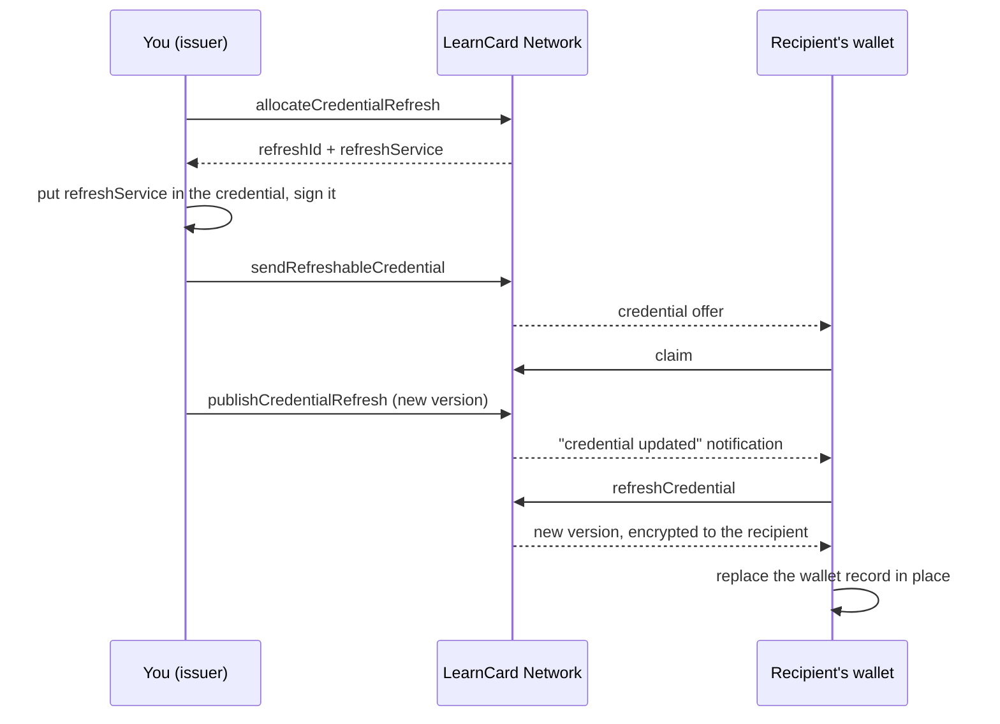

# Issue and Refresh a Managed Credential

Some credentials change after you issue them: a provisional transcript becomes final, a certification gains an endorsement, a license renews. Managed refresh lets you publish a new version of a credential you already sent, and lets the recipient's wallet replace its copy in place instead of receiving a duplicate.

This page walks through the whole loop with three small scripts. For what's happening underneath, see [Credential Refresh](../core-concepts/credential-refresh.md).




Managed refresh is rolling out network by network. If any of these calls fails with `Credential refresh is not available`, it isn't enabled on the network you're connected to yet.


## Before you start

- A seed and profile from the [Quickstart](../quick-start/your-first-integration.md), in `.env` as `SECURE_SEED` and `PROFILE_ID`
- The recipient's profile ID (they need a LearnCard account; refresh delivers to a specific person)

The scripts below use `node --env-file=.env`. Install `@learncard/init` in the folder where you run them.

## 1. Issue a credential that can be refreshed

The refresh service's URL is part of the signed credential, so you allocate it first, add it to the credential, then sign and send. The network stores the credential encrypted to the recipient only.

<!-- snippet: refresh/issue-refreshable.mjs -->

```javascript
import { randomUUID } from 'node:crypto';
import { writeFileSync } from 'node:fs';
import { initLearnCard } from '@learncard/init';

const { SECURE_SEED, PROFILE_ID, RECIPIENT_PROFILE_ID } = process.env;
if (!SECURE_SEED || !PROFILE_ID || !RECIPIENT_PROFILE_ID) {
    throw new Error('Set SECURE_SEED, PROFILE_ID, and RECIPIENT_PROFILE_ID');
}

const issuer = await initLearnCard({ seed: SECURE_SEED, network: true });
if (!(await issuer.invoke.getProfile())) {
    await issuer.invoke.createProfile({ profileId: PROFILE_ID, displayName: 'Example University' });
}

const recipient = await issuer.invoke.getProfile(RECIPIENT_PROFILE_ID);
if (!recipient) throw new Error(`No profile named ${RECIPIENT_PROFILE_ID}`);

// Every version of this credential must reuse this exact ID.
const credentialId = `urn:uuid:${randomUUID()}`;

// 1. Allocate the refresh service BEFORE signing. Its URL becomes part of the signed credential.
const { refreshId, refreshService } = await issuer.invoke.allocateCredentialRefresh({
    holder: { profileId: RECIPIENT_PROFILE_ID, did: recipient.did },
    credentialId,
});

// 2. Add the service to the credential. The inline context defines the LearnCard refresh
//    terms, which the standard Open Badges context does not include.
const credential = await issuer.invoke.issueCredential({
    '@context': [
        'https://www.w3.org/ns/credentials/v2',
        'https://purl.imsglobal.org/spec/ob/v3p0/context-3.0.3.json',
        {
            LearnCardCredentialRefresh2026:
                'https://learncard.com/refresh#LearnCardCredentialRefresh2026',
            authorization: {
                '@id': 'https://purl.imsglobal.org/spec/ob/v3p0#authorization',
                '@context': {
                    LearnCardDIDAuth: 'https://docs.learncard.com/definitions#LearnCardDIDAuth',
                },
            },
        },
    ],
    id: credentialId,
    type: ['VerifiableCredential', 'OpenBadgeCredential'],
    issuer: issuer.id.did(),
    validFrom: new Date().toISOString(),
    name: 'Provisional Transcript',
    refreshService,
    credentialSubject: {
        id: recipient.did,
        type: ['AchievementSubject'],
        achievement: {
            id: 'urn:uuid:5b2d6c4e-1f57-4b9a-9d0f-3a8c2e7f1b10',
            type: ['Achievement'],
            name: 'Introduction to Biology',
            description: 'Grade pending final exam.',
            criteria: { narrative: 'Complete all coursework and the final exam.' },
        },
    },
});

// 3. Send through the refresh path. The network stores it encrypted to the recipient only.
const credentialUri = await issuer.invoke.sendRefreshableCredential(refreshId, credential);

// Keep these with your own record of the credential: publishing an update needs all of them.
const record = {
    refreshId,
    refreshService,
    credentialId,
    credentialUri,
    recipientDid: recipient.did,
};
writeFileSync('refresh.json', JSON.stringify(record, null, 2));
console.log(JSON.stringify(record));
```

<!-- /snippet -->

```bash
RECIPIENT_PROFILE_ID=their-profile-id node --env-file=.env issue-refreshable.mjs
```

The script writes `refresh.json`. In a real integration, store `refreshId` and `refreshService` alongside your own record of the credential (the student row, the license number). You need both to publish an update, and you can't recover them later: the network only holds the credential encrypted to the recipient.

The recipient sees **Provisional Transcript** in their LearnCard app once they claim it.


`sendBoost(recipient, templateUri, { enableRefresh: true })` also issues a refreshable credential, but it doesn't return the `refreshId`, so you can't publish updates to it. Use the explicit flow above until `send()` supports refresh directly.


## 2. Publish an update

An update is a complete, signed credential with the same `id`, the same issuer, the same `refreshService`, and a `validFrom` no earlier than the current version.

<!-- snippet: refresh/publish-update.mjs -->

```javascript
import { readFileSync } from 'node:fs';
import { initLearnCard } from '@learncard/init';

if (!process.env.SECURE_SEED) throw new Error('Set SECURE_SEED');

// Written by issue-refreshable.mjs.
const { refreshId, refreshService, credentialId, recipientDid } = JSON.parse(
    readFileSync('refresh.json', 'utf8')
);

const issuer = await initLearnCard({ seed: process.env.SECURE_SEED, network: true });

// The update is a complete credential: same id, issuer, and refreshService; newer validFrom.
const updated = await issuer.invoke.issueCredential({
    '@context': [
        'https://www.w3.org/ns/credentials/v2',
        'https://purl.imsglobal.org/spec/ob/v3p0/context-3.0.3.json',
        {
            LearnCardCredentialRefresh2026:
                'https://learncard.com/refresh#LearnCardCredentialRefresh2026',
            authorization: {
                '@id': 'https://purl.imsglobal.org/spec/ob/v3p0#authorization',
                '@context': {
                    LearnCardDIDAuth: 'https://docs.learncard.com/definitions#LearnCardDIDAuth',
                },
            },
        },
    ],
    id: credentialId,
    type: ['VerifiableCredential', 'OpenBadgeCredential'],
    issuer: issuer.id.did(),
    validFrom: new Date().toISOString(),
    name: 'Final Transcript',
    refreshService,
    credentialSubject: {
        id: recipientDid,
        type: ['AchievementSubject'],
        achievement: {
            id: 'urn:uuid:5b2d6c4e-1f57-4b9a-9d0f-3a8c2e7f1b10',
            type: ['Achievement'],
            name: 'Introduction to Biology',
            description: 'Final grade: A.',
            criteria: { narrative: 'Complete all coursework and the final exam.' },
        },
    },
});

const result = await issuer.invoke.publishCredentialRefresh({
    mode: 'issuer-signed',
    refreshId,
    signedCredential: updated,
    updateSummary: 'Final grades posted',
    idempotencyKey: 'final-grades', // retrying with the same key returns the same version
});

console.log(JSON.stringify({ version: result.version, notification: result.notification }));
```

<!-- /snippet -->

```bash
node --env-file=.env publish-update.mjs
```

**What you should see**

```json
{ "version": 2, "notification": "queued" }
```

- `version` counts from 1 (the original). Run it again with the same `idempotencyKey` and you get `version: 2` back, not a third version.
- `notification` is `queued` when the content changed in a way the recipient would notice, `suppressed` when it didn't (or you passed `notifyHolder: false`), and `not-applicable` when the recipient hasn't claimed yet.

You can publish before the recipient claims. Nothing is served or announced until they do; on claim they get the newest version.

### Let the network sign for you

If a [signing authority](create-signing-authority.md) signs your credentials, send unsigned claims instead:

```typescript
await issuer.invoke.publishCredentialRefresh({
    mode: 'signing-authority',
    refreshId,
    credential: updatedUnsignedCredential,
    signingAuthority: { type: 'http', endpoint: 'https://…', name: 'my-sa' },
});
```

### See what you've published

```typescript
const { records } = await issuer.invoke.getCredentialRefreshHistory({ refreshId, limit: 25 });
// records: [{ version, publishedAt, updateSummary, ... }]
```

History is metadata only. It never includes credential content.

## 3. Refresh from the recipient's side

The LearnCard app does this automatically: it checks refreshable credentials when it opens (at most once a day per credential) and immediately when the user taps a "credential updated" notification. The credential is replaced in place; the previous version stays viewable under **View Previous Versions**.

If you're building your own wallet, this is the whole primitive:

<!-- snippet: refresh/refresh-held.mjs -->

```javascript
import { initLearnCard } from '@learncard/init';

const { HOLDER_SEED, CREDENTIAL_URI } = process.env;
if (!HOLDER_SEED || !CREDENTIAL_URI) throw new Error('Set HOLDER_SEED and CREDENTIAL_URI');

const holder = await initLearnCard({ seed: HOLDER_SEED, network: true });

// Claim it if it is still waiting. (The LearnCard app does this when the user taps Claim.)
const incoming = await holder.invoke.getIncomingCredentials();
if (incoming.some(offer => offer.uri === CREDENTIAL_URI)) {
    await holder.invoke.acceptCredential(CREDENTIAL_URI);
}

const held = await holder.read.get(CREDENTIAL_URI);

// Ask the credential's refreshService for a newer version. Works for LearnCard-managed
// services and standard 1EdTech refresh services alike.
const result = await holder.invoke.refreshCredential(held);

if (result.status === 'updated') {
    console.log(`Updated to version ${result.managedVersion}: ${result.credential.name}`);
} else if (result.status === 'unchanged') {
    console.log(`Up to date: ${held.name}`);
} else if (result.status === 'unsupported') {
    console.log('This credential has no refresh service.');
} else {
    console.log(`Refresh failed (${result.code}). Retry later: ${result.retryable}`);
}
```

<!-- /snippet -->

**What you should see**

Before publishing: `Up to date: Provisional Transcript`. After: `Updated to version 2: Final Transcript`.

`refreshCredential` verifies the credential you hold, contacts the service once, verifies what comes back (valid proof, same issuer, same ID, not older than what you have), and returns it. It never writes to storage; where the new version goes is your wallet's decision. It also refuses to talk to non-HTTPS or private-network addresses unless you opt in for local development.

## Troubleshooting

| You see                                                      | Why                                                                                    | Fix                                                                                         |
| ------------------------------------------------------------ | -------------------------------------------------------------------------------------- | ------------------------------------------------------------------------------------------- |
| `Credential refresh is not available`                        | Refresh isn't enabled on this network                                                  | Check which network you're connected to; contact us if you need it enabled                  |
| `Profile did not allocate this credential refresh`           | Publishing with a different seed than the one that allocated                           | Use the issuer seed that ran `issue-refreshable.mjs`                                        |
| Signing fails mentioning `refreshService` or `authorization` | The inline context object is missing from `@context`                                   | Copy the third `@context` entry from the scripts above                                      |
| `publishCredentialRefresh` rejects the update                | `id`, `issuer`, or `refreshService` differs from the original, or `validFrom` is older | Rebuild the update from `refresh.json`; set `validFrom` to now                              |
| `notification: "not-applicable"`                             | The recipient hasn't claimed yet                                                       | Nothing to do; they'll receive the newest version when they claim                           |
| `refreshCredential` returns `UNSAFE_ENDPOINT`                | The service URL isn't HTTPS or resolves to a private address                           | For local development only, pass `{ allowInsecureHttp: true, allowPrivateAddresses: true }` |
| `refreshCredential` returns `REVOKED`                        | You revoked the credential                                                             | Expected; the recipient keeps their local copy and history                                  |
| `refreshCredential` returns `ROLLBACK`                       | The service returned something older than what the wallet holds                        | Publish a version with a newer `validFrom`                                                  |

## Limits to know about

- Refresh has to be set up **before** the credential is signed. You can't add it to a credential that's already out.
- The app checks in the foreground only (open, resume, notification tap). There's no background polling yet.
- Revoking stops the network from serving any version. It doesn't reach into the recipient's wallet to delete what they already have.

## Next steps

- [Credential Refresh](../core-concepts/credential-refresh.md): how the pieces fit and what the network can and can't see
- [Revoke or Update a Credential](revoke-or-update-a-credential.md): for changes that don't need in-place refresh
- [Who Signs Your Credentials?](create-signing-authority.md): to publish updates in signing-authority mode
