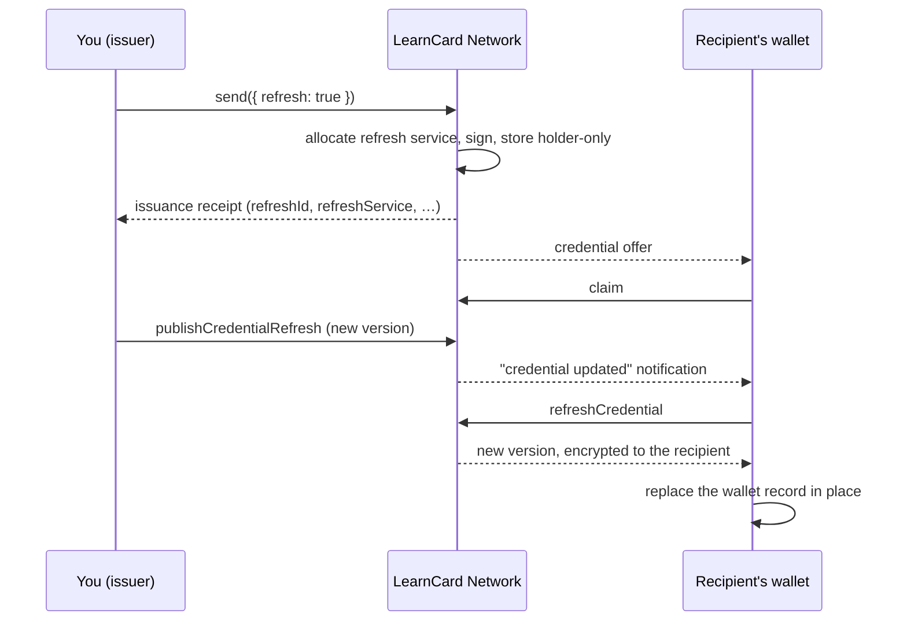

# Issue and Refresh a Managed Credential

Some credentials change after you issue them: a provisional transcript becomes final, a certification gains an endorsement, a license renews. Managed refresh lets you publish a new version of a credential you already sent, and lets the recipient's wallet replace its copy in place instead of receiving a duplicate.

This page walks through the whole loop with three small scripts. For what's happening underneath, see [Credential Refresh](../core-concepts/credential-refresh.md).



The send call hides the machinery: it allocates the refresh service, injects it (with its JSON-LD context) before signing, signs, and delivers — the same steps the [lower-level path](#the-lower-level-path) below performs explicitly.


Managed refresh is rolling out network by network. If any of these calls fails with `Credential refresh is not available`, it isn't enabled on the network you're connected to yet.


## Before you start

- A seed and profile from the [Quickstart](../quick-start/your-first-integration.md), in `.env` as `SECURE_SEED` and `PROFILE_ID`
- The recipient's profile ID (they need a LearnCard account; refresh delivers to a specific person)

The scripts below use `node --env-file=.env`. Install `@learncard/init` in the folder where you run them.

## 1. Issue a credential that can be refreshed

One call does it. `send()` with `refresh: true` takes an ordinary credential template — no refresh fields, no hand-copied JSON-LD context — and handles the refresh setup, signing, and holder-only encrypted delivery. Profile/DID recipients use immediate issuance. Email and phone recipients use deferred Universal Inbox signing; see [Refresh through Universal Inbox](#refresh-through-universal-inbox) below.

<!-- snippet: refresh/issue-refreshable.mjs -->

```javascript
import { writeFileSync } from 'node:fs';
import { initLearnCard } from '@learncard/init';

const { SECURE_SEED, PROFILE_ID, RECIPIENT_PROFILE_ID } = process.env;
if (!SECURE_SEED || !PROFILE_ID || !RECIPIENT_PROFILE_ID) {
    throw new Error('Set SECURE_SEED, PROFILE_ID, and RECIPIENT_PROFILE_ID');
}

const issuer = await initLearnCard({ seed: SECURE_SEED, network: true });
if (!(await issuer.invoke.getProfile())) {
    await issuer.invoke.createProfile({ profileId: PROFILE_ID, displayName: 'Example University' });
}

// An ordinary credential template: no refresh fields, no special JSON-LD context.
// `refresh: true` makes send() allocate the managed refresh service, add it (with its
// JSON-LD context) before signing, and deliver the credential encrypted to the
// recipient only. Recipients must be LearnCard profiles or DIDs on your network —
// email and phone recipients use the separate deferred Inbox flow in the guide.
const result = await issuer.invoke.send({
    type: 'boost',
    recipient: RECIPIENT_PROFILE_ID,
    template: {
        credential: {
            '@context': [
                'https://www.w3.org/ns/credentials/v2',
                'https://purl.imsglobal.org/spec/ob/v3p0/context-3.0.3.json',
            ],
            type: ['VerifiableCredential', 'OpenBadgeCredential'],
            issuer: issuer.id.did(),
            name: 'Provisional Transcript',
            credentialSubject: {
                type: ['AchievementSubject'],
                achievement: {
                    id: 'urn:uuid:5b2d6c4e-1f57-4b9a-9d0f-3a8c2e7f1b10',
                    type: ['Achievement'],
                    name: 'Introduction to Biology',
                    description: 'Grade pending final exam.',
                    criteria: { narrative: 'Complete all coursework and the final exam.' },
                },
            },
        },
        name: 'Provisional Transcript',
        category: 'Achievement',
    },
    refresh: true,
});

// `refresh` is the issuance receipt: the metadata every future version must reuse.
// Keep it with your own record of the claims. You cannot read the credential back —
// the network stores it encrypted to the recipient only.
const record = {
    refreshId: result.refresh.refreshId,
    refreshService: result.refresh.refreshService,
    credentialId: result.refresh.credentialId,
    issuerDid: result.refresh.issuerDid,
    holderDid: result.refresh.holderDid,
    credentialStatus: result.refresh.credentialStatus,
    credentialUri: result.credentialUri,
    activityId: result.activityId,
};
writeFileSync('refresh.json', JSON.stringify(record, null, 2));
console.log(JSON.stringify(record));
```

<!-- /snippet -->

```bash
RECIPIENT_PROFILE_ID=their-profile-id node --env-file=.env issue-refreshable.mjs
```

The script writes `refresh.json` — the issuance receipt:

- `refreshId` / `refreshService` — the managed service that serves your updates
- `credentialId` / `issuerDid` / `holderDid` — the identity every version must reuse
- `credentialStatus` — the revocation status descriptor to preserve on every version
- `credentialUri` / `activityId` — where the credential lives and how to track delivery

The receipt is metadata only — it never contains the credential's claims. Keep it alongside your own record of the credential (the student row, the license number): publishing an update needs it, and you can't read the credential back afterwards. The network stores it encrypted to the recipient only, so neither the network nor you can decrypt it once sent.

If your template includes the `BoostCredential` type, also keep `result.uri` (the boost URI). `send()` embeds it as `boostId` before signing; include the same `boostId` when rebuilding each update so the recipient can verify the boost's authenticity. This is distinct from `result.credentialUri`, which identifies the issued credential.

The recipient sees **Provisional Transcript** in their LearnCard app once they claim it.

### Retrying a refreshable send safely

Issuing a refreshable credential takes several network steps (prepare, sign, deliver). Pass an `idempotencyKey` that is stable for the logical send — for example your own enrollment or award ID — and retry the **same** call after any failure:

```js
const result = await learnCard.invoke.send({
    type: 'boost',
    recipient: 'student-profile-id',
    templateUri,
    refresh: true,
    idempotencyKey: `course-cert:${enrollmentId}`,
});
```

Retries with the same key reuse the same boost and refresh allocation and return the original result once delivery has succeeded. Reusing a key for a different recipient, template, template data, integration, contract, or explicitly supplied credential ID is rejected with `CONFLICT`. Keys are scoped to your profile and only apply to `refresh: true` sends.

For manually signed credentials, `idempotencyKey` requires an earlier `boost.prepareRefreshableSend`
call with that key. That preparation procedure is tRPC-only; the SDK handles it automatically
when signing locally. Direct REST callers supplying `signedCredential` should omit the key and
retry the exact same signed credential with the same `templateUri`: the refresh allocation's
binding already prevents duplicate delivery. A key without prior preparation is rejected with
`BAD_REQUEST` before any send state is created.

### `sendBoost` also issues refreshable credentials

For a guided demonstration without writing SDK code, the CLI offers `learncard demo refresh`.
It creates demo issuer and recipient accounts, sends a provisional certificate through
`sendBoost`, publishes a final version, and refreshes the recipient's copy. Press Enter
between steps to present the before and after. It defaults to the local network at
`http://localhost:4000/trpc`; use `--network staging` for a staging network with managed
refresh and LC-2198 deployed. Use a CLI build containing this command. The updated copy
is displayed in the terminal, not saved to the app. Demo records remain on the selected
network; account keys stay in memory for the session.

To demonstrate the recipient experience in the local LearnCard app, start its local
development stack and run `learncard demo refresh --ui` (or, from this repository,
`bun --cwd packages/learn-card-cli start demo refresh --ui`). Follow the printed demo
sign-in link, then press Enter to send. In the app, open **Alerts → Claim → Accept**.
Press Enter in the terminal to publish the update, then open the new update notification
in the app. Press Enter once more to confirm the final certificate was saved. The CLI
waits for the app to save each version; it does not claim or refresh on the app's behalf.
Open the full certificate to compare **Provisional Results — Final grade: Pending** with
**Final Results — Final grade: A** after the update. Both its title and description change.
Keep the sign-in link private: it controls a disposable demo account. This mode is
interactive and local-only; `--app-url` selects a different local app port.

If you already work boost-first — create the boost template, then send it to many people — `sendBoost` takes an opt-in flag instead. With literal `{ enableRefresh: true }` it returns the credential URI **and** the receipt; without it, the plain URI string, exactly as before:

```typescript
const boostUri = await issuer.invoke.createBoost(template); // ordinary boost template

const sent = await issuer.invoke.sendBoost(recipientProfileId, boostUri, {
    enableRefresh: true,
});

console.log(sent.credentialUri); // the issued credential
console.log(sent.refresh.refreshId); // publish future versions with this receipt

// Omit the flag (or pass the legacy boolean options) and you get the URI string:
const plainUri = await issuer.invoke.sendBoost(recipientProfileId, boostUri);
```

Publishing works the same way: rebuild the update from your own claims plus `sent.refresh`, and pass it to `publishCredentialRefresh` as shown in the next section. Like `send()`, `enableRefresh` requires a profile or DID recipient on your network, a network with refresh enabled, and — for API-token callers — a token with `credentials:write` in addition to `boosts:write`.

## 2. Publish an update

An update is a complete, signed credential with the same `id`, the same issuer, the same `refreshService`, and a `validFrom` no earlier than the current version.

<!-- snippet: refresh/publish-update.mjs -->

```javascript
import { readFileSync } from 'node:fs';
import { initLearnCard } from '@learncard/init';

if (!process.env.SECURE_SEED) throw new Error('Set SECURE_SEED');

// Written by issue-refreshable.mjs.
const record = JSON.parse(readFileSync('refresh.json', 'utf8'));

const issuer = await initLearnCard({ seed: process.env.SECURE_SEED, network: true });

// Rebuild the credential from your own claims plus the receipt: same id, issuer,
// subject, refreshService, and status descriptor as version 1; newer validFrom.
// The refresh terms' JSON-LD context is injected automatically at signing.
const updated = await issuer.invoke.issueCredential({
    '@context': [
        'https://www.w3.org/ns/credentials/v2',
        'https://purl.imsglobal.org/spec/ob/v3p0/context-3.0.3.json',
    ],
    type: ['VerifiableCredential', 'OpenBadgeCredential'],
    id: record.credentialId,
    issuer: record.issuerDid,
    validFrom: new Date().toISOString(),
    name: 'Final Transcript',
    ...(record.credentialStatus ? { credentialStatus: record.credentialStatus } : {}),
    refreshService: record.refreshService,
    credentialSubject: {
        id: record.holderDid,
        type: ['AchievementSubject'],
        achievement: {
            id: 'urn:uuid:5b2d6c4e-1f57-4b9a-9d0f-3a8c2e7f1b10',
            type: ['Achievement'],
            name: 'Introduction to Biology',
            description: 'Final grade: A.',
            criteria: { narrative: 'Complete all coursework and the final exam.' },
        },
    },
});

const result = await issuer.invoke.publishCredentialRefresh({
    mode: 'issuer-signed',
    refreshId: record.refreshId,
    signedCredential: updated,
    updateSummary: 'Final grades posted',
    idempotencyKey: 'final-grades', // retrying with the same key returns the same version
});

console.log(JSON.stringify({ version: result.version, notification: result.notification }));
```

<!-- /snippet -->

```bash
node --env-file=.env publish-update.mjs
```

**What you should see**

```json
{ "version": 2, "notification": "queued" }
```

- `version` counts from 1 (the original). Run it again with the same `idempotencyKey` and you get `version: 2` back, not a third version.
- `notification` is `queued` when the content changed in a way the recipient would notice, `suppressed` when it didn't (or you passed `notifyHolder: false`), and `not-applicable` when the recipient hasn't claimed yet.

You can publish before the recipient claims. Nothing is served or announced until they do; on claim they get the newest version.

### Let the network sign for you

If a [signing authority](create-signing-authority.md) signs your credentials, send unsigned claims instead:

```typescript
await issuer.invoke.publishCredentialRefresh({
    mode: 'signing-authority',
    refreshId,
    credential: updatedUnsignedCredential,
    signingAuthority: { type: 'http', endpoint: 'https://…', name: 'my-sa' },
});
```

### See what you've published

```typescript
const { records } = await issuer.invoke.getCredentialRefreshHistory({ refreshId, limit: 25 });
// records: [{ version, publishedAt, updateSummary, ... }]
```

History is metadata only. It never includes credential content.

### The lower-level path

Everything `send({ refresh: true })` does is also available as explicit steps — useful when one service signs and another delivers, or when you need the allocation record before issuing:

```typescript
// 1. Allocate the refresh service BEFORE signing. Its URL becomes part of the signed
//    credential, bound to the recipient and the credential's stable ID.
const { refreshId, refreshService } = await issuer.invoke.allocateCredentialRefresh({
    holder: { profileId: recipientProfileId, did: recipientDid },
    credentialId,
});

// 2. Issue with the service attached. issueCredential injects the refresh terms'
//    JSON-LD context automatically before signing — no hand-copied context needed.
const credential = await issuer.invoke.issueCredential({
    ...ordinaryCredential,
    id: credentialId,
    refreshService,
});

// 3. Send through the managed path. The network stores it encrypted to the recipient only.
const credentialUri = await issuer.invoke.sendRefreshableCredential(refreshId, credential);
```

You can also sign first and hand the signed credential to `send({ …, signedCredential, refresh: true })`. The signed credential must already contain its allocated managed refresh service — the network never adds refresh to an already-signed credential, and it rejects a refresh send whose credential carries no suitable allocation rather than issuing a second one.

Publishing from this path is identical: keep `refreshId`, `refreshService`, and the signed identity with your records, and follow the next section.

## 3. Refresh from the recipient's side

The LearnCard app does this automatically: it checks refreshable credentials when it opens (at most once a day per credential) and immediately when the user taps a "credential updated" notification. The credential is replaced in place; the previous version stays viewable under **View Previous Versions**.

If you're building your own wallet, this is the whole primitive:

<!-- snippet: refresh/refresh-held.mjs -->

```javascript
import { initLearnCard } from '@learncard/init';

const { HOLDER_SEED, CREDENTIAL_URI } = process.env;
if (!HOLDER_SEED || !CREDENTIAL_URI) throw new Error('Set HOLDER_SEED and CREDENTIAL_URI');

const holder = await initLearnCard({ seed: HOLDER_SEED, network: true });

// Claim it if it is still waiting. (The LearnCard app does this when the user taps Claim.)
const incoming = await holder.invoke.getIncomingCredentials();
if (incoming.some(offer => offer.uri === CREDENTIAL_URI)) {
    await holder.invoke.acceptCredential(CREDENTIAL_URI);
}

const held = await holder.read.get(CREDENTIAL_URI);

// Ask the credential's refreshService for a newer version. Works for LearnCard-managed
// services and standard 1EdTech refresh services alike.
const result = await holder.invoke.refreshCredential(held);

if (result.status === 'updated') {
    console.log(`Updated to version ${result.managedVersion}: ${result.credential.name}`);
} else if (result.status === 'unchanged') {
    console.log(`Up to date: ${held.name}`);
} else if (result.status === 'unsupported') {
    console.log('This credential has no refresh service.');
} else {
    console.log(`Refresh failed (${result.code}). Retry later: ${result.retryable}`);
}
```

<!-- /snippet -->

**What you should see**

Before publishing: `Up to date: Provisional Transcript`. After: `Updated to version 2: Final Transcript`.

`refreshCredential` verifies the credential you hold, contacts the service once, verifies what comes back (valid proof, same issuer, same ID, not older than what you have), and returns it. It never writes to storage; where the new version goes is your wallet's decision. It also refuses to talk to non-HTTPS or private-network addresses unless you opt in for local development.

The LearnCard app's development server handles local testing automatically when both the
app and its configured Brain service use loopback addresses (`localhost`, `127.0.0.1`, or
`[::1]`). It trusts that configured network for Boost verification and permits HTTP refresh
requests only to that backend's origin, with redirects disabled. Signature, issuer, holder,
and credential identity checks still run. No extra flag or custom Vite configuration is needed.
Set `VITE_CREDENTIAL_REFRESH_LOCAL_QA=false` to opt out. These local exceptions are always
disabled in production and staging builds, even if the flag is set to `true`; standalone SDK
clients retain their existing explicit opt-in behavior.

## Refresh through Universal Inbox

Use this path when you know an email address or phone number but the recipient does not yet have a LearnCard account. A registered signing authority is required: the credential remains unsigned until the verified recipient claims it. Phone delivery retains the existing trusted-issuer requirement.

For a guided, no-code walkthrough of this path, run `learncard demo refresh --inbox` (or `bun --cwd packages/learn-card-cli start demo refresh --inbox`). It creates a fresh issuer-owned signing authority, issues to a random `@example.com` address with delivery suppressed, publishes a final version before anyone claims, then either claims with a real DIDAuth presentation (terminal) or hands the claim link to the local app (`--inbox --ui`) and waits for the human to claim and refresh there. The terminal demo defaults to the local LCA at `http://localhost:5100/trpc` and accepts `--lca-url` for another local stack; the UI demo reads the LCA service from the app's `tenant-config.json`. See the CLI README for the exact stages and what to look for.

```javascript
const template = {
    '@context': ['https://www.w3.org/ns/credentials/v2'],
    type: ['VerifiableCredential'],
    issuer: issuer.id.did(),
    name: 'Provisional results',
    credentialSubject: {},
};
const signingAuthority = { endpoint: 'https://your-authority.example/api', name: 'school' };

const issued = await issuer.invoke.sendCredentialViaInbox({
    recipient: { type: 'email', value: 'student@example.com' },
    credential: template,
    refresh: true,
    idempotencyKey: 'student-123-biology',
    configuration: {
        signingAuthority,
        delivery: { suppress: true }, // return a claim URL for your own delivery flow
    },
});
const receipt = issued.refresh;
// issued.claimUrl is used by the recipient to claim.
// receipt.holderDid is absent until a holder has been bound.
```

The equivalent REST request is `POST /api/inbox/issue` with `refresh: true`. API tokens require both `inbox:write` and `credentials:write`. Reusing an issuance key with the same request reuses the inbox record and refresh allocation; using it for a different request conflicts. Each request without a key creates a separate issuance.

To publish before claim, rebuild the unsigned content from your template and the allocation receipt. Keep the credential ID, issuer, refresh service, status descriptors, and subject identity fields unchanged. The inbox binds the subject ID when the recipient claims.

```javascript
import { injectManagedRefreshService } from '@learncard/helpers';

const latest = injectManagedRefreshService(
    {
        ...template,
        id: receipt.credentialId,
        issuer: receipt.issuerDid,
        name: 'Final grade A',
        credentialStatus: receipt.credentialStatus,
    },
    receipt.refreshService
);

await issuer.invoke.publishCredentialRefresh({
    refreshId: receipt.refreshId,
    mode: 'signing-authority',
    credential: latest,
    signingAuthority: { type: 'http', ...signingAuthority },
    idempotencyKey: 'student-123-biology-final',
});
```

Publication replaces the pending encrypted content. No update notification is sent before a holder exists. Claim signs and delivers the newest content with the same credential ID and refresh URL. Earlier pending revisions retain metadata in issuer history; they are not signed, holder-downloadable credentials. Claim and publication use a version check, so an update racing with claim cannot silently deliver stale content. Expired or guardian-blocked inbox records cannot be claimed.

The temporary unsigned content uses the existing encrypted, expiring inbox escrow, which the service can decrypt for signing. At successful claim, the escrow is erased and the signed version is stored encrypted for the holder (and their authorized managers). This differs from immediate managed sends, which never need inbox escrow.

After claim, fetch the metadata-only receipt to learn the bound DID, then publish normally:

```javascript
const metadata = await issuer.invoke.getInboxCredential(issued.issuanceId);
const bound = metadata.refresh;
if (bound?.holderDid) {
    await issuer.invoke.publishCredentialRefresh({
        refreshId: bound.refreshId,
        mode: 'signing-authority',
        credential: {
            ...latest,
            name: 'Final grade A with honors',
            credentialSubject: { ...latest.credentialSubject, id: bound.holderDid },
        },
        signingAuthority: { type: 'http', ...signingAuthority },
        idempotencyKey: 'student-123-biology-honors',
    });
}
```

`getInboxCredential` requires `inbox:read`. Historical publication keys remain replayable after claim. If publication conflicts because claim just bound the holder, fetch this receipt and rebuild using its holder DID. A verified existing recipient is delivered the signed credential immediately and follows the normal acceptance/refresh lifecycle.

The unified SDK send path also supports email/phone recipients:

```javascript
const sent = await issuer.invoke.send({
    type: 'boost',
    recipient: 'student@example.com',
    templateUri: boostUri,
    refresh: true,
    idempotencyKey: 'student-123-boost',
    options: { suppressDelivery: true },
});
const inboxReceipt = sent.inbox.refresh;
```

This uses the issuer's primary registered signing authority, including for seed-based SDK callers. The deferred allocation receipt is at `sent.inbox.refresh`; the existing `sent.refresh` signed-delivery receipt remains the profile/DID contract. Preserve `boostId: boostUri` when rebuilding boost content for publication. Pre-signed inbox credentials, multiple subjects, and pre-claim consent-contract linking are not supported with refresh. Remote-DID federation remains outside this path.

## Troubleshooting

| You see                                                  | Why                                                                         | Fix                                                                                         |
| -------------------------------------------------------- | --------------------------------------------------------------------------- | ------------------------------------------------------------------------------------------- |
| `Credential refresh is not available`                    | Refresh isn't enabled on this network                                       | Check which network you're connected to; contact us if you need it enabled                  |
| `Profile did not allocate this credential refresh`       | Publishing with a different seed than the one that sent the credential      | Use the issuer seed that ran `issue-refreshable.mjs`                                        |
| `Credential issuer does not match the allocated refresh` | The update was signed with a different DID than version 1                   | Rebuild the update from `issuerDid` in `refresh.json`                                       |
| `publishCredentialRefresh` rejects the update            | `id` or `refreshService` differs from the original, or `validFrom` is older | Rebuild the update from `refresh.json`; set `validFrom` to now                              |
| `notification: "not-applicable"`                         | The recipient hasn't claimed yet                                            | Nothing to do; they'll receive the newest version when they claim                           |
| `refreshCredential` returns `UNSAFE_ENDPOINT`            | The service URL isn't HTTPS or resolves to a private address                | For local development only, pass `{ allowInsecureHttp: true, allowPrivateAddresses: true }` |
| `refreshCredential` returns `REVOKED`                    | You revoked the credential                                                  | Expected; the recipient keeps their local copy and history                                  |
| `refreshCredential` returns `ROLLBACK`                   | The service returned something older than what the wallet holds             | Publish a version with a newer `validFrom`                                                  |

## Limits to know about

- Refresh has to be set up **before** the credential is signed. You can't add it to a credential that's already out.
- The app checks in the foreground only (open, resume, notification tap). There's no background polling yet.
- Revoking stops the network from serving any version. It doesn't reach into the recipient's wallet to delete what they already have.

## Next steps

- [Credential Refresh](../core-concepts/credential-refresh.md): how the pieces fit and what the network can and can't see
- [Revoke or Update a Credential](revoke-or-update-a-credential.md): for changes that don't need in-place refresh
- [Who Signs Your Credentials?](create-signing-authority.md): to publish updates in signing-authority mode
