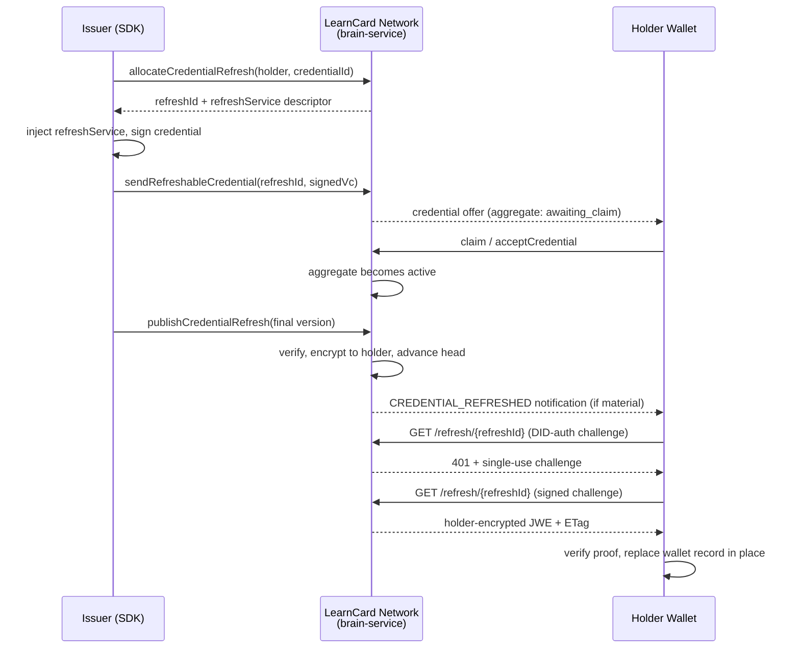

# Issue and Refresh a Managed Credential

This guide shows how to issue a Verifiable Credential (VC) that can be **updated in place after issuance** — for example, a provisional CLR 2.0 transcript that later becomes final — and how a holder wallet picks up those updates. For the concepts and privacy model, see [Credential Refresh](../core-concepts/credential-refresh.md).

---

## Overview



## Prerequisites

- LearnCard SDK initialized with `network: true`
- An issuer profile on the network (see [Send Credentials](send-credentials.md))
- For signing-authority publication: a [signing authority](create-signing-authority.md) registered to the issuer
- The managed refresh endpoint enabled on the network (`CREDENTIAL_REFRESH_ENABLED=true`)

```typescript
import { initLearnCard } from '@learncard/init';

const issuer = await initLearnCard({ seed: process.env.ISSUER_SEED, network: true });
const holder = await initLearnCard({ seed: process.env.HOLDER_SEED, network: true });
```

---

## Issuing a refreshable credential

### Option A — Convenience API (recommended)

Pass `enableRefresh: true` when sending a boost credential. The SDK allocates the refresh service, injects it into the credential **before signing**, and delivers through the managed path (holder-encrypted storage only):

```typescript
const credentialUri = await issuer.invoke.sendBoost(
    'student-123', // recipient profileId
    'urn:lc:boost:abc123', // boost template URI
    { enableRefresh: true, encrypt: true, skipNotification: false }
);
```

The recipient's wallet now holds a credential whose signed `refreshService` points at the network's managed endpoint.


`enableRefresh` generates a stable `urn:uuid:` credential ID when the credential doesn't already have one. Every published version must keep that exact ID.


### Option B — Explicit allocation (raw/custom issuance)

If you construct and sign credentials yourself, allocate first, inject the returned service, then sign and send:

```typescript
const holderDid = 'did:key:z6Mk…'; // resolve the recipient's DID first

// 1. Allocate BEFORE signing — refreshService is part of the signed payload
const allocation = await issuer.invoke.allocateCredentialRefresh({
    holder: { did: holderDid }, // or { profileId: 'student-123', did: holderDid }
    credentialId: 'urn:uuid:9f2c…', // stable ID shared by every version
});

// allocation.refreshService:
// {
//     id: 'https://network.learncard.app/refresh/<unguessable-id>',
//     type: 'LearnCardCredentialRefresh2026',
//     authorization: { type: 'LearnCardDIDAuth' },
// }

// 2. Inject the service (and the required inline context) into the credential
const credentialContexts = Array.isArray(credential['@context'])
    ? credential['@context']
    : [credential['@context']];

const unsigned = {
    ...credential,
    '@context': [
        ...credentialContexts,
        {
            'LearnCardCredentialRefresh2026':
                'https://learncard.com/refresh#LearnCardCredentialRefresh2026',
            authorization: {
                '@id': 'https://purl.imsglobal.org/spec/ob/v3p0#authorization',
                '@context': {
                    LearnCardDIDAuth: 'https://docs.learncard.com/definitions#LearnCardDIDAuth',
                },
            },
        },
    ],
    refreshService: allocation.refreshService,
};

// 3. Sign
const signed = await issuer.invoke.issueCredential(unsigned);

// 4. Send through the managed path — brain-service persists ONLY a
//    holder-encrypted JWE; plaintext storage is bypassed
const uri = await issuer.invoke.sendRefreshableCredential(
    allocation.refreshId,
    signed,
    'urn:lc:boost:…' // optional: keep the credential linked to its boost
);
```


The inline `@context` fragment above is **required** for signing. Neither VCDM 1.1/2.0 nor the live Open Badges 3.0 contexts define the terms `LearnCardCredentialRefresh2026`, `authorization`, or `LearnCardDIDAuth`, so DIDKit's data-loss detection will refuse to sign a credential that carries them without an inline mapping. The convenience API injects this fragment automatically.


---

## Publishing an update

Once the credential is issued, publish new versions with `publishCredentialRefresh`. Every version must share the same credential ID and normalized issuer, and must not carry an _older_ effective date than the current head.

### Issuer-signed mode

You sign the updated credential yourself:

```typescript
const result = await issuer.invoke.publishCredentialRefresh({
    mode: 'issuer-signed',
    refreshId: allocation.refreshId,
    signedCredential: finalTranscriptVc, // fully signed, same id + issuer
    updateSummary: 'Final grades posted', // optional issuer/history audit metadata
    notifyHolder: true, // optional: force (true) / suppress (false)
    idempotencyKey: 'final-grades-2026-09', // optional: safe retries
});

// result: { refreshId, version: 2, publishedAt, notification: 'queued' | 'suppressed' | 'not-applicable' }
```

### Signing-authority mode

You supply updated unsigned claims; the network signs with your [signing authority](create-signing-authority.md):

```typescript
const result = await issuer.invoke.publishCredentialRefresh({
    mode: 'signing-authority',
    refreshId: allocation.refreshId,
    credential: updatedUnsignedClaims,
    signingAuthority: { type: 'http', endpoint: 'https://…', name: 'my-sa' },
});
```

Notes:

- **Idempotency**: retrying with the same `refreshId` + `idempotencyKey` returns the original result instead of creating a duplicate version.
- **Materiality**: when `notifyHolder` is unset, the network compares a canonical projection of user-visible content and notifies only on material change. The `notification` field in the result is the _decision_; delivery is fire-and-forget and never rolls back publication.
- **Unclaimed credentials**: you can publish before the holder claims. Versions are stored but not served and not notified; on claim, the holder activates at the latest head with at most one notification.

### Inspecting issuer history

```typescript
const history = await issuer.invoke.getCredentialRefreshHistory({
    refreshId: allocation.refreshId,
    cursor: undefined,
    limit: 25,
});

// history.records: [{ version, publishedAt, effectiveAt?, etag?, signingMode?, updateSummary? }]
```

Issuer history is cursor-paginated and **metadata-only** — it never returns credential bodies or encrypted payloads.

---

## Holder-side refresh

### The generic primitive

Any wallet can refresh any credential that carries a supported `refreshService` — LearnCard-managed or a public 1EdTech service:

```typescript
const result = await holder.invoke.refreshCredential(currentVc, {
    etag: lastKnownEtag, // optional: sent as If-None-Match
});

switch (result.status) {
    case 'updated':
        // result.credential is verified (proof, same issuer/ID, not older)
        // result.etag / result.managedVersion may be present
        break;
    case 'unchanged':
        break; // held credential is current
    case 'unsupported':
        break; // no supported refreshService
    case 'failed':
        // result.code is a safe machine-readable code; result.retryable hints next steps
        break;
}
```

The primitive:

- verifies the **currently held** credential before contacting any endpoint
- performs **one** refresh interaction (single object or first supported entry of an array)
- answers a recognized `LearnCardDIDAuth` challenge by signing once and retrying
- accepts plain VC or holder-encrypted JWE envelopes and decrypts with the holder's keys
- never mutates storage — storage decisions belong to the wallet layer

### Safety rails

The fetcher treats `refreshService.id` as untrusted input: HTTPS-only, at most `maxRedirects` (default 3) revalidated redirects, `timeoutMs` (default 10s), and a `maxResponseBytes` cap (default 1 MiB). In Node runtimes it also resolves and pins the destination address, rejecting private, loopback, link-local, and metadata ranges; browser JavaScript cannot inspect or pin DNS results, so browser requests reject unsafe IP literals and otherwise rely on browser networking and CORS. Endpoints violating the applicable checks fail with `UNSAFE_ENDPOINT`. Local development can explicitly opt into HTTP with `allowInsecureHttp: true` and private addresses with `allowPrivateAddresses: true`; never enable either exception for credentials from untrusted issuers.

### Failure codes

| Code                  | Meaning                                             | Retryable |
| --------------------- | --------------------------------------------------- | --------- |
| `UNAVAILABLE`         | Endpoint unreachable / server error                 | yes       |
| `TIMEOUT`             | Request timed out                                   | yes       |
| `UNSUPPORTED_SERVICE` | Service type not recognized                         | no        |
| `UNAUTHORIZED`        | DID-auth rejected                                   | no        |
| `MALFORMED_RESPONSE`  | Response isn't a valid credential/envelope          | no        |
| `INVALID_PROOF`       | Returned credential fails proof verification        | no        |
| `ISSUER_MISMATCH`     | Returned credential has a different issuer          | no        |
| `ID_MISMATCH`         | Returned credential has a different ID (or subject) | no        |
| `ROLLBACK`            | Returned credential is older than the held one      | no        |
| `REVOKED`             | The managed credential was revoked                  | no        |
| `UNSAFE_ENDPOINT`     | URL/redirect/DNS failed SSRF checks                 | no        |

### What the LearnCard app does automatically

The app builds on the primitive so holders don't have to think about refresh:

- **Foreground scanning**: on app launch/resume, stale refreshable records are checked (at most once per session and once per credential per **24 hours**, configurable via `CREDENTIAL_REFRESH_CHECK_INTERVAL_MS`). There is no background scheduler — all checks are foreground-only.
- **In-place replacement**: an update replaces the wallet record's URI in one index write and appends the previous encrypted URI to holder-only history. A failure before that write leaves the current credential untouched; cross-device races converge on the next foreground check.
- **Notification tap**: tapping a "credential updated" notification forces a targeted refresh (bypassing the 24-hour guard) and opens the detail view; on failure the existing credential opens with friendly retry copy.
- **Updated state & history**: the detail view shows an `Updated` pill until viewed, and `View Previous Versions` opens the holder-only version history.

---

## Standard compact VC-JWT (text/plain 1EdTech refresh)

A standard [`1EdTechCredentialRefresh`](https://www.imsglobal.org/spec/vccr/v1p0/) service may answer a refresh `GET` with a bare compact VC-JWT in a `text/plain` body instead of a JSON credential. The primitive accepts these responses for the standard service type only, verifies the token with the pinned DIDKit/SSI implementation, and normalizes the replacement from the verified token. It also accepts a JWT-backed **held** credential — a raw compact token, a canonical `{ format: 'jwt-vc-json', data }` envelope, or a legacy `JwtProof2020` / `proof.jwt` projection.

```typescript
// The held credential may be a compact VC-JWT, a jwt-vc-json envelope, or a
// JwtProof2020 / proof.jwt projection. The signed token's refreshService — not a
// mutable display object — selects the endpoint.
const result = await holder.invoke.refreshCredential(heldCompactJwt, {
    etag: lastKnownEtag, // optional: sent as If-None-Match
});

switch (result.status) {
    case 'updated':
        // result.credential is the normalized replacement. It retains the exact
        // signed replacement token under proof.jwt, so persisting and reading it
        // back re-derives the same authoritative claims.
        await holder.store.LearnCloud.uploadEncrypted(result.credential);
        break;
    case 'unchanged':
    case 'unsupported':
        break;
    case 'failed':
        // result.code is a safe machine-readable code; result.retryable hints next steps
        break;
}

// Verify a compact token directly. DIDKit reports JWT success as checks: ['JWS'].
const check = await holder.invoke.verifyCredential(compactJwt, { proofFormat: 'jwt' });
// check: { checks: ['JWS'], warnings: [], errors: [] } for a valid token.
```

`@learncard/vc-plugin` also exports the lower-level `verifyCredentialJwt`, which returns the exact verified token and token-derived metadata instead of the `VerificationCheck` projection:

```typescript
import { verifyCredentialJwt } from '@learncard/vc-plugin';

// The first argument is the VC plugin's DIDKit-backed dependency object (the
// object getVCPlugin receives), not the merged top-level wallet, which would
// recurse into learnCard.invoke.verifyCredential.
const verified = await verifyCredentialJwt(didkitBackedLearnCard, compactJwt);

if (verified.verified) {
    const { token, metadata } = verified;

    // token is the exact compact JWS that was verified.
    // metadata is token-derived; display metadata cannot substitute for it:
    // { version, profile, issuer, subjectIds, id, issuedAt, expiresAt, algorithm, keyId }
    console.log(token, metadata.issuer);
}
```

`learnCard.invoke.verifyCredential(compactJwt, { proofFormat: 'jwt' })` routes through this same normalization.

The compact token is the authority. Verification returns the exact original token plus token-derived metadata; display objects cannot substitute for it. Store, read and export retain the token as `proof.jwt` (`JwtProof2020`) or a `jwt-vc-json` envelope.

### Supported algorithms, profiles and media types

| Dimension           | Supported                                                                                                                                                         | Rejected or not claimed                                                                                                                                  |
| ------------------- | ----------------------------------------------------------------------------------------------------------------------------------------------------------------- | -------------------------------------------------------------------------------------------------------------------------------------------------------- |
| Signature algorithm | Ed25519 `did:key` with JOSE `alg: EdDSA` (the positive fixture); the algorithm is read from the protected header and verified against the key resolved from `kid` | `alg: none`; symmetric `HS256` / `HS384` / `HS512` (algorithm confusion). Other JWT algorithms are delegated to DIDKit but are **not** claimed supported |
| Securing profile    | VCDM 1.1; VCDM 2.0 only as the legacy JOSE `vc`-claim wrapping profile (`vc-jwt-2.0-legacy`)                                                                      | General VC-JOSE-COSE conformance; unknown contexts and unknown `proofFormat`                                                                             |
| Refresh transport   | `text/plain` bare compact VC-JWT for a verified `refreshService.type === '1EdTechCredentialRefresh'`; `charset` of `utf-8`, `utf8`, `us-ascii`, or `ascii`        | `text/plain` for managed `LearnCardCredentialRefresh2026` (`MALFORMED_RESPONSE`). JSON-LD credentials keep the existing JSON media types                 |
| Token input         | Raw compact JWS; `jwt-vc-json` envelope; `JwtProof2020` / `proof.jwt` projection                                                                                  | SD-JWT; non-object or unsigned payloads                                                                                                                  |

### Registered claim mapping

The normalized credential is reconciled against the embedded `vc` claim; contradictions reject.

| JWT claim | Credential field                                                                   |
| --------- | ---------------------------------------------------------------------------------- |
| `iss`     | `issuer`                                                                           |
| `sub`     | `credentialSubject.id` (single subject only; multi-subject is ambiguous and fails) |
| `jti`     | `id`                                                                               |
| `iat`     | `issuanceDate` (takes precedence over `nbf`)                                       |
| `nbf`     | `issuanceDate` (used only when `iat` is absent)                                    |
| `exp`     | `expirationDate`                                                                   |

Issuer DID assertion-method authorization is enforced: a `kid` bound to a different DID than the normalized issuer is rejected. Unsupported contexts, malformed headers or claims, and unknown `proofFormat` values fail closed.


**Expired compact VC-JWT renewal.** A signature-valid but **expired** compact VC-JWT held by the holder is renewed through an explicit, credential-only renewal-only verification mode: the JWS signature, issuer-authorized key (`kid`), `nbf`, proof purpose, nonce and audience are still enforced, but an expired `exp` is tolerated. A successful renewal-only result reports the additional `JWSRenewalExpired` check alongside `JWS` and is **not** ordinary credential validity. Replacements are always verified strictly, so an expired or future replacement, a future-`nbf` held token, a forged signature or a wrong signer still fails closed (`INVALID_PROOF`) before any request. Ordinary verification and every presentation remain strict; `allowExpiredCredential` is rejected for them. SD-JWT is out of scope.


---

## Configuration & feature flags

| Setting                                        | Where                    | Default      | Purpose                                                             |
| ---------------------------------------------- | ------------------------ | ------------ | ------------------------------------------------------------------- |
| `CREDENTIAL_REFRESH_ENABLED`                   | brain-service env        | off          | Registers the managed `/refresh/*` holder endpoints                 |
| `CREDENTIAL_REFRESH_DIGEST_SECRET`             | brain-service env        | _(required)_ | Dedicated HMAC secret keying materiality digests; validated at boot |
| `CREDENTIAL_REFRESH_NOTIFICATION_WINDOW_HOURS` | brain-service env        | `24`         | Delivery window for collapsing repeat-update notifications          |
| `credentialRefreshForegroundEnabled`           | LaunchDarkly (client)    | off          | Gates automatic foreground scanning in the app                      |
| `CREDENTIAL_REFRESH_CHECK_INTERVAL_MS`         | learn-card-base constant | 24 hours     | Per-credential staleness interval for ordinary checks               |

Issuer tRPC/OpenAPI routes (`/credential-refresh/allocate`, `/credential-refresh/send`, `/credential-refresh/publish`, `/credential-refresh/history`) require the `credentials:write` scope (`credentials:read` for history).

---

## Local browser QA (no source edits)

This flow uses the local app and Docker backend. It does not clear existing databases or run the destructive E2E harness.

### 1. Configure the backend and app

In `services/learn-card-network/brain-service/.env`, set:

```dotenv
CREDENTIAL_REFRESH_ENABLED=true
CREDENTIAL_REFRESH_DIGEST_SECRET=<your-generated-secret>
```

Generate the secret **once** with `openssl rand -hex 32` and keep that value across restarts. It keys persisted materiality digests; changing it requires a rotation/backfill strategy. This belongs in the backend env file, never a `VITE_` variable. If using Infisical, the backend folder is `/LearnCard/brain-service` in your development environment; a later env pull can overwrite local additions.

In `apps/learn-card-app/.env`, set:

```dotenv
VITE_CREDENTIAL_REFRESH_LOCAL_QA=true
```

The app opt-in works only under the Vite **dev server**, with both the app and configured brain-service URL on `localhost`, `127.0.0.1`, or `[::1]`. Only managed `/refresh/` URLs on that exact backend origin receive the SDK's HTTP/private-address exceptions, with **zero redirects**. Production/staging builds ignore this flag. Use only synthetic credentials from your local test issuer while it is enabled.

In LaunchDarkly, create the boolean key `credentialRefreshForegroundEnabled`, make it available to **client-side SDKs**, and serve `true` in **Local Dev** (or the environment selected by your tenant's client ID). This controls foreground scanning; the backend env flag independently enables the APIs. Notification taps force a targeted check.

### 2. Start the stack and sign in

From the repository root:

```bash
bun install --frozen-lockfile
bun run --cwd packages/learn-card-types build
bun run --cwd packages/learn-card-helpers build
bun run --cwd apps/learn-card-app dev
```

Open `http://localhost:3000`, sign in, and note your profile ID (for example, `billygates`, without the DID prefix). The default local services are brain `4000`, LearnCloud `4100`, and notification API `5100`. Ensure the Compose host ports are free; if host Redis already uses `6379`, remove that Redis port mapping with a local Compose override (the containers use their internal network).

After backend env edits, recreate the container to reload `env_file`:

```bash
docker compose -f apps/learn-card-app/compose-local.yaml up -d --force-recreate brain
```

After app env edits, recreate the app container (or restart Vite if running it on the host):

```bash
docker compose -f apps/learn-card-app/compose-local.yaml up -d --force-recreate app
```

Include any local Compose override in these commands too.

### 3. Send, claim, and publish

In a second terminal at the repository root, replace `billygates` with your local profile ID:

```bash
bun --conditions=development tests/e2e/scripts/credential-refresh-qa.ts send billygates
```

In the app, open **Alerts → Claim**, then **Passport → Studies**. Confirm the provisional transcript has a valid proof and its BIO 150 result is in progress. Then publish:

```bash
bun --conditions=development tests/e2e/scripts/credential-refresh-qa.ts publish billygates
bun --conditions=development tests/e2e/scripts/credential-refresh-qa.ts status billygates
```

The CLI creates a random local registrar and stores its key and signed retry state in the gitignored `.credential-refresh-qa/` directory. Run commands sequentially. Repeating `send` reuses the original delivery; repeating `publish` uses the same signed payload and idempotency key. `status` shows issuer version metadata, without printing the key. The CLI is intentionally fixed to localhost and does not publish to staging or production.

### 4. Check the result

- Tap the update notification. Expect **Final Official Transcript**, with BIO 150 **Completed / A**.
- Confirm Studies still has one record, with an Updated indicator until viewed.
- Open **View Previous Versions** from the earned credential menu and confirm the provisional transcript remains readable.
- For foreground-only testing, reload the page to start a new session; ordinary checks have a 24-hour staleness interval. Repeated tab switching alone does not force a check. Notification taps bypass that interval.

One initial `401` is expected: it supplies `WWW-Authenticate: LearnCardDIDAuth`; the SDK signs the challenge and retries. The route exposes `WWW-Authenticate` and `ETag` through CORS so browser JavaScript can read them. A lone `401` followed by `UNAUTHORIZED` is a failed handshake, not a successful update. A `UNSAFE_ENDPOINT` result usually means the local QA opt-in, app origin, or configured backend origin does not match.

This CLI covers the provisional-to-final path. Notification-collapse and Boost-recipient revocation scenarios remain in `tests/e2e/tests/credential-refresh.spec.ts`; a raw CLR sent by this CLI has no Boost recipient to revoke. After testing, unset the app's local QA flag and restart it. Preserve the backend secret while retaining its database.

---

## Limitations (Phase 1)

- Managed refresh must be allocated **before signing** — it cannot be retrofitted onto already-signed credentials.
- Refresh is **foreground-only**; manual pull-to-refresh is a planned follow-up.
- The app replaces the wallet record in place, but exact cross-device compare-and-swap is out of scope; devices converge on their next foreground check.
- Revocation stops the endpoint from serving versions; the holder's locally retained history is not remotely deleted.
- **Expired compact VC-JWT refresh is supported through an explicit renewal-only mode.** The held token's JWS signature, issuer-authorized key, `nbf`, proof purpose, nonce and audience are verified, and an expired `exp` is tolerated only for the held credential. The successful result carries the `JWSRenewalExpired` check in addition to `JWS` and must not be treated as ordinary validity. Replacements and ordinary verification remain strict. This capability ships with the rebuilt WASM/native artifacts from the LC-2195 fork commits; the source commits are local-only until the forks are published.

## See also

- [Credential Refresh (Core Concepts)](../core-concepts/credential-refresh.md)
- [Send Credentials](send-credentials.md)
- [Create Signing Authority](create-signing-authority.md)
- [1EdTech Credential Refresh Service 1.0](https://www.imsglobal.org/spec/vccr/v1p0/)
