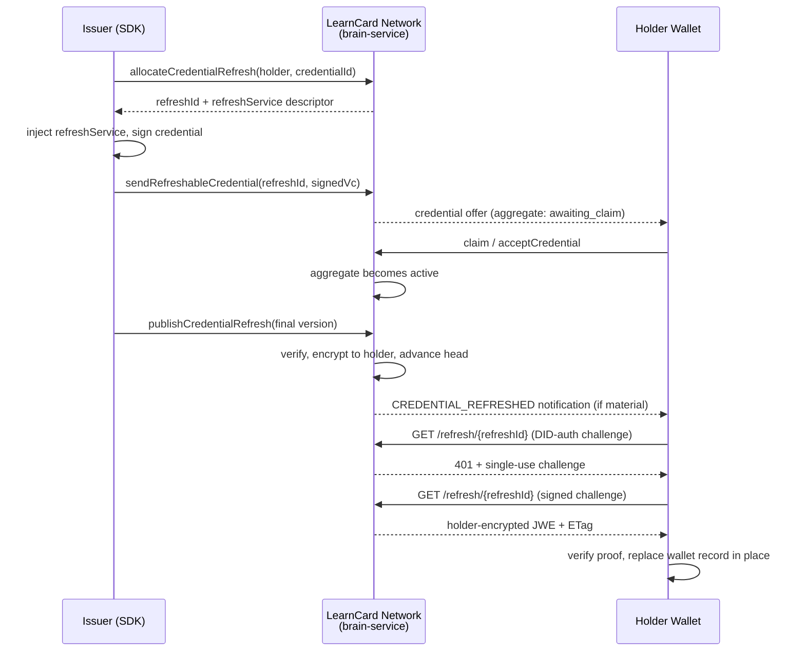

# Issue and Refresh a Managed Credential

This guide shows how to issue a Verifiable Credential (VC) that can be **updated in place after issuance** — for example, a provisional CLR 2.0 transcript that later becomes final — and how a holder wallet picks up those updates. For the concepts and privacy model, see [Credential Refresh](../core-concepts/credential-refresh.md).

---

## Overview



## Prerequisites

- LearnCard SDK initialized with `network: true`
- An issuer profile on the network (see [Send Credentials](send-credentials.md))
- For signing-authority publication: a [signing authority](create-signing-authority.md) registered to the issuer
- The managed refresh endpoint enabled on the network (`CREDENTIAL_REFRESH_ENABLED=true`)

```typescript
import { initLearnCard } from '@learncard/init';

const issuer = await initLearnCard({ seed: process.env.ISSUER_SEED, network: true });
const holder = await initLearnCard({ seed: process.env.HOLDER_SEED, network: true });
```

---

## Issuing a refreshable credential

### Option A — Convenience API (recommended)

Pass `enableRefresh: true` when sending a boost credential. The SDK allocates the refresh service, injects it into the credential **before signing**, and delivers through the managed path (holder-encrypted storage only):

```typescript
const credentialUri = await issuer.invoke.sendBoost(
    'student-123', // recipient profileId
    'urn:lc:boost:abc123', // boost template URI
    { enableRefresh: true, encrypt: true, skipNotification: false }
);
```

The recipient's wallet now holds a credential whose signed `refreshService` points at the network's managed endpoint.


`enableRefresh` generates a stable `urn:uuid:` credential ID when the credential doesn't already have one. Every published version must keep that exact ID.


### Option B — Explicit allocation (raw/custom issuance)

If you construct and sign credentials yourself, allocate first, inject the returned service, then sign and send:

```typescript
const holderDid = 'did:key:z6Mk…'; // resolve the recipient's DID first

// 1. Allocate BEFORE signing — refreshService is part of the signed payload
const allocation = await issuer.invoke.allocateCredentialRefresh({
    holder: { did: holderDid }, // or { profileId: 'student-123', did: holderDid }
    credentialId: 'urn:uuid:9f2c…', // stable ID shared by every version
});

// allocation.refreshService:
// {
//     id: 'https://network.learncard.app/refresh/<unguessable-id>',
//     type: '1EdTechCredentialRefresh',
//     authorization: { type: 'LearnCardDIDAuth' },
// }

// 2. Inject the service (and the required inline context) into the credential
const credentialContexts = Array.isArray(credential['@context'])
    ? credential['@context']
    : [credential['@context']];

const unsigned = {
    ...credential,
    '@context': [
        ...credentialContexts,
        {
            '1EdTechCredentialRefresh':
                'https://purl.imsglobal.org/spec/ob/v3p0#1EdTechCredentialRefresh',
            authorization: {
                '@id': 'https://purl.imsglobal.org/spec/ob/v3p0#authorization',
                '@context': {
                    LearnCardDIDAuth: 'https://docs.learncard.com/definitions#LearnCardDIDAuth',
                },
            },
        },
    ],
    refreshService: allocation.refreshService,
};

// 3. Sign
const signed = await issuer.invoke.issueCredential(unsigned);

// 4. Send through the managed path — brain-service persists ONLY a
//    holder-encrypted JWE; plaintext storage is bypassed
const uri = await issuer.invoke.sendRefreshableCredential(
    allocation.refreshId,
    signed,
    'urn:lc:boost:…' // optional: keep the credential linked to its boost
);
```


The inline `@context` fragment above is **required** for signing. Neither VCDM 1.1/2.0 nor the live Open Badges 3.0 contexts define the terms `1EdTechCredentialRefresh`, `authorization`, or `LearnCardDIDAuth`, so DIDKit's data-loss detection will refuse to sign a credential that carries them without an inline mapping. The convenience API injects this fragment automatically.


---

## Publishing an update

Once the credential is issued, publish new versions with `publishCredentialRefresh`. Every version must share the same credential ID and normalized issuer, and must not carry an _older_ effective date than the current head.

### Issuer-signed mode

You sign the updated credential yourself:

```typescript
const result = await issuer.invoke.publishCredentialRefresh({
    mode: 'issuer-signed',
    refreshId: allocation.refreshId,
    signedCredential: finalTranscriptVc, // fully signed, same id + issuer
    updateSummary: 'Final grades posted', // optional issuer/history audit metadata
    notifyHolder: true, // optional: force (true) / suppress (false)
    idempotencyKey: 'final-grades-2026-09', // optional: safe retries
});

// result: { refreshId, version: 2, publishedAt, notification: 'queued' | 'suppressed' | 'not-applicable' }
```

### Signing-authority mode

You supply updated unsigned claims; the network signs with your [signing authority](create-signing-authority.md):

```typescript
const result = await issuer.invoke.publishCredentialRefresh({
    mode: 'signing-authority',
    refreshId: allocation.refreshId,
    credential: updatedUnsignedClaims,
    signingAuthority: { type: 'http', endpoint: 'https://…', name: 'my-sa' },
});
```

Notes:

- **Idempotency**: retrying with the same `refreshId` + `idempotencyKey` returns the original result instead of creating a duplicate version.
- **Materiality**: when `notifyHolder` is unset, the network compares a canonical projection of user-visible content and notifies only on material change. The `notification` field in the result is the _decision_; delivery is fire-and-forget and never rolls back publication.
- **Unclaimed credentials**: you can publish before the holder claims. Versions are stored but not served and not notified; on claim, the holder activates at the latest head with at most one notification.

### Inspecting issuer history

```typescript
const history = await issuer.invoke.getCredentialRefreshHistory({
    refreshId: allocation.refreshId,
    cursor: undefined,
    limit: 25,
});

// history.records: [{ version, publishedAt, effectiveAt?, etag?, signingMode?, updateSummary? }]
```

Issuer history is cursor-paginated and **metadata-only** — it never returns credential bodies or encrypted payloads.

---

## Holder-side refresh

### The generic primitive

Any wallet can refresh any credential that carries a supported `refreshService` — LearnCard-managed or a public 1EdTech service:

```typescript
const result = await holder.invoke.refreshCredential(currentVc, {
    etag: lastKnownEtag, // optional: sent as If-None-Match
});

switch (result.status) {
    case 'updated':
        // result.credential is verified (proof, same issuer/ID, not older)
        // result.etag / result.managedVersion may be present
        break;
    case 'unchanged':
        break; // held credential is current
    case 'unsupported':
        break; // no supported refreshService
    case 'failed':
        // result.code is a safe machine-readable code; result.retryable hints next steps
        break;
}
```

The primitive:

- verifies the **currently held** credential before contacting any endpoint
- performs **one** refresh interaction (single object or first supported entry of an array)
- answers a recognized `LearnCardDIDAuth` challenge by signing once and retrying
- accepts plain VC or holder-encrypted JWE envelopes and decrypts with the holder's keys
- never mutates storage — storage decisions belong to the wallet layer

### Safety rails

The fetcher treats `refreshService.id` as untrusted input: HTTPS-only, at most `maxRedirects` (default 3) revalidated redirects, `timeoutMs` (default 10s), and a `maxResponseBytes` cap (default 1 MiB). In Node runtimes it also resolves and pins the destination address, rejecting private, loopback, link-local, and metadata ranges; browser JavaScript cannot inspect or pin DNS results, so browser requests reject unsafe IP literals and otherwise rely on browser networking and CORS. Endpoints violating the applicable checks fail with `UNSAFE_ENDPOINT`. Local development can explicitly opt into HTTP with `allowInsecureHttp: true` and private addresses with `allowPrivateAddresses: true`; never enable either exception for credentials from untrusted issuers.

### Failure codes

| Code                  | Meaning                                             | Retryable |
| --------------------- | --------------------------------------------------- | --------- |
| `UNAVAILABLE`         | Endpoint unreachable / server error                 | yes       |
| `TIMEOUT`             | Request timed out                                   | yes       |
| `UNSUPPORTED_SERVICE` | Service type not recognized                         | no        |
| `UNAUTHORIZED`        | DID-auth rejected                                   | no        |
| `MALFORMED_RESPONSE`  | Response isn't a valid credential/envelope          | no        |
| `INVALID_PROOF`       | Returned credential fails proof verification        | no        |
| `ISSUER_MISMATCH`     | Returned credential has a different issuer          | no        |
| `ID_MISMATCH`         | Returned credential has a different ID (or subject) | no        |
| `ROLLBACK`            | Returned credential is older than the held one      | no        |
| `REVOKED`             | The managed credential was revoked                  | no        |
| `UNSAFE_ENDPOINT`     | URL/redirect/DNS failed SSRF checks                 | no        |

### What the LearnCard app does automatically

The app builds on the primitive so holders don't have to think about refresh:

- **Foreground scanning**: on app launch/resume, stale refreshable records are checked (at most once per session and once per credential per **24 hours**, configurable via `CREDENTIAL_REFRESH_CHECK_INTERVAL_MS`). There is no background scheduler — all checks are foreground-only.
- **In-place replacement**: an update replaces the wallet record's URI in one index write and appends the previous encrypted URI to holder-only history. A failure before that write leaves the current credential untouched; cross-device races converge on the next foreground check.
- **Notification tap**: tapping a "credential updated" notification forces a targeted refresh (bypassing the 24-hour guard) and opens the detail view; on failure the existing credential opens with friendly retry copy.
- **Updated state & history**: the detail view shows an `Updated` pill until viewed, and `View Previous Versions` opens the holder-only version history.

---

## Configuration & feature flags

| Setting                                        | Where                    | Default      | Purpose                                                             |
| ---------------------------------------------- | ------------------------ | ------------ | ------------------------------------------------------------------- |
| `CREDENTIAL_REFRESH_ENABLED`                   | brain-service env        | off          | Registers the managed `/refresh/*` holder endpoints                 |
| `CREDENTIAL_REFRESH_DIGEST_SECRET`             | brain-service env        | _(required)_ | Dedicated HMAC secret keying materiality digests; validated at boot |
| `CREDENTIAL_REFRESH_NOTIFICATION_WINDOW_HOURS` | brain-service env        | `24`         | Delivery window for collapsing repeat-update notifications          |
| `credentialRefreshForegroundEnabled`           | LaunchDarkly (client)    | off          | Gates automatic foreground scanning in the app                      |
| `CREDENTIAL_REFRESH_CHECK_INTERVAL_MS`         | learn-card-base constant | 24 hours     | Per-credential staleness interval for ordinary checks               |

Issuer tRPC/OpenAPI routes (`/credential-refresh/allocate`, `/credential-refresh/send`, `/credential-refresh/publish`, `/credential-refresh/history`) require the `credentials:write` scope (`credentials:read` for history).

---

## Limitations (Phase 1)

- Managed refresh must be allocated **before signing** — it cannot be retrofitted onto already-signed credentials.
- Refresh is **foreground-only**; manual pull-to-refresh is a planned follow-up.
- The app replaces the wallet record in place, but exact cross-device compare-and-swap is out of scope; devices converge on their next foreground check.
- Revocation stops the endpoint from serving versions; the holder's locally retained history is not remotely deleted.

## See also

- [Credential Refresh (Core Concepts)](../core-concepts/credential-refresh.md)
- [Send Credentials](send-credentials.md)
- [Create Signing Authority](create-signing-authority.md)
- [1EdTech Credential Refresh Service 1.0](https://www.imsglobal.org/spec/vccr/v1p0/)
