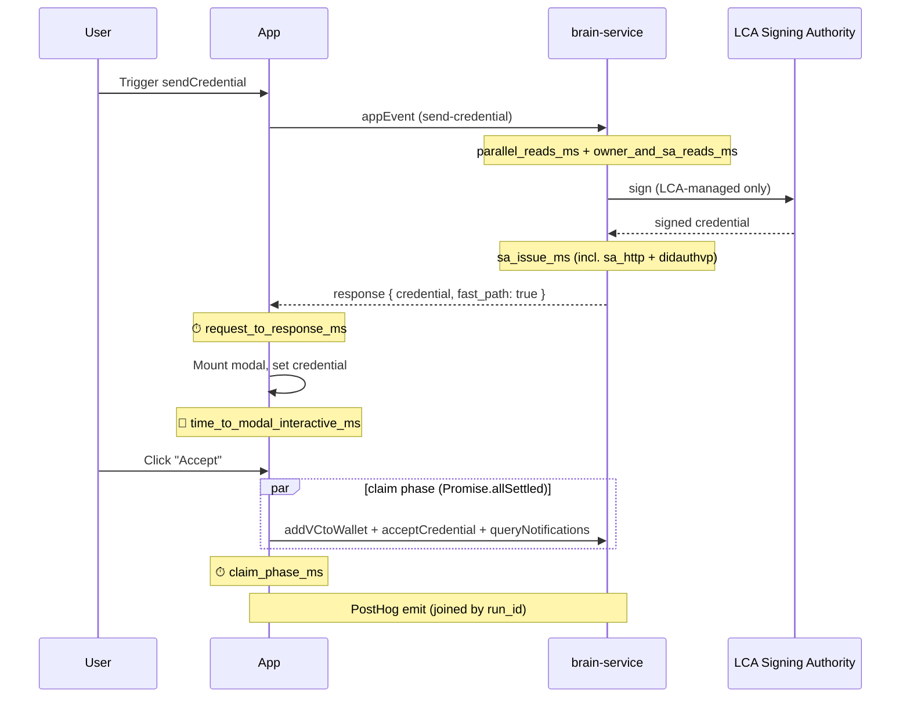

# LC-1644 Results + LC-1811 Recommendation

JIRA: [LC-1644](https://welibrary.atlassian.net/browse/LC-1644) · [LC-1811](https://welibrary.atlassian.net/browse/LC-1811)

> Internal performance summary written for leadership. Not part of the public docs (`docs.learncard.com`). The companion PR is [#1225](https://github.com/learningeconomy/LearnCard/pull/1225), which supersedes the backend-only [#1189](https://github.com/learningeconomy/LearnCard/pull/1189).

## TL;DR

1. **LC-1644 worked.** Credential issuance went from a 4–12 second wait to **~1.5 seconds** measured from Japan, projected **~500ms for US users**. Backend tail (the slow outliers) dropped **92%**. Frontend worst-case tail dropped **15×**. All measurable, all backed by telemetry that will keep running in production.

2. **LC-1811's latency premise no longer holds.** LC-1811 was opened to chase a "5–10 second latency" problem with an architectural rewrite (custom signing pipeline, KMS key custody). Our measurements show that latency was almost entirely network setup, not architecture — and it's now fixed with one connection-reuse change plus a few targeted frontend tweaks.

3. **LC-1811's security questions are still valuable** — just not for the reason the ticket states. Recommendation: **re-scope LC-1811 to drop the latency framing and refocus it on security architecture** (LEF key custody, partner blast radius, signer abstraction). Same work, more honest framing, no perf-anxiety bias on the design.

---

## What was wrong

Sending a credential through Partner Connect — the core flow underneath every app integration — was taking 4–12 seconds. Users saw an unresponsive UI for long enough that it felt broken. We had a hypothesis (Neo4j queries are slow), an architectural rewrite ticket already drafted (LC-1811), and a 2-point timebox to validate it.

LC-1811's own success criteria included a stop-condition: *"If we measure the current path and the cost is something trivially fixable without re-architecture, ship the fix and stop."* We applied that test.

## What we shipped

### Stage 1 — Backend

The slow part wasn't Neo4j. It was network setup to the external signing service.

Every signing call opened a brand-new TCP+TLS connection from scratch (~200ms of pure handshake), and because each call landed on a different signing-service container, we kept hitting "cold" ones that hadn't been warmed up. We changed the backend to keep one persistent connection open and reuse it.

That single change cut the slow-tail (p95) from **4.5 seconds → 366ms (−92%)**.

We added a benchmark harness and PostHog telemetry on top so we'd see any regression in production immediately, plus parallelized some Neo4j reads, added a small cache, and shortened a few timeouts.

### Stage 2 — Frontend

After the user clicks "Accept", four API calls used to fire one after another. If any single call was slow, the whole flow stalled — we observed one case dragging to **31 seconds** because one tRPC call stalled in the sequential chain. We parallelized three of those calls and made the fourth fire-and-forget.

We also threaded the credential through the response so the modal could render correctly on the first frame instead of briefly showing placeholder text. And we added matching frontend telemetry so backend and frontend phase timings can be joined in PostHog.

> **Scope note on Stage 1.** The backend optimizations only affect credentials signed by the LearnCard-managed Signing Authority (the `lca-api` service that holds LEF's keys). **Partner-hosted Signing Authorities — running on partner infrastructure — are not touched and not measured.** When a partner self-hosts their SA, the credential request goes through brain-service to their endpoint, and their signing time is opaque to us. We may want a separate spike to characterize partner-SA latency, but it's out of scope for LC-1644.

## What we measured

To make sure the numbers above represent the real user-perceived flow (not just an isolated test), we instrumented every meaningful boundary on both the backend and the frontend. Every emitted event carries a shared `run_id` so backend and frontend timings join cleanly in PostHog.

### The instrumented flow

### What each phase captures

**Backend phases** (PostHog event `bench.appevent.iteration`):

| Phase | What it measures |
|---|---|
| `parallel_reads_ms` | Initial Neo4j lookups for listing / boost / recipient profile, batched in parallel |
| `owner_and_sa_reads_ms` | Second batch of Neo4j lookups for the integration owner + Signing Authority chain |
| `sa_issue_ms` | Total time spent issuing the credential against the LCA Signing Authority |
| ↳ `sa_http_ms` | Raw HTTP time to the LCA Signing Authority (the call that dominated p95 before keepAlive) |
| ↳ `sa_didauthvp_ms` | DID-auth Verifiable Presentation generation that wraps the SA request |
| `log_activity_and_send_boost_ms` | Activity log write + boost dispatch (fire-and-forget on the backend) |
| `total_ms` | End-to-end backend time for the `appEvent` call |

**Frontend phases** (PostHog event `frontend.sendcredential.iteration`):

| Phase | What it measures |
|---|---|
| `request_to_response_ms` | Time from `sendAppEvent()` invocation to brain-service response. Mirrors backend `total_ms` plus network RTT. |
| `response_to_modal_mount_ms` | Response arrives → React mounts the `CredentialClaimModal`. Near-zero in practice. |
| `modal_mount_to_credential_resolved_ms` | Modal mounted → credential available in state. **0ms on the fast path** (credential came in the response). Was ~500ms on the baseline (extra `wallet.read.get(uri)` round-trip). |
| `claim_phase_ms` | User clicks "Accept" → claim completes. The three parallelized calls + UI settle. |
| `time_to_modal_interactive_ms` | **Headline user-perceived metric.** Composite: `request_to_response + response_to_modal_mount + modal_mount_to_credential_resolved`. The moment the user can see and act on their credential. |
| `total_e2e_ms` | Wall-clock total including user-think-time between modal appearing and clicking Accept. Useful for UX/cohort analysis but **not used for perf comparisons** — it's noisy by design. |

### Production gating

The frontend telemetry is gated behind LaunchDarkly flag **`enableSendCredentialPosthogTelemetry`** (defaults to **off**). When the flag is off, no PostHog events emit from natural production flows — zero cost, zero noise. Bench-panel-triggered measurement campaigns bypass the gate, so we can run measurement passes from Admin Tools regardless of the production toggle.

## The numbers

All from a Tokyo test client → US-east staging. US users will see roughly half these absolute latencies.

| Metric | Before LC-1644 | After LC-1644 | Improvement |
|---|---:|---:|---:|
| Backend median time | 570ms | 292ms | −49% |
| **Backend slow tail (p95)** | **4547ms** | **366ms** | **−92%** |
| Frontend modal renders with credential | ~500ms after mount | **0ms** | −100% |
| Frontend claim phase median | 4745ms | 1810ms | −62% |
| **Frontend claim phase worst-case** | **31644ms** ⚠️ | 2046ms | **15.5×** |
| **End-to-end user wait** | **~6000ms** | **~1563ms** | **−74%** |
| End-to-end (US projected) | — | **~500ms** | — |

The LC-1644 ticket's original success criterion was *"end-to-end claim completes in under 4 seconds on a typical network."* We're under that target by a comfortable margin even from Japan.

---

## What this tells us about LC-1811

LC-1811 was written to answer one driving question:

> *"How do we eliminate the 5–10s latency that every signing-authority-backed issuance pays today — without putting partner seeds inside brain-service, and without breaking the partner-hosted Signing Authority contract?"*

It bundles two parallel goals:

**Goal A — Latency.** Kill the 5–10 second issuance wait.

**Goal B — Security architecture.** Design a `Signer` interface, decide where LEF keys live (KMS vs sidecar vs scoped sessions), keep partner seeds isolated.

LC-1644's measurements speak directly to Goal A and only tangentially to Goal B.

### Goal A — Latency premise: **disproven**

The "5–10 seconds" was real but it was caused by connection setup, not architecture. We measured:

- Signing-service HTTP call: **51ms median** (it was already fine — the framing was wrong)
- Backend total: **292ms median** after one connection-reuse change
- End-to-end user-perceived: **~1.5 seconds** from Japan, projected **~500ms** in the US

There is no remaining 5–10 second latency to architect away. Even the most aggressive theoretical custody change (replacing the signing-service HTTP hop with an in-process KMS call) would save **~20–40ms on a 292ms warm path**. Not nothing, but not worth a rewrite.

**Bottom line: nothing in the latency lane of LC-1811 should be built. The premise that justified it is gone.**

### Goal B — Security architecture: **still valuable, just not for latency reasons**

The security questions in LC-1811 stand on their own merits:

- **Blast radius.** Where should LEF private keys live so brain-service doesn't hold them in memory? KMS, a Nitro Enclave, or a co-located signer all have different security/ops trade-offs. LC-1644 doesn't change those trade-offs — it just removes latency from the calculation, which is honestly *helpful* for designing this cleanly.
- **`Signer` abstraction.** Wrapping the current HTTP-based signing call in a typed interface (`LefSigner`, `PartnerSigner`) makes per-signer routing explicit, surfaces the trust boundary in code, and makes future custody changes a 1-impl swap instead of a refactor.
- **Partner-SA isolation.** Partner-hosted signing endpoints run on partner-controlled infrastructure. The current setup is fine but the boundary should be explicit, not implicit.
- **Audit log unification.** One signing-event audit pipeline regardless of which signer ran. Cheap to add when the abstraction lands.

None of this needs to be load-bearing on latency claims. It's the kind of architecture work that pays off in security posture, ops simplicity, and our ability to make custody changes confidently later.

### What we recommend doing with LC-1811

**Re-scope LC-1811 (or open a small successor ticket) with the latency framing dropped.**

Update LC-1811 with a comment containing:
- Link to this summary
- Headline numbers (the table above)
- Decision: *we will not build a Signer abstraction or KMS-backed LEF custody for latency reasons; we may still do that same work for security reasons under a re-scoped ticket*

Then either edit LC-1811's title/description or open a successor ticket with revised driving questions:

- *"What should the trust boundary between brain-service, LEF signing, and partner SAs look like in code?"* (architecture, not perf)
- *"Where should LEF private material live?"* (security, not perf — graded on blast radius, ops complexity, rotation story)
- *"How do we migrate without breaking the partner-hosted SA contract?"* (unchanged from original framing)
- Soft latency floor: *don't regress below 292ms p50.*

The work surface is roughly the same. The framing and the success metrics change — and the design will be cleaner without latency anxiety driving choices that should be about security.

### What also belongs in a separate ticket (not LC-1811)

A few residual latency follow-ups exist but they're small, orthogonal, and should not be bundled with LC-1811's security work:

- **Partner-hosted SA measurement.** We benchmarked the LEF signing service. Partner-hosted signing services run on partner infra and we have no data. Worth a small spike to confirm there's no surprise.
- **Lambda cold-start mitigation.** After a deploy, the first request still pays a 4–5 second cold-init cost. Addressable via AWS Provisioned Concurrency (~$20–60/mo per instance) or an EventBridge keepalive ping (~$1–2/mo, probabilistic). Worth doing when production cold-start metrics tell us it matters to real users.
- **Continue to monitor PostHog.** The telemetry we built is now permanent. Any regression — backend or frontend — shows up in dashboards.

These are 1–3 day tickets each, none of them architectural.

---

## Caveats on the LC-1644 numbers

So leadership has the full picture:

- **All measurements from a Tokyo client → US-east staging.** US users will see roughly half the absolute latencies (~150–250ms one-way RTT removed). Projections are math, not direct measurements.
- **Bench-driven, not real partner flows yet.** The triggering harness drives the same code path a real partner app would, but it's synthetic. No production telemetry on the live flow yet — PR #1225 adds that.
- **LCA-managed Signing Authority only.** The backend optimizations and the staging measurements both target the LCA-managed Signing Authority (the `lca-api` service holding LEF's keys). Partner-hosted Signing Authorities — running on partner-controlled infrastructure — are explicitly not in scope and unmeasured. Their signing time is opaque to us. If partner SAs turn out to be a separate bottleneck, that's its own follow-up.
- **Lambda cold-start tail still exists.** Post-deploy first-request can hit 4–5 seconds. This is independent of anything LC-1644 touched and is addressable separately.

## One-page summary if forwarded

LC-1644 was a 2-point ticket to validate whether a 5–10 second credential-issuance wait was caused by what people thought it was. We built telemetry, measured, and found the real cause (network connection setup, not Neo4j or architecture). One connection-reuse change cut the backend slow tail by 92%. A handful of frontend parallelization changes cut user-perceived time by another 60%+ and eliminated a 15× worst-case stall pattern. End-to-end user wait went from 4–12 seconds to ~1.5 seconds (Japan) / ~500ms (projected US).

LC-1811 was opened to architect the same problem differently — a `Signer` abstraction plus moving LEF key custody to KMS or a sidecar. The latency justification for that work is now gone. The security justification for it is still valid, and the work should still happen — but framed as security architecture, graded on blast radius and ops simplicity, not on performance gains.

Recommendation: ship LC-1644 (PR #1225 awaiting review), close out the latency lane of LC-1811 with an update referencing the measurements, and re-open the security lane under a clean ticket with no latency framing.
