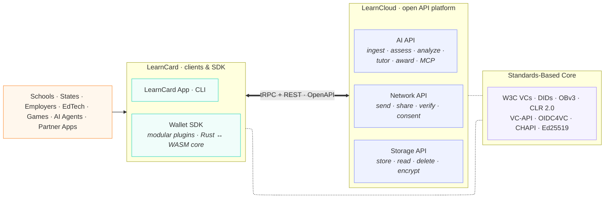
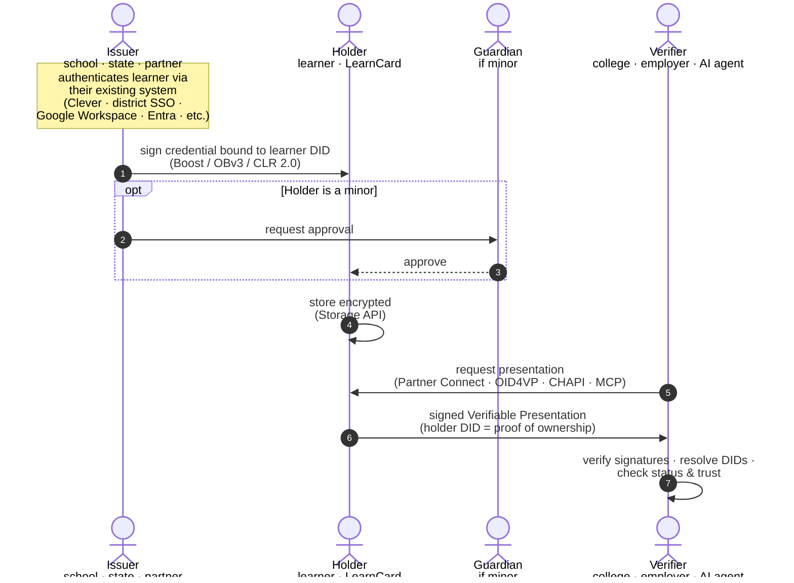

# Ecosystem Architecture

**LearnCard** is the lifelong-learning passport — the wallet, app, CLI, and SDK a learner (or any app acting on their behalf) uses to **collect, understand, and navigate** their learning and employment record. **LearnCloud** is the open API platform behind it: a network for sending and receiving credentials, encrypted personal storage, and an AI layer that turns the passport into something useful.

Together they make verifiable learning records portable across schools, states, employers, games, and AI — without locking anyone into a closed ecosystem.

This is the single page to understand the whole stack.

***

## Three verbs

Three verbs the whole platform is organized around:

**Collect** — fill your passport from every source. School transcripts, course completions, badges, internships, work history, certifications — credentials aggregate longitudinally, across institutions, products, and life stages.

**Understand** — make sense of what's inside. Skills extracted from your record, gaps identified against your goals, AI tutoring grounded in your actual history. Insights you can act on.

**Navigate** — turn your record into opportunity. Pathways into education, jobs that fit your skills, scholarships and credentials that unlock them, AI agents that can advocate on your behalf with your consent.

Every component below — LearnCard, LearnCloud, the standards core — exists to make these three verbs portable, open, and learner-controlled.

***

## At a glance

**LearnCard** is everything users (or partners on their behalf) actually touch. Wallet operations — signing, verification, DID resolution, JSON-LD canonicalization — run in a Rust core compiled to native and WebAssembly, so the same SDK works identically on the web, iOS, Android, and Node.

**LearnCloud** is three open APIs, each fully OpenAPI-documented and individually adoptable. They sit behind one network of verifiable, consented data.

The **standards core** is what makes both halves interoperable — with each other, with any conformant wallet, and with any conformant verifier in the world.

***

## LearnCard · clients & SDK

What a learner — or any app integrating on their behalf — actually touches.

| Surface | Role |
|---|---|
| **LearnCard App** | Universal wallet — web, iOS, Android |
| **LearnCard CLI** | Automation, scripting, server-side use |
| **Wallet SDK** | `@learncard/init` for programmatic control, plugin-extensible |

The SDK is **modular**. Identity providers, signing methods, storage backends, exchange protocols, AI providers — every concern is a plugin you can swap. The same SDK works identically across the web, iOS, Android, and Node because the credential primitives (signing, verification, DID resolution, JSON-LD canonicalization) live in a Rust core compiled to native and WebAssembly.

This means apps don't have to choose between speed and portability — they get both, on every surface.

→ Deep dives: [Wallet SDK](../sdks/learncard-core/README.md) · [Plugin System](../core-concepts/architecture-and-principles/plugins.md) · [Control Planes](../core-concepts/architecture-and-principles/control-planes.md)

***

## LearnCloud · open API platform

Three open APIs. Each fully OpenAPI-documented. Each individually adoptable — use one, two, or all three.

### Network API

The credential exchange backbone. Send credentials to learners, run consent contracts, register Signing Authorities, manage trust between profiles, query the credential graph. Backed by a graph database; every interaction is recorded and revocable.

`send · share · verify · consent · revoke`

→ [LearnCloud Network API](../sdks/learncard-network/README.md) · [OpenAPI](https://network.learncard.com/docs)

### Storage API

End-to-end encrypted personal credential storage, with cross-device sync and pluggable storage backends. Credentials are encrypted client-side; the platform never sees private data unless explicitly shared via a consent contract.

`store · read · delete · encrypt`

→ [LearnCloud Storage API](../sdks/learncloud-storage-api/README.md)

### AI API

The passport is data. The AI API turns that data into something useful, on demand, across every product the learner uses.

- **Ingest** — CLRs, transcripts, badges, and work history flow into a unified learner context — a single source of truth the AI grounds every interaction in.
- **Assess** — Skill assessments calibrated against the learner's actual record, not generic rubrics.
- **Analyze** — Insights, skill gaps, and goal mapping against frameworks like CTDL, O\*NET, and ESCO.
- **Tutor** — AI tutors that know the learner — their goals, their history, their level — instead of starting from a blank prompt every session.
- **Award** — Auto-issue credentials when assessment criteria are met, closing the loop from learning to recognition.
- **MCP** — A Model Context Protocol server that exposes learner context to external AI agents with explicit, scoped consent.

Because the learner context is a first-class API, **AI sessions are portable**: a tutoring relationship that begins in one product can continue in another, with the learner's history and consent intact.


Every AI API call against learner data is gated by an explicit consent contract. The platform never operates on a learner's record without their (or their guardian's) approval.


→ [LearnCloud AI API](../sdks/learncloud-ai-api/README.md)

***

## How the stack stays interoperable

LearnCard and LearnCloud both build on a layered standards core. Each layer is independent — you can swap one without rewriting the others.

```mermaid
%%{init: {"flowchart": {"defaultRenderer": "elk"}}}%%
flowchart LR
  L1["1 · Identity & Crypto<br/>did:key · did:web · plus any DID method via plugin<br/>Ed25519 · Secp256k1 — Rust ↔ WASM core"]:::indigo
  L2["2 · Envelopes<br/>W3C Verifiable Credentials 2.0 (VC 1.1 also supported)<br/>Verifiable Presentations · JWT or LD-Proof"]:::teal
  L3["3 · Schemas<br/>Open Badges 3.0 · CLR 2.0 · IEEE LER<br/>plus custom JSON-LD"]:::violet
  L4["4 · Skills & Alignment<br/>CTDL (via ctid) · CASE · O*NET · ESCO<br/>OpenSALT skill frameworks"]:::orange
  L5["5 · Exchange<br/>VC-API · OIDC4VC (OID4VP / OID4VCI)<br/>CHAPI · VPQR · claim links · inbox"]:::fuchsia
  L6["6 · Trust & Consent<br/>Signing Authorities · ConsentFlow contracts<br/>Trust registries"]:::green

  L1 --> L2 --> L3 --> L4 --> L5 --> L6

  classDef indigo stroke:#818cf8,fill:#eef2ff;
  classDef teal stroke:#2dd4bf,fill:#f0fdfa;
  classDef violet stroke:#a78bfa,fill:#f5f3ff;
  classDef orange stroke:#fb923c,fill:#fff7ed;
  classDef fuchsia stroke:#e879f9,fill:#fdf4ff;
  classDef green stroke:#4ade80,fill:#f0fdf4;
```

| Layer | Today | Status |
|---|---|---|
| Identity | did:key · did:web · plus any DID method via plugin | First-class |
| Crypto | Ed25519, Secp256k1 — Rust ↔ WASM core | First-class |
| Envelopes | W3C VC 2.0 (and VC 1.1) | First-class |
| Schemas | OBv3, CLR 2.0, IEEE LER, custom JSON-LD | First-class |
| Skills & alignment | CTDL via `ctid`; CASE / O\*NET / ESCO via Alignment URLs | First-class |
| Exchange | VC-API, OIDC4VC, CHAPI, VPQR, claim links, inbox | Each has a plugin |
| Trust | Signing Authorities, ConsentFlow contracts | First-class |

### Partners interoperate via standards, not custom integration code

The plugin and app-store layers are how the rest of the world plugs in *without* changes to the core:

- **Plugin layer** — protocol-level integrations. Custom DID methods, custom signing, custom credential types, custom AI providers, custom storage backends. A partner like an **Open Awarding Service** can issue credentials into LearnCard by speaking VC-API. **LIF** can map data into the network through its own JSON-LD context. **SCD** consumers can render credentials from any provider that publishes the right metadata. **KYC** providers can attach identity proofs as endorsements without touching the credential subject. None of these require code in this repo.

- **App store** — application-level integrations. Partner apps embed LearnCard (or are embedded by it) and exchange credentials through the **Partner Connect SDK** with origin-validated postMessage. The app store is the front door for the broader ecosystem of products learners actually use.

This is the same model that makes any conformant wallet — DCC, MATTR, Procivis, Microsoft Entra Verified ID — readable by LearnCard verifiers and vice versa. Standards are the wire; plugins and the app store are the connectors.


**Plug in via standards, not custom code.** A partner that publishes a conformant Verifiable Credential is already interoperable with LearnCard — no special integration required.


→ Deep dives: [Verifiable Credentials](../core-concepts/credentials-and-data/verifiable-credentials-vcs.md) · [DIDs](../core-concepts/identities-and-keys/decentralized-identifiers-dids.md) · [Skill Frameworks & OpenSALT](../sdks/learncard-network/skills-and-opensalt.md) · [Partner Connect SDK](../sdks/partner-connect.md) · [Interoperability](interoperability.md)

***

## How a credential moves through the system

Three actors, one shared protocol. (Plus a guardian, when the holder is a minor.)

In a typical K-12 or workforce flow:

1. The **issuer** (school, state, employer, EdTech app) authenticates the learner with their existing identity system, then signs a credential bound to the learner's DID and sends it.
2. The **holder** (the learner, or their guardian if a minor) receives it through a claim link, an inbox, or a direct send. The wallet stores it encrypted in LearnCloud Storage; the network records it as received.
3. The **verifier** (college, employer, scholarship platform, AI agent) requests credentials via Partner Connect, VC-APIU, OID4VP, CHAPI, or MCP. The holder approves with selective disclosure, and the wallet returns a signed Verifiable Presentation.

### Identity providers, holder binding, and guardianship

Authentication shows up in two places, deliberately decoupled:

**On the wallet side (the personal passport)** — LearnCard uses a *modular auth provider* model. Today: email/phone. Provider model supports any OIDC-compliant provider, Keycloak, Okta, custom. Every wallet has a learner DID; private-key custody uses Shamir Secret Sharing across device + server, with passkey, recovery phrase, and email backup options.

**On the issuer side (schools, states, ecosystem actors)** — issuers use *whatever auth they already have*. LearnCard does not require — and never will require — schools or states to adopt a particular identity system. Whatever they use to authenticate the learner today, they can use to gate credential issuance tomorrow. The learner's DID is just the address the credential is sent to.

**Holder binding** is cryptographic — to share a credential, the holder signs a Verifiable Presentation with the private key of the DID the credential is bound to. Possession of the key is proof of identity.

**Guardian gating** is supported via approval tokens and a `guardianStatus` field on inbox credentials, used when the holder is a minor or when the issuer requires guardian co-signature before a credential can be claimed.

→ Deep dives: [Auth Coordinator](../core-concepts/architecture-and-principles/auth-coordinator.md) · [Signing Authorities](../core-concepts/identities-and-keys/signing-authorities.md) · [Trust Registries](../core-concepts/identities-and-keys/trust-registries.md) · [Universal Inbox](../core-concepts/network-and-interactions/universal-inbox.md) · [Guardian-Gated Credentials](../how-to-guides/implement-flows/guardian-gated-credentials.md) · [ConsentFlow Overview](../core-concepts/consent-and-permissions/consentflow-overview.md)

***

## What you can build with it

The components compose upward into real products:

1. **Data Pipes** — ingest credential and learning data
2. **Portfolios** — aggregate credentials per learner / worker
3. **Consent** — share with granular control
4. **Credentialing** — issue and verify new claims
5. **Analytics** — insight from usage and pathways
6. **Personalization** — adapt experiences in real time
7. **Pathways** — discover careers and learning options
8. **Applications** — features people see and touch

You don't need every layer. Most teams start with one and grow into others.

***

## Next steps

If you're...

- **Building an app** → start with the [Wallet SDK](../sdks/learncard-core/README.md)
- **Working cloud-side** → start with the [Network API](../sdks/learncard-network/README.md) or [Storage API](../sdks/learncloud-storage-api/README.md)
- **Issuing credentials** → start with [Boost Credentials](../core-concepts/credentials-and-data/boost-credentials.md)
- **Building consent flows** → start with [ConsentFlow Overview](../core-concepts/consent-and-permissions/consentflow-overview.md)
- **Connecting an AI agent** → start with [Connect AI Agent](../how-to-guides/connect-systems/connect-ai-agent.md)
- **Integrating into a school or state** → start with [Use Cases & Possibilities](use-cases-and-possibilities.md)

Or jump straight into [Your First Integration](../quick-start/your-first-integration.md).
