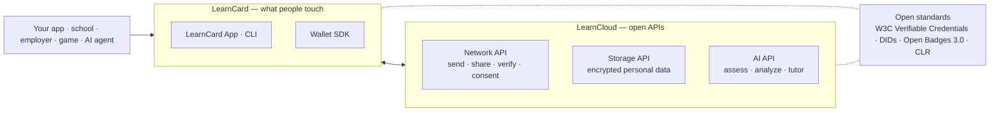

# How LearnCard Works

You just sent a badge (or you're about to). Here's what happened, and the model everything else in these docs hangs off.

## Three verbs

Everything a person does with their record is one of three things:

- **Collect** — gather credentials from every source: school, work, courses, games, certifications. They accumulate over a lifetime, across institutions.
- **Understand** — make sense of what's inside: skills, gaps against a goal, insights grounded in the real record.
- **Navigate** — turn the record into opportunity: pathways, jobs, scholarships, and AI agents that act on the person's behalf — with their consent.

Every part of the platform exists to make those three verbs **portable, open, and learner-controlled**.

## Three layers

- **LearnCard** is the wallet: the app people carry, plus the SDK you used in the Quickstart. Signing and verification run in a Rust core that compiles to native and WebAssembly, so it behaves identically on web, iOS, Android, and Node.
- **LearnCloud** is the set of open APIs behind it — sending credentials across the network, encrypted storage the user controls, and AI that understands the record. Each is independently usable and fully documented.
- **Open standards** are the floor. A credential issued through LearnCard is a W3C Verifiable Credential (usually an Open Badge 3.0). It verifies in any conformant wallet or verifier, not just ours — and credentials from elsewhere land in LearnCard just as well.

## One credential's journey

1. **You issue it.** Your seed (or a hosted signing authority) signs a credential naming you as issuer. It's now tamper-evident: anyone can check the signature without asking you.
2. **You send it.** To a profile, a DID, or — for someone with no account — an email or phone via the **Universal Inbox**. They get a claim link.
3. **They hold it.** After claiming, the credential is stored encrypted in the person's own storage, under a **DID** they control. You can't revoke their copy of the _data_ — only mark the credential's _status_.
4. **They share it.** With a verifier, an employer, another app — through **consent** the person grants and can withdraw. Verifiers check the signature and status; they don't need to call you.

That's the whole loop: **issue → send → hold → share**, with the person in the middle holding the keys.

## Where to go deeper

- Full architecture, including how a credential moves through every component → [Ecosystem Architecture](ecosystem-architecture.md)
- Why open standards are the point, not a feature → [Interoperability](interoperability.md)
- The credential formats themselves → [Verifiable Credentials](../core-concepts/credentials-and-data/verifiable-credentials-vcs.md), [Boosts](../core-concepts/credentials-and-data/boost-credentials.md)
- Identity and keys → [DIDs](../core-concepts/identities-and-keys/decentralized-identifiers-dids.md), [How Should I Manage Keys?](../how-to-guides/deploy-infrastructure/choose-key-management.md)
- Consent → [ConsentFlow Overview](../core-concepts/consent-and-permissions/consentflow-overview.md)
