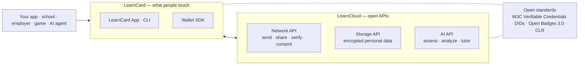

# How LearnCard Works

LearnCard's mission is to help people collect, understand, and navigate their learning records, but the developer model is built around a simple flow: **Issuer → Credential → Holder → Verifier**.

## The Integration Flow

| Role         | What runs where      | Which API/SDK you call  |
| :----------- | :------------------- | :---------------------- |
| **Issuer**   | Your server (or CLI) | `send()` or `/api/send` |
| **Delivery** | LearnCard hosts      | Universal Inbox         |
| **Holder**   | Recipient's device   | Wallet app or SDK       |
| **Verifier** | Your server or app   | `verifyCredential()`    |

## Three layers

- **LearnCard** is the wallet app and SDK. Signing and verification use a Rust core compiled to native and WebAssembly for web, iOS, Android, and Node.
- **LearnCloud** provides APIs for network delivery, user-controlled encrypted storage, and AI analysis. Each API can be used independently.
- **Open standards** support interoperability. LearnCard issues W3C Verifiable Credentials, usually Open Badges 3.0, that work with conformant wallets and verifiers. LearnCard also accepts credentials from other systems.

## One credential's journey

1. **You issue it.** Your seed (or a hosted signing authority you registered) signs a credential naming you as issuer. It's now tamper-evident: anyone can check the signature without asking you.
2. **You send it.** To a profile, a DID, or — for someone with no account — an email or phone via the **Universal Inbox**. They get a claim link.
3. **They hold it.** After claiming, the credential is stored encrypted in the person's own storage, under a **DID** they control. You can't revoke their copy of the _data_ — only mark the credential's _status_.
4. **They share it.** With a verifier, an employer, another app — through **consent** the person grants and can withdraw. Verifiers check the signature and status; they don't need to call you.

The issuer's key signs the credential. Before claiming, an email recipient has no key and the credential waits in the inbox. After claiming, the holder's key controls storage and sharing. Verifiers need neither key.

## Where to go deeper

- Full architecture, including how a credential moves through every component → [Ecosystem Architecture](ecosystem-architecture.md)
- Why open standards are the point, not a feature → [Interoperability](interoperability.md)
- The credential formats themselves → [Verifiable Credentials](../core-concepts/credentials-and-data/verifiable-credentials-vcs.md), [Boosts](../core-concepts/credentials-and-data/boost-credentials.md)
- Identity and keys → [DIDs](../core-concepts/identities-and-keys/decentralized-identifiers-dids.md), [How Should I Manage Keys?](../how-to-guides/deploy-infrastructure/choose-key-management.md)
- Consent → [ConsentFlow Overview](../core-concepts/consent-and-permissions/consentflow-overview.md)
