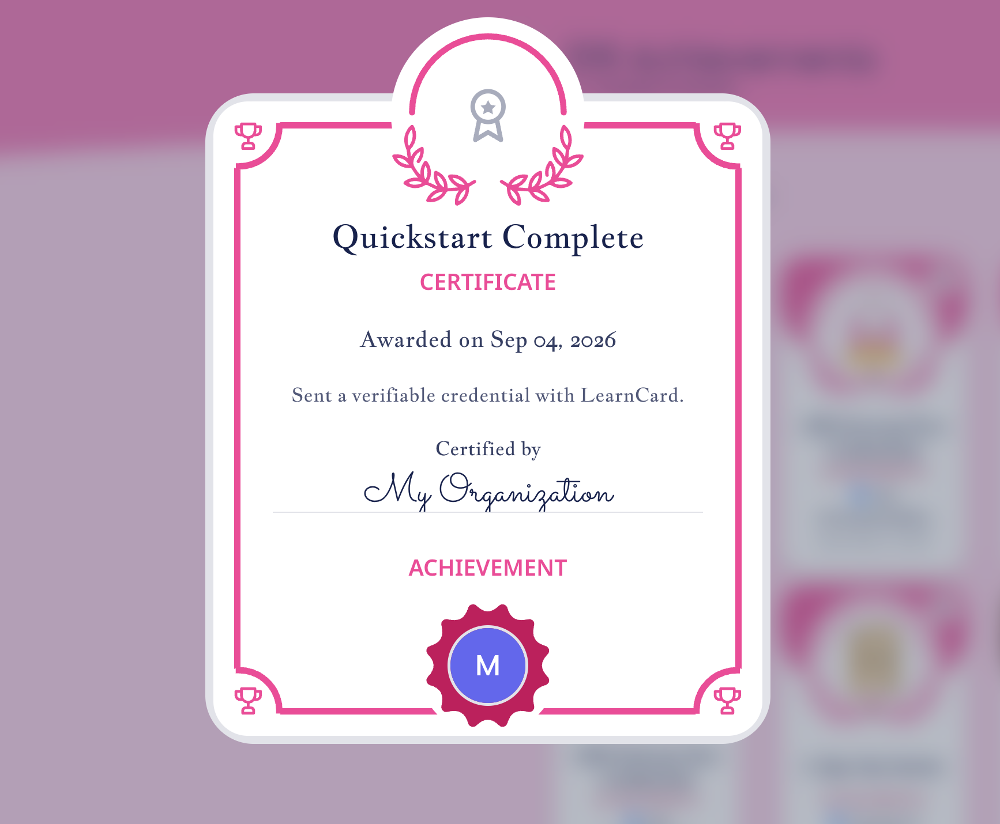

# Quickstart: Send a Credential

The fastest way to see LearnCard work: send a badge to an email address. The recipient gets an email with a claim link and the badge lands in their wallet — no account needed before they claim.


No code at all? You can issue credentials directly from the [LearnCard app](https://learncard.app). This guide is for sending programmatically.


Two ways to do it. Pick one.




You need **Node.js 20 or newer**. In an empty folder, run:

```bash
npx @learncard/cli send you@example.com
```

Use **a real email address you can open** — this sends a real email. It will:

1. Ask for your issuer name and a badge name (Enter accepts the defaults)
2. Generate a secret seed and write it to `.env` (and add `.env` to `.gitignore`)
3. Create your profile on the LearnCard Network
4. Sign a "Quickstart Complete" badge and send it
5. Write the code it just ran to `./send.mjs` so you can read and modify it

Then skip to [What you should see](#what-you-should-see).





Nothing to install and no cryptography on your machine — LearnCard signs for you.

1. Sign in at [learncard.app](https://learncard.app) and open **[learncard.app/app-store/developer](https://learncard.app/app-store/developer)**. Create an Integration if you don't have one.
2. Open **Guides → Issue Credentials** and work down the steps:
    - **API Token** — create one and copy it. It's shown once.
    - **Signing Authority** — one click; LearnCard hosts it for you.
    - **Create Templates** — make a badge (any name). Its **template URI** (`boost:…`) appears under the template selector.
3. Send it:

```bash
export TOKEN=...            # from the API Token step
export TEMPLATE_URI=boost:… # from the Create Templates step
export RECIPIENT_EMAIL=you@example.com
```

<!-- snippet: quickstart/send-from-template.sh -->

```bash
curl -X POST https://network.learncard.com/api/send \
  -H "Authorization: Bearer $TOKEN" \
  -H "Content-Type: application/json" \
  -d "{
    \"type\": \"boost\",
    \"recipient\": \"$RECIPIENT_EMAIL\",
    \"templateUri\": \"$TEMPLATE_URI\"
  }"
```

<!-- /snippet -->

This is the same request the portal shows in its **Issue & Verify** step. The response is JSON; `inbox.status` is `PENDING` (new person — they get an email with `inbox.claimUrl`) or `ISSUED` (already a LearnCard user — it's in their wallet). Then skip to [What you should see](#what-you-should-see).





**Set up.**
You need **Node.js 20 or newer**. In an empty folder:

```bash
npm install @learncard/init
```

Create a `.env` file with a secret seed and a profile ID:

```bash
# Generate the seed with:  node -e "console.log(require('crypto').randomBytes(32).toString('hex'))"
SECURE_SEED=paste-the-64-character-hex-string-here

# Your organization's public handle on the network. 3–40 chars, lowercase, letters/numbers/hyphens.
# IDs are global — pick something specific to you.
PROFILE_ID=acme-quickstart
```


The seed **is** your issuer identity. Anyone with it can issue credentials as you. Never commit it or share it.


**Send a credential.** Save this as `send.mjs`:

<!-- snippet: quickstart/send.mjs -->

```javascript
import { randomUUID } from 'node:crypto';
import { initLearnCard } from '@learncard/init';

const recipientEmail = process.argv[2];
if (!recipientEmail) throw new Error('Usage: node --env-file=.env send.mjs you@example.com');

// `network: true` connects to the production LearnCard Network.
const learnCard = await initLearnCard({ seed: process.env.SECURE_SEED, network: true });

// Your public identity on the network. Created once; safe to re-run.
if (!(await learnCard.invoke.getProfile())) {
    await learnCard.invoke.createProfile({
        profileId: process.env.PROFILE_ID,
        displayName: 'My Organization',
    });
}

// A minimal Open Badges 3.0 credential, signed by you.
const credential = await learnCard.invoke.issueCredential({
    '@context': [
        'https://www.w3.org/ns/credentials/v2',
        'https://purl.imsglobal.org/spec/ob/v3p0/context-3.0.3.json',
    ],
    type: ['VerifiableCredential', 'OpenBadgeCredential'],
    issuer: learnCard.id.did(),
    validFrom: new Date().toISOString(),
    name: 'Quickstart Complete',
    credentialSubject: {
        type: ['AchievementSubject'],
        achievement: {
            id: `urn:uuid:${randomUUID()}`,
            type: ['Achievement'],
            name: 'Quickstart Complete',
            description: 'Sent a verifiable credential with LearnCard.',
            criteria: { narrative: 'Ran the LearnCard quickstart.' },
        },
    },
});

// Send it. The recipient can be an email, phone number, profile ID, or DID.
const result = await learnCard.invoke.send({
    type: 'boost',
    recipient: recipientEmail,
    signedCredential: credential,
});

if (result.inbox?.status === 'PENDING') {
    console.log(
        `Sent. ${recipientEmail} will get an email with this claim link:\n${result.inbox.claimUrl}`
    );
} else {
    console.log(
        `Delivered. ${recipientEmail} already uses LearnCard — the credential is in their wallet.`
    );
}
console.log(`Reusable template for this badge: ${result.uri}`);
```

<!-- /snippet -->

Run it with **a real email address you can open** (your own is ideal) — this sends a real email on the production network. Placeholder domains like `example.com` are rejected by the mail provider.

```bash
node --env-file=.env send.mjs you@example.com
```




## What you should see

<figure><figcaption>What the recipient sees after claiming.</figcaption></figure>

In your terminal, one of two lines, depending on whether that email address already has a LearnCard account:

```
Sent. you@example.com will get an email with this claim link:
https://learncard.app/...
```

Open the email → tap **Claim** → sign in or create an account. **"Quickstart Complete"** appears in the wallet. That's a real, verifiable Open Badges 3.0 credential, signed by you.

```
Delivered. you@example.com already uses LearnCard — the credential is in their wallet.
```

No email in this case: the recipient already has a verified account, so LearnCard delivered straight to it. Open the app and it's there.

Both are followed by:

```
Reusable template for this badge: boost:…
```

Every `send` also saves the badge as a **template** (a Boost). To send the same badge to more people, pass `templateUri: result.uri` instead of `signedCredential` — LearnCard fills in and signs each one server-side once you've set up a [signing authority](../how-to-guides/create-signing-authority.md) (one call).

Run it again — it's safe. The profile is only created the first time.

## If something goes wrong

| You see                                                                                             | Why                                                                                | Fix                                                                                               |
| --------------------------------------------------------------------------------------------------- | ---------------------------------------------------------------------------------- | ------------------------------------------------------------------------------------------------- |
| `Cannot use import statement outside a module`                                                      | File is named `.js`                                                                | Name it `send.mjs`                                                                                |
| `Key must be a hexadecimal string!`                                                                 | `SECURE_SEED` isn't 64 hex characters                                              | Generate it with the command in step 1                                                            |
| `A LearnCard has been initialized with a seed that is less than 32 bytes`                           | Seed is too short                                                                  | Same — generate a full 64-character seed                                                          |
| `Profile already exists!`                                                                           | Someone else already took your `PROFILE_ID`                                        | Pick a more specific one                                                                          |
| `Usage: node --env-file=.env send.mjs you@example.com`                                              | No recipient given                                                                 | Add the email address as the last argument                                                        |
| `Sending credentials via phone is a feature reserved for members of the LearnCard Trusted Registry` | You switched `type` to `phone`                                                     | Email works for everyone; phone needs [issuer verification](../how-to-guides/verify-my-issuer.md) |
| `Failed to send email via Postmark: … marked as inactive`                                           | The address is a placeholder (`example.com`) or has bounced before                 | Use a real address you can open                                                                   |
| `You must register a signing authority before using send without a pre-signed credential`           | You passed `template` or `templateUri` (server-signed) without a signing authority | Sign locally (`signedCredential`) or [set one up](../how-to-guides/create-signing-authority.md)   |

## Send your own signed credential over HTTP

The no-keys tab lets LearnCard sign from a template. If you sign credentials yourself but want to deliver them from any language, create an API token once and POST the signed credential to `/api/send`. This script creates the token (scope `boosts:write`) and writes the exact request body to `request.json`:

<!-- snippet: quickstart/api-token.mjs -->

```javascript
import { writeFileSync } from 'node:fs';
import { randomUUID } from 'node:crypto';
import { initLearnCard } from '@learncard/init';

const recipientEmail = process.argv[2];
if (!recipientEmail) throw new Error('Usage: node --env-file=.env api-token.mjs you@example.com');

const learnCard = await initLearnCard({ seed: process.env.SECURE_SEED, network: true });

// 1. A token that can only send boosts. Create once, store like a password.
const grantId = await learnCard.invoke.addAuthGrant({ name: 'sender', scope: 'boosts:write' });
const token = await learnCard.invoke.getAPITokenForAuthGrant(grantId);

// 2. A signed credential to send — same shape as send.mjs.
const credential = await learnCard.invoke.issueCredential({
    '@context': [
        'https://www.w3.org/ns/credentials/v2',
        'https://purl.imsglobal.org/spec/ob/v3p0/context-3.0.3.json',
    ],
    type: ['VerifiableCredential', 'OpenBadgeCredential'],
    issuer: learnCard.id.did(),
    validFrom: new Date().toISOString(),
    name: 'Quickstart Complete',
    credentialSubject: {
        type: ['AchievementSubject'],
        achievement: {
            id: `urn:uuid:${randomUUID()}`,
            type: ['Achievement'],
            name: 'Quickstart Complete',
            description: 'Sent a verifiable credential with LearnCard.',
            criteria: { narrative: 'Ran the LearnCard quickstart.' },
        },
    },
});

// 3. The exact request body the HTTP API expects.
writeFileSync(
    'request.json',
    JSON.stringify(
        { type: 'boost', recipient: recipientEmail, signedCredential: credential },
        null,
        2
    )
);

console.log(`export TOKEN=${token}`);
console.log('Wrote request.json');
```

<!-- /snippet -->

```bash
node --env-file=.env api-token.mjs you@example.com
# prints:  export TOKEN=...   ← run that line, then:
```

<!-- snippet: quickstart/send.sh -->

```bash
curl -X POST https://network.learncard.com/api/send \
  -H "Authorization: Bearer $TOKEN" \
  -H "Content-Type: application/json" \
  -d @request.json
```

<!-- /snippet -->

The token has one permission (`boosts:write`). Store it like a password; [revoke it](../core-concepts/architecture-and-principles/auth-grants-and-api-tokens.md) any time. Full API reference, phone delivery, templates, and webhooks: [Send & Issue Credentials](../how-to-guides/send-credentials.md).

## Next steps

- **Design a real badge** with an image, criteria, and skills → [Create a Credential](../tutorials/create-a-credential.md)
- **Issue the same badge to many people** → [Create a Boost](../tutorials/create-a-boost.md)
- **Know when it's claimed** → [Listen to Webhooks](../tutorials/listen-to-webhooks.md)
- **Not sure what to build?** → [What Do You Want to Build?](../introduction/what-do-you-want-to-build.md)
