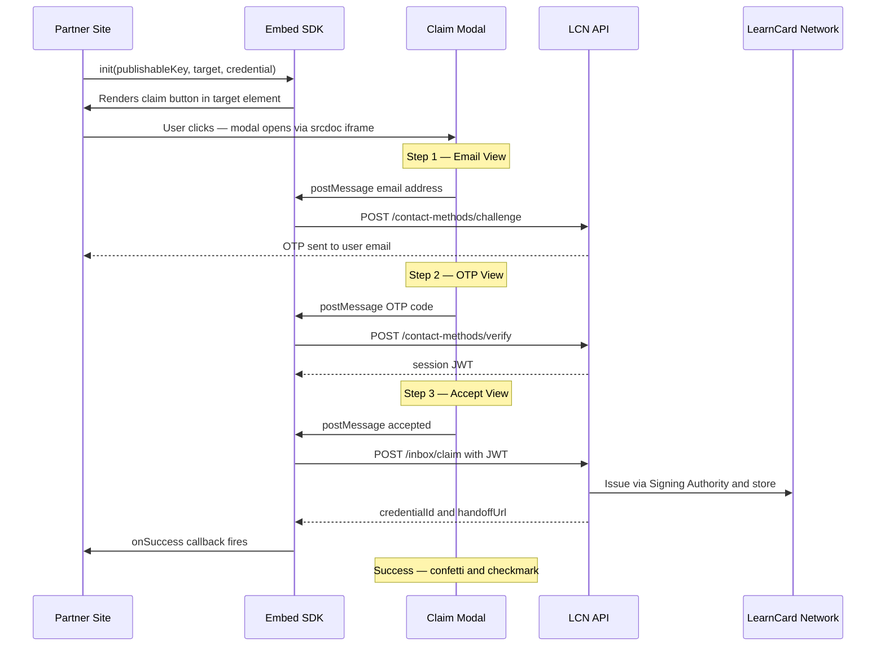

# Embed SDK (`@learncard/embed-sdk`)

The Embed SDK lets you add a credential claim button to any webpage with a single script tag and one function call. No framework required — it renders a sandboxed iframe modal that handles the full email OTP verification and credential acceptance flow.

## Installation



```bash
npm install @learncard/embed-sdk
```


```html
<script src="https://cdn.learncard.com/sdk/v1/learncard.js"></script>
```


```js
import { init } from '@learncard/embed-sdk';
```



## Quick Start

```html
<div id="claim-here"></div>

<script src="https://cdn.learncard.com/sdk/v1/learncard.js"></script>
<script>
  LearnCard.init({
    publishableKey: 'pk_your_key_here',
    target: '#claim-here',
    credential: { name: 'My Template Name' },
    partnerName: 'Your Organization',
  });
</script>
```

Clicking the rendered button opens the claim modal. The user enters their email, receives an OTP, and accepts the credential into their LearnCard wallet.

## How It Works



### Architecture Details

- The modal runs in a **sandboxed `srcdoc` iframe** with `allow-scripts allow-same-origin`. All credential data and session tokens stay inside the iframe; the parent page cannot read them.
- The parent SDK communicates with the iframe via `postMessage` using a shared `nonce` for origin-safe message routing.
- Session JWT is stored in `localStorage` under `lcEmbed:v1:{publishableKey}`, persisting across page navigations so the user stays authenticated for subsequent claims.
- `credential` is resolved server-side: you can pass a full VC object or simply `{ name: 'Template Name' }` and the backend resolves the template by name + your integration's `publishableKey`.

## `init(options)`

Renders a "Claim Credential" button into `target` and wires up the full claim flow.

```ts
import { init } from '@learncard/embed-sdk';

init(options: InitOptions): void
```

### `InitOptions`

| Property | Type | Required | Description |
|----------|------|----------|-------------|
| `target` | `string \| HTMLElement` | ✅ | CSS selector or DOM element to render the button into |
| `credential` | `CredentialConfig` | ✅ | Full VC object **or** `{ name: 'Template Name' }` for server-side resolution |
| `publishableKey` | `string` | Recommended | Your integration's publishable key from the developer dashboard. Omit for stub/test mode. |
| `partnerName` | `string` | — | Displayed in the modal header next to your logo |
| `branding` | `BrandingTokens` | — | Color and logo customization (see below) |
| `apiBaseUrl` | `string` | — | Defaults to `https://network.learncard.com/api` |
| `requestBackgroundIssuance` | `boolean` | — | Issue credential without user interaction (no modal shown) |
| `onSuccess` | `(details: ClaimSuccessDetails) => void` | — | Called when user accepts. When provided, SDK skips auto-opening the wallet URL. |
| `onEmailSubmit` | `(email: string) => Promise<EmailSubmitResult>` | — | Override default email challenge logic |
| `onOtpVerify` | `(email: string, code: string) => Promise<OtpVerifyResult>` | — | Override default OTP verification logic |
| `theme` | `{ primaryColor?: string }` | — | Deprecated — use `branding.primaryColor` instead |

### `BrandingTokens`

| Property | Type | Description |
|----------|------|-------------|
| `primaryColor` | `string` | Hex color for buttons, stepper, and card accent. Defaults to `#2EC4A5` (teal). |
| `accentColor` | `string` | Darker accent for hover states. Defaults to `darken(primaryColor, 20%)`. |
| `partnerLogoUrl` | `string` | URL for your organization's logo in the modal header |
| `logoUrl` | `string` | Override the LearnCard brand logo |
| `walletUrl` | `string` | URL to open on success when no `onSuccess` callback is provided |

### `CredentialConfig`

```ts
// Full VC object (any valid VerifiableCredential JSON):
credential: {
  "@context": ["https://www.w3.org/ns/credentials/v2", ...],
  "type": ["VerifiableCredential", "OpenBadgeCredential", ...],
  ...
}

// Template name shorthand (resolved server-side):
credential: { name: 'Course Completion' }
```

Using `{ name: '...' }` is recommended for production — the generated embed snippet stays stable even if your credential template changes.

### `ClaimSuccessDetails`

```ts
type ClaimSuccessDetails = {
  credentialId: string;   // Issued credential ID
  consentGiven: boolean;  // Whether user gave consent
  handoffUrl?: string;    // Deep link to the credential in the user's wallet
};
```

## Examples

### Custom Branding

```js
init({
  publishableKey: 'pk_...',
  target: '#claim-target',
  credential: { name: 'Course Completion' },
  partnerName: 'Learning Economy Academy',
  branding: {
    primaryColor: '#e11d48',
    accentColor: '#be123c',
    partnerLogoUrl: 'https://your-org.com/logo.png',
    walletUrl: 'https://app.learncard.com',
  },
});
```

### Handle Success in Your UI

```js
init({
  publishableKey: 'pk_...',
  target: '#claim-target',
  credential: { name: 'Course Completion' },
  onSuccess: ({ credentialId, handoffUrl }) => {
    document.getElementById('success-banner').style.display = 'block';
    // handoffUrl is available if you want to link to the wallet
  },
});
```

### Custom Auth Handlers

If you manage your own user sessions, you can bypass the default email/OTP flow:

```js
init({
  target: '#claim-target',
  credential: { name: 'Course Completion' },
  onEmailSubmit: async (email) => {
    await myApi.sendOtp(email);
    return { ok: true };
  },
  onOtpVerify: async (email, code) => {
    const result = await myApi.verifyOtp(email, code);
    if (!result.valid) return { ok: false, error: 'Invalid code' };
    return { ok: true };
  },
});
```

### Stub Mode (No Backend)

Omit `publishableKey` to run the full UI flow without any network calls — useful for local development and visual testing:

```js
init({
  target: '#claim-target',
  credential: { name: 'Test Credential' },
  partnerName: 'My Org',
  // No publishableKey → stub mode, all steps succeed silently
});
```

## Browser Support

The SDK uses `srcdoc` iframe delivery and `postMessage`. Supported in all modern browsers (Chrome, Firefox, Safari, Edge). IE not supported.

## Bundle Size

| Format | Raw | Gzipped |
|--------|-----|---------|
| IIFE (`learncard.js`) | ~37KB | **~10.5KB** |
| ESM (`learncard.esm.js`) | ~37KB | **~10.5KB** |

Zero runtime dependencies. The claim modal UI is bundled inline as a minified string.

## See Also

- [How-To: Add an Embed Claim Button to Your Website](../how-to-guides/connect-systems/embed-a-claim-button.md)
- [Developer Dashboard Guide](../how-to-guides/connect-systems/connect-a-website.md)
- [Partner Connect SDK](partner-connect.md) — for apps embedded _inside_ LearnCard
