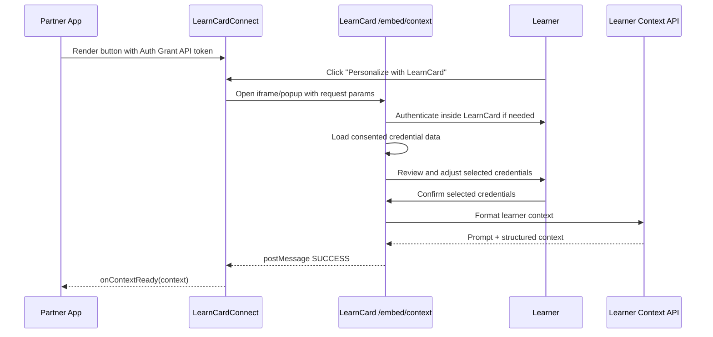

# LearnCard Connect (`LearnCardConnect`)

`LearnCardConnect` is a React component that lets partner applications add a “Personalize with LearnCard” button to their app. When clicked, it opens LearnCard in an iframe modal or popup, lets the learner authenticate and review the credentials they want to share, and returns formatted learner context to the host application.

Use it when your application needs consented LearnCard data to personalize an AI tutor, learning experience, recommendation engine, form, or other learner-facing workflow.

## Installation



```bash
npm install @learncard/react
```



```bash
pnpm add @learncard/react
```



```bash
yarn add @learncard/react
```



## Quick Start

```tsx
import { LearnCardConnect } from '@learncard/react';

export function PersonalizeButton() {
    return (
        <LearnCardConnect
            apiKey="YOUR_AUTH_GRANT_API_TOKEN"
            hostOrigin="https://learncard.app"
            buttonText="Personalize with LearnCard"
            onContextReady={context => {
                console.log('Learner context:', context.prompt);
            }}
            onError={error => {
                console.warn('LearnCard Connect error:', error.code, error.message);
            }}
        />
    );
}
```

The user clicks the button, signs in to LearnCard if needed, reviews the credentials they consented to share, and confirms the selection. Your app receives the resulting learner context through `onContextReady`.

## How It Works



## API Reference

### `LearnCardConnectProps`

| Prop | Type | Required | Default | Description |
|------|------|----------|---------|-------------|
| `apiKey` | `string` | ✅ | — | Auth Grant API token with access to consent-flow data. |
| `onContextReady` | `(context: ContextData) => void` | ✅ | — | Called when the learner confirms sharing and context is generated. |
| `onError` | `(error: LearnCardError) => void` | — | — | Called when the flow is cancelled, declined, times out, or fails. |
| `buttonText` | `string` | — | `'Personalize with LearnCard'` | Text shown in the trigger button. |
| `theme` | `{ primaryColor?: string; accentColor?: string; borderRadius?: string }` | — | `{}` | Basic visual customization for the trigger button. |
| `mode` | `'modal' \| 'popup'` | — | `'modal'` | Whether to open LearnCard in an embedded modal iframe or popup window. |
| `includeRawCredentials` | `boolean` | — | `false` | Include the selected raw credential objects in the returned context. |
| `className` | `string` | — | `''` | Additional class name for the trigger button. |
| `style` | `React.CSSProperties` | — | `{}` | Inline styles for the trigger button. |
| `hostOrigin` | `string` | — | `'https://learncard.app'` | Expected LearnCard origin. The SDK ignores messages from other origins. |
| `requestTimeout` | `number` | — | `30000` | Timeout in milliseconds before the SDK rejects the request. |
| `instructions` | `string` | — | — | Optional formatting instructions for the learner-context output. |
| `detailLevel` | `'compact' \| 'expanded'` | — | `'compact'` | Controls how detailed the generated context should be. |

### `ContextData`

```ts
interface ContextData {
    prompt: string;
    metadata: {
        did: string;
        name?: string;
        [key: string]: unknown;
    };
    structuredContext?: unknown;
    credentials?: unknown[];
}
```

| Field | Description |
|-------|-------------|
| `prompt` | Formatted learner-context prompt for your AI or personalization layer. |
| `metadata.did` | Learner DID. |
| `metadata.name` | Learner display name, when available. |
| `structuredContext` | Machine-readable context returned by the formatter, when available. |
| `credentials` | Raw selected credential objects, only present when `includeRawCredentials` is `true`. |

### `LearnCardError`

```ts
interface LearnCardError {
    code: string;
    message: string;
}
```

Common error codes include:

| Code | Meaning |
|------|---------|
| `CANCELLED` | The learner cancelled the request. |
| `NO_CREDENTIALS_SELECTED` | The learner declined to share any credentials. Treat this as a graceful user-decline state, not a system failure. |
| `REQUEST_TIMEOUT` | The SDK did not receive a terminal response before `requestTimeout`. |
| `INVALID_REQUEST` | Required embed parameters were missing. |
| `FETCH_ERROR` | LearnCard could not load consented credential data. |
| `FORMAT_ERROR` | LearnCard could not format the selected credentials into learner context. |

## Auth Grant Requirements

`apiKey` should be an Auth Grant API token that allows the embedded LearnCard route to read consent-flow data for the learner. For the current LearnCard Connect flow, the example app uses an Auth Grant scoped to:

```txt
contracts-data:read
```

Create and store this token server-side when possible, then pass it to the client integration that renders `LearnCardConnect`.

## Security Notes

- Always set `hostOrigin` to the LearnCard origin your app should trust, such as `https://learncard.app` in production or `http://localhost:3000` in local development.
- The SDK ignores messages whose `event.origin` does not match `hostOrigin`.
- The iframe uses a sandboxed LearnCard route and does not expose wallet state directly to the host page.
- Your app should handle `NO_CREDENTIALS_SELECTED` and `CANCELLED` as intentional user choices.

## Local Development

This repository includes a runnable example at `examples/learn-card-connect-test`. It can generate demo credentials, create the consent-flow contract, create an Auth Grant API token, and exercise the embedded flow against a local LearnCard App.

See [Embed LearnCard Connect](../how-to-guides/connect-systems/embed-learncard-connect.md) for a step-by-step local QA flow.
