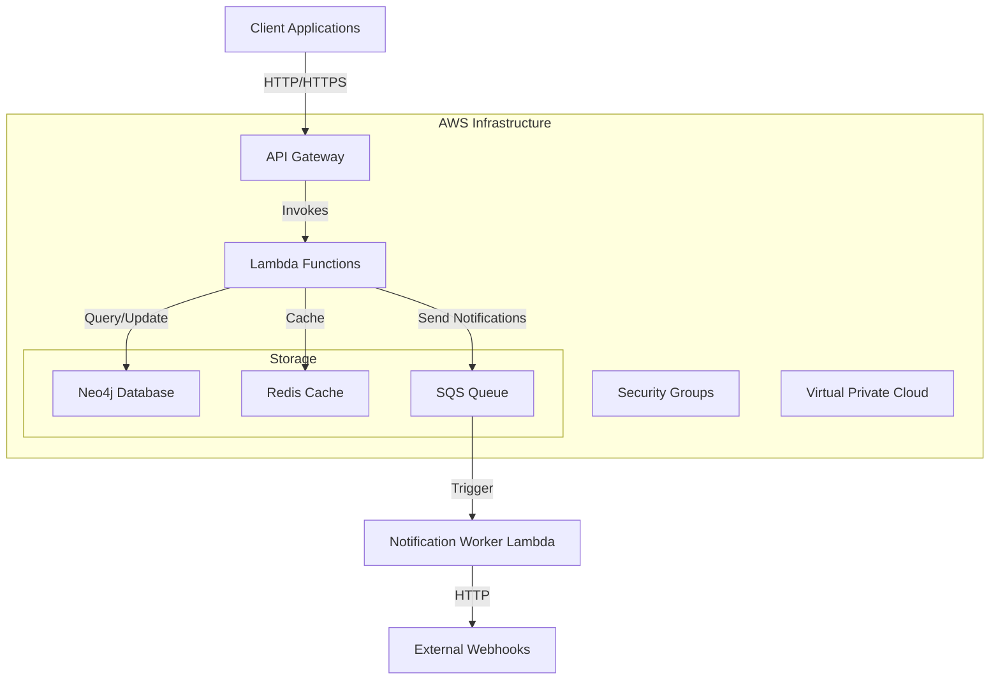

# Architecture

The LearnCloud Network API is deployed as a serverless application on AWS with the following components:

```mermaid
graph TB
    subgraph "AWS Infrastructure"
        api["API Gateway"]
        lambda["Lambda Functions"]
        sg["Security Groups"]
        vpc["Virtual Private Cloud"]

        subgraph "Storage"
            neo4j["Neo4j Database"]
            redis["Redis Cache"]
            sqs["SQS Queue"]
        end
    end

    client["Client Applications"] -->|"HTTP/HTTPS"| api
    api -->|"Invokes"| lambda
    lambda -->|"Query/Update"| neo4j
    lambda -->|"Cache"| redis
    lambda -->|"Send Notifications"| sqs

    sqs -->|"Trigger"| notificationWorker["Notification Worker Lambda"]
    notificationWorker -->|"HTTP"| webhooks["External Webhooks"]
```
