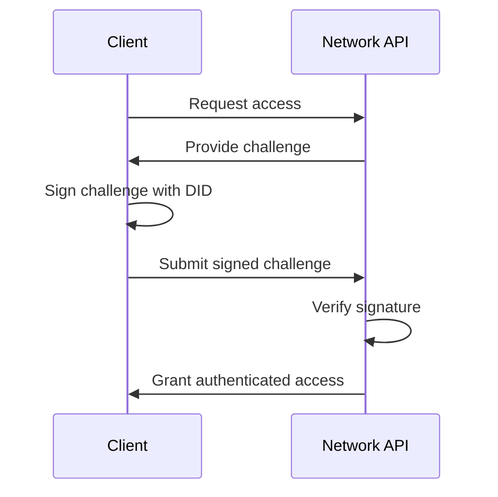
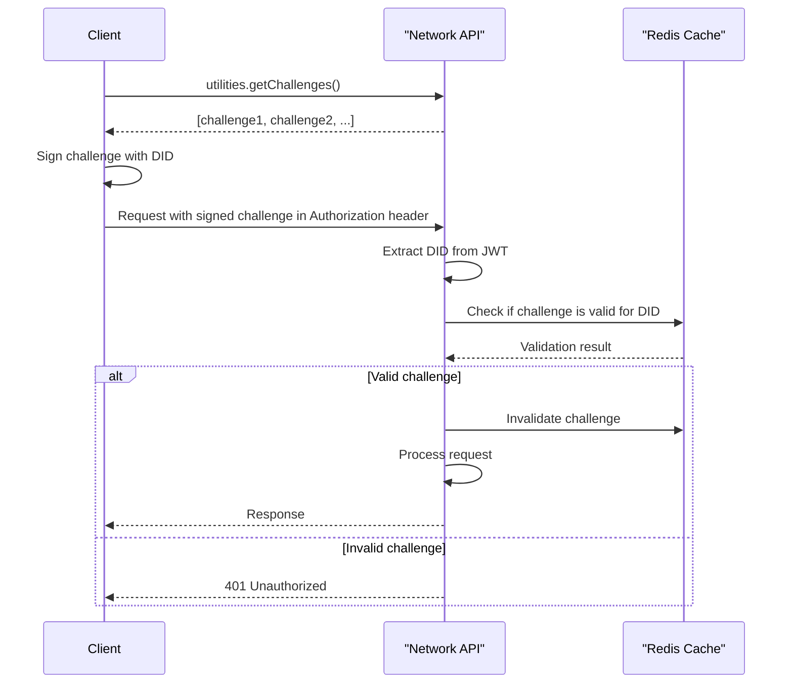

# Authentication

### Authenticating with the LearnCard Network API

To interact with the LearnCard Network API, you can choose one of two ways to authenticate:

1. Using the LearnCard Network Plugin (`@learncard/network-plugin`) which handles authentication for you. **(Preferred option)**
2. Using[ a scoped API Token](../../how-to-guides/deploy-infrastructure/generate-api-tokens.md) for authentication with API endpoints. (recommended for implementations using REST endpoints).&#x20;
3. Directly through the API endpoints using challenge-based DID Authentication. (most complex)

#### 1. Using LearnCard Network Plugin

To authenticate using the LearnCard Network Plugin (`@learncard/network-plugin`), first install the package:

```bash
pnpm install @learncard/network-plugin
```

Then, either instantiate a LearnCard Network enabled LearnCard, or add the Network Plugin to an existing LearnCard:




```typescript
import { initLearnCard } from '@learncard/init';
import didkit from '@learncard/didkit-plugin/dist/didkit/didkit_wasm_bg.wasm?url';

const networkLearnCard = await initLearnCard({
    seed,
    network: true,
    didkit,
});
```




```typescript
import { initLearnCard } from '@learncard/core'
import { getLearnCardNetworkPlugin } from '@learncard/network-plugin';
import didkit from '@learncard/core/dist/didkit/didkit_wasm_bg.wasm?url';

const lcnAPI = 'https://network.learncard.app/trpc';

const learnCard = await initLearnCard({
    seed,
    didkit,
});

const networkLearnCard learnCard.addPlugin(
    await getLearnCardNetworkPlugin(learnCard, lcnAPI)
);
```



When using the LearnCard Network Plugin, challenge-based DID Authentication is handled for you, so no further steps are necessary.

#### 2.  Using a [scoped API Token](../../how-to-guides/deploy-infrastructure/generate-api-tokens.md)

```typescript
// Step 1: Create an AuthGrant with specific permissions
const grantId = await learnCard.invoke.addAuthGrant({
    name: "Boost Sender Auth",
    description: "Permission to send boosts",
    scope: 'boosts:write',
});

// Step 2: Generate an API token from the AuthGrant
const token = await learnCard.invoke.getAPITokenForAuthGrant(grantId);

// Step 3: Prepare the payload for your API request
const payload = {
    boostUri: "uri-of-the-boost-to-send",
    signingAuthority: "your-signing-authority"
};

// Step 4: Make an authenticated HTTP request using the token
const response = await fetch(
    `https://network.learncard.com/api/boost/send/via-signing-authority/RECIPIENT_PROFILE_ID`,
    {
        method: 'POST',
        headers: {
            'Content-Type': 'application/json',
            'Authorization': `Bearer ${token}`,
        },
        body: JSON.stringify(payload),
    }
);

// Step 5: Process the response
if (response.status === 200) {
    const sentBoostUri = await response.json();
    console.log(`Boost sent successfully: ${sentBoostUri}`);
} else {
    console.error(`Error sending boost: ${response.status}`);
    const errorDetails = await response.json();
    console.error(errorDetails);
}
```

#### 3. Using Challenge-based DID Authentication

Profile management uses DID-based authentication with a challenge-response mechanism and scope-based authorization.

**Simple High-Level Auth Flow:**



**Granular Auth Flow:**



If you choose to use the API endpoints directly, you'll need to manage challenge-based DID Authentication for each request. Here's a simplified TypeScript example to help you implement this authentication method:

```typescript
 
async function getClient(
  url = 'https://network.learncard.com/api': string,
  didAuthFunction: (challenge?: string) => Promise<string>
) {
  let challenges: string[] = [];

  const getChallenges = async (amount = 95 + Math.round((Math.random() - 0.5) * 5)): Promise<string[]> => {
    // Call the API to get a list of challenges
    // Replace this line with your preferred way of making API calls
    const response = await fetch(url + "/challenges?amount=" + amount);
    return await response.json();
  };

  challenges = await getChallenges();

  async function getAuthHeaders() {
    if (challenges.length === 0) challenges.push(...(await getChallenges()));
    return { Authorization: `Bearer ${await didAuthFunction(challenges.pop())}` };
  }

  // Use getAuthHeaders in your API calls to set the Authorization header
}

export default getClient;
```

In this example, we first define a `getClient` function that takes a `url` and a `didAuthFunction`. The `didAuthFunction` should be an asynchronous function that returns a signed challenge as a string.

The `getChallenges` function fetches a list of challenges from the API. The `getAuthHeaders` function generates an Authorization header using the `didAuthFunction` and a challenge. This header can then be used in your API calls.

## Authorization & Scopes

#### Route Middleware <a href="#route-middleware" id="route-middleware"></a>

The system uses several middleware layers for authentication and authorization:

1. `openRoute`: Base middleware that allows public access
2. `didRoute`: Requires a valid DID in the request
3. `didAndChallengeRoute`: Requires a valid DID and challenge
4. `profileRoute`: Requires a valid DID, challenge, and existing profile
5. `scopedRoute`: Requires specific permission scopes

#### Authorization Scopes <a href="#authorization-scopes" id="authorization-scopes"></a>

Each API endpoint requires specific scopes for authorization:

| Scope                      | Description                | Example Endpoints                |
| -------------------------- | -------------------------- | -------------------------------- |
| `profiles:read`            | Read profile information   | `getProfile`, `getOtherProfile`  |
| `profiles:write`           | Create or update profiles  | `createProfile`, `updateProfile` |
| `profiles:delete`          | Delete profiles            | `deleteProfile`                  |
| `connections:read`         | View connections           | `paginatedConnections`           |
| `connections:write`        | Manage connections         | `connectWith`, `blockProfile`    |
| `signingAuthorities:read`  | View signing authorities   | `signingAuthorities`             |
| `signingAuthorities:write` | Manage signing authorities | `registerSigningAuthority`       |

The authorization system also supports wildcard scopes like `*:read` (read access to all resources) and `*:*` (full access).

