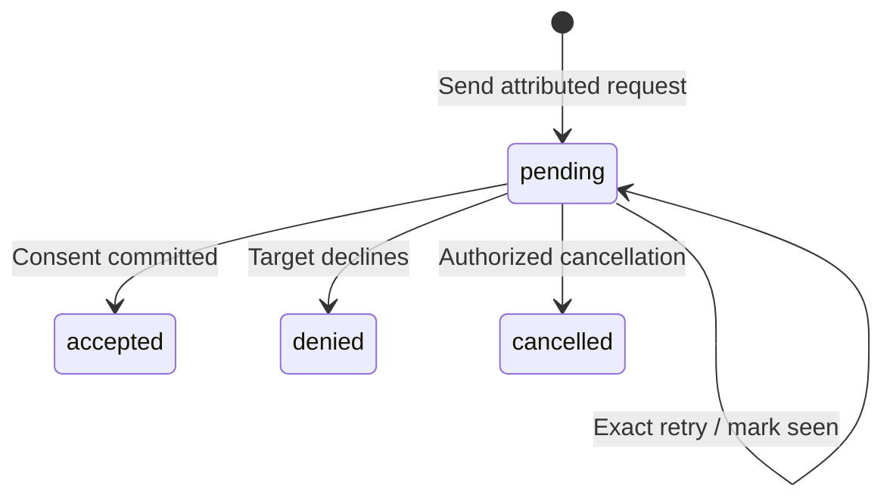

# Contract Requests and Events

A contract request invites an existing network profile to review a ConsentFlow contract. Sending a request grants no permission to read or write the user's data. The user chooses consent terms through the existing consent flow, including guardian approval when required.

The Salesforce Data Mediator, or any other external integration, is a client of these APIs and webhooks.

## Roles

| Action                                     | Who can perform it                                                                                 |
| ------------------------------------------ | -------------------------------------------------------------------------------------------------- |
| Send a generic request                     | Contract owner, explicit writer, or current data recipient                                         |
| List sent requests / inspect target status | Owner and writer: all referrals; current recipient: only referrals it sent; target: its own status |
| List incoming requests                     | The target profile only                                                                            |
| Mark a generic request seen                | The target, for an existing request only                                                           |
| Deny                                       | The target only                                                                                    |
| Cancel                                     | Owner, writer, target, or the requesting recipient while still in the audience                     |
| Read consented data                        | Owner and current data recipients, under current consent permissions                               |
| Write outcomes                             | Owner or explicit writer, under current write permissions                                          |

A writer outside the data audience receives only a decision and correlation metadata for a request it sent. Being a writer does not grant read access.

Being a data recipient does not grant access to other organizations' invitations or decisions, even after the learner accepts. Request lists are filtered in the database. Inspecting another sender's request returns `null`, the same as a missing request, without exposing its status, message, internal reference, or target profile. Owners and writers retain management access; legacy writer/target request reads retain their behavior.

## Send and track a request

Use an initialized network-enabled LearnCard instance with an existing profile. Generic send, deny, seen and cancel actions require `contracts:write` scope when using an auth grant.

```typescript
await referrer.invoke.sendContractRequest({
    contractUri,
    targetProfileId: learnerProfileId,
    externalReferenceId: 'referral-123',
    message: 'Career support is available through this partner.',
});

const status = await referrer.invoke.getRequestStatusForProfile(
    learnerProfileId,
    undefined,
    contractUri
);
// status includes requestId, requestedBy, externalReferenceId, requestedAt,
// message, status and readStatus. Legacy requests may omit attribution fields.
```

`externalReferenceId` is an opaque integration reference, limited to 256 characters; `message` is limited to 500. Avoid putting sensitive data in either field. Targets may also be addressed by a resolvable network DID. Missing targets return `NOT_FOUND`; email-only invitations are not supported by this endpoint. Requests are limited to 500 per hour per contract and sender.

There is one request per contract/target pair in this version. An identical pending retry keeps the same request and event IDs. Conflicting sender, reference or message returns `CONFLICT`. Terminal requests and existing legacy requests are not replaced. Sending to a target with an unexpired active consent, including a one-time snapshot, also returns `CONFLICT`.

## Target actions

```typescript
const requests = await learner.invoke.getAllContractRequestsForProfile(learnerProfileId);
await learner.invoke.markContractRequestAsSeen(contractUri, learnerProfileId);

// Explicitly decline; merely dismissing a card is not denial.
await learner.invoke.denyContractRequest(contractUri);

// Or cancel a pending request; authorized senders use this method too.
await learner.invoke.cancelContractRequest(contractUri, learnerProfileId);
```

Acceptance uses `consentToContract` after the user reviews the latest contract, audience and permissions. Include its current `audienceVersion` for recipient-bearing contracts. Encryption must cover the owner and current recipients before sharing credential URIs. See [ConsentFlow](../../core-concepts/consent-and-permissions/consentflow-overview.md).



Denied and cancelled generic requests retain their correlation fields. Withdrawing consent retains an accepted generic request and the referral captured on consent history. It revokes current data access; it does not reset a terminal request to pending.

## Webhook events

Configure the receiving profile's `notificationsWebhook` using the existing profile API. Events use `type: "CONSENT_FLOW_TRANSACTION"` and a localized `message`. Correlation lives in `data.metadata`:

```json
{
    "eventId": "stable-event-id",
    "deliveryKey": "stable-event-id:recipient-profile-id",
    "event": "consent_created",
    "contractUri": "lc:network:example.com/trpc:contract:contract-id",
    "termsUri": "lc:network:example.com/trpc:terms:terms-id",
    "requestId": "request-id",
    "requestedBy": "referrer-profile-id",
    "externalReferenceId": "referral-123",
    "recipientRole": "owner"
}
```

| Event                                 | Delivery                                                                                    |
| ------------------------------------- | ------------------------------------------------------------------------------------------- |
| `request_sent`                        | Target; metadata includes `type: "contract-request"` and optional message                   |
| `request_accepted`                    | Requester outside the data audience; no transaction payload or Terms URI                    |
| `request_denied`, `request_cancelled` | Owner and original requester only; no consent payload                                       |
| `consent_created`, `consent_updated`  | Owner and data recipients                                                                   |
| `consent_withdrawn`                   | Owner and data recipients; signals revocation                                               |
| `credentials_synced`                  | Owner and data recipients; legacy transaction shape retained with permitted credential URIs |

Each event is deduplicated per recipient, excluding the acting profile. Consenting to a request also changes its status to accepted atomically. A Terms update that accepts a pending request after prior consent expired sends the requester an acceptance decision too.

`termsUri` appears only on consent events delivered to the data audience. Referral fields are optional for direct or legacy consent, and are preserved on Terms, transaction history, and holder export metadata. The owner, writers with data access, and the original referrer retain `externalReferenceId` on their permitted events. Other data recipients receive consented data and public attribution (`requestId`, `requestedBy`), with the internal reference removed from both metadata and the transaction's `referral`. They do not receive private invitation text. The learner retains the full referral in its own history and export. Use the consented data APIs for current values; notification transactions are not a substitute for permission checks.

## Delivery and retry

State changes and event intents commit in the same Neo4j statement. Notification transport failure does not roll back consent or a request. A leased worker checks pending deliveries once per minute, using the existing SQS/webhook transport. Production uses the scheduled `contractEvents` Lambda; Docker starts the same worker after server readiness and stops it during shutdown. Local Serverless Offline can use the handler directly; it does not start the Docker timer.

Delivery is **at least once**. Persist `deliveryKey` with the downstream side effect to deduplicate retries, and acknowledge only after durable storage. Return an existing supported acknowledgement such as `{"success": true}`. Direct webhook timeouts, HTTP 5xx, HTTP 408/425/429, and explicit unsuccessful storage acknowledgements are retryable. Other HTTP 4xx responses are final rejections. A missing or disabled webhook also ends direct delivery without retry. These distinctions apply only to contract events; existing notification callers retain their behavior.

Outbox retries start after one minute, double after each failed attempt, and cap at one hour between attempts. A delivery stops after 12 claimed attempts or 24 hours from event creation, whichever comes first. Claims count even if the worker crashes before recording the outcome. A stopped delivery is marked `rejected` for a permanent rejection or `failed` when its retry budget expires; it is not marked delivered. The worker retains a coarse failure reason without recording the notification body in logs.

For SQS, a successful enqueue completes the outbox delivery. The queue consumer acknowledges permanent contract webhook rejections so SQS can discard those messages; temporary failures remain subject to the queue's configured retry and retention policy. The outbox's 12-attempt/24-hour limits do not govern SQS retries.

Recipients removed before dispatch are skipped, including events already placed on SQS. Request decisions queued under the former broad audience are also suppressed for unrelated recipients. Queued consent events have private reference fields removed if the recipient no longer has referral management access. These checks run before outbox dispatch and again in the SQS consumer; previously delivered copies cannot be recalled. Expired or withdrawn consent blocks queued data events, and revoked personal values or credential URIs are removed before delivery. A queued invitation is skipped if the request was already decided. Already delivered copies cannot be recalled.

Outbox intents discard their payload and message once every delivery is delivered, skipped, rejected, or failed; stable event/delivery metadata remains for deduplication and diagnostics. Pending intents remain available only within the retry budget. Cleanup also recovers events with no recipients or with already-finished deliveries. Expiration and cleanup require a running worker; they happen on a subsequent pass and can be delayed by a backlog or service downtime. This removes the extra notification copy, while consent history remains available through its existing APIs. Failed notifications are not automatically replayed after configuration is repaired.

## Legacy compatibility

Existing owner-only contracts and consent calls require no migration. `sendAiInsightsContractRequest` retains its boolean output and `type: "AI Insight"`, `shareLink`, and `contractUri` notification metadata. Legacy writer seen/upsert and legacy cancellation/deletion behavior remain available for legacy requests. The AI-specific shared-insights list excludes attributed generic requests.

REST paths and response schemas are generated from the brain-service tRPC router. The TypeScript brain client inherits route types; the network plugin exposes the invoke methods above. Python client generation follows the repository's published OpenAPI workflow after deployment.
