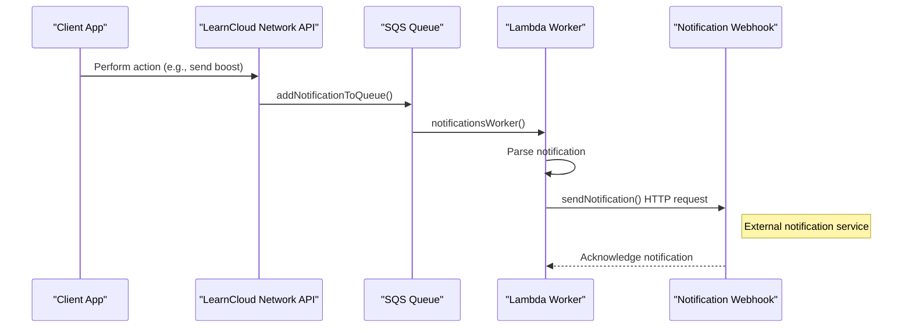

# Notifications & Webhooks

The LearnCloud Network includes a notification system that alerts users of important events such as received credentials, connection requests, and consent requests.

## Reading Notifications

### Get Notifications (Paginated)

Fetch a paginated list of notifications with optional filters:

```typescript
const result = await learnCard.invoke.getNotifications(
    { limit: 20, sort: 'REVERSE_CHRONOLOGICAL' },
    { read: false, archived: false } // optional filters
);

console.log(result.notifications); // Array of notifications
console.log(result.hasMore);       // Boolean indicating more pages
console.log(result.cursor);        // Cursor for next page
```

**Options:**
- `limit` - Number of notifications per page
- `cursor` - Pagination cursor from previous response
- `sort` - `'CHRONOLOGICAL'` or `'REVERSE_CHRONOLOGICAL'`

**Filters:**
- `type` - Filter by notification type (e.g., `'CREDENTIAL_RECEIVED'`)
- `read` - Filter by read status (`true` or `false`)
- `archived` - Filter by archived status (`true` or `false`)
- `actionStatus` - Filter by action status (`'PENDING'`, `'COMPLETED'`, `'REJECTED'`)

### Query Notifications

For more flexible querying, use `queryNotifications` to find notifications matching specific criteria:

```typescript
// Find notification by credential URI
const result = await learnCard.invoke.queryNotifications(
    { 'data.vcUris': 'urn:lc:vc:example-credential-uri' },
    { limit: 1 }
);

// Find notifications from a specific sender
const fromSender = await learnCard.invoke.queryNotifications(
    { 'from.did': 'did:web:network.learncard.com:users:sender123' }
);

// Find unread boost notifications
const unreadBoosts = await learnCard.invoke.queryNotifications(
    { type: 'BOOST_RECEIVED', read: false }
);

// Combine multiple filters
const result = await learnCard.invoke.queryNotifications(
    { 
        type: 'CREDENTIAL_RECEIVED',
        archived: false,
        actionStatus: 'PENDING'
    },
    { limit: 10, sort: 'REVERSE_CHRONOLOGICAL' }
);
```

**Query Fields:**
- `type` - Notification type enum
- `from.did` - Sender's DID
- `from.profileId` - Sender's profile ID
- `data.vcUris` - Credential URI(s) associated with the notification
- `data.vpUris` - Presentation URI(s) associated with the notification
- `read` - Read status
- `archived` - Archived status
- `actionStatus` - Action status (`'PENDING'`, `'COMPLETED'`, `'REJECTED'`)

### Update Notification

Mark a notification as read, archived, or update its action status:

```typescript
await learnCard.invoke.updateNotificationMeta(notificationId, {
    read: true,
    actionStatus: 'COMPLETED'
});
```

### Mark All Read

Mark all notifications as read:

```typescript
await learnCard.invoke.markAllNotificationsRead();
```

## Architecture



## Configuration

Profiles may optionally add a `notificationsWebhook` url, which will cause the LCN service to send payloads of a specific shape to that URL. These payloads are described here.

```typescript
const updatedProfile = {
  notificationsWebhook: 'https://example.com/webhooks/learn-cloud-network',
};

await learnCard.invoke.updateProfile(updatedProfile);
```

## Payload Reference&#x20;

### Connection Request

When requesting a connection with a profile, the target profile will receive a notification payload of the following structure:

```json
{
    type: 'CONNECTION_REQUEST',
    to: {{ targetProfile }},
    from: {{ requesterProfile }},
    message: {
        title: 'New Connection Request',
        body: '{{ requesterProfile.displayName }} has sent you a connection request!'
    }
}
```

Where `targetProfile` and `requesterProfile` are each `LCNProfile` objects

### Connection Accepted

When accepting a connection request, the profile who requested the connection will receive a notification payload of the following structure:

```json
{
    type: 'CONNECTION_ACCEPTED',
    to: {{ requesterProfile }},
    from: {{ accepterProfile }},
    message: {
        title: 'Connection Accepted',
        body: '{{ accepterProfile.displayName }} has accepted your connection request!'
    }
}
```

Where `accepterProfile` and `requesterProfile` are each `LCNProfile` objects

### Credential Received

When sending a credential to a profile, the profile who will receive the credential will receive a notification payload of the following structure:

```json
{
    type: 'CREDENTIAL_RECEIVED',
    to: {{ receiverProfile }},
    from: {{ senderProfile }},
    message: {
        title: 'Credential Received',
        body: '{{ senderProfile.displayName }} has sent you a credential'
    },
    data: { vcUris: [{{ uri }}] }
}
```

Where `senderProfile` and `receiverProfile` are each `LCNProfile` objects, and `uri` is a [URI](../../core-concepts/credentials-and-data/uris.md) that resolves to the credential that was sent.

### Boost Received

When sending a boost to a profile, the profile who will receive the boost will receive a notification payload of the following structure:

```json
{
    type: 'BOOST_RECEIVED',
    to: {{ receiverProfile }},
    from: {{ senderProfile }},
    message: {
        title: 'Boost Received',
        body: '{{ senderProfile.displayName }} has boosted you!'
    },
    data: { vcUris: [{{ uri }}] }
}
```

Where `senderProfile` and `receiverProfile` are each `LCNProfile` objects, and `uri` is a [URI](../../core-concepts/credentials-and-data/uris.md) that resolves to the boost that was sent.

### Boost Accepted

When accepting a sent boost, the profile who sent the boost will receive a notification payload of the following structure:

```json
{
    type: 'BOOST_ACCEPTED',
    to: {{ senderProfile }},
    from: {{ receiverProfile }},
    message: {
        title: 'Boost Accepted',
        body: '{{ receiverProfile.displayName }} has accepted your boost'
    },
    data: { vcUris: [{{ uri }}] }
}
```

Where `senderProfile` and `receiverProfile` are each `LCNProfile` objects, and `uri` is a [URI](../../core-concepts/credentials-and-data/uris.md) that resolves to the boost that was sent.

### Presentation Received

When sending a presentation to a profile, the profile who will receive the presentation will receive a notification payload of the following structure:

```json
{
    type: 'PRESENTATION_RECEIVED',
    to: {{ receiverProfile }},
    from: {{ senderProfile }},
    message: {
        title: 'Presentation Received',
        body: '{{ senderProfile.displayName }} has sent you a presentation'
    },
    data: { vpUris: [{{ uri }}] }
}
```

Where `senderProfile` and `receiverProfile` are each `LCNProfile` objects, and `uri` is a [URI](../../core-concepts/credentials-and-data/uris.md) that resolves to the presentation that was sent.

### Consent Flow Transaction

#### Consent

When consenting to a Consent Flow Contract, the owner of the contract will receive a notification payload of the following structure:

```json
{
    type: 'CONSENT_FLOW_TRANSACTION',
    to: {{ ownerProfile }},
    from: {{ consenterProfile }},
    message: {
        title: 'New Consent Transaction',
        body: '{{ consenterProfile.displayName }} has just consented to {{ contract.name }}!'
    },
    data: { transaction: {{ transaction }} }
}
```

Where `ownerProfile` and `consenterProfile` are each `LCNProfile` objects, `contract` is a `ConsentFlowContractDetails`  object, and `transaction` is a `ConsentFlowTransaction` object with its `action` set to `'consent'`.

#### Re-Consent

When a profile consents, withdraws consent, then _reconsents_ to a contract, the owner of the contract will receive a notification payload of the following structure:

```json
{
    type: 'CONSENT_FLOW_TRANSACTION',
    to: {{ ownerProfile }},
    from: {{ consenterProfile }},
    message: {
        title: 'New Consent Transaction',
        body: '{{ consenterProfile.displayName }} has just reconsented to {{ contract.name }}!'
    },
    data: { transaction: {{ transaction }} }
}
```

Where `ownerProfile` and `consenterProfile` are each `LCNProfile` objects, `contract` is a `ConsentFlowContractDetails`  object, and `transaction` is a `ConsentFlowTransaction` object with its `action` set to `'consent'`.

#### Updated Terms

When a profile updates its terms to a contract, the owner of the contract will receive a notification payload of the following structure:

```json
{
    type: 'CONSENT_FLOW_TRANSACTION',
    to: {{ ownerProfile }},
    from: {{ consenterProfile }},
    message: {
        title: 'New Consent Transaction',
        body: '{{ consenterProfile.displayName }} has just updated their terms to {{ contract.name }}!'
    },
    data: { transaction: {{ transaction }} }
}
```

Where `ownerProfile` and `consenterProfile` are each `LCNProfile` objects, `contract` is a `ConsentFlowContractDetails`  object, and `transaction` is a `ConsentFlowTransaction` object with its `action` set to `'update'`.

#### Withdrawn Consent

When a profile withdraws consent to a contract, the owner of the contrct will receive a notification payload of the following structure:

```json
{
    type: 'CONSENT_FLOW_TRANSACTION',
    to: {{ ownerProfile }},
    from: {{ consenterProfile }},
    message: {
        title: 'New Consent Transaction',
        body: '{{ consenterProfile.displayName }} has just withdrawn their terms to {{ contract.name }}!'
    },
    data: { transaction: {{ transaction }} }
}
```

Where `ownerProfile` and `consenterProfile` are each `LCNProfile` objects, `contract` is a `ConsentFlowContractDetails`  object, and `transaction` is a `ConsentFlowTransaction` object with its `action` set to `'withdraw'`.
