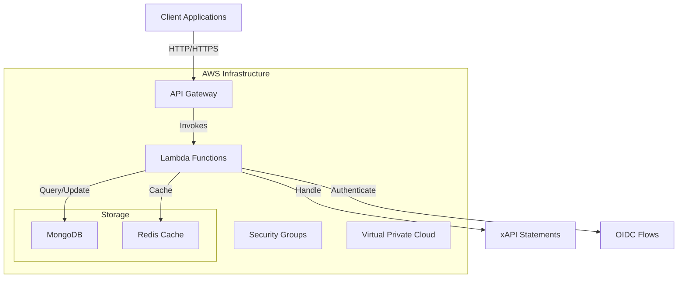

# Architecture

## Deployment Architecture 

LearnCloud Storage is deployed as a serverless application on AWS.

## API Endpoints

The LearnCloud Storage API exposes the following endpoints:

| Endpoint                            | Description                 | Handler            |
| ----------------------------------- | --------------------------- | ------------------ |
| `/trpc/*`                           | tRPC API endpoints          | `trpcHandler`      |
| `/api/*`                            | OpenAPI REST endpoints      | `openApiHandler`   |
| `/users/*`                          | DID Web identity resolution | `didWebHandler`    |
| `/xapi/*`                           | xAPI statement handling     | `xApiHandler`      |
| `/oidc/*`                           | OIDC authentication         | `oidcHandler`      |
| `/.well-known/openid-configuration` | OIDC configuration          | `oidcHandler`      |
| `/docs`                             | Swagger UI documentation    | `swaggerUiHandler` |

