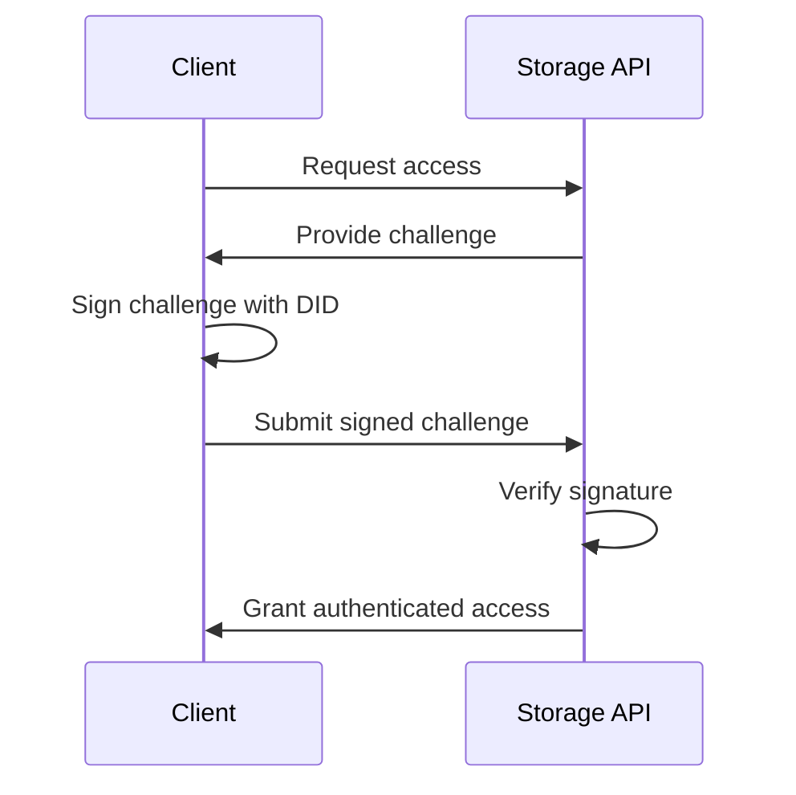
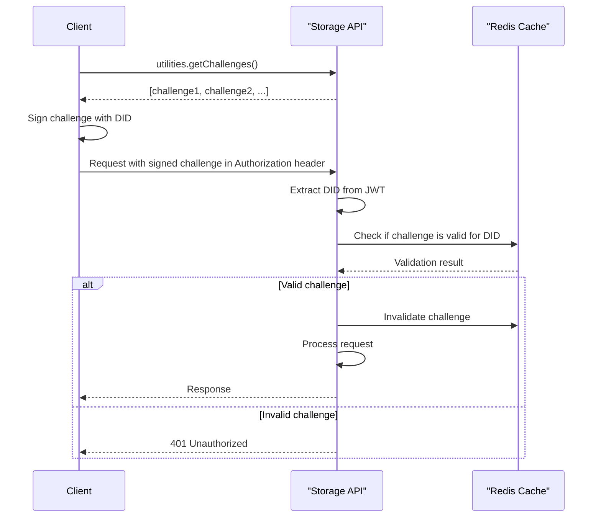

# Authentication

### Authenticating with the LearnCloud Storage API

To interact with the LearnCloud Storage API, you can choose one of two ways to authenticate:

1. Using the LearnCloud Storage Plugin (`@learncard/learn-cloud-plugin`) which handles authentication for you. **(Preferred option)**
2. Directly through the API endpoints using challenge-based DID Authentication. (most complex)

#### 1. Using LearnCloud Storage Plugin

To authenticate using the LearnCloud Storage Plugin (`@learncard/learn-cloud-plugin`), first install the package:

```bash
pnpm install @learncard/learn-cloud-plugin
```

Then, either instantiate a LearnCloud STorage enabled LearnCard, or add the Storage Plugin to an existing LearnCard:




```typescript
import { initLearnCard } from '@learncard/init';
import didkit from '@learncard/didkit-plugin/dist/didkit/didkit_wasm_bg.wasm?url';

const storageLearnCard = await initLearnCard({
    seed,
    network: true,
    didkit,
});
```




```typescript
import { initLearnCard } from '@learncard/core'
import { getLearnCloudPlugin } from '@learncard/network-plugin';
import didkit from '@learncard/core/dist/didkit/didkit_wasm_bg.wasm?url';

const storageAPI = 'https://cloud.learncard.com/trpc';

const learnCard = await initLearnCard({
    seed,
    didkit,
});

const storageLearnCard = await learnCard.addPlugin(
    await getLearnCloudPlugin(learnCard, storageAPI)
);
```



When using the LearnCloud Storage Plugin, challenge-based DID Authentication is handled for you, so no further steps are necessary.

#### 2. Using Challenge-based DID Authentication

Storage API uses DID-based authentication with a challenge-response mechanism and scope-based authorization.

**Simple High-Level Auth Flow:**



**Granular Auth Flow:**



If you choose to use the API endpoints directly, you'll need to manage challenge-based DID Authentication for each request. Here's a simplified TypeScript example to help you implement this authentication method:

```typescript
 
async function getClient(
  url = 'https://cloud.learncard.com/api': string,
  didAuthFunction: (challenge?: string) => Promise<string>
) {
  let challenges: string[] = [];

  const getChallenges = async (amount = 95 + Math.round((Math.random() - 0.5) * 5)): Promise<string[]> => {
    // Call the API to get a list of challenges
    // Replace this line with your preferred way of making API calls
    const response = await fetch(url + "/challenges?amount=" + amount);
    return await response.json();
  };

  challenges = await getChallenges();

  async function getAuthHeaders() {
    if (challenges.length === 0) challenges.push(...(await getChallenges()));
    return { Authorization: `Bearer ${await didAuthFunction(challenges.pop())}` };
  }

  // Use getAuthHeaders in your API calls to set the Authorization header
}

export default getClient;
```

In this example, we first define a `getClient` function that takes a `url` and a `didAuthFunction`. The `didAuthFunction` should be an asynchronous function that returns a signed challenge as a string.

The `getChallenges` function fetches a list of challenges from the API. The `getAuthHeaders` function generates an Authorization header using the `didAuthFunction` and a challenge. This header can then be used in your API calls.

## Authorization

#### Route Middleware <a href="#route-middleware" id="route-middleware"></a>

The system uses several middleware layers for authentication and authorization:

1. `openRoute`: Base middleware that allows public access
2. `didRoute`: Requires a valid DID in the request
3. `didAndChallengeRoute`: Requires a valid DID and challenge
4. `profileRoute`: Requires a valid DID, challenge, and existing profile
