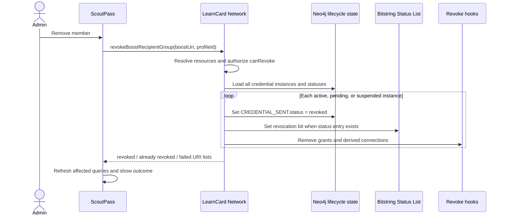

# LC-1950: ScoutPass Real Revocation Design

**Date:** 2026-08-09

**Status:** Approved for implementation planning

**Jira:** https://welibrary.atlassian.net/browse/LC-1950

## Summary

ScoutPass currently infers whether a Troop ID is revoked from recipient-list membership. That is not an authoritative lifecycle check: request failures can appear as revocation, revoked IDs disappear from the holder's view, and group removal does not reliably revoke every credential instance.

This design makes the existing LearnCard lifecycle system the source of truth in ScoutPass. Removing a person from a group will revoke every credential issued from that group Boost to that profile, including active, pending, and suspended instances. Holder-facing ScoutPass screens will keep the credential visible, show its authoritative state, and disable sharing and protected actions when it is not active.

Delivery is intentionally split into two cycles:

1. **Runtime revocation:** authoritative status, cryptographic Bitstring Status List revocation where the credential supports it, group-level removal, cleanup hooks, retained revoked IDs, and tests.
2. **Legacy migration and compatibility:** inventory pre-Bitstring credentials, reissue active credentials where needed, retire or blocklist old identifiers, and cut external verifiers over to the replacement credentials.

The runtime cycle is the first priority and is the scope of the implementation plan that follows this design.

## Goals

-   Replace ScoutPass's recipient-list-based "fake revocation" with the lifecycle system already used by LearnCard App.
-   Revoke all credential instances that grant a profile membership in a group when an authorized administrator removes that profile.
-   Set the Bitstring Status List revocation bit for every affected credential that contains a revocation status-list entry.
-   Remove permissions, administrator grants, and auto-created connections that were derived from the revoked credentials.
-   Keep revoked credential records visible to holders as `ID Revoked` instead of deleting them.
-   Disable sharing and membership-protected actions for pending, suspended, and revoked IDs.
-   Preserve the existing single-instance revoke API and its current targeting behavior.
-   Make bulk removal idempotent and expose partial failures so administrators can retry safely.

## Non-goals for the Runtime Cycle

-   Migrating or rewriting old signed credentials in place. A previously signed credential cannot be modified without invalidating its proof.
-   Completing the controlled reissuance and verifier-cutover program for pre-Bitstring active IDs.
-   Implementing self-service `Leave` behavior. Holder-initiated departure requires a separate product and authorization design.
-   Deleting revoked credential records from LearnCloud or the network index.
-   Changing the existing `revokeBoostRecipient` semantics. When a credential URI is provided it continues to revoke only that instance; without one it continues to target the most recent non-revoked instance.

## Approved Product Decisions

1. Removing a member from a group revokes **every** issuance for that group and profile, not only the latest issuance.
2. The bulk operation includes active, pending, and suspended credentials. A suspended credential must not be able to regain membership later through unsuspension.
3. Revoked IDs remain visible to the holder and are labeled `ID Revoked`.
4. External cryptographic revocation is required for active IDs issued before Bitstring Status List support. Because old signed copies cannot be changed, that requirement will be met in the follow-up migration cycle through controlled reissuance plus retirement/blocklist and verifier cutover.
5. Self-service `Leave` is separate from administrator removal and is not part of LC-1950's runtime cycle.

## Current State

### Authoritative lifecycle support

LearnCard Network already stores issuer-controlled lifecycle state on `CREDENTIAL_SENT` and can set a credential's Bitstring Status List revocation or suspension bit. LearnCard App's `useCredentialStatus` first queries `getMyCredentialLifecycleStatuses`, then falls back to credential verification, and fails open to `active` when status cannot be established. Its pure `deriveLifecycleStatus` helper gives structured lifecycle results and verification errors precedence over incidental list state.

### ScoutPass status inference

ScoutPass's `useTroopIDStatus` checks whether the current profile appears in claimed or all-recipient queries. It reports:

-   `valid` when present in claimed recipients;
-   `pending` when present only in all recipients;
-   `revoked` when absent from both lists.

This means an API failure or stale list can be rendered as revocation. The check is also tied to a Boost/profile pair rather than the credential record URI held by the user.

### Removal behavior

The existing `revokeBoostRecipient` API is deliberately per-instance. It revokes an explicitly supplied credential URI or, when no URI is supplied, the most recent non-revoked instance. ScoutPass currently calls it without a credential URI for Scout and Member removal. Administrator removal separately mutates permissions. Those paths do not express the group-level invariant that no issuance may remain usable after removal.

### Holder cleanup

ScoutPass mounts `useSyncRevokedCredentials`, which deletes revoked credentials from the holder's personal index. That conflicts with the approved requirement to retain and visibly label revoked IDs.

## Architecture

### 1. Shared lifecycle hook in `learn-card-base`

Move the lifecycle derivation and query behavior currently local to LearnCard App into `packages/learn-card-base` as a shared public hook. Both LearnCard App and ScoutPass will consume the same implementation.

The shared contract is:

```ts
import type { VC } from '@learncard/types';

export type CredentialLifecycleStatus = 'active' | 'revoked' | 'suspended';

export interface UseCredentialStatusOptions {
    uri?: string;
    credential?: VC;
    enabled?: boolean;
}

export interface CredentialStatusResult {
    status: CredentialLifecycleStatus;
    isLoading: boolean;
    isError: boolean;
}

export const useCredentialStatus = (
    options: UseCredentialStatusOptions
): CredentialStatusResult;
```

Behavior:

1. If there is no credential URI or the hook is disabled, return `active` with no request. Callers that require lifecycle gating must provide the held credential-record URI.
2. Query the authenticated holder's authoritative lifecycle endpoint using that URI.
3. If the backend returns a lifecycle status, use it.
4. If no backend status is available, verify the supplied credential, or read it by URI when necessary, so Bitstring Status List results can derive `revoked` or `suspended`.
5. If the status request or verification fails for an unrelated reason, expose `isError` and fail open to `active`; request failure must never imply revocation.
6. Preserve the existing query key prefix, `['credentialStatus', credentialUri]`, so lifecycle invalidation remains compatible.

Pending is issuance state rather than a cryptographic credential lifecycle state. ScoutPass will continue to derive `pending` from explicit issuance metadata for credentials that have been sent but not accepted; it will not infer pending from a failed request.

LearnCard App's local hook becomes a compatibility re-export during this cycle so existing imports do not need a flag-day change.

### 2. Dedicated group-removal API

Add a new `revokeBoostRecipientGroup` mutation through the full network type flow: brain-service route, network plugin type and implementation, and `learn-card-base` React Query mutation.

Input:

```ts
export interface RevokeBoostRecipientGroupInput {
    boostUri: string;
    recipientProfileId: string;
}
```

Result:

```ts
export interface RevokeBoostRecipientGroupResult {
    revokedCredentialUris: string[];
    alreadyRevokedCredentialUris: string[];
    failedCredentialUris: string[];
}
```

The group route is distinct from `revokeBoostRecipient`; it represents a different business invariant and avoids silently changing a public per-instance API.

The server will:

1. Resolve the recipient profile and Boost.
2. Check `canRevoke` before returning or mutating credential data.
3. Load every credential instance connected to that Boost and recipient, including already-revoked instances, with the effective issuer-controlled state from `CREDENTIAL_SENT` and any legacy `CREDENTIAL_RECEIVED` status.
4. Partition already-revoked instances from active, pending, and suspended instances for result reporting.
5. Mark each non-revoked instance revoked on `CREDENTIAL_SENT`.
6. For every instance, including one whose relationship was already revoked, ensure its Bitstring Status List revocation bit is set when a revocation entry exists and run the idempotent revoke hooks. Reprocessing already-revoked instances allows a retry to repair a prior partial failure instead of skipping required cleanup.
7. Collect per-instance outcomes rather than abandoning the batch after the first failure.
8. Queue one consolidated holder notification containing the successfully revoked credential URIs. Notification failure is logged but does not turn a completed revocation into a failure.
9. Return all three URI groups to the authorized caller.

The supporting access-layer query must return all matching credential instances in deterministic newest-first order and must not reuse the existing latest-only accessor.

The status-list helper must distinguish three internal outcomes: `updated`, `missing-entry`, and `failed`. `missing-entry` identifies a pre-Bitstring credential: authoritative revocation succeeds and a structured migration-gap log is emitted. `failed` means a credential that has a revocation entry could not be updated; the URI is returned in `failedCredentialUris` so the operation can repair it on retry. The existing external per-instance API remains boolean and keeps its targeting semantics.

### 3. ScoutPass credential URI wiring

The credential-record URI returned by recipient and earned-ID queries must be preserved through ScoutPass view models and component props. In particular:

-   `useTroopMembers` must retain each recipient issuance URI rather than reducing a profile to only Boost and profile data.
-   Earned-ID card flows must pass their record URI through `IdDisplayContainer`, `TroopPage`, status controls, and the options menu.
-   Managed-group views must distinguish the managed Boost URI from a credential-record URI; a Boost URI must never be passed to the lifecycle hook as though it were a held credential.
-   Where multiple issuances exist, holder views operate on the concrete record being displayed. Administrator group removal intentionally operates on the Boost/profile pair and revokes them all.

### 4. ScoutPass status and presentation

Replace list-membership status inference with a small ScoutPass presentation adapter over:

-   the shared credential lifecycle status for a concrete credential URI; and
-   explicit accepted/pending issuance metadata.

Presentation states are:

| State       | Source                                   | UI behavior                                                       |
| ----------- | ---------------------------------------- | ----------------------------------------------------------------- |
| `valid`     | lifecycle `active` and issuance accepted | Show `Valid ID`; sharing and protected actions enabled            |
| `pending`   | issuance explicitly not accepted         | Show `Pending Acceptance`; sharing and protected actions disabled |
| `suspended` | lifecycle `suspended`                    | Show `ID Suspended`; sharing and protected actions disabled       |
| `revoked`   | lifecycle `revoked`                      | Show `ID Revoked`; sharing and protected actions disabled         |

Loading remains visibly neutral until status is known. An error shows a retryable, user-friendly status error where needed but does not render `ID Revoked`.

Revoked ID records remain in holder lists and detail views. ScoutPass must remove its top-level `useSyncRevokedCredentials` call so it does not delete records as a side effect of viewing the app. Existing compatibility behavior elsewhere in LearnCard App remains unchanged during this cycle.

### 5. Administrator removal flow

Scout and Member removal uses the new group mutation. Administrator removal also uses the same group mutation; permissions and administrator grants are cleaned through the normal per-credential revoke hooks rather than separate client-orchestrated mutations.

The UI will:

1. Show an in-progress state while the mutation runs.
2. Treat a response with no `failedCredentialUris` as success, including a repeat request where every credential is already revoked.
3. Show a success message only after complete success.
4. Show a retryable partial-failure message when any URI failed.
5. Refresh members, recipient counts, activity, and credential lifecycle queries after both full and partial outcomes so the screen reflects server state.

The client must not report a failed administrator cleanup as a successful member removal.

## Data Flow



## Idempotency and Failure Semantics

-   Authorization and resource resolution happen before batch mutation. Unauthorized callers receive no credential inventory.
-   Already-revoked credentials do not rewrite lifecycle state, but their status-list bit and idempotent cleanup hooks are checked again. They are returned separately after those checks succeed.
-   Repeating the same group removal after full success produces no effective state changes and is treated as success.
-   The batch is best-effort across credential instances because graph state, external status-list updates, hooks, and notifications do not share a database transaction.
-   One instance failure does not prevent later instances from being attempted.
-   A URI appears in `revokedCredentialUris` only after the authoritative relationship update, applicable Bitstring update, and revoke hooks complete. A missing legacy Bitstring entry is logged for migration reporting but does not roll back the authoritative relationship revocation.
-   A URI appears in `alreadyRevokedCredentialUris` only after its applicable Bitstring update and cleanup hooks complete.
-   A URI appears in `failedCredentialUris` when its authoritative relationship update, applicable Bitstring update, or mandatory cleanup hooks fail. Retrying the group operation reprocesses these side effects even if the relationship was already changed.
-   Consolidated notification delivery is non-blocking and is not included in `failedCredentialUris`.
-   Structured server logs include counts and internal credential identifiers but no credential contents or recipient personal data.

## Query Invalidation

The `learn-card-base` group mutation invalidates, at minimum:

-   Boost recipient lists for the affected Boost;
-   paginated recipient and recipient-count queries;
-   ScoutPass network/member lists;
-   activity list and activity statistics;
-   credential lifecycle queries under `['credentialStatus']`;
-   cached Boost summaries that derive recipient state.

Invalidation runs from the mutation's settled path for full success, returned partial outcomes, and transport errors. A transport failure can leave the client uncertain whether the server changed any instances, so refreshing is safer than retaining stale membership. Authorization and transport errors still use the existing mutation error feedback path.

## Security and Privacy

-   The server, not the client, determines the full credential set to revoke.
-   `canRevoke` is checked against the resolved Boost before credential URIs are returned.
-   A caller cannot submit arbitrary credential URIs to the group route.
-   The query constrains every credential to both the Boost and the resolved recipient profile.
-   Existing public per-instance authorization remains unchanged.
-   Logs and user-facing errors do not include credential contents or raw internal failures.

## Testing Strategy

### Shared lifecycle behavior

-   Move or reproduce the existing lifecycle derivation tests in `learn-card-base`.
-   Cover authoritative `active`, `revoked`, and `suspended` responses.
-   Cover Bitstring-verification fallback when authoritative state is absent.
-   Cover status-query and verification failures and assert they do not derive `revoked`.
-   Verify LearnCard App's compatibility re-export preserves behavior.

### Brain-service group removal

-   Revokes all active instances for the same Boost/profile.
-   Revokes pending instances that have no `CREDENTIAL_RECEIVED` relationship.
-   Revokes suspended instances and prevents later unsuspension from restoring access.
-   Reports already-revoked instances and succeeds on a duplicate request.
-   Rejects unauthorized callers before exposing credential URIs.
-   Sets each available Bitstring revocation bit.
-   Emits a structured migration-gap log for legacy credentials without a revocation entry while retaining authoritative revocation.
-   Runs permission, administrator, auto-connect, and connection cleanup hooks for each newly revoked instance.
-   Sends one consolidated notification for the batch; notification failure does not fail revocation.
-   Returns partial failures and continues processing remaining instances.
-   Keeps the existing per-instance revoke and suspend test suite green, including latest-instance fallback semantics.

### ScoutPass

-   A revoked earned ID remains present and displays `ID Revoked`.
-   Pending and suspended IDs display their distinct states.
-   Sharing and protected actions are disabled for pending, suspended, and revoked states.
-   A list-query or lifecycle-query failure never displays `ID Revoked` by inference.
-   Managed-group Boost URIs are not sent to the holder lifecycle hook.
-   Group removal uses the group API for Scout, Member, and Administrator roles.
-   Full success, already-revoked success, partial failure, and transport failure produce the correct feedback and refresh behavior.
-   ScoutPass no longer mounts deletion-based revoked-credential synchronization.

### Baseline and focused verification

The implementation plan will retain these known-green focused suites and add package-specific commands for the new tests:

```bash
bun run --cwd apps/learn-card-app test:unit -- src/hooks/__tests__/useCredentialStatus.test.ts
env SEED=aaaaaaaaaaaaaaaaaaaaaaaaaaaaaaaaaaaaaaaaaaaaaaaaaaaaaaaaaaaaaaaa \
  bun run --cwd services/learn-card-network/brain-service test -- run \
  test/revoke-suspend-per-instance.spec.ts
env SEED=aaaaaaaaaaaaaaaaaaaaaaaaaaaaaaaaaaaaaaaaaaaaaaaaaaaaaaaaaaaaaaaa \
  bun run --cwd services/learn-card-network/brain-service test -- run \
  test/scouts-hierarchy.spec.ts
```

## Documentation

Update `docs/apps/scouts/credential-revocation.md` in the runtime cycle to describe:

-   authoritative lifecycle state rather than recipient-list inference;
-   retained revoked IDs;
-   group removal semantics;
-   cryptographic status behavior for credentials with Bitstring entries; and
-   the explicit limitation and planned handling of pre-Bitstring credentials.

The ScoutPass `AGENTS.md` lifecycle section should be updated with the new hook and component landmarks so future changes do not restore list-absence inference.

## Runtime Acceptance Criteria

-   An authorized group removal revokes all active, pending, and suspended credential instances for the Boost/profile pair.
-   Credentials with revocation status-list entries verify as revoked outside LearnCard/ScoutPass after their published Bitstring list is refreshed.
-   No old issuance can keep or regain ScoutPass membership after successful group removal.
-   Permission, administrator, and connection side effects derived from the affected credentials are removed.
-   Revoked IDs remain visible and display `ID Revoked`.
-   Pending, suspended, and revoked IDs cannot be shared or used for membership-protected actions.
-   Network or query failures do not render a credential as revoked.
-   Repeating removal is safe and successful.
-   Partial failures are visible and retryable.
-   Existing single-instance lifecycle behavior remains backward compatible.
-   Focused frontend, shared-package, and brain-service tests pass.

## Follow-up: Pre-Bitstring Migration and Compatibility

After the runtime cycle is stable, a separate design and implementation cycle will:

1. Inventory ScoutPass credential instances by issuance generation and status-list capability.
2. Produce an auditable report of active, pending, suspended, and already-revoked legacy IDs.
3. Reissue active pre-Bitstring IDs with status-list entries under a controlled process.
4. Preserve group hierarchy, role, display, and permission intent during reissuance.
5. Retire or blocklist old credential identifiers at LearnCard-controlled verification boundaries.
6. Cut external verifiers over to replacement identifiers and document the period in which legacy signed copies cannot be cryptographically revoked on their own.
7. Define rollback, holder communication, and reconciliation procedures before production execution.

That follow-up is required to satisfy cryptographic revocation for pre-Bitstring active IDs outside LearnCard/ScoutPass. It is secondary to shipping correct runtime revocation for current credentials.
