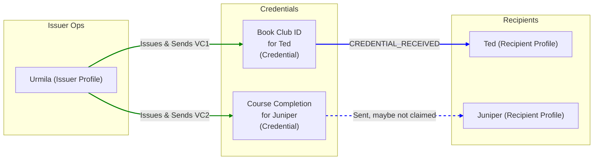
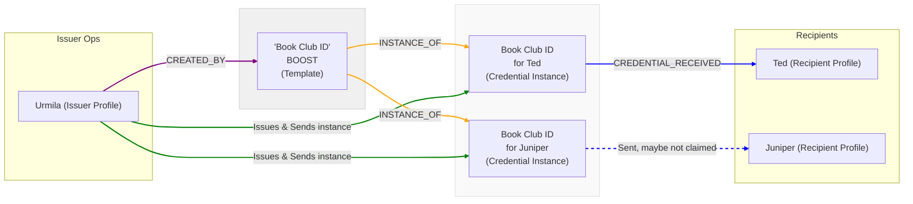

# Create a Boost

Welcome! This tutorial will guide you through creating a "Boost" with LearnCard. Boosts are an enhanced way to manage and issue Verifiable Credentials (VCs), especially when you want to issue a similar credential to multiple people or manage it as a distinct "template."

## **What is a Boost, and Why Use It?**

You already know how to Create and Send a Single Credential. That's great for one-off situations!

A **Boost** takes this a step further. Think of a Boost as a **master template or a blueprint for a specific type of credential**.

* **Direct VC:** Like handwriting a single invitation.
* **Boost:** Like designing a beautiful invitation template that you can then print and send to many guests. Each guest gets a personalized copy (their own VC instance), but they all originate from your master "Boost" template.

**You should use a Boost instead of sending VCs directly when you want to:**

* **Issue the same type of credential to multiple people:** e.g., a "Course Completion" certificate for all students who pass.
* **Track recipients centrally:** Easily see a list of everyone who has received a credential derived from a specific Boost.
* **Manage a credential type:** Update metadata or display properties of the Boost, which can influence future issuances.
* **Delegate issuance:** Grant permissions to others (e.g., "Coaches") to issue credentials based on a Boost you created.
* **Organize credentials:** Create hierarchies of Boosts (e.g., a "Programming" Boost with child Boosts for "Python" and "JavaScript").

_(See the diagrams below for a visual comparison of sending VCs directly vs. sending Boosts)_

**Diagram 1: Sending Individual VCs** _(This is what the previous_ [_"Create a Credential" tutorial_ ](create-a-credential.md)_covered)_




In this model, each credential is a distinct, standalone item.


**Diagram 2: Sending Credentials via a Boost** _(This is what this tutorial will cover)_




Here, Urmila creates one "Book Club ID" Boost. Then, when she sends it to Ted and Juniper, they each receive a credential that is an _instance of_ that main Boost.


## **What you'll accomplish in this tutorial:**

1. Set up your Issuer environment (quick recap).
2. Define the content for a "Monthly Tech Meetup Attendee" Boost.
3. Create the Boost on the LearnCard Network.
4. Send this Boost (as individual credentials) to two different recipient Profile IDs.
5. Briefly discuss how you might see who received the Boost.


Full Create and Send a Boost Example


## **Prerequisites:**

1. **LearnCard App Installed:** For your recipients (you can use your own Profile ID as one or both recipients for testing).
2. **Recipient Profile IDs:** You'll need at least two unique Profile IDs from LearnCard apps. For testing, you can use your own and perhaps a friend's, or create dummy ones if your test environment allows.
3. **Development Environment:**
   * Node.js installed.
   * A new project folder.
   *   LearnCard SDK installed:&#x20;

       ```bash
       npm install @learncard/init @learncard/didkit-plugin
       # or pnpm / yarn
       ```
4. **Basic Understanding:** Review [What is a Verifiable Credential?](../core-concepts/credentials-and-data/verifiable-credentials-vcs.md) and the previous tutorial [Create and Send Your First Digital Credential.](create-a-credential.md)

***

## Part 1: Setting Up Your Issuer Environment (Recap)

Just like in the previous tutorial, your computer will act as the Issuer.

### **Step 1.1: Create an Issuer Script** Create `issueBoost.ts` (or `.js`).

### **Step 1.2: Initialize LearnCard SDK for the Issuer**

```typescript
// issueBoost.ts
import { initLearnCard } from '@learncard/init';
// import didkit from '@learncard/didkit-plugin/dist/didkit/didkit_wasm_bg.wasm'; // If needed

async function setupIssuerLearnCard() {
    const issuerSeed = 'my-tech-meetup-organizer-seed-keep-secret'; // Replace with a unique, secure seed!
    const learnCardIssuer = await initLearnCard({
        seed: issuerSeed,
        network: true,
        allowRemoteContexts: true, // We will issue a credential with a remote context 
        // didkit: didkit, // If self-hosting wasm
    });
    console.log("Issuer LearnCard Initialized for Boosts.");
    console.log("Issuer DID:", learnCardIssuer.id.did());
    return learnCardIssuer;
}

```

### **Step 1.3: Ensure Issuer Has a Service Profile**&#x20;


(Same as the previous tutorial – important for network interactions)


```typescript
// Add this function to issueBoost.ts
async function ensureIssuerProfile(learnCardIssuer: any) { // Use 'any' or the specific LearnCard type
    const issuerServiceProfileData = {
      profileId: 'tech-meetup-hq', // Unique ID for your issuer profile
      displayName: 'Tech Meetup HQ',
    };
    try {
        let profile = await learnCardIssuer.invoke.getProfile(issuerServiceProfileData.profileId);
        if (!profile) {
            console.log(`Creating service profile for issuer: ${issuerServiceProfileData.profileId}`);
            await learnCardIssuer.invoke.createServiceProfile(issuerServiceProfileData);
            console.log('Issuer Service Profile for Boosts created successfully.');
        } else {
            console.log('Issuer Service Profile for Boosts already exists.');
        }
    } catch (error) {
        console.error('Error ensuring issuer profile for Boosts:', error.message);
    }
}

```

## Part 2: Defining the Credential Content for Your Boost

This is the "template" for the credential that will be issued each time you send this Boost. For our example, it's an attendance credential for a monthly tech meetup.

```typescript
// Add this to issueBoost.ts

// The recipient's DID will be filled in when the Boost is *sent* to each person.
// So, the credentialSubject.id here is often a placeholder or omitted,
// as the `sendBoost` operation will create a specific VC instance for each recipient.
// However, the overall structure of what you're attesting to is defined here.

const meetupAttendeeCredentialTemplate = {
    // "@context" defines the vocabulary used (like a dictionary for terms)
    "@context": [
      "https://www.w3.org/2018/credentials/v1",
      "https://purl.imsglobal.org/spec/ob/v3p0/context-3.0.1.json",
      "https://ctx.learncard.com/boosts/1.0.0.json",
    ],
    // "type" specifies what kind of credential this is
    "type": [
      "VerifiableCredential",
      "OpenBadgeCredential",
      "BoostCredential"
    ] // Standard VC type + OpenBadge type + Boost type
    // `issuer` and `issuanceDate` will be added when the Boost is created/sent.
    "issuer": "did:example:issuer",
    "name": "Monthly Tech Innovators Meetup",
     // "credentialSubject" is about whom or what the credential is
    "credentialSubject": {
      "id": "did:example:recipient",
      "achievement": {
        "achievementType": "Badge",
        "criteria": {
          "narrative": "Awarded for attending the Monthly Tech Innovators Meetup."
        },
        "description": "Tech Innovators Meetup is a montly gathering of like-minded tech enthusiasts and entrepreneurs.",
        "id": "urn:uuid:" + crypto.randomUUID(), // Generate a unique ID
        "image": "https://cdn.filestackcontent.com/FtOrbWhiTTKb818btGlu",
        "name": "Monthly Tech Innovators Meetup",
        "type": [
          "Achievement"
        ]
      },
      "type": [
        "AchievementSubject"
      ]
    },
    // Additional Boost Display Fields for Extra Customization
    "display": {
      "backgroundColor": "#40cba6",
      "displayType": "badge"
    },
    "image": "https://cdn.filestackcontent.com/FtOrbWhiTTKb818btGluE",
    // "proof" will be added automatically when the credential is signed
};


```

Notice we don't specify the recipient's DID in the `credentialSubject.id` here. The Boost is the template; the specific recipient details are handled when you _send_ the Boost.

## Part 3: Creating the Boost

Now, let's create the Boost itself on the LearnCard Network using the template content.

```typescript
// Add this function to issueBoost.ts

async function createMeetupBoost(learnCardIssuer: any, credentialTemplate: any) {
    const boostMetadata = {
        name: 'Tech Innovators Meetup - May 2025 Attendee',
        description: 'Recognizes attendance at the May 2025 Tech Innovators Meetup.',
        category: 'Social Badge', // Choose a relevant category
        // You can add display properties here too, see Boost Core Concepts
    };

    console.log("Creating Boost with metadata:", boostMetadata);
    try {
        console.log("Using template VC for Boost:", JSON.stringify(credentialTemplate, null, 2));

        const boostUri = await learnCardIssuer.invoke.createBoost(credentialTemplate, boostMetadata);
        console.log('Boost Created Successfully! Boost URI:', boostUri);
        // Save this boostUri! You'll use it to send the Boost to recipients.
        return boostUri;
    } catch (error) {
        console.error('Error creating Boost:', error);
        throw error;
    }
}

```

When you run this, you'll get a `boostUri`. This URI is the identifier for your Boost template.

## Part 4: Sending the Boost to Multiple Recipients

With your `boostUri`, you can now send it to your attendees. Each `sendBoost` call will create a unique Verifiable Credential instance for that recipient, based on the Boost template.

```typescript
// Add this function to issueBoost.ts

async function sendBoostToAttendees(learnCardIssuer: any, boostUriToShare: string, recipientProfileIds: string[]) {
    if (!boostUriToShare) {
        console.error("Boost URI is missing. Cannot send.");
        return;
    }
    console.log(`Preparing to send Boost (${boostUriToShare}) to ${recipientProfileIds.length} recipients.`);

    for (const profileId of recipientProfileIds) {
        console.log(`Sending Boost to Profile ID: ${profileId}...`);
        try {
            // `sendBoost` takes the recipient's Profile ID and the Boost URI.
            // It generates a Verifiable Credential instance based on the Boost's template
            // and issues it to the recipient.
            const sentCredentialUri = await learnCardIssuer.invoke.sendBoost(
                profileId,
                boostUriToShare,
                // { encrypt: true } // Optional: consider encryption
            );
            console.log(`  Successfully sent Boost to ${profileId}. Credential Instance URI: ${sentCredentialUri}`);
        } catch (error) {
            console.error(`  Error sending Boost to ${profileId}:`, error.message);
        }
    }
    console.log("Finished sending Boost to all specified recipients.");
}

```

## Part 5: Putting It All Together & Viewing

Let's run the full sequence.

```typescript
// Add this main execution block at the end of issueBoost.ts

async function main() {
    // --- !! REPLACE THESE WITH ACTUAL PROFILE IDs FROM LEARNCARD APPS !! ---
    const attendeeProfileId1 = 'YOUR_FIRST_RECIPIENT_PROFILE_ID'; 
    const attendeeProfileId2 = 'YOUR_SECOND_RECIPIENT_PROFILE_ID';
    // --- !! --------------------------------------------------------- !! ---

    if (attendeeProfileId1 === 'YOUR_FIRST_RECIPIENT_PROFILE_ID' || attendeeProfileId2 === 'YOUR_SECOND_RECIPIENT_PROFILE_ID') {
        console.error("Please replace 'YOUR_FIRST_RECIPIENT_PROFILE_ID' and 'YOUR_SECOND_RECIPIENT_PROFILE_ID' with actual Profile IDs from LearnCard apps.");
        return;
    }
     if (await setupIssuerLearnCard().then(issuer => issuer.id.did() === 'did:key:z6Mkpissg9N3752fGusN7f5KkHobbWp8rW4xY8y3JYR8XnpZ')) { // Default DID for an empty seed, prompt user to change
        console.warn("You are using a default/empty seed for the issuer. Please change 'my-tech-meetup-organizer-seed-keep-secret' to a unique value for a real issuer.");
    }


    const learnCardIssuer = await setupIssuerLearnCard();
    await ensureIssuerProfile(learnCardIssuer);

    const meetupBoostUri = await createMeetupBoost(learnCardIssuer, meetupAttendeeCredentialTemplate);

    if (meetupBoostUri) {
        const recipientProfileIds = [attendeeProfileId1, attendeeProfileId2];
        await sendBoostToAttendees(learnCardIssuer, meetupBoostUri, recipientProfileIds);
        
        console.log("\nBoost Tutorial complete!");
        console.log("Check the LearnCard apps for the recipient Profile IDs you provided.");
        console.log("Each should have received a 'Tech Innovators Meetup - May 2025 Attendee' credential.");
        console.log(`\nTo see who received this Boost, you could later use: learnCard.invoke.getPaginatedBoostRecipients('${meetupBoostUri}')`);
    } else {
        console.log("Boost creation failed. Cannot send to recipients.");
    }
}

main().catch(err => console.error("Boost tutorial encountered an error:", err));

```

### **Step 5.1: Run Your Script**

1. **Replace Placeholders:**
   * In `issueBoost.ts`, find `YOUR_FIRST_RECIPIENT_PROFILE_ID` and `YOUR_SECOND_RECIPIENT_PROFILE_ID` and replace them with actual Profile IDs from LearnCard apps (you can use your own ID twice for testing if needed, but using two different ones is better for demonstration).
   * Also, replace `'my-tech-meetup-organizer-seed-keep-secret'` with your own unique string for the issuer's seed.
2. Save the file.
3. Open your terminal in your project directory and run:
   * If using TypeScript: `npx ts-node issueBoost.ts`
   * If using JavaScript: `node issueBoost.js`

### **Step 5.2: View in LearnCard Apps**

After the script runs, check the LearnCard apps associated with the recipient Profile IDs you used. Each should have received the "Tech Innovators Meetup - May 2025 Attendee" credential in your notifications.

## Summary & What's Next

Fantastic! You've now learned how to: ✅ Understand the value of Boosts for reusable credential templates. ✅ Define the content for a Boost. ✅ Create a Boost using the LearnCard SDK. ✅ Send instances of that Boost to multiple recipients.

Boosts are a powerful way to manage credentialing at scale. From here, you can explore:

* **Retrieving Boost Recipients:** Use `learnCard.invoke.getPaginatedBoostRecipients(boostUri)` to see who has been issued a credential from this Boost.
* **Boost Permissions:** Control who can edit, issue, or manage your Boosts. (See Boost Permission Model).
* **Boost Hierarchies:** Organize Boosts into parent-child relationships. (See Boost Hierarchies).
* Customizing **Display Options** for your Boosts to make them visually appealing in wallets.

Explore the [Boost Credentials Core Concept page](../core-concepts/credentials-and-data/boost-credentials.md) for more in-depth information on all the capabilities of Boosts!
