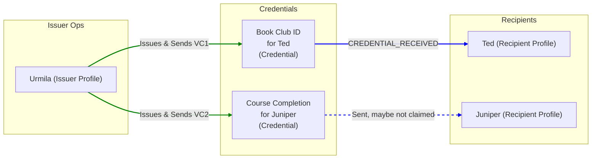
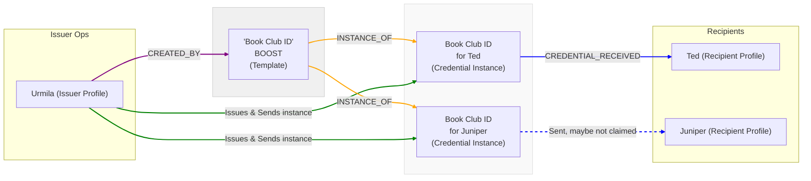

# Issue at Scale with Boosts

Boosts are credential templates for issuing similar credentials to multiple people.

## What is a Boost, and Why Use It?

Use a Boost to:

- Issue the same type of credential to multiple people.
- Track recipients centrally.
- Manage a credential type.
- Delegate issuance.

**Diagram 1: Sending Individual VCs** _(Covered in the previous tutorial)_


```mermaid
graph LR
    subgraph Issuer Ops
        Urmila["Urmila (Issuer Profile)"]
    end

    subgraph Credentials
        VC1["Book Club ID<br/>for Ted<br/>(Credential)"]
        VC2["Course Completion<br/>for Juniper<br/>(Credential)"]
    end

    subgraph Recipients
        Ted["Ted (Recipient Profile)"]
        Juniper["Juniper (Recipient Profile)"]
    end

    Urmila -- "Issues & Sends VC1" --> VC1
    VC1 -- "CREDENTIAL_RECEIVED" --> Ted

    Urmila -- "Issues & Sends VC2" --> VC2
    VC2 -. "Sent, maybe not claimed" .-> Juniper

    linkStyle 0 stroke-width:2px,fill:none,stroke:green;
    linkStyle 1 stroke-width:2px,fill:none,stroke:blue;
    linkStyle 2 stroke-width:2px,fill:none,stroke:green;
    linkStyle 3 stroke-width:2px,fill:none,stroke:blue,stroke-dasharray: 5 5;
```


Each credential is a distinct, standalone item.


**Diagram 2: Sending Credentials via a Boost** _(Covered in this tutorial)_


```mermaid
graph LR
    subgraph Issuer Ops
        UrmilaB["Urmila (Issuer Profile)"]
    end

    subgraph BoostDefinition [" "]
        style BoostDefinition fill:#f0f0f0,stroke:#ccc
        MasterBoost["'Book Club ID'<br/>BOOST<br/>(Template)"]
    end

    subgraph CredentialInstances [" "]
      style CredentialInstances fill:#f9f9f9,stroke:#ddd
        VC_Ted["Book Club ID<br/>for Ted<br/>(Credential Instance)"]
        VC_Juniper["Book Club ID<br/>for Juniper<br/>(Credential Instance)"]
    end

    subgraph Recipients
        TedB["Ted (Recipient Profile)"]
        JuniperB["Juniper (Recipient Profile)"]
    end

    UrmilaB -- "CREATED_BY" --> MasterBoost

    MasterBoost -- "INSTANCE_OF" --> VC_Ted
    UrmilaB -- "Issues & Sends instance" --> VC_Ted
    VC_Ted -- "CREDENTIAL_RECEIVED" --> TedB

    MasterBoost -- "INSTANCE_OF" --> VC_Juniper
    UrmilaB -- "Issues & Sends instance" --> VC_Juniper
    VC_Juniper -. "Sent, maybe not claimed" .-> JuniperB

    linkStyle 0 stroke-width:2px,fill:none,stroke:purple;
    linkStyle 1 stroke-width:2px,fill:none,stroke:orange;
    linkStyle 2 stroke-width:2px,fill:none,stroke:green;
    linkStyle 3 stroke-width:2px,fill:none,stroke:blue;
    linkStyle 4 stroke-width:2px,fill:none,stroke:orange;
    linkStyle 5 stroke-width:2px,fill:none,stroke:green;
    linkStyle 6 stroke-width:2px,fill:none,stroke:blue,stroke-dasharray: 5 5;
```


Urmila creates one "Book Club ID" Boost. Ted and Juniper receive credentials that are instances of that Boost.


## Prerequisites

1. **Node.js 20+** installed.
2. **A basic LearnCard project** set up (from the [Quickstart](../quick-start/your-first-integration.md)).
3. **A Signing Authority:** this tutorial sends templates to email addresses, which LearnCard signs on your behalf — so register one first: [Set Up a Signing Authority](../how-to-guides/create-signing-authority.md). (Sending a credential you signed yourself, as in the Quickstart, doesn't need this.)

---

## Part 1: Setting Up Your Issuer Environment

Create `issueBoost.mjs` and initialize the LearnCard SDK:

```javascript
import 'dotenv/config';
import { initLearnCard } from '@learncard/init';

const issuerSeed = process.env.SECURE_SEED;
if (!issuerSeed) throw new Error('Missing SECURE_SEED in .env');

const learnCard = await initLearnCard({
    seed: issuerSeed,
    network: true,
});

const profileId = process.env.PROFILE_ID;
let profile = await learnCard.invoke.getProfile(profileId);
if (!profile) {
    await learnCard.invoke.createServiceProfile({
        profileId,
        displayName: process.env.PROFILE_NAME || 'Tech Meetup HQ',
    });
}
```


**Profiles:** `createProfile` creates a standard user profile (a person). `createServiceProfile` creates an organization or app issuer. Learn more about [Network Profiles](../core-concepts/identities-and-keys/network-profiles.md).


---

## Part 2: Defining the Credential Template

Define the template for the credential. Do not specify the recipient's DID (`credentialSubject.id`) or the `issuer` — the network fills those in when you send the Boost.

```javascript
const meetupAttendeeTemplate = {
    '@context': [
        'https://www.w3.org/ns/credentials/v2',
        'https://purl.imsglobal.org/spec/ob/v3p0/context-3.0.3.json',
    ],
    type: ['VerifiableCredential', 'OpenBadgeCredential'],
    name: 'Monthly Tech Innovators Meetup',
    credentialSubject: {
        type: ['AchievementSubject'],
        achievement: {
            type: ['Achievement'],
            achievementType: 'Badge',
            name: 'Monthly Tech Innovators Meetup',
            description: 'Tech Innovators Meetup is a monthly gathering of tech enthusiasts.',
            criteria: {
                narrative: 'Awarded for attending the Monthly Tech Innovators Meetup.',
            },
            image: {
                id: 'https://cdn.filestackcontent.com/FtOrbWhiTTKb818btGlu',
                type: 'Image',
            },
        },
    },
};
```

---

## Part 3: Creating the Boost

Create the Boost on the LearnCard Network using the template content.

```javascript
const boostMetadata = {
    name: 'Tech Innovators Meetup - May 2025 Attendee',
    description: 'Recognizes attendance at the May 2025 Tech Innovators Meetup.',
    category: 'Social Badge',
};

console.log('Creating Boost template...');
const boostUri = await learnCard.invoke.createBoost(meetupAttendeeTemplate, boostMetadata);
console.log('Boost Created! URI:', boostUri);
```

The `boostUri` is the identifier for your Boost template.

---

## Part 4: Sending the Boost to Multiple Recipients

The `send` method populates the recipient, signs the credential using your signing authority, and delivers it.

```javascript
const attendees = ['alice@example.com', 'bob@example.com'];

for (const email of attendees) {
    console.log(`Sending Boost to ${email}...`);
    const result = await learnCard.invoke.send({
        type: 'boost',
        recipient: email, // email, phone, profile ID, or DID — auto-detected
        templateUri: boostUri,
    });

    if (result.inbox?.status === 'PENDING') {
        console.log(`  Sent. Claim link: ${result.inbox.claimUrl}`);
    } else {
        console.log(`  Delivered to wallet.`);
    }
}
```


**Lower-level alternative:** You can also use `learnCard.invoke.sendBoost(profileId, boostUri)` if you only have a LearnCard Profile ID and don't need the unified `send` method's email/phone delivery features.


---

## Dynamic Templates with Mustache Variables

Boosts support **Mustache-style templating** to inject dynamic values at issuance time.

### Creating a Templated Boost

Use `{{variableName}}` syntax in your credential template:

```javascript
const templatedCredential = {
    '@context': [
        'https://www.w3.org/ns/credentials/v2',
        'https://purl.imsglobal.org/spec/ob/v3p0/context-3.0.3.json',
    ],
    type: ['VerifiableCredential', 'OpenBadgeCredential'],
    name: 'Certificate for {{courseName}}',
    credentialSubject: {
        type: ['AchievementSubject'],
        achievement: {
            type: ['Achievement'],
            name: '{{courseName}} Completion',
            description:
                'Awarded to {{studentName}} for completing {{courseName}} with grade {{grade}}',
            criteria: { narrative: 'Successfully complete the course' },
        },
    },
};

const dynamicBoostUri = await learnCard.invoke.createBoost(templatedCredential, {
    name: 'Course Completion Template',
});
```

### Sending with Personalized Data

Provide `templateData` when sending to fill in the variables:

```javascript
const result = await learnCard.invoke.send({
    type: 'boost',
    recipient: 'student@example.com',
    templateUri: dynamicBoostUri,
    templateData: {
        courseName: 'Web Development 101',
        studentName: 'Alice Smith',
        grade: 'A',
    },
});
```

The resulting credential will have all placeholders replaced:

- `{{courseName}}` → `Web Development 101`
- `{{studentName}}` → `Alice Smith`
- `{{grade}}` → `A`


**Missing Variables**: If you don't provide a value for a variable, it's rendered as an empty string. This is useful for optional fields.


For more details on dynamic templates, see [Dynamic Templates with Mustache](../core-concepts/credentials-and-data/boost-credentials.md#dynamic-templates-with-mustache).

---

## Summary & What's Next

Next steps:

- **Retrieving Boost Recipients:** Use `learnCard.invoke.getPaginatedBoostRecipients(boostUri)` to see who has been issued a credential from this Boost.
- **Boost Permissions:** Control who can edit, issue, or manage your Boosts.
- **Default Permissions:** Use `defaultPermissions` to create open Boosts that anyone can issue. (See [Default Permissions](../core-concepts/credentials-and-data/boost-credentials.md#default-permissions)).
