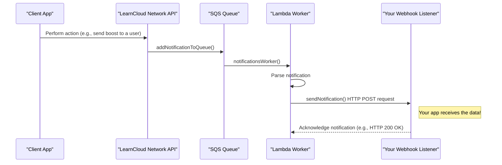

# Listen to Webhooks

**What are Webhooks in LearnCard?** Imagine you want your application to know _immediately_ when something interesting happens to a user's LearnCard profile on the network – like receiving a new credential or a connection request. Instead of your app constantly asking "Anything new? Anything new?", the LearnCloud Network can send your application a direct message (a "notification") as soon as that event occurs. This direct message is sent to a specific web address (URL) that you provide, and this mechanism is called a **webhook**.

## **What you'll accomplish in this tutorial:**

1. Understand how LearnCloud notifications work at a high level.
2. Configure a profile on LearnCard to send notifications to your webhook URL.
3. Build a very simple web server (a "listener") to receive and process these notifications.
4. See an example of handling a "Connection Request" notification.

### **Why is this useful?**&#x20;

Webhooks enable you to:

* Build responsive applications that react to events in real-time.
* Automate workflows based on LearnCloud Network activities.
* Enhance user experience by providing timely updates.

## **Prerequisites:**

1. **LearnCard SDK Initialized:** An active `learnCard` instance connected to the network (we'll call it `yourLearnCardInstance`).
2. **A Publicly Accessible URL:** Your application needs an endpoint (a URL) that the LearnCloud Network can reach over the internet to send `POST` requests.
   * **For local development:** Tools like **ngrok** are perfect for this! Ngrok can create a secure, public URL that tunnels to your local machine. We'll cover this.
   * **For production:** This would be a route on your deployed web server or a serverless function (e.g., AWS Lambda + API Gateway, Google Cloud Function).
3. **Basic understanding of:**
   * How webhooks work (HTTP `POST` requests).
   * Node.js and a simple web framework like Express (for our example listener). You can adapt the principles to any backend technology.
4. **Familiarity with LearnCard Profiles:** You'll be updating a profile to set its webhook URL.

***

## Part 1: How LearnCloud Notifications Work

Before we build, let's look at the flow (as shown in ["Notifications & Webhook Reference"](../../sdks/learncard-network/notifications.md)):



When an event occurs (like `App` sending a boost to a user whose profile has a webhook configured), the LearnCloud Network API eventually triggers an HTTP `POST` request to the registered webhook URL. Your application needs to be listening at that URL.

***

## Part 2: Setting Your Webhook URL in LearnCard

For a LearnCard profile to receive notifications via webhook, you need to tell LearnCard _where_ to send them.

### **Step 2.1: Get Your Public Webhook URL**

* **If deploying to a server:** You'll have a public URL like `https://yourapp.com/api/learncard-webhook`.
* **For Local Development (using ngrok):**
  1. Install ngrok: [https://ngrok.com/download](https://ngrok.com/download)
  2. If your local listener will run on port 3000 (we'll set this up later), run: `ngrok http 3000`
  3. Ngrok will give you a public "Forwarding" URL (e.g., `https://xxxx-yyy-zzz.ngrok.io`). **This is your temporary public webhook URL.** Use the `https` version.

### **Step 2.2: Update Your LearnCard Profile**

Use the LearnCard SDK to update the profile for which you want to receive notifications. Set its `notificationsWebhook` field to your public URL.

```typescript
// Ensure yourLearnCardInstance is initialized and authenticated
// for the profile you want to configure.

async function setWebhookUrl(webhookUrl: string) {
    try {
        const profileUpdateData = {
            notificationsWebhook: webhookUrl,
        };

        const success = await yourLearnCardInstance.invoke.updateProfile(profileUpdateData);

        if (success) {
            console.log(`Successfully updated profile's webhook URL to: ${webhookUrl}`);
        } else {
            console.error('Failed to update profile with webhook URL.');
        }
    } catch (error) {
        console.error('Error setting webhook URL:', error);
    }
}

// Replace with your actual ngrok URL or deployed webhook URL
const myPublicWebhookUrl = 'https://YOUR_NGROK_OR_DEPLOYED_URL.io/learncard-notifications'; 
// setWebhookUrl(myPublicWebhookUrl); // Call this function once to set it up
```


**Action:** Run a script with this function call (or integrate it into your app's profile settings) to update the profile you want to receive notifications for.


***

## Part 3: Building a Simple Webhook Listener

Now, let's create a simple server that will listen for incoming notifications at the URL you just configured. We'll use Node.js and Express.

### **Step 3.1: Project Setup**

```bash
mkdir learncard-webhook-listener
cd learncard-webhook-listener
npm init -y
npm install express body-parser
# If using TypeScript (optional, but recommended)
# npm install typescript @types/express @types/node ts-node --save-dev
# npx tsc --init 
```

### **Step 3.2: Create Your Server (`listener.js` or `listener.ts`)**

```typescript
// listener.ts (or listener.js if not using TypeScript)
import express from 'express';
import bodyParser from 'body-parser';

const app = express();
const port = 3000; // The port ngrok will forward to

// Middleware to parse JSON request bodies
app.use(bodyParser.json());

// This is your webhook endpoint. 
// Make sure the path matches what you set in myPublicWebhookUrl 
// (e.g., if URL is https://.../learncard-notifications, path is /learncard-notifications)
app.post('/learncard-notifications', (req, res) => {
    console.log('Received a notification!');
    
    // The actual notification data is in req.body
    const notificationPayload = req.body;
    console.log('Payload:', JSON.stringify(notificationPayload, null, 2));

    // --- Process the notification based on its type ---
    if (notificationPayload.type === 'CONNECTION_REQUEST') {
        const fromProfile = notificationPayload.from; // This is an LCNProfile object
        const message = notificationPayload.message;
        console.log(`Received CONNECTION_REQUEST from: ${fromProfile?.displayName || fromProfile?.profileId || 'Unknown'}`);
        console.log(`Message: ${message?.body}`);
        
        // Example action: Log it, send an internal alert, update your database, etc.
        // For now, we just log it.
    } else if (notificationPayload.type === 'CREDENTIAL_RECEIVED') {
        const fromProfile = notificationPayload.from;
        const credentialUris = notificationPayload.data?.vcUris;
        console.log(`Received CREDENTIAL_RECEIVED from: ${fromProfile?.displayName || 'Unknown'}`);
        console.log(`Credential URIs:`, credentialUris);
        // You might want to fetch these credentials using learnCard.read.get(uri)
    } else {
        console.log(`Received unhandled notification type: ${notificationPayload.type}`);
    }

    // --- IMPORTANT: Acknowledge receipt quickly! ---
    // Send a 200 OK response to LearnCloud to let it know you received the notification.
    // If LearnCloud doesn't get a quick 2xx response, it might retry sending,
    // leading to duplicate processing.
    res.status(200).send('Notification received');

    // Any long-running tasks based on the notification should be done asynchronously
    // AFTER sending this response (e.g., queue it for later processing).
});

app.listen(port, () => {
    console.log(`Webhook listener started on http://localhost:${port}`);
    console.log(`If using ngrok, ensure it's forwarding to this port.`);
    console.log(`Your webhook endpoint is POST http://localhost:${port}/learncard-notifications`);
});
```

### **Step 3.3: Running Your Listener**

* If using JavaScript: `node listener.js`
* If using TypeScript: `npx ts-node listener.ts`

And if you're developing locally, make sure `ngrok http 3000` (or your chosen port) is running in another terminal.

***

## Part 4: Triggering and Testing Your Webhook

Now, let's test it! We'll simulate an action that sends a `CONNECTION_REQUEST` notification to the profile whose webhook you configured.

### **Step 4.1: Perform an Action**

You'll need another LearnCard instance (let's call it `profileA_learnCard`) to act as the requester. The profile you configured with the webhook URL will be `profileB_learnCard` (represented by `yourLearnCardInstance` in Step 2.2).

```typescript
// In a separate script or part of your testing setup:
// Assume profileA_learnCard is initialized for Profile A
// Assume profileB_ProfileId is the profileId of the user/service you configured the webhook for in Part 2.

// const profileB_ProfileId = 'the-profile-id-with-webhook-configured';

// async function sendConnectionRequest() {
//   try {
//     console.log(`Profile A attempting to connect with ${profileB_ProfileId}`);
//     const success = await profileA_learnCard.invoke.connectWith(profileB_ProfileId);
//     if (success) {
//       console.log('Connection request sent successfully by Profile A!');
//     } else {
//       console.error('Failed to send connection request from Profile A.');
//     }
//   } catch (error) {
//     console.error('Error sending connection request:', error);
//   }
// }

// sendConnectionRequest();
```


**Action:** Execute code similar to the `sendConnectionRequest` function above, where `profileA_learnCard` sends a connection request to the profile that has the webhook set up.


### **Step 4.2: Check Your Listener's Logs**

If everything is set up correctly:

1. Profile A sends the connection request.
2. LearnCloud Network processes this and identifies that the target profile (Profile B) has a webhook URL.
3. LearnCloud Network sends a `POST` request to your ngrok URL (which forwards to `http://localhost:3000/learncard-notifications`).
4. Your `listener.js` / `listener.ts` server will receive the request.

You should see output in your listener's console similar to:

```json
Webhook listener started on http://localhost:3000
If using ngrok, ensure it's forwarding to this port.
Your webhook endpoint is POST http://localhost:3000/learncard-notifications
Received a notification!
Payload: {
  "type": "CONNECTION_REQUEST",
  "to": { /* Profile B's details */ },
  "from": { /* Profile A's details */ },
  "message": {
    "title": "New Connection Request",
    "body": "Profile A DisplayName has sent you a connection request!"
  }
}
Received CONNECTION_REQUEST from: Profile A DisplayName
Message: Profile A DisplayName has sent you a connection request!
```

***

## Important Considerations

* **Security:** Always use `https` for your webhook URLs in production. Ngrok provides this automatically.
* **Asynchronous Processing:** As mentioned, respond with `200 OK` quickly. If you need to do significant processing (like database updates, sending other API calls), do it after sending the response, perhaps by adding the task to an internal queue.
* **Error Handling & Retries:** Build robust error handling in your listener. Be aware that LearnCloud might retry sending a notification if it doesn't receive a timely success response. Design your processing to be **idempotent** (processing the same notification multiple times doesn't cause unintended side effects).
* **Payload Reference:** This tutorial focused on `CONNECTION_REQUEST`. Refer to the [LearnCloud Network API Notifications Documentation](../../sdks/learncard-network/notifications.md) for the structure of all other notification types (`CREDENTIAL_RECEIVED`, `CONSENT_FLOW_TRANSACTION`, etc.) and expand your listener to handle them as needed.

***

## Summary & Next Steps

You've now learned how to:

1. **Configure a webhook URL** for a LearnCard profile.
2. **Build a basic webhook listener** using Node.js and Express.
3. **Receive and parse** an example `CONNECTION_REQUEST` notification.
4. **Trigger a test notification.**

From here, you can:

* Expand your listener to handle various other `type` values from the LearnCloud Network.
* Integrate more complex business logic into your webhook handler.
* Deploy your listener to a robust server or serverless environment for production use.

Happy listening!
