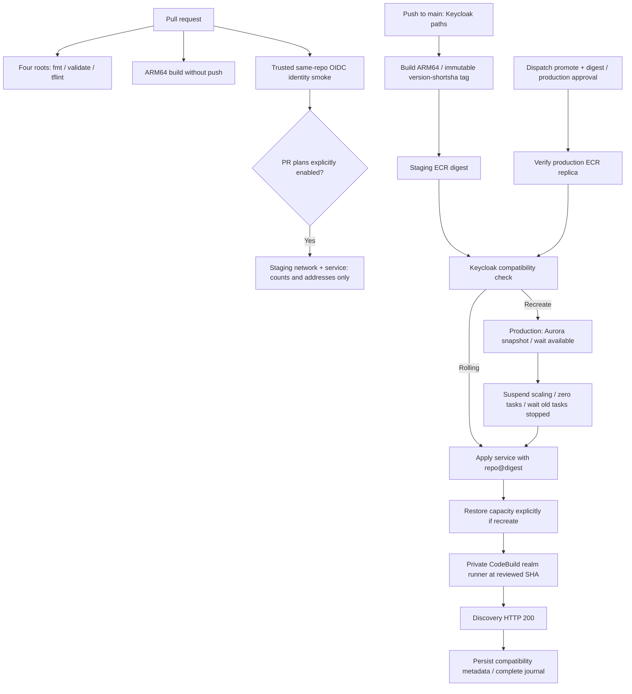

# Keycloak Terraform roots

Each directory is an independent root with its own state and committed environment
tfvars. Do not run Terraform in this index directory. Cross-root discovery uses
SSM, never `terraform_remote_state`.

| Root                                               | Ownership                                                            |
| -------------------------------------------------- | -------------------------------------------------------------------- |
| [Account bootstrap](../../aws/bootstrap/README.md) | Human-admin state bucket, OIDC roles/boundary, ECR, budgets          |
| [Network](network/README.md)                       | VPC, subnets, NAT, flow logs, delegated zones and certificates       |
| [Service](service/README.md)                       | ARM64 ECS, Aurora, public/private ALBs, realm runner and access task |
| [Realm](realm/README.md)                           | Keycloak realms/clients/IdPs, applied privately through CodeBuild    |

First apply: **bootstrap → network (certificate wait off) → GoDaddy NS delegation →
network re-apply (certificate wait on) → service → realm → automation bootstrap**.
Use separate directories and account sessions for staging and production.

Terraform >= 1.10 with S3-native locking; CI pins 1.15.8. All AWS roots use provider
6.x and committed three-platform lockfiles. There are no DynamoDB lock tables.
The old flat root was never applied; its service files were moved without a state
migration. Read the service runbook's unresolved rotation and live private-access
gates before deployment, and the realm runbook's local hostname proof. Production
user cutover remains a separate workstream.

## lca-api wiring

`deploy.yml` passes these from lca-api's GitHub environment (the `lca_api_env` of the
deployment matrix). All unset = Keycloak sign-in disabled, identical to before.

| Kind           | Name                                                 | Staging value                                                                                                   |
| -------------- | ---------------------------------------------------- | --------------------------------------------------------------------------------------------------------------- |
| var            | `KEYCLOAK_ISSUERS`                                   | `https://auth.staging.learncard.app/realms/learncard`                                                           |
| var            | `KEYCLOAK_AUDIENCES`                                 | `learncard-app`                                                                                                 |
| var            | `OIDC_ISSUER`                                        | lca-api's public origin, e.g. `https://staging.api.learncard.app` (must equal the realm's `lca_api_issuer_url`) |
| var            | `OIDC_CLIENT_ID`                                     | `keycloak-broker`                                                                                               |
| var            | `GOOGLE_OAUTH_CLIENT_IDS` / `APPLE_OAUTH_CLIENT_IDS` | output of `bun run lc auth-audiences <tenants…> <stage>`                                                        |
| var (optional) | `OIDC_REDIRECT_URIS`                                 | leave unset; derived as `<issuer>/broker/lca-api/endpoint`                                                      |
| var (optional) | `KEYCLOAK_JWKS_URL_OVERRIDES`                        | leave unset outside local compose                                                                               |
| secret         | `OIDC_CLIENT_SECRET`                                 | `broker_client_secret` from Secrets Manager `learncard-keycloak/<env>/<realm>/lca-api`                          |
| secret         | `OIDC_SIGNING_KEY_JWK`                               | RS256 private JWK (`kid`, `alg`) from `learncard-keycloak/<env>/<realm>/lca-api-oidc-signing-jwk`               |

Copy secrets without printing them, e.g.
`aws secretsmanager get-secret-value --secret-id learncard-keycloak/staging/learncard/lca-api --query SecretString --output text | jq -r .broker_client_secret | gh secret set OIDC_CLIENT_SECRET --env <lca-api staging env>`.

## CI/CD

The pipeline runs only from `main`. Configure **main-only deployment branches** on
both `keycloak-staging` and `keycloak-production`; require independent production
reviewers and prevent self-approval. Jobs serialize network/service/image operations
per environment with no cancellation of a running deployment. GitHub concurrency
can replace older _pending_ jobs; this is not a FIFO release queue. Bootstrap is
always human-applied. No static AWS credentials, raw plans or plan artifacts are used.

### Required GitHub configuration

| Scope                      | Variable                                 | Purpose                                                                                                                |
| -------------------------- | ---------------------------------------- | ---------------------------------------------------------------------------------------------------------------------- |
| Each environment           | `AWS_DEPLOY_ROLE_ARN`                    | Bootstrap deploy OIDC role                                                                                             |
| Each environment           | `TF_STATE_BUCKET`                        | That account's bootstrap state bucket                                                                                  |
| Each environment           | `KEYCLOAK_BOOTSTRAP_ADMIN_SECRET_ARN`    | Existing secret ARN, never its value                                                                                   |
| Each environment           | `KEYCLOAK_DB_ROTATION_RISK_ACKNOWLEDGED` | Explicit `true` after reviewing the service runbook's unresolved rotation risk                                         |
| Each environment, optional | `KEYCLOAK_CONTAINER_IMAGE`               | Manual service plan/apply override only, account-local `repo@sha256:...`; otherwise use running image                  |
| Each environment, optional | `KEYCLOAK_ALLOW_MISSING_REALM`           | Default `false`; `true` temporarily allows discovery 404 **only when the realm root is absent and no realm apply ran** |
| Repository                 | `KEYCLOAK_STAGING_PLAN_ROLE_ARN`         | Staging plan role for the non-environment PR OIDC subject                                                              |
| Repository, optional       | `KEYCLOAK_ENABLE_PR_PLANS`               | Default off; literal `true` enables credentialed trusted-author staging plans                                          |

Region is pinned to `us-east-1`. Repository URLs are discovered from
`/learncard-keycloak/<env>/bootstrap/ecr_repository_url` and checked against account
281762601323 (staging) / 206533012615 (production). Automated deployments derive the
image digest directly from the build, not `KEYCLOAK_CONTAINER_IMAGE`. Tags are
`<Keycloak-version>-<12-character-source-sha>` and immutable; reruns reuse that tag.
ARM64 builds use QEMU/buildx, `provenance: false`, and no production rebuild.

**Human bootstrap re-apply required before enabling this pipeline:** the new
`infra/aws/bootstrap/deploy-pipeline.tf` attaches a protected `*-deploy-pipeline`
policy. It adds `s3:GetObject`, `s3:PutObject` for exactly
`keycloak/<env>/compat/{metadata.json,deployment.json}`, and `logs:GetLogEvents`,
`logs:DescribeLogStreams`, `logs:FilterLogEvents` for the realm log group/streams.
Existing policy already grants ECR push only in staging, ECR describe/pull in both,
CodeBuild StartBuild/BatchGetBuilds, named RDS CreateDBClusterSnapshot and discovery,
ECS UpdateService/Describe/List/waits, application-autoscaling registration/discovery,
SSM GetParameter and state bucket ListBucket. Existing state policy allowlists the
deploy role and denies bootstrap-state access; no bucket-policy widening is needed.
The new IAM policy name is covered by the existing bootstrap self-mutation deny.
Production bootstrap still needs its initial human apply and ECR replication setup.

### PR trust tradeoff

Fork PRs never receive credentials. Identity smoke checks out **no code**. Optional
plans require same-repository PRs authored by OWNER, MEMBER or COLLABORATOR, but that
is not sufficient isolation: Terraform providers, data sources and workflow changes
can execute arbitrary PR code with the plan role's **account-wide ReadOnlyAccess**,
downstream state read and state-lock writes. State/application data may be sensitive.
The IAM `pull_request` subject cannot distinguish a fork or trusted author; workflow
review remains mandatory. Enabling the toggle explicitly accepts that exposure.
**The toggle is a scheduling control, not an IAM security boundary.** A repository
writer can edit PR YAML to bypass it or add code to the retained identity-smoke job;
the existing plan-role trust already permits that token. Keeping the toggle off
does not revoke this inherited access. Preventing that attack requires a separate,
human-applied redesign of plan-role trust and externally enforced approval (including
the identity-smoke path). This pipeline does not claim to provide that isolation.
Keep it off unless maintainers trust all code contributors covered by that condition.
Plan output, errors and JSON stay on the ephemeral runner, are removed on exit, and
are never uploaded. Only create/update/delete counts and up to 100 changed addresses
appear in job summaries. No production PR plan runs.

### Promotion and manual operations

1. Merge reviewed Keycloak changes to main; wait for staging service, realm runner,
   discovery smoke, and metadata/journal persistence to succeed.
2. Copy its digest from the deployment summary. Dispatch **Keycloak Infrastructure**
   from main with `action=promote`, `environment=production`, `digest=sha256:<64 hex>`.
   `root` is ignored for promotion. Approve the production environment deployment.
   The image's `org.opencontainers.image.revision` label must identify an ancestor
   of main; the job restores service/realm Terraform from that exact commit and
   passes it to CodeBuild. An older image is never paired with newer realm config.
   Legacy manually pushed images without that label are not promotable through
   this action; use a deliberately reviewed manual service override for recovery.
3. The job verifies the digest exists in production ECR (replication is asynchronous;
   a missing digest fails before mutation). It never rebuilds or accepts mutable tags.
   Verify that the approved digest is from the successful staging run; replica presence
   alone is not a staging-health attestation.

Manual `action=plan|apply`, `root=network|service` remains available on main. Service
apply goes through the same compatibility gate and smoke checks, including when the
image stays unchanged. Network apply uses its same-job saved plan. For an optional
staging recreate snapshot, dispatch service apply with `snapshot_staging=true`;
push-triggered staging deploys skip snapshots by default. Production cannot skip.

Realm runs **only inside the VPC** via `learncard-keycloak-<env>-realm` CodeBuild,
`--source-version` set to the reviewed workflow commit SHA. The pipeline polls a
bounded 30 minutes and fails on all non-success terminal statuses. No standalone
realm dispatch is exposed until the runner supports a reviewed plan/apply contract.
If the parallel realm root has not landed, the runner is explicitly skipped; the
temporary 404 exception above must be enabled to finish that bootstrap deployment.
Once the root exists, runner success and HTTP 200 are required regardless of the flag.

### Compatibility and recreate safety

The [26.7.4 compatibility CLI](https://github.com/keycloak/keycloak/blob/26.7.4/docs/guides/server/update-compatibility.adoc)
is authoritative; do not infer compatibility by parsing versions or metadata fields.
`scripts/compat-gate.sh PREVIOUS_JSON IMAGE [start options...]` runs the **new image**
with `update-compatibility check --optimized --file=/work/prev.json`:

- Exit `0`: `strategy=rolling`.
- Exit `3` (incompatible) or `4` (rolling feature disabled): `strategy=recreate`.
- Any other exit (including `1` corrupted metadata, `2` invalid CLI, Docker errors):
  fail without deployment. An absent object is first deployment → recreate;
  access/network errors are **not** treated as absent metadata.

Both metadata generation and checking use postgres, ispn and jdbc-ping, all non-secret
environment options from the candidate ECS task in the saved Terraform plan, and the
image's baked build options/features (`--optimized`). No feature override is invented:
future feature changes must be baked into that same image. `KC_ENV_FILE` supplies the
task environment to both scripts. The CLI considers cache stack/config/mTLS/remote
cache, database vendor/schema/host/port/name and selected feature changes; it does not
inspect cache XML content, so custom cache configuration changes still need review.
Metadata is generated before mutation to catch CLI problems, then persisted only
after successful service/realm/smoke using that exact image and checked configuration.

Recreate refuses a plan that also changes the autoscaling target: apply sizing
changes separately with a compatible image first. This prevents Terraform from
raising the minimum during the zero-capacity window or undoing new sizing later.
Recreate snapshots production Aurora and waits for availability, suspends dynamic
and scheduled scaling, temporarily sets min capacity to zero, scales ECS to zero,
and waits for old tasks to **stop**, not merely for service stability. Terraform
ignores desired count, so the script explicitly restores the previous positive count.
It disables circuit-breaker rollback while starting the new revision, verifies the
service's actual image, and restores the previous scaling bounds/suspension state and
normal circuit breaker only after health succeeds. No service Terraform changes are
required. This deployment path assumes the foundation service already exists; first
network/service provisioning remains the human runbook's responsibility.

### Failure recovery and rollback

The S3 `deployment.json` journal is marked pending **before** mutation. An incomplete
journal blocks later deployments, even if an old metadata object remains. Do not
blindly rerun or mark it complete. After a failed recreate the pipeline attempts to
stop tasks and leave scaling suspended; a killed runner or AWS outage can prevent
cleanup, so an operator must verify capacity, autoscaling and task revisions.

For a rolling-compatible rollback, redeploy the previous retained digest through
manual service apply (set the optional image override), or production promotion.
For **recreate/schema rollback**, restoring only the image is unsafe: stop all tasks,
restore the pre-upgrade Aurora snapshot into a new cluster, reconcile the service
Terraform/database endpoint and secrets through the human recovery procedure, then
deploy the previous digest. Do not restore an old image against an upgraded schema.
Before unblocking the journal, privately verify the actual database/image/config,
restore intended capacity/scaling bounds from the prior deployment and committed
tfvars, run the realm and smoke checks, regenerate matching metadata, and write a
complete journal. If schema state is uncertain, restore the snapshot first. S3
versioning preserves prior metadata/journal versions for investigation (90-day expiry).
ECR never expires tagged images, so deployed and rollback digests stay pullable.

### Drift detection

`keycloak-drift.yml` runs nightly (and on dispatch) from `main` with each
environment's **plan role**: repository variables `KEYCLOAK_STAGING_PLAN_ROLE_ARN`
and, once production is bootstrapped, `KEYCLOAK_PRODUCTION_PLAN_ROLE_ARN` (unset → skipped).
It plans network and service against the running image, then opens or comments on a
`keycloak-drift` issue when any change is planned and closes it on a clean run. Drift
means either out-of-band edits or merged-but-unapplied code. The realm root is not
covered: it can only run inside the VPC, and the runner has no plan-only mode yet.

### Dependency automation and verification boundaries

Dependabot checks only Keycloak Dockerfiles and the four Terraform roots weekly,
grouped, with two open PRs per ecosystem; no repo-wide Actions update noise. The
[Terraform fetcher](https://github.com/dependabot/dependabot-core/blob/main/terraform/lib/dependabot/terraform/file_fetcher.rb)
requires `.tf`/`.hcl` configuration files. Missing `realm/` is **not guaranteed to be
a silent skip**: it can report a missing-manifest update error until the parallel root
lands. The requested entry stays configured in advance; no placeholder realm files
are created here. CI validation separately warns/skips the absent root.

The Apple provider watcher downloads only the exact stable upstream release asset,
hashes it, updates both pins and opens a review PR with release notes and a Keycloak
26.x-minor compatibility checklist. It never executes a downloaded jar or release
notes and never auto-merges. Enable GitHub's setting allowing Actions to create PRs;
approve/run required CI for token-created PRs before merging.

Offline checks: actionlint for both workflows, shellcheck for scripts, ARM64 Docker
build and same-/different-version compatibility tests, bootstrap fmt/validate/tflint.
Real CI must still verify OIDC and IAM authorization, ECR replication, actual Aurora
snapshot waits, ECS drain/recreate and autoscaling restoration, CodeBuild VPC/admin
access, realm deployment, discovery smoke and S3 persistence. Local checks cannot
prove these, nor replace the service runbook's rotation and production-readiness gates.
