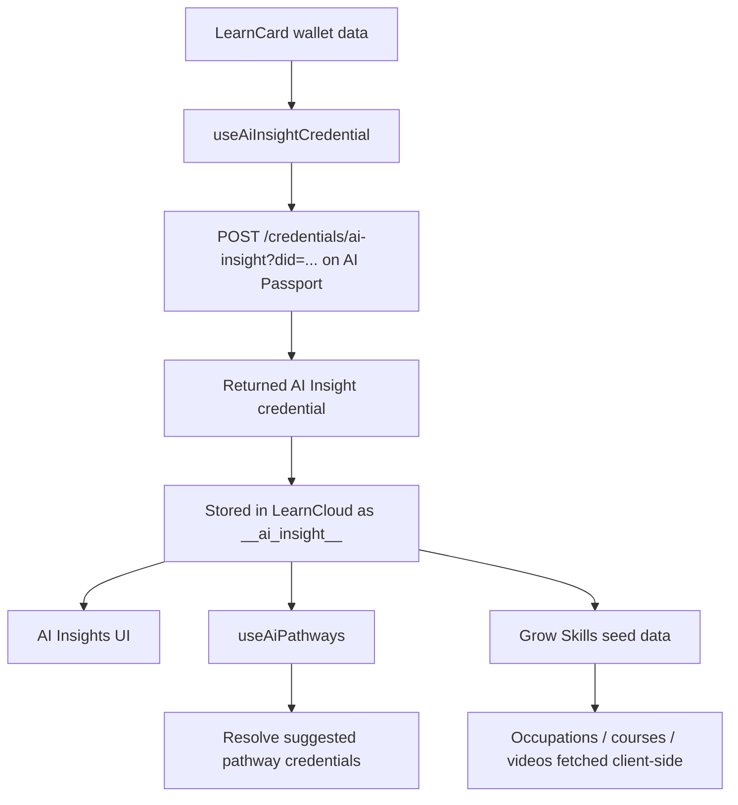

# AI Insights + Grow Skills Data Flow Map

## Purpose

This note documents how the LearnCard app currently consumes AI-generated suggestions and insights, where those values come from, and what is known vs unknown about the AI Passport side.

It is intended to be useful for both:

-   humans trying to understand the system
-   AI agents trying to modify or trace the flow safely

## High-level summary

The LearnCard app does **not** generate AI Insights or Grow Skills recommendations locally.
Instead, it:

1. asks AI Passport for an AI Insight credential
2. stores that credential in the user’s wallet / LearnCloud index
3. renders the stored credential in the UI
4. resolves secondary recommendation data from the stored credential

The important consequence is:

-   if the stored AI Insight credential is stale, the UI will also feel stale
-   changing goals, skills, or credentials in LearnCard does **not** currently guarantee that the AI Insight credential is regenerated
-   LearnCard now has a targeted refresh path for the LearnCard AI contract that asks AI Passport to regenerate the credential after consent syncs or deletions
-   the client briefly polls for a newer credential after that targeted refresh starts, then stops once it detects the update or hits a timeout window

## Key LearnCard files involved

### AI Insight generation / caching

-   `packages/learn-card-base/src/hooks/useAiInsightCredential.ts`
    -   fetches the AI insight credential from AI Passport
    -   stores it in LearnCloud under the special id `__ai_insight__`
    -   exposes the React Query hook used across the app
    -   exposes `useAiPathways()` for pathway credential resolution
    -   exposes `useAiInsightCredentialMutation()` for forcing regeneration

### AI Insights display

-   `apps/learn-card-app/src/pages/ai-insights/AiInsights.tsx`
-   `apps/learn-card-app/src/pages/ai-insights/AiInsightsLearningSnapshots.tsx`
-   `apps/learn-card-app/src/pages/ai-insights/AiInsightsLearningPathways.tsx`
-   `apps/learn-card-app/src/pages/ai-insights/AiInsightsWidgets.tsx`

### Grow Skills display

-   `apps/learn-card-app/src/pages/ai-pathways/GrowSkillsPathwaysHome.tsx`
-   `apps/learn-card-app/src/pages/ai-pathways/useGrowSkillsContent.ts`
-   `apps/learn-card-app/src/pages/ai-pathways/ExploreRoles.tsx`

### Skill profile inputs that should matter, but currently do not drive AI refresh directly

-   `apps/learn-card-app/src/pages/ai-pathways/ai-pathways-skill-profile/SkillProfileStep1.tsx`
    -   saves goals and professional profile
-   `apps/learn-card-app/src/pages/ai-pathways/ai-pathways-skill-profile/SkillProfileStep5.tsx`
    -   saves self-assigned skills

### Credential change path that does trigger AI refresh today

-   `apps/learn-card-app/src/hooks/useUploadFile.tsx`
    -   calls `useAiInsightCredentialMutation().mutate()` after some upload / parse flows

### Consent sync / delete paths that now trigger targeted AI refresh

-   `packages/learn-card-base/src/react-query/mutations/syncConsentFlow.ts`
    -   after syncing credentials to the LearnCard AI contract, it calls AI Passport `POST /credentials`
-   `packages/learn-card-base/src/react-query/mutations/mutations.ts`
    -   after deleting a credential tied to the LearnCard AI contract, it calls the same AI Passport refresh path
-   `packages/learn-card-base/src/hooks/useAiInsightCredential.ts`
    -   polls only while the refresh store is pending
    -   stops when a newer credential is detected
    -   also stops after a bounded wait window if the credential never changes

## Current data flow

## What the LearnCard app actually displays

### Learning Snapshots

`AiInsightsLearningSnapshots.tsx` reads:

-   `resolvedAiInsightCredential?.insights?.strongestArea`
-   `resolvedAiInsightCredential?.insights?.weakestArea`
-   `resolvedAiInsightCredential?.insights?.roomForGrowth`

It does not compute these values itself.

### Learning Pathways

`AiInsightsLearningPathways.tsx` reads:

-   `aiInsightCredential?.insights?.suggestedPathways`

Then it resolves each returned credential URI and renders the pathway cards.

### Grow Skills

`useGrowSkillsContent.ts` uses the AI Insight credential as a seed:

-   prefers `aiInsightCredential?.insights?.strongestArea?.keywords?.occupations`
-   falls back to keywords from `useAiPathways()`
-   uses the first keyword to query:
    -   occupations
    -   training programs
    -   YouTube videos

So Grow Skills is a downstream consumer of the stored AI insight credential, not an independent recommendation engine.

## What actually causes regeneration today

### Explicit generation entry points found in this repo

1. **Manual button in AI Insights**

    - `AiInsights.tsx`
    - calls `useAiInsightCredentialMutation()`

2. **After file upload / parsing flows**
    - `apps/learn-card-app/src/hooks/useUploadFile.tsx`
    - calls `aiInsightMutation.mutate()` after certain credential save flows

### Query cache behavior

`useAiInsightCredential()` currently uses a long React Query stale time:

-   `staleTime: 1000 * 60 * 60 * 24 * 7`
    -   1 week

That means the UI can remain on an old AI Insight credential for a long time unless something explicitly refreshes it.

In the current implementation, that “something” is either the manual regenerate action or the targeted consent-sync/delete refresh flow for the LearnCard AI contract.

## What does not currently trigger regeneration

I could not find any direct refresh wiring from these changes to AI Insight generation:

-   saving goals in `SkillProfileStep1.tsx`
-   saving professional title / profile in `SkillProfileStep1.tsx`
-   saving self-assigned skills in `SkillProfileStep5.tsx`
-   most generic credential deletion flows outside the LearnCard AI contract

So, as of the current code, goals and skills are **stored**, but they are **not part of an obvious local refresh pipeline** for AI Insights.

Note: deletions for credentials that belong to the LearnCard AI contract are now part of the refresh pipeline.

## AI Passport boundary

The only clearly visible AI Passport call on the LearnCard side is:

-   `POST ${networkStore.get.aiServiceUrl()}/credentials/ai-insight?did=<did>`

From this repository alone, I could **not** confirm:

-   the generation algorithm
-   whether AI Passport reads LearnCard data directly
-   whether it uses goals and skills today
-   whether it recomputes immediately or via batch / scheduled jobs
-   whether it persists a cached result server-side

In other words:

-   LearnCard knows how to request and display the credential
-   AI Passport owns the actual insight generation logic

## Known request / response shape from this repo

### Request

The request visible here is:

-   `POST /credentials/ai-insight?did=<userDid>`

No additional payload is visible in this repo.

### Response

The LearnCard code expects a response that includes:

-   `data.credential`

That credential is then:

1. validated with `VCValidator.parseAsync`
2. uploaded to LearnCloud
3. indexed locally under `__ai_insight__`

## Practical implications

If the goal is to make recommendations more responsive, the current architecture suggests these likely changes:

-   trigger AI insight regeneration when relevant LearnCard data changes
-   consider passing richer inputs to AI Passport if it does not already read the latest LearnCard state
-   reduce dependency on a long-lived cached credential for live views
-   invalidate dependent queries when the insight credential changes

## Likely refresh triggers to add

These are the LearnCard events that seem most important:

-   credential added
-   credential deleted
-   goals changed
-   professional title changed
-   self-assigned skills changed

If AI Passport can recompute from the DID alone, LearnCard can simply trigger refreshes.
If it cannot, LearnCard will probably need to send a richer payload or a snapshot of the relevant user state.

## Open questions for the AI Passport project

These are the main things that still need confirmation from the other repo:

1. Does AI Passport already read user state from LearnCard / network graph data?
2. Are goals and skills included in the generation inputs today?
3. Is there a cache or persistence layer for generated insights?
4. Is insight generation event-driven, scheduled, or manual?
5. What would be the safest API contract for forcing regeneration after a LearnCard change?

## Suggested next step

If you are implementing this end-to-end, the best next move is usually:

1. inspect the AI Passport repo for the `/credentials/ai-insight` handler
2. confirm its input sources
3. add a LearnCard-side refresh hook after the relevant wallet/profile/skill mutations
4. make the AI Insight query invalidation happen immediately after regeneration

## Notes on confidence

These findings are based on the LearnCard codebase only.
Where the logic lives in AI Passport, I intentionally left uncertainty instead of guessing.
