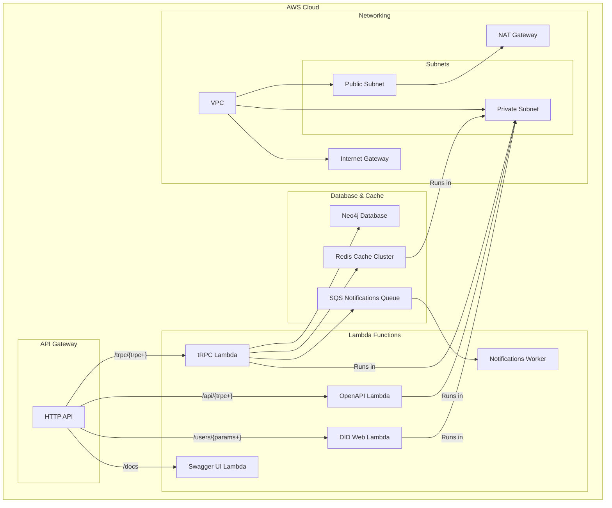
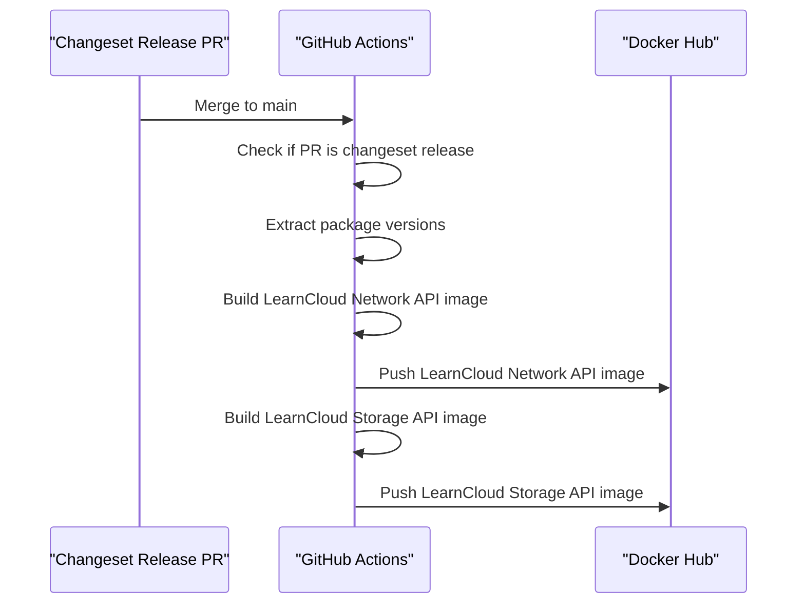

# Deployment Infrastructure

> Internal ops reference. Moved out of the public Contributing page (docs/development/contributing.md) in the 2026 docs migration.

LearnCard backend services are deployed as serverless applications on AWS, primarily using Lambda functions, API Gateway, and various supporting services.

### Serverless Configuration 

The services are configured using the Serverless Framework, which manages the AWS resources. Key features:

- **Functions**: Multiple Lambda functions serve different endpoints
- **VPC Configuration**: Services run in a private subnet with NAT gateway access
- **ElastiCache**: Redis cache for improved performance
- **Security Groups**: Control network access between components

### Environment Variables 

The deployment process uses numerous environment variables to configure the services securely. These include:

| Category      | Variables                                       | Purpose                       |
| ------------- | ----------------------------------------------- | ----------------------------- |
| AWS Access    | `AWS_ACCESS_KEY_ID`, `AWS_SECRET_ACCESS_KEY`    | AWS authentication            |
| Database      | `NEO4J_URI`, `NEO4J_USERNAME`, `NEO4J_PASSWORD` | Neo4j database access         |
| Redis         | `REDIS_HOST`, `REDIS_PORT`                      | Redis cache configuration     |
| Cryptographic | `SEED`, `LEARN_CLOUD_SEED`, `JWT_SIGNING_KEY`   | Secure key material           |
| Monitoring    | `SENTRY_DSN`, `DD_API_KEY`                      | Error tracking and monitoring |

### Docker Images 

LearnCard services are also published as Docker images to Docker Hub, making them easier to deploy in containerized environments.

#### Docker Release Process 

The Docker release process:

1. Triggered when a Changeset release PR is merged to main
2. Extracts version information from package.json files
3. Builds Docker images for Brain Service and LearnCloud Service
4. Tags images with semantic version numbers
5. Pushes images to Docker Hub

Available images:

- `welibrary/lcn-brain-service`: LearnCloud Network API container
- `welibrary/lcn-cloud-service`: LearnCloud Storage API container

### Maintenance 

The repository includes a "Maid Service" workflow that automatically cleans up the codebase when necessary. This workflow:

1. Runs after pushes to the main branch
2. Checks for unintended file changes that weren't committed
3. Creates an automated PR to clean up the worktree if necessary

This helps maintain a clean repository state, especially when automation scripts modify files.
