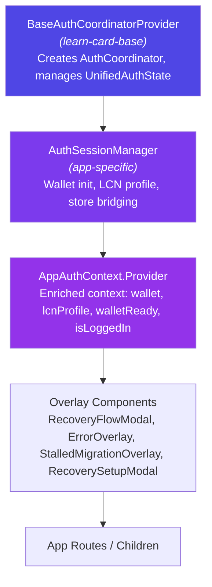

# AuthCoordinator — App Integration Guide

How to wire the `AuthCoordinator` into a LearnCard application. Covers the provider hierarchy, step-by-step integration, environment variables, legacy bridge, and extension points.

---

## Provider Hierarchy

Every app follows the same nesting pattern: a **base provider** (from `learn-card-base`) wrapping an **app-specific session manager** that enriches the context with wallet, LCN profile, and overlays.



### What each layer does

| Layer | Responsibility |
|---|---|
| **BaseAuthCoordinatorProvider** | Creates `AuthCoordinator` instance, calls `initialize()`, exposes `AuthCoordinatorContextValue` via `useAuthCoordinator()` |
| **AuthSessionManager** | Calls `useAuthCoordinatorAutoSetup()`, initializes wallet on `ready`, fetches LCN profile, bridges legacy stores |
| **AppAuthContext.Provider** | Merges base context with app-enriched values (`wallet`, `lcnProfile`, `walletReady`, etc.) |
| **Overlays** | Renders `RecoveryFlowModal` on `needs_recovery`, error overlay on `error`, stalled migration overlay, recovery setup prompt for new users |

---

## Step-by-Step Integration

### 1. Create the auth provider

```tsx
import { createFirebaseAuthProvider, firebaseAuthStore } from 'learn-card-base';
import { auth } from '../firebase/firebase';

const firebaseUser = firebaseAuthStore.use.currentUser();

const authProvider = useMemo(() => {
    return createFirebaseAuthProvider({
        getAuth: () => auth(),
        user: firebaseUser,
        onSignOut: async () => {
            const firebaseAuth = auth();
            await firebaseAuth.signOut();
            firebaseAuthStore.set.firebaseAuth(null);
            firebaseAuthStore.set.setFirebaseCurrentUser(null);
        },
    });
}, [firebaseUser]);
```

### 2. Create the key derivation strategy

```tsx
import { createSSSStrategy } from '@learncard/sss-key-manager';

const keyDerivation = useMemo(() => createSSSStrategy(), []);
```

### 3. Define callback props

```tsx
// DID derivation
const didFromPrivateKey = useCallback(async (privateKey: string): Promise<string> => {
    const lc = await getBespokeLearnCard(privateKey);
    return lc?.id.did() || '';
}, []);

// Cached private key (private-key-first path)
const getCachedPrivateKey = async (): Promise<string | null> => {
    try {
        return await getCurrentUserPrivateKey();
    } catch {
        return null;
    }
};

// Web3Auth key extraction (migration path)
const getWeb3AuthKey = useCallback(async (): Promise<string | null> => {
    if (!firebaseUser) return null;
    // ... Web3Auth SFA init + connect logic ...
    return privateKey || null;
}, [firebaseUser]);

// App-specific logout cleanup
const handleAppLogout = useCallback(async () => {
    walletStore.set.wallet(null);
    currentUserStore.set.currentUser(null);
    window.localStorage.clear();
    await clearAllIndexedDB();
    // ... other cleanup ...
}, []);
```

### 4. Wrap with BaseAuthCoordinatorProvider

```tsx
import { AuthCoordinatorProvider as BaseAuthCoordinatorProvider } from 'learn-card-base';

<BaseAuthCoordinatorProvider
    serverUrl={authConfig.serverUrl}
    keyDerivation={keyDerivation}
    authProvider={authProvider}
    didFromPrivateKey={didFromPrivateKey}
    getWeb3AuthKey={getWeb3AuthKey}
    getCachedPrivateKey={getCachedPrivateKey}
    onLogout={handleAppLogout}
    onDebugEvent={handleDebugEvent}
>
    <AuthSessionManager>{children}</AuthSessionManager>
</BaseAuthCoordinatorProvider>
```

### 5. Build AuthSessionManager

Inside `AuthSessionManager`, wire up auto-setup, wallet init, and LCN profile:

```tsx
const AuthSessionManager: React.FC<{ children: React.ReactNode }> = ({ children }) => {
    const coordinator = useBaseAuthCoordinator();
    const [wallet, setWallet] = useState<BespokeLearnCard | null>(null);

    // Auto-handle needs_setup and needs_migration
    useAuthCoordinatorAutoSetup(coordinator, {
        generatePrivateKey: generateEd25519PrivateKey,
        didFromPrivateKey,
        onReady: (privateKey, did) => { /* log */ },
        onError: (error) => { /* log */ },
    });

    // Initialize wallet when coordinator reaches 'ready'
    useEffect(() => {
        if (coordinator.state.status !== 'ready') return;
        const { privateKey } = coordinator.state;
        // ... create wallet, bridge stores, persist PK ...
        setWallet(newWallet);
    }, [coordinator.state]);

    // Fetch LCN profile when wallet is available
    useEffect(() => {
        if (wallet) fetchLCNProfile();
    }, [wallet]);

    return (
        <AppAuthContext.Provider value={{ ...coordinator, wallet, walletReady: !!wallet }}>
            {/* Overlay components */}
            {children}
        </AppAuthContext.Provider>
    );
};
```

### 6. Add overlay components

```tsx
{/* Recovery flow — shown when coordinator reaches needs_recovery */}
{coordinator.state.status === 'needs_recovery' && (
    <RecoveryFlowModal
        availableMethods={coordinator.state.recoveryMethods}
        onRecoverWithPasskey={...}
        onRecoverWithPhrase={...}
        onRecoverWithBackup={...}
        onCancel={coordinator.logout}
    />
)}

{/* Error overlay — shown when coordinator reaches error */}
{coordinator.state.status === 'error' && (
    <ErrorOverlay
        error={coordinator.state.error}
        onRetry={coordinator.retry}
        onLogout={coordinator.logout}
    />
)}

{/* Recovery setup prompt — shown for new users with no recovery methods */}
{showRecoverySetup && coordinator.state.status === 'ready' && (
    <RecoverySetupModal
        existingMethods={[]}
        onSetupPasskey={...}
        onGeneratePhrase={...}
        onSetupBackup={...}
        onClose={() => setShowRecoverySetup(false)}
    />
)}
```

---

## LCA vs Scouts Comparison

Both apps follow the same pattern but differ in feature scope:

| Feature | LearnCard App (LCA) | Scouts |
|---|---|---|
| **Recovery overlays** | RecoveryFlowModal + RecoverySetupModal | None (no recovery UI yet) |
| **Stalled migration overlay** | Yes (30s timeout) | No |
| **Debug events** | Full `authDebugEvents` system + widget | Console logging only |
| **Recovery setup prompt** | Yes (after first-time setup) | No |
| **Legacy `initLoading` bridge** | Yes (dual-signal with `useFirebase`) | Yes (simpler) |
| **LCN profile fetching** | Yes | Yes |
| **Web3Auth migration** | Yes (verifier: `learnCard-firebase-cyan-mainnet`) | Yes (verifier: `scoutPass-firebase-cyan-mainnet`) |
| **Push token sync** | Yes | Yes |

---

## Environment Variables

Set these in your `.env` file or deployment environment:

| Variable | Type | Default | Description |
|---|---|---|---|
| `REACT_APP_AUTH_PROVIDER` | `'firebase' \| 'supertokens' \| 'keycloak' \| 'oidc'` | `'firebase'` | Which auth provider to use |
| `REACT_APP_KEY_DERIVATION_PROVIDER` | `'sss' \| 'web3auth'` | `'sss'` | Which key derivation strategy |
| `REACT_APP_SSS_SERVER_URL` | `string` | `'http://localhost:5100/api'` | Server URL for key share operations |
| `REACT_APP_ENABLE_MIGRATION` | `'true' \| 'false'` | `'false'` | Whether Web3Auth → SSS migration is enabled |
| `REACT_APP_ENABLE_EMAIL_BACKUP_SHARE` | `'true' \| 'false'` | `'true'` | Whether to send a backup share to the user's email during key setup |

These are read by `getAuthConfig()` in `packages/learn-card-base/src/config/authConfig.ts`.

---

## Legacy Bridge

The apps have pre-existing auth state in Zustand stores (`authStore`, `currentUserStore`, `walletStore`). During the transition period, the coordinator bridges these:

### `initLoading` dual-signal system

```
initLoading = walletReady ? false : (legacyInitLoading || coordinatorLoading)
```

- **`coordinatorLoading`** — `true` when coordinator is in `authenticating`, `checking_key_status`, or `deriving_key`
- **`legacyInitLoading`** — `authStore.initLoading`, set by `useFirebase` login methods before the coordinator picks up

**Deprecation:** `legacyInitLoading` should be removed once all `useFirebase` login methods are migrated to trigger coordinator state instead of setting `authStore.initLoading`.

### Store bridging

When the coordinator reaches `ready` and the wallet initializes:

1. `walletStore.set.wallet(newWallet)` — so legacy code using `walletStore` still works
2. `currentUserStore.set.currentUser(...)` — bridges uid, email, phone, privateKey, baseColor
3. `setPlatformPrivateKey(privateKey)` — persists to secure storage for private-key-first path

---

## Adding a New Auth Provider

To support a new auth backend (e.g., Supertokens):

1. Implement the `AuthProvider` interface in a new file `auth-providers/createSupertokensAuthProvider.ts`:

```ts
import type { AuthProvider, AuthUser, AuthProviderType } from '../auth-coordinator/types';

interface SupertokensAuthProviderConfig {
    getSession: () => Promise<{ userId: string; accessToken: string } | null>;
    signOut: () => Promise<void>;
}

export function createSupertokensAuthProvider(config: SupertokensAuthProviderConfig): AuthProvider {
    return {
        async getIdToken(): Promise<string> {
            const session = await config.getSession();
            if (!session) throw new Error('No Supertokens session');
            return session.accessToken;
        },

        async getCurrentUser(): Promise<AuthUser | null> {
            const session = await config.getSession();
            if (!session) return null;
            return { id: session.userId, providerType: 'supertokens' };
        },

        getProviderType(): AuthProviderType {
            return 'supertokens';
        },

        async signOut(): Promise<void> {
            await config.signOut();
        },
    };
}
```

2. Export from `auth-providers/index.ts`
3. Use in your app's `AuthCoordinatorProvider` the same way as `createFirebaseAuthProvider`

The coordinator itself requires **no changes** — it only depends on the `AuthProvider` interface.

---

## Adding a New Key Derivation Strategy

To implement a non-SSS key derivation backend:

1. Implement `KeyDerivationStrategy` from `@learncard/sss-key-manager`:

```ts
import type { KeyDerivationStrategy } from '@learncard/sss-key-manager';

export function createCustomStrategy(): KeyDerivationStrategy {
    return {
        name: 'custom',

        async hasLocalKey(): Promise<boolean> { /* ... */ },
        async getLocalKey(): Promise<string | null> { /* ... */ },
        async storeLocalKey(key: string): Promise<void> { /* ... */ },
        async clearLocalKeys(): Promise<void> { /* ... */ },

        async splitKey(privateKey: string): Promise<{ localKey: string; remoteKey: string }> {
            // Your key-splitting logic
        },

        async reconstructKey(localKey: string, remoteKey: string): Promise<string> {
            // Your key-reconstruction logic
        },

        async verifyKeys(localKey, remoteKey, expectedDid, didFromPrivateKey): Promise<boolean> {
            // Optional health check
        },
    };
}
```

2. Pass it as `keyDerivation` prop to `BaseAuthCoordinatorProvider`

The coordinator's state machine works identically regardless of the strategy — it only calls the `KeyDerivationStrategy` interface methods.

---

## `useAuthCoordinatorAutoSetup` Hook

This hook watches the coordinator state and automatically handles two cases:

- **`needs_setup`** — Generates a new Ed25519 private key, derives its DID, and calls `coordinator.setupNewKey()`
- **`needs_migration`** — Takes the `web3AuthKey` from state, derives its DID, and calls `coordinator.migrate()`

### Config

```ts
useAuthCoordinatorAutoSetup(coordinator, {
    generatePrivateKey: generateEd25519PrivateKey,
    didFromPrivateKey: async (pk) => { /* ... */ },
    onReady: (privateKey, did) => { /* ... */ },
    onError: (error) => { /* ... */ },
});
```

### Internal safeguards

- Uses `handlingRef` to prevent double-handling the same state
- Uses `configRef` / `actionsRef` to avoid stale closures when callbacks change identity between renders
- Only fires when `coordinator.state.status` actually changes

---

## See Also

- [README.md](./README.md) — Core state machine reference + diagrams
- [RECOVERY.md](./RECOVERY.md) — Recovery methods, share lifecycle, hook APIs
