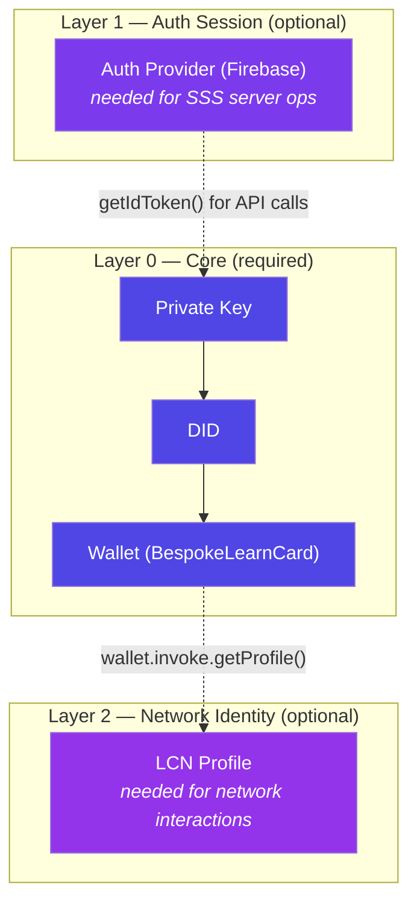
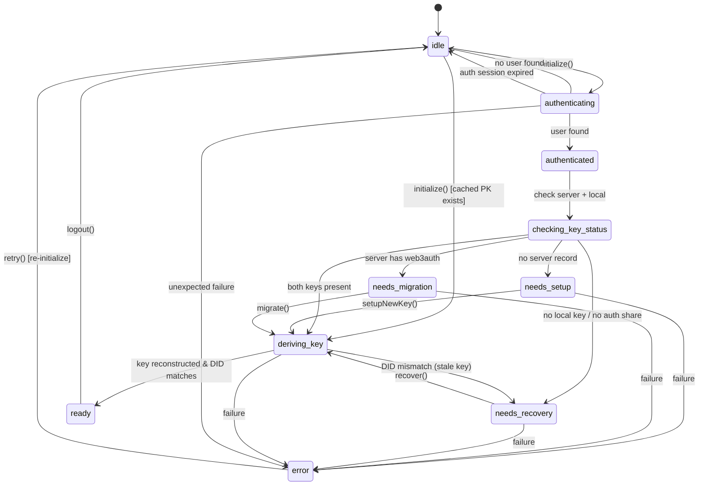
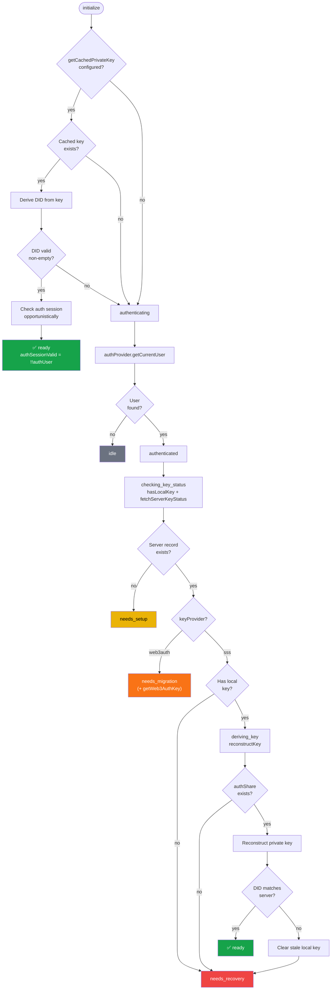
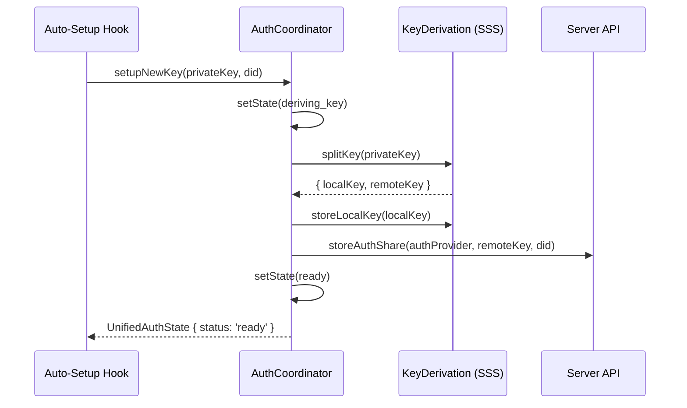
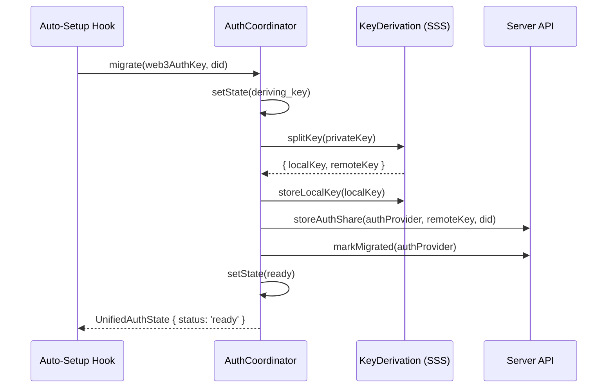
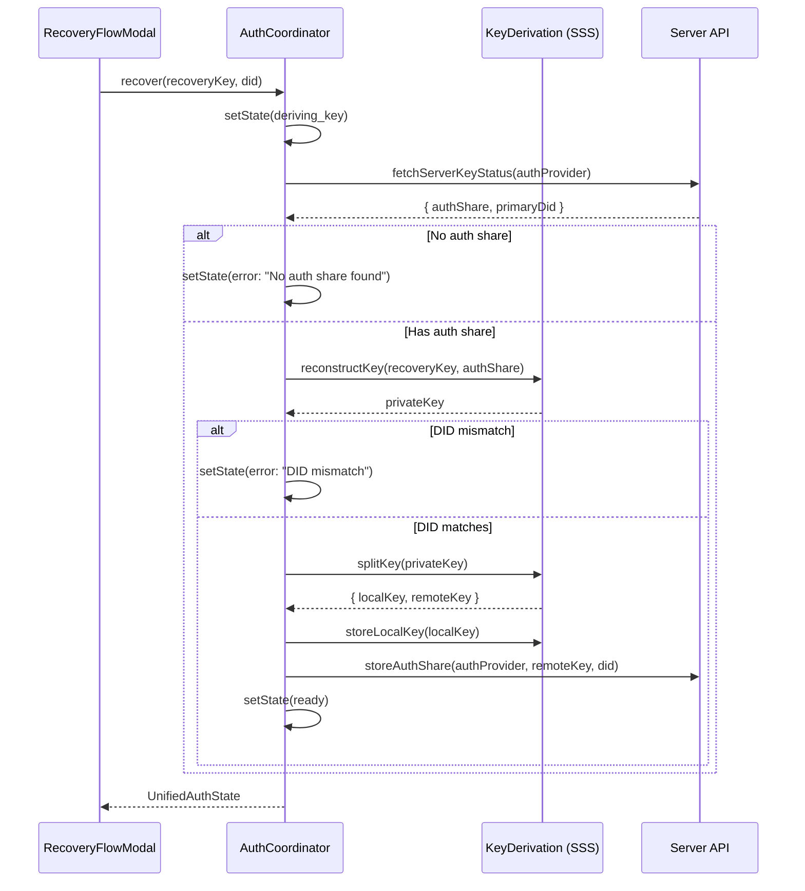
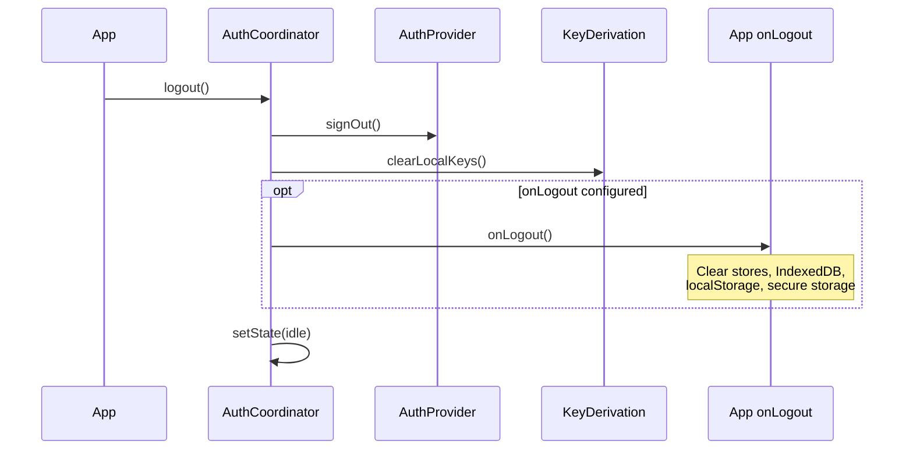
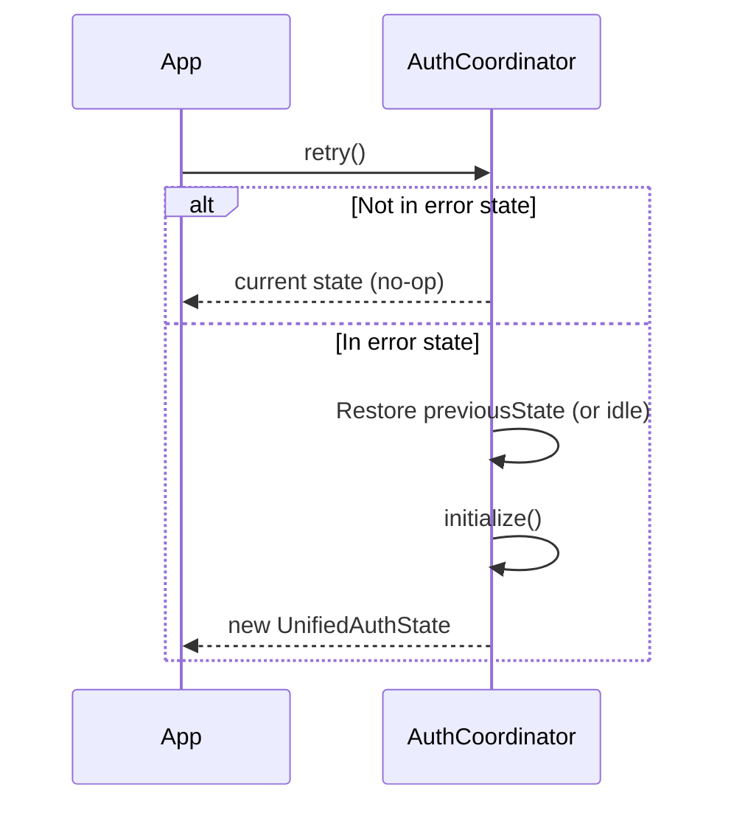

# AuthCoordinator

Unified state machine that coordinates **authentication** and **key derivation** across LearnCard applications. It replaces the previous ad-hoc Web3Auth flow with a composable, testable, provider-agnostic architecture.

## Design Goals

- **Provider-agnostic** — Works with any auth provider (Firebase, Supertokens, OIDC) and any key derivation strategy (SSS, Web3Auth).
- **Testable** — Pure state machine with injectable dependencies; 35+ unit tests cover every path.
- **Composable** — Base coordinator lives in `learn-card-base`; each app wraps it with app-specific logic (wallet init, LCN profile, overlays).
- **Private-key-first** — Can reach `ready` from a cached private key without an active auth session, enabling offline-first UX.

---

## Architecture: 3-Layer Auth Model

Each app's auth system is built from three independent layers:



**Layer 0** is the only hard requirement. A user with a cached private key can use the wallet even if their Firebase session has expired. Layers 1 and 2 are checked opportunistically and tracked via `authSessionValid` and `lcnProfile`.

---

## State Machine

The coordinator manages 10 possible states. Every public method transitions between these states and fires `onStateChange` for each transition.

### States

| Status | Description | Key Fields |
|---|---|---|
| `idle` | No active auth session, no cached key | — |
| `authenticating` | Checking auth provider for current user | — |
| `authenticated` | Auth provider confirmed a user | `authUser` |
| `checking_key_status` | Querying server for key record + local key | — |
| `needs_setup` | New user, no server record exists | `authUser` |
| `needs_migration` | Server has `web3auth` key, must migrate to SSS | `authUser`, `web3AuthKey?` |
| `needs_recovery` | Server has key but local share missing/stale | `authUser`, `recoveryMethods[]` |
| `deriving_key` | Reconstructing or splitting private key | — |
| `ready` | Private key available, wallet can initialize | `authUser?`, `did`, `privateKey`, `authSessionValid` |
| `error` | Something failed | `error`, `canRetry`, `previousState?` |

### State Diagram



---

## `initialize()` — Decision Flowchart

This is the primary entry point. It runs automatically when the `AuthCoordinatorProvider` mounts.



---

## Method Sequence Diagrams

### `setupNewKey(privateKey, did)`

Called by `useAuthCoordinatorAutoSetup` when state is `needs_setup`.



### `migrate(privateKey, did)`

Called by `useAuthCoordinatorAutoSetup` when state is `needs_migration`.



### `recover(recoveryKey, did)`

Called by app-level recovery UI when state is `needs_recovery`.



### `logout()`



### `retry()`



---

## Configuration Reference

### `AuthCoordinatorConfig`

| Field | Type | Required | Description |
|---|---|---|---|
| `authProvider` | `AuthProvider` | **yes** | Auth session manager (Firebase, Supertokens, etc.) |
| `keyDerivation` | `KeyDerivationStrategy` | **yes** | Key split/reconstruct implementation (SSS) |
| `api` | `AuthCoordinatorApi` | **yes** | Server API for key share operations |
| `onStateChange` | `(state) => void` | no | Callback fired on every state transition |
| `didFromPrivateKey` | `(pk) => Promise<string>` | no | Derives DID from private key; enables DID health checks |
| `getWeb3AuthKey` | `() => Promise<string \| null>` | no | Extracts legacy Web3Auth key for migration |
| `getCachedPrivateKey` | `() => Promise<string \| null>` | no | Enables private-key-first initialization path |
| `onLogout` | `() => Promise<void>` | no | App-specific cleanup after coordinator logout |

### `AuthCoordinatorApi`

| Method | Description |
|---|---|
| `fetchServerKeyStatus(authProvider)` | Returns `ServerKeyStatus`: exists, keyProvider, primaryDid, recoveryMethods, authShare |
| `storeAuthShare(authProvider, share, did)` | Stores the remote key component on the server |
| `markMigrated(authProvider)` | Marks the user as migrated from Web3Auth to SSS |

Default implementation: `createAuthCoordinatorApi(serverUrl)` — uses `fetch` with Bearer token auth against the SSS server endpoints.

### `KeyDerivationStrategy`

| Method | Description |
|---|---|
| `hasLocalKey()` | Check if device share exists |
| `getLocalKey()` | Retrieve device share |
| `storeLocalKey(key)` | Persist device share |
| `clearLocalKeys()` | Delete all local shares |
| `splitKey(privateKey)` | Split into `{ localKey, remoteKey }` |
| `reconstructKey(local, remote)` | Reconstruct private key from shares |
| `verifyKeys?(local, remote, did, didFn)` | Optional health check |

Default implementation: `createSSSStrategy()` from `@learncard/sss-key-manager`.

### `AuthProvider`

| Method | Description |
|---|---|
| `getIdToken()` | Returns a Bearer token for API calls |
| `getCurrentUser()` | Returns `AuthUser \| null` |
| `getProviderType()` | Returns `'firebase' \| 'supertokens' \| 'keycloak' \| 'oidc'` |
| `signOut()` | Signs the user out |

Default implementation: `createFirebaseAuthProvider({ getAuth, user, onSignOut })`.

---

## Server API Contract

`createAuthCoordinatorApi(serverUrl)` communicates with these endpoints:

### `POST /keys/auth-share` — Fetch key status

**Request:**
```json
{ "authToken": "<idToken>", "providerType": "firebase" }
```

**Response (200):**
```json
{
  "exists": true,
  "keyProvider": "sss",
  "primaryDid": "did:key:z...",
  "recoveryMethods": [{ "type": "password", "createdAt": "..." }],
  "authShare": { "encryptedData": "...", "encryptedDek": "", "iv": "" }
}
```

**Response (404):** Record not found → `{ exists: false }`

### `PUT /keys/auth-share` — Store/update auth share

**Request:**
```json
{
  "authToken": "<idToken>",
  "providerType": "firebase",
  "authShare": { "encryptedData": "<share>", "encryptedDek": "", "iv": "" },
  "primaryDid": "did:key:z...",
  "securityLevel": "basic"
}
```

### `POST /keys/migrate` — Mark migration complete

**Request:**
```json
{ "authToken": "<idToken>", "providerType": "firebase" }
```

---

## Error Handling

Errors are classified into two categories:

1. **Auth session gone** (expired token, no Firebase user) → returns to `idle`, not `error`. This is a normal state — the user simply isn't logged in.

2. **Unexpected failure** (network error, split failure, DID mismatch) → enters `error` state with:
   - `error`: human-readable message
   - `canRetry`: always `true` currently
   - `previousState`: the state before the error, enabling `retry()` to restore and re-initialize

---

## Testing

Unit tests are in `__tests__/AuthCoordinator.test.ts` (35 tests covering all paths).

```bash
# Run tests
pnpm --filter learn-card-base test

# Run in watch mode
pnpm --filter learn-card-base test:watch
```

Tests use mock factories for `AuthProvider`, `KeyDerivationStrategy`, and `AuthCoordinatorApi` — see the test file for patterns.

---

## File Map

```
packages/learn-card-base/src/auth-coordinator/
├── AuthCoordinator.ts           — Core state machine class
├── AuthCoordinatorProvider.tsx   — Base React provider + context
├── createAuthCoordinatorApi.ts   — Default server API factory
├── useAuthCoordinatorAutoSetup.ts — Auto handles needs_setup & needs_migration
├── types.ts                      — Type definitions (re-exports from sss-key-manager)
├── index.ts                      — Public exports
├── README.md                     — This file
├── INTEGRATION.md                — App integration guide
├── RECOVERY.md                   — Recovery system guide
└── __tests__/
    └── AuthCoordinator.test.ts   — Unit tests
```

## See Also

- [INTEGRATION.md](./INTEGRATION.md) — How to wire the coordinator into an app
- [RECOVERY.md](./RECOVERY.md) — Recovery methods, share lifecycle, hook APIs
