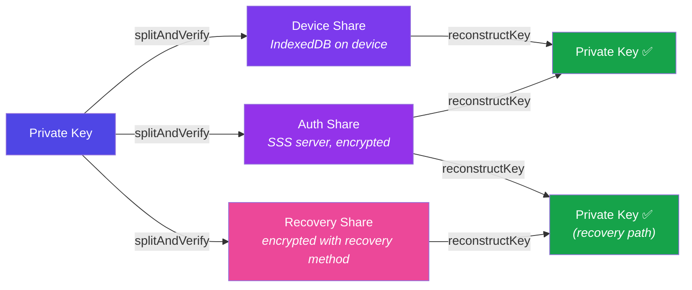
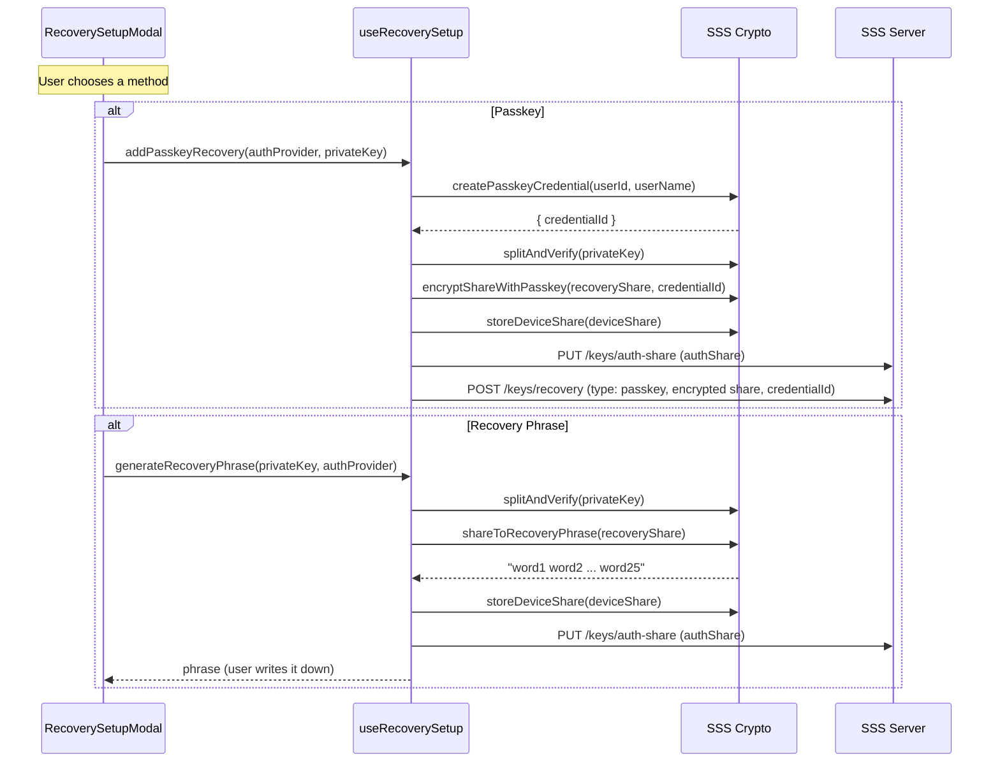
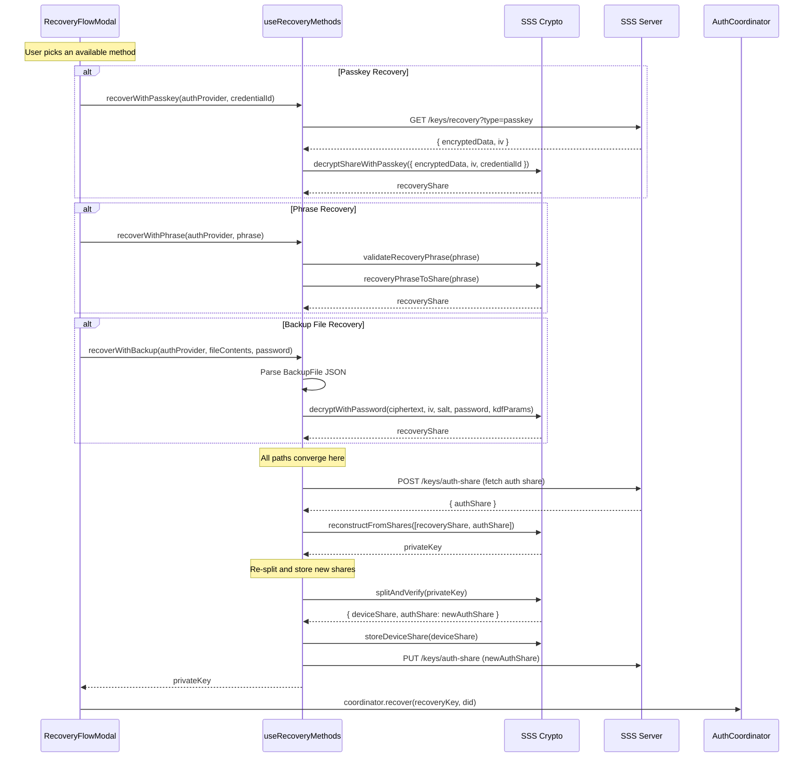

# AuthCoordinator — Recovery System Guide

How the recovery system works: share lifecycle, recovery methods, setup and execution flows, and hook APIs.

---

## SSS Share Model

Every private key is split into **3 shares** using Shamir's Secret Sharing (2-of-3 threshold):



### Normal operation

The coordinator reconstructs the private key from **device share + auth share**. No recovery share is involved.

### Recovery

When the device share is lost (new device, cleared storage), the private key is reconstructed from **recovery share + auth share**. After reconstruction, new shares are generated and the device share is stored on the new device.

### Share preservation on logout

`clearAllIndexedDB()` deletes all IndexedDB databases **except** `lcb-sss-keys`, which stores the device share. This means the user keeps their device share across logouts, avoiding unnecessary recovery prompts on re-login.

---

## Recovery Methods

Three methods are supported. Each encrypts the **recovery share** differently.

| Method | Storage | User Input | Encryption |
|---|---|---|---|
| **Passkey** | Server (encrypted recovery share) | Biometric/FIDO2 auth | WebAuthn PRF → AES-GCM |
| **Phrase** | User writes down 25 words | 25-word mnemonic | Direct encoding (`shareToRecoveryPhrase`) |
| **Backup File** | User downloads `.json` file | File + password | `encryptWithPassword` (Argon2id KDF → AES-GCM) |

### Server endpoints for recovery

| Endpoint | Method | Description |
|---|---|---|
| `GET /keys/recovery?type=<type>&providerType=<p>&authToken=<t>` | GET | Fetch encrypted recovery share |
| `POST /keys/recovery` | POST | Store new encrypted recovery share |

---

## Recovery Setup Flow

After a new user completes first-time setup (`needs_setup` → `ready`), the LCA app prompts them to configure at least one recovery method via `RecoverySetupModal`.

### Detection logic (LCA `AuthSessionManager`)

1. A `sawNeedsSetupRef` tracks whether the coordinator passed through `needs_setup`
2. Once the wallet initializes (`ready` + wallet created), check:
   - Did the coordinator pass through `needs_setup`?
   - Does the user have 0 recovery methods?
3. If both true → show `RecoverySetupModal`

### `useRecoverySetup` hook

Located at `packages/learn-card-base/src/hooks/useRecoverySetup.ts`.



### `useRecoverySetup` API

```ts
const {
    getRecoveryMethods,      // (authProvider) => Promise<RecoveryMethodInfo[]>
    addPasskeyRecovery,      // (authProvider, privateKey) => Promise<string> (credentialId)
    generateRecoveryPhrase,  // (privateKey, authProvider?) => Promise<string> (25 words)
    exportBackup,            // (privateKey, password, did) => Promise<BackupFile>
} = useRecoverySetup({ serverUrl });
```

---

## Recovery Execution Flow

When the coordinator reaches `needs_recovery` (device share missing or stale), the app shows `RecoveryFlowModal`.

### `useRecoveryMethods` hook

Located at `packages/learn-card-base/src/hooks/useRecoveryMethods.ts`.



### `useRecoveryMethods` API

```ts
const {
    recoverWithPasskey,   // (authProvider, credentialId) => Promise<string>
    recoverWithPhrase,    // (authProvider, phrase) => Promise<string>
    recoverWithBackup,    // (authProvider, fileContents, password) => Promise<string>
    connecting,           // boolean — loading state
    error,                // string | null — last error
} = useRecoveryMethods({ serverUrl });
```

---

## Share Lifecycle Diagram

Complete lifecycle of SSS shares across key operations:

```mermaid
graph TD
    subgraph "First-Time Setup"
        NEW_KEY["generateEd25519PrivateKey()"] --> SPLIT1["splitAndVerify(privateKey)"]
        SPLIT1 --> STORE_DEV1["storeDeviceShare(deviceShare)<br/>→ IndexedDB: lcb-sss-keys"]
        SPLIT1 --> STORE_AUTH1["storeAuthShare(authShare)<br/>→ SSS Server"]
    end

    subgraph "Normal Login"
        GET_DEV["getDeviceShare()<br/>← IndexedDB"] --> RECON["reconstructKey(device, auth)"]
        GET_AUTH["fetchServerKeyStatus()<br/>← SSS Server"] --> RECON
        RECON --> VERIFY["DID match check"]
        VERIFY -->|match| READY["✅ ready"]
        VERIFY -->|mismatch| RECOVERY_NEEDED["needs_recovery"]
    end

    subgraph "Recovery"
        DECRYPT["Decrypt recovery share<br/>(passkey/phrase/backup)"]
        DECRYPT --> RECON2["reconstructFromShares(recovery, auth)"]
        RECON2 --> RESPLIT["splitAndVerify(privateKey)<br/><i>Generate fresh shares</i>"]
        RESPLIT --> STORE_DEV2["storeDeviceShare(newDevice)"]
        RESPLIT --> STORE_AUTH2["updateAuthShare(newAuth)"]
    end

    subgraph "Recovery Setup"
        SPLIT_RS["splitAndVerify(privateKey)"] --> ENCRYPT["Encrypt recoveryShare<br/>(passkey/phrase/backup)"]
        ENCRYPT --> STORE_RS["POST /keys/recovery<br/>→ SSS Server"]
        SPLIT_RS --> UPDATE_DEV["storeDeviceShare(deviceShare)"]
        SPLIT_RS --> UPDATE_AUTH["PUT /keys/auth-share(authShare)"]
    end

    subgraph "Logout (trusted device)"
        SIGNOUT["authProvider.signOut()"]
        CLEAR_IDB["clearAllIndexedDB()<br/><i>Preserves lcb-sss-keys</i>"]
        CLEAR_STORES["Clear app stores, localStorage,<br/>sessionStorage, secure storage"]
        NOTE_SHARE["Device share persists in IDB<br/><i>Enables fast re-login</i>"]
    end

    subgraph "Forget Device (public computer)"
        FORGET["forgetDevice()"]
        CLEAR_LOCAL["clearLocalKeys()<br/><i>Clears device share from IDB</i>"]
        FORGET --> CLEAR_LOCAL
    end

    style READY fill:#16a34a,color:#fff
    style RECOVERY_NEEDED fill:#ef4444,color:#fff
```



### Key invariant

After **every** recovery, the shares are **re-split** and **re-stored**. This means:
- The device share on the new device is fresh (not the old one)
- The auth share on the server is fresh
- Old shares are effectively invalidated

---

## RecoveryFlowModal

**Location:** `apps/learn-card-app/src/components/recovery/RecoveryFlowModal.tsx`

### When shown

The modal is rendered when `coordinator.state.status === 'needs_recovery'`.

### Method availability

Each method is only shown as "Available" if the server has a recovery record of that type in the user's `recoveryMethods` array. This prevents showing methods that would fail at runtime:

```ts
const methods = [
    { id: 'passkey', available: hasMethod('passkey') && webAuthnSupported },
    { id: 'phrase', available: hasMethod('phrase') },
    { id: 'backup', available: hasMethod('backup') },
];
```

### User flow

1. User sees list of available recovery methods
2. Selects one → enters credentials (passkey auth, phrase, or file + password)
3. On success → coordinator transitions to `ready` → wallet initializes
4. On failure → error shown inline, user can try again or pick another method
5. Cancel → calls `coordinator.logout()` → returns to `idle`

---

## RecoverySetupModal

**Location:** `apps/learn-card-app/src/components/recovery/RecoverySetupModal.tsx`

### When shown

Shown as a **dismissible prompt** for first-time users who:
1. Went through `needs_setup` → `ready` (tracked via `sawNeedsSetupRef`)
2. Have **zero** configured recovery methods

### User flow

1. User sees options: Passkey, Recovery Phrase, Backup File
2. Can configure one or more methods
3. Can dismiss without configuring (prompt disappears, wallet still works)

---

## Crypto Dependencies

All cryptographic operations come from `@learncard/sss-key-manager`:

| Function | Package Path | Description |
|---|---|---|
| `splitAndVerify` | `atomic-operations.ts` | Split private key into 3 shares with verification |
| `reconstructFromShares` | `sss.ts` | Reconstruct from any 2 shares |
| `encryptWithPassword` | `crypto.ts` | Argon2id KDF → AES-GCM encryption |
| `decryptWithPassword` | `crypto.ts` | Reverse of above |
| `createPasskeyCredential` | `passkey.ts` | WebAuthn credential creation |
| `encryptShareWithPasskey` | `passkey.ts` | PRF-derived key → AES-GCM |
| `decryptShareWithPasskey` | `passkey.ts` | Reverse of above |
| `shareToRecoveryPhrase` | `recovery-phrase.ts` | Encode share as 25-word mnemonic |
| `recoveryPhraseToShare` | `recovery-phrase.ts` | Decode mnemonic back to share |
| `storeDeviceShare` | `storage.ts` | Persist to IndexedDB (`lcb-sss-keys`) |
| `getDeviceShare` | `storage.ts` | Retrieve from IndexedDB |

---

## See Also

- [README.md](./README.md) — Core state machine reference + diagrams
- [INTEGRATION.md](./INTEGRATION.md) — How to wire the coordinator into an app
