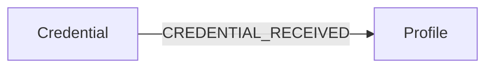
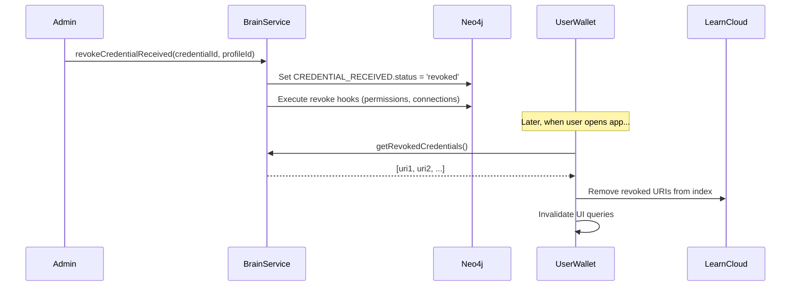
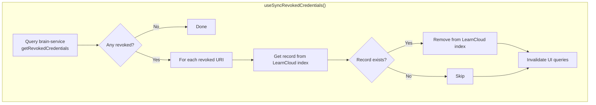
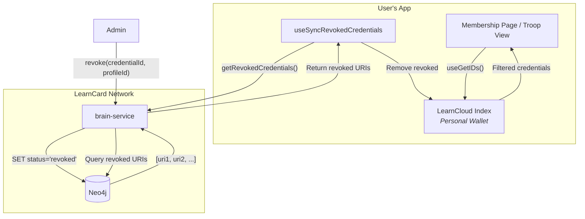

# PR: Credential Revocation System

## Overview

This PR implements a complete credential revocation system for the LearnCard platform. When a credential is revoked (e.g., a scout is removed from a troop), the system:

1. Marks the credential as revoked in Neo4j (not deleted, for audit purposes)
2. Filters revoked credentials from all recipient/member queries
3. Syncs the user's local wallet to remove revoked credentials from their view
4. Reverses any permissions or connections granted via claim hooks

---

## Key Changes

### 1. New `status` Property on `CREDENTIAL_RECEIVED` Relationship

The revocation state is tracked via a `status` property on the Neo4j `CREDENTIAL_RECEIVED` relationship:



| Property | Type | Description |
|----------|------|-------------|
| `status` | string | `null` (claimed), `'pending'` (not yet accepted), `'revoked'` |
| `date` | datetime | When the credential was received/claimed |
| `revokedAt` | datetime | When the credential was revoked (if applicable) |

**Status Values:**
- `null` → Active/claimed credential
- `'pending'` → Sent but not yet accepted
- `'revoked'` → Credential has been revoked

---

### 2. Revocation Flow

When an admin revokes a credential, the following happens:



**Revoke Hooks** (cleanup operations):
| Hook | Purpose |
|------|---------|
| `processPermissionsRevokeHooks` | Removes HAS_ROLE relationships granted via GRANT_PERMISSIONS claim hooks |
| `processAutoConnectRevokeHooks` | Removes AUTO_CONNECT_RECIPIENT relationships |
| `processAdminRevokeHooks` | Removes admin role relationships granted via ADD_ADMIN claim hooks |
| `processConnectionRevoke` | Removes CONNECTED_WITH relationships sourced from the boost |

---

### 3. Updated Queries & Filters

All recipient queries now filter out revoked credentials:

```cypher
MATCH (c:Credential)-[r:CREDENTIAL_RECEIVED]->(p:Profile)
WHERE c.boostId = $boostId
  AND (r.status IS NULL OR r.status <> 'revoked')
  AND ($includeUnacceptedBoosts = true OR r.status IS NULL)
RETURN p
```

**Query Behavior:**

| Query | `includeUnacceptedBoosts=false` (default) | `includeUnacceptedBoosts=true` |
|-------|-------------------------------------------|--------------------------------|
| `getBoostRecipients` | Only claimed credentials | Claimed + pending |
| `countBoostRecipients` | Count of claimed only | Count of claimed + pending |

> **Note:** Revoked credentials are **always** filtered out regardless of `includeUnacceptedBoosts`.

**Files Modified:**
- `brain-service/src/accesslayer/credential/read.ts` - Added filtering for `status <> 'revoked'`
- `brain-service/src/accesslayer/boost/relationships/read.ts` - Updated `getBoostRecipients`

---

### 4. New `getRevokedCredentials` Endpoint

A new backend endpoint returns revoked credential URIs for the authenticated user:

```typescript
// brain-service/src/routes/credentials.ts
getRevokedCredentials: profileRoute
    .input(z.object({}).default({}))
    .output(z.array(z.string()))
    .query(async ({ ctx }) => {
        return getRevokedCredentialUrisForProfile(ctx.domain, ctx.user.profile);
    });
```

**Exposed in Network Plugin:**
```typescript
// packages/plugins/learn-card-network/src/types.ts
getRevokedCredentials: () => Promise<string[]>;
```

---

### 5. Frontend Sync: `useSyncRevokedCredentials` Hook

This hook syncs the user's local wallet with the network's revocation state:



**Implementation** (`packages/learn-card-base/src/react-query/queries/vcQueries.ts`):

```typescript
export const useSyncRevokedCredentials = (enabled = true) => {
    // 1. Fetch revoked credential URIs from brain-service
    const revokedUris = await wallet.invoke.getRevokedCredentials();
    
    // 2. For each revoked URI, remove from learn-cloud index
    for (const uri of revokedUris) {
        const records = await wallet.index.LearnCloud.get({ uri });
        if (records?.length > 0) {
            await wallet.index.LearnCloud.remove?.(records[0]!.id);
        }
    }
    
    // 3. Invalidate queries to refresh UI
    queryClient.invalidateQueries({ queryKey: ['useGetIDs'] });
    queryClient.invalidateQueries({ queryKey: ['useGetCredentials'] });
    queryClient.invalidateQueries({ queryKey: ['currentUserTroopIds'] });
    queryClient.invalidateQueries({ queryKey: ['useGetCurrentUserTroopIdsResolved'] });
};
```

**Why is this needed?**

The brain-service cannot directly modify the user's LearnCloud index (it's user-authenticated). The frontend must sync by:
1. Querying which credentials are revoked (via `getRevokedCredentials`)
2. Removing them from the personal wallet index

---

### 6. Integration in Apps

Add to top-level component (e.g., `AppRouter.tsx`):

```typescript
import { useSyncRevokedCredentials } from 'learn-card-base';

function AppRouter() {
    // ... other hooks
    useSyncRevokedCredentials(enablePrefetch);  // Add this
    // ...
}
```

The hook runs on mount and window focus, with a 30-second stale time.

---

## Architecture Diagram



---

## Files Changed Summary

| File | Change |
|------|--------|
| `brain-service/src/accesslayer/credential/read.ts` | Filter revoked from queries |
| `brain-service/src/routes/credentials.ts` | `getRevokedCredentials` endpoint |
| `brain-service/src/helpers/revoke-hooks.helpers.ts` | Revocation cleanup hooks |
| `packages/plugins/learn-card-network/src/types.ts` | `getRevokedCredentials` method type |
| `packages/plugins/learn-card-network/src/plugin.ts` | `getRevokedCredentials` implementation |
| `packages/learn-card-base/src/react-query/queries/vcQueries.ts` | `useSyncRevokedCredentials` hook |
| `apps/scouts/src/AppRouter.tsx` | Hook integration |

---

## Testing

```bash
# Run revocation tests
cd services/learn-card-network/brain-service
SEED=<64-char-hex> pnpm test -- revoke-credential.spec.ts
```
