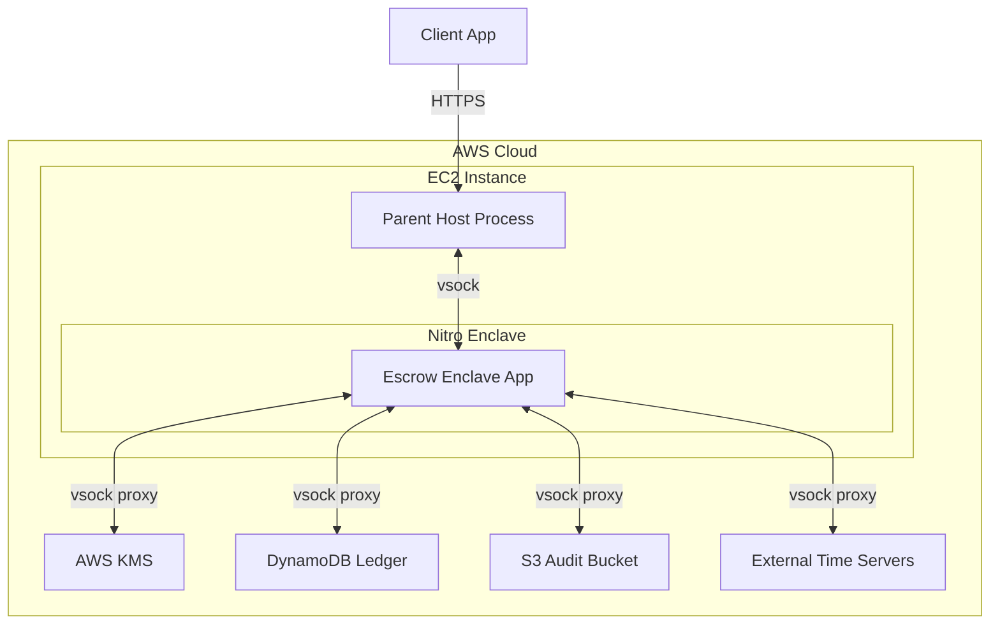

# Security Review Packet: Escrow Enclave

This document provides a comprehensive security overview of the Escrow Enclave system, detailing its trust boundaries, threat model, cryptographic guarantees, and known limitations. It is intended for external security reviewers and internal auditors.

## System Overview and Trust Boundaries

The Escrow Enclave is a hardware-isolated environment (AWS Nitro Enclaves) responsible for securely holding and releasing encrypted account recovery keys. It enforces a strict release policy (7-day delay or PIN) that cannot be bypassed by the host operating system, the parent application (`lca-api`), or human operators.



**Trust Boundaries:**

- **Trusted:** The measured enclave code (`services/escrow-enclave-app/`), AWS Nitro hypervisor isolation, AWS KMS (for key sealing), and pinned external time authorities (Roughtime).
- **Untrusted:** The parent EC2 host (`services/escrow-enclave-host/`), the `lca-api` service, the network, and human operators (including database administrators).

## Assets

1. **Escrow Private Key:** An ECDSA P-256 private key generated inside the enclave at first boot. It never leaves the enclave in plaintext. It is sealed via AWS KMS and stored by the parent.
2. **User Recovery Pieces:** Encrypted blobs submitted by clients. The enclave decrypts these only when the release policy is satisfied.
3. **PIN Budgets:** The remaining number of PIN attempts (max 10) for a given enrollment.
4. **Ledger State:** The history of holds, cancellations, and releases, ensuring a hold cannot be replayed or a PIN budget bypassed.

## Adversaries

- **Compromised Host/Parent:** Can drop, delay, or reorder messages. Can deny service by refusing to persist data or route traffic. Cannot read enclave memory or forge enclave signatures.
- **Compromised `lca-api`:** Can submit malicious requests or attempt to brute-force PINs. Constrained by the enclave's PIN budget and cryptographic verification.
- **Malicious Operator / Key Admin:** Can delete infrastructure or modify IAM policies. A key admin with MFA can theoretically rewrite the KMS key policy (see Residual Risk below).
- **Network Attacker:** Can observe or tamper with traffic between the client and the parent, or the parent and external services. Mitigated by TLS and enclave-verified signatures.
- **Malicious Client:** Can submit malformed requests or attempt to exploit parsing vulnerabilities. Mitigated by strict input validation and memory-safe Rust code.

## Design Decisions

- **D1 (Instance Size):** The enclave requires an `m6i.xlarge` instance. AWS requires at least 2 vCPUs for the parent host, so a 2-vCPU enclave necessitates a 4-vCPU parent instance.
- **D2 (Time Sources):** The enclave clock is host-influenced and untrusted. Time evidence must come from ≥2 independent signed sources (Roughtime) checked inside the enclave. Non-overlapping intervals fail closed.
- **D3 (Rollback Detection):** The anti-replay ledger provides rollback _detection_, not prevention. A fresh-booted enclave cannot know the true head (Trust On First Use). Strict prevention requires quorum replicas, which is deferred.
- **D4 (KMS Recipient Flow):** The enclave generates a boot-time RSA-2048 keypair for the KMS recipient. KMS decrypts the sealed escrow key using this recipient key, returning CMS EnvelopedData which the enclave unwraps.
- **D7 (KMS Key Policy):** The KMS key policy uses one statement per released measurement tuple. It requires an exact match on PCR0, PCR1, and PCR2 simultaneously to prevent cross-combination of measurements.
- **D10 (Key Admin Residual Risk):** An MFA-authenticated key admin can theoretically rewrite the KMS key policy to remove attestation gates. This residual risk is mitigated by mandatory two-person PR review and CloudTrail alarms, rather than an immutable key policy.
- **D11 (RSA/Marvin Rationale):** The `rsa` crate has a known timing side-channel (Marvin). This is accepted because the CMS blob only arrives inside the enclave's own TLS session to KMS, meaning the host cannot submit chosen ciphertexts.
- **D12 (Software Mode Blocked):** The client guard (`getEscrowStrategyConfig` in `packages/learn-card-base/src/config/authConfig.ts`) downgrades `software` mode to `off` for production tenants (`learncard`, `vetpass`, `scoutpass`) whenever the app was built in a Vite production-mode build (`IS_PRODUCTION`, i.e. `mode === 'production'`). Staging deployments are production-mode builds too — `apps/learn-card-app`'s `build` script runs `vite build` under `STAGE=staging`, and only `STAGE` selects the tenant/config overlay, not the Vite mode — so staging is covered by the same guard; only a local dev (non-production-mode) build can select software mode. Independently, the enclave binary enforces this server-side: `--emulate` (software mode) is feature-gated behind `fake-nsm`/`fake-kms`/`fake-time`/`fake-ledger`, which a production `--features nitro,kms` build excludes, so that compiled binary refuses `--emulate` before binding.
- **D13 (Ledger Design):** The ledger uses one bounded chain per enrollment epoch. PIN reservations consume an attempt before verification. Readback does not prove durable storage, as a malicious parent can retain signed bytes only in RAM. Time intervals describe signed processing events, not an authenticated upper bound on receipt time.
- **D14 (Release Replay Refused & Enrollment Boundary):** Release replay is explicitly refused after a `Released` state is observed. A crash or lost response after append but before returning ciphertext burns the hold. Additionally, current enrollment is a required trust boundary: the production enclave currently wires in `UnavailableEnrollment`, so every mutating operation fails closed until an authenticated, fresh enrollment source is integrated.
- **D15 (Cancel-Link Token Primitive):** Cancel-link tokens (`services/learn-card-network/lca-api/src/helpers/escrowCancelToken.ts`) are 256-bit random values stored as SHA-256 hashes and compared in constant time — the same primitive as resume tokens. They are single-use and valid only while the hold is `pending`. An HMAC was considered and rejected: the token is random and never derived from other data, so a keyed hash would add no security over a plain hash of a high-entropy secret.

## Guarantees vs. Non-Guarantees

We are scrupulously honest about the limits of this system. The following table outlines what the system enforces versus what it only detects or relies on operational controls for.

| Threat                          | Prevention / Detection Boundary                                                                                                                                                                                                                                                                                  | Citation                                                                                 |
| :------------------------------ | :--------------------------------------------------------------------------------------------------------------------------------------------------------------------------------------------------------------------------------------------------------------------------------------------------------------- | :--------------------------------------------------------------------------------------- |
| Forged/modified ledger record   | **Prevented** by enclave signature and sequence verification.                                                                                                                                                                                                                                                    | `services/escrow-enclave-app/README.md`                                                  |
| Ledger rollback / stale history | **Detected**, not prevented. A fresh enclave cannot distinguish the true latest head from an old valid head supplied by the parent. Requires independent monitor.                                                                                                                                                | `services/escrow-enclave-app/README.md`, [Design Decisions](#design-decisions) (D3, D13) |
| Release replay                  | **Prevented**. Once `Released` is observed, every retry is refused. A crash after append but before returning ciphertext burns the hold. (Note: Today, all production releases fail closed due to the enrollment blocker).                                                                                       | `services/escrow-enclave-app/README.md`, [Design Decisions](#design-decisions) (D14)     |
| Enclave clock manipulation      | **Enforced** by requiring ≥2 agreeing signed Roughtime sources; fails closed otherwise. **Today releases fail closed** because only one usable production source exists. Time intervals describe signed processing events, not an authenticated upper bound on receipt time.                                     | `services/escrow-enclave-app/README.md`, [Design Decisions](#design-decisions) (D2, D13) |
| PIN attempt budget bypass       | **Enforced** by the enclave ledger per enrollment epoch (host counter is defense-in-depth). Rollback of the ledger head is detection-only, so the budget is only as strong as rollback detection.                                                                                                                | [Design Decisions](#design-decisions) (D13)                                              |
| Key Admin policy rewrite        | **Residual Risk**. An MFA-authenticated admin can rewrite the KMS policy to remove attestation gates. Mitigated by PR review and CloudTrail alarms.                                                                                                                                                              | `infra/escrow-enclave/README.md`, [Design Decisions](#design-decisions) (D10)            |
| RSA timing side-channels        | **Accepted Risk**. The `rsa` crate has a known timing side-channel (Marvin). Exploitation requires chosen ciphertexts, which the enclave does not accept from the host (only via verified KMS TLS).                                                                                                              | [Design Decisions](#design-decisions) (D11)                                              |
| Software mode in staging        | **Prevented**. The client guard downgrades software mode to `off` for production tenants in any Vite production-mode build; staging deploys are production-mode builds too, so the same guard covers them. The enclave binary separately excludes the software-mode emulator from `nitro,kms` production builds. | [Design Decisions](#design-decisions) (D12)                                              |

## KMS Key Policy Summary

The AWS KMS Customer Master Key (CMK) policy (`infra/escrow-enclave/kms.tf`) is the primary security boundary enforcing attestation.

- **Per-Tuple PCR Statements:** `kms:Decrypt` is granted via individual statements for each approved measurement tuple (PCR0, PCR1, PCR2). Conditions use `StringEqualsIgnoreCase` and require all three PCRs to match simultaneously.
- **Grant Ban:** `kms:CreateGrant` is explicitly denied for all principals to prevent bypassing the policy via grants.
- **Debug-PCR Deny:** `kms:Decrypt` is explicitly denied if the attestation document contains the all-zero debug-mode PCR values.
- **MFA on Policy Changes:** `kms:PutKeyPolicy` is denied unless the caller's session is MFA-authenticated (`aws:MultiFactorAuthPresent`).

## Measurement Rotation Procedure (N / N+1)

When the enclave code changes, the EIF measurements (PCRs) change. To rotate without downtime (`infra/escrow-enclave/README.md`):

1. **Build N+1:** The CI workflow (`.github/workflows/escrow-enclave-eif.yml`) builds the EIF twice and verifies reproducibility. The resulting `measurements.json` is committed to `security/escrow-measurements.json`.
2. **Add N+1:** Update `infra/escrow-enclave/variables.tf` (or tfvars) to include both N and N+1 measurements. Apply the Terraform change (requires two-person review and MFA).
3. **Roll ASG:** Update the ASG to deploy the N+1 image.
4. **Update Clients:** Publish the new measurements to the tenant config so clients accept N+1 attestations.
5. **Retire N:** Once all instances and clients are updated, remove the N measurement from the Terraform configuration and apply.

## Incident Response Pointers

- **Monitor Alarms:** The independent ledger monitor (`services/escrow-ledger-monitor/`) runs every 15 minutes. It alarms on DynamoDB/S3 divergence, invalid signatures, or unexpected `MODIFY`/`REMOVE` events on the append-only ledger.
- **Kill Switch:** If tampering is suspected, operators must manually set `ESCROW_RELEASE_KILL_SWITCH=true` in the `lca-api` environment and redeploy. This refuses starting and completing recovery; cancellation and notifications keep working. The monitor does not auto-flip this switch to prevent denial-of-service attacks. (`services/escrow-ledger-monitor/README.md`, `services/learn-card-network/lca-api/src/routes/escrow.ts`)

## Open Items / Launch Blockers

- **BLOCKER-TIME:** The system requires ≥2 independent Roughtime sources. Currently, only Cloudflare is viable (Google's sandbox is unreachable/unsupported). A second production-grade source must be identified and pinned before launch. ([Design Decisions](#design-decisions) D2)
- **BLOCKER-ENROLLMENT:** The production enclave has no authenticated `EnrollmentSource`. `src/server/parent/nitro.rs` wires in `UnavailableEnrollment`, so every mutating operation (create hold, release, cancel) fails closed with `Unavailable` in a Nitro build. `EnrollmentSource::current(tenant, did)` must independently authenticate the current `{epoch, shareVersion, blobHash}` and serialize rotation with policy operations; a host-database lookup or replayable signed snapshot is not acceptable (anyone can encrypt to the enclave's public key, so a blob proves neither ownership nor currentness). A protocol design and separate security review are required. ([Design Decisions](#design-decisions) D14)

## How to Verify

To verify the components locally (requires Rust 1.93 and Node.js):

**Enclave App (`services/escrow-enclave-app/`):**

```bash
cargo fmt --check
cargo clippy -- -D warnings
cargo test
cargo clippy --features fake-ledger,fake-time,fake-kms,fake-nsm -- -D warnings
cargo check --features nitro,kms
```

**Enclave Host (`services/escrow-enclave-host/`):**

```bash
cargo fmt --check
cargo clippy -- -D warnings
cargo test
```

**Ledger Monitor (`services/escrow-ledger-monitor/`):**

```bash
cargo fmt --check
cargo clippy --all-targets -- -D warnings
cargo test
```

**Infrastructure (`infra/escrow-enclave/`):**

```bash
terraform fmt -check -recursive
terraform init -backend=false
terraform validate
```
