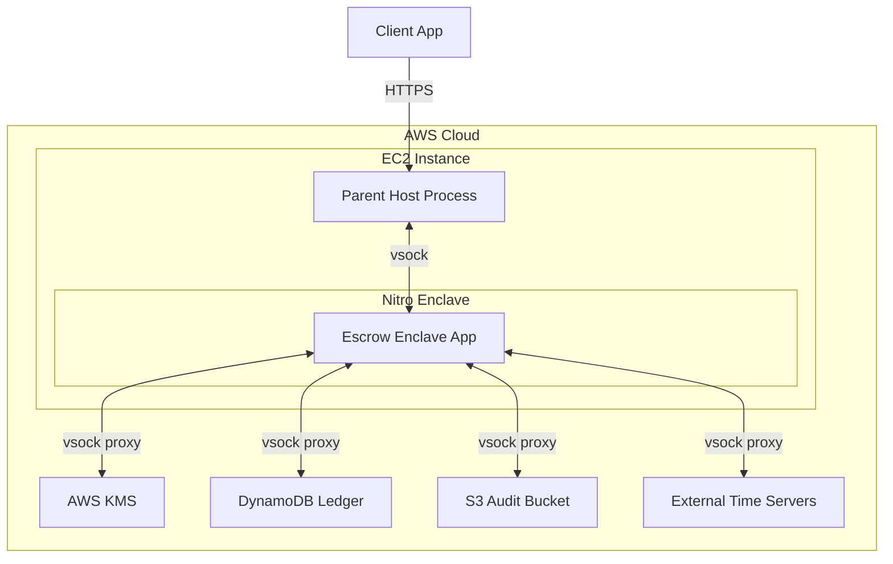

# Security Review Packet: Escrow Enclave

This document provides a comprehensive security overview of the Escrow Enclave system, detailing its trust boundaries, threat model, cryptographic guarantees, and known limitations. It is intended for external security reviewers and internal auditors.

## System Overview and Trust Boundaries

The Escrow Enclave is a hardware-isolated environment (AWS Nitro Enclaves) responsible for securely holding and releasing encrypted account recovery keys. It enforces a strict release policy (7-day delay or PIN) that cannot be bypassed by the host operating system, the parent application (`lca-api`), or human operators.


```mermaid
flowchart TD
    subgraph AWS Cloud
        subgraph EC2 Instance
            Parent[Parent Host Process]
            subgraph Nitro Enclave
                Enclave[Escrow Enclave App]
            end
        end
        KMS[AWS KMS]
        DynamoDB[DynamoDB Ledger]
        S3[S3 Audit Bucket]
        Time[External Time Servers]
    end

    Client[Client App] -->|HTTPS| Parent
    Parent <-->|vsock| Enclave
    Enclave <-->|vsock proxy| KMS
    Enclave <-->|vsock proxy| DynamoDB
    Enclave <-->|vsock proxy| S3
    Enclave <-->|vsock proxy| Time
```

**Trust Boundaries:**

- **Trusted:** The measured enclave code (`services/escrow-enclave-app/`), AWS Nitro hypervisor isolation, AWS KMS (for key sealing), and pinned external time authorities (Roughtime).
- **Untrusted:** The parent EC2 host (`services/escrow-enclave-host/`), the `lca-api` service, the network, and human operators (including database administrators).

## Assets

1. **Escrow Private Key:** A P-256 key deterministically derived inside the enclave from an attested KMS-generated 32-byte seed. The parent stores only the seed's KMS CiphertextBlob; neither seed nor derived private key leaves the enclave in plaintext.
2. **User Recovery Pieces:** Encrypted blobs submitted by clients. The enclave decrypts these only when the release policy is satisfied.
3. **PIN Budgets:** The remaining number of PIN attempts (max 10) for a given enrollment.
4. **Ledger State:** The history of holds, cancellations, and releases, ensuring a hold cannot be replayed or a PIN budget bypassed.

## Adversaries

- **Compromised Host/Parent:** Can drop, delay, or reorder messages. Can deny service by refusing to persist data or route traffic. Cannot read enclave memory or forge enclave signatures.
- **Compromised `lca-api`:** Can submit malicious requests or attempt to brute-force PINs. Constrained by the enclave's PIN budget and cryptographic verification.
- **Malicious Operator / Key Admin:** Can delete infrastructure or modify IAM policies. A key admin with MFA can theoretically rewrite the KMS key policy (see Residual Risk below).
- **Network Attacker:** Can observe or tamper with traffic between the client and the parent, or the parent and external services. Mitigated by TLS and enclave-verified signatures.
- **Malicious Client:** Can submit malformed requests or attempt to exploit parsing vulnerabilities. Mitigated by strict input validation and memory-safe Rust code.

## Design Decisions

- **D1 (Instance Size):** The enclave requires an `m6i.xlarge` instance. AWS requires at least 2 vCPUs for the parent host, so a 2-vCPU enclave necessitates a 4-vCPU parent instance.
- **D2 (Time Sources):** The enclave hypervisor clock was considered but not used. Measured code pins Cloudflare (draft-08), int08h and Tanner Ryan (Google legacy), with a 2-of-3 quorum and a shared two-second query deadline. All authenticated intervals must intersect; no majority/outlier exclusion. The 10s radius cap accommodates rough/smeared time without weakening the seven-day comparison. Bad signatures/timeouts count as unavailable; one unavailable source is tolerated, two fail closed. int08h and Tanner passed live verification on 2026-09-30; Cloudflare timed out. Public-source uptime and high-volume service-use approval remain staging obligations.
- **D3 (Rollback Detection):** The anti-replay ledger provides rollback _detection_, not prevention. A fresh-booted enclave cannot know the true head (Trust On First Use). Strict prevention requires quorum replicas, which is deferred.
- **D4 (KMS Recipient Flow):** The enclave generates a boot-time RSA-2048 recipient keypair. First boot calls `GenerateDataKey(KeySpec=AES_256, Recipient=NSM attestation)` with `{purpose:escrow-enclave-key,keyId}` context; subsequent boots call `Decrypt` with the same context and Recipient. Both reject any Plaintext field (including empty), require nonempty recipient ciphertext, and accept exactly 32 seed bytes after CMS opening. Generation additionally requires a nonempty CiphertextBlob for persistence. Domain-separated HKDF-SHA256 binds keyId and rejection-samples the escrow P-256 scalar; the seed/scalar buffers zeroize. No `Encrypt` operation exists in the enclave. No sealed-format migration is supported: Nitro never ran in production and the prior `nitro,kms` build did not compile. Deploy with a fresh restricted CMK, or prove it has never allowed attacker-known ciphertext generation: newly denying Encrypt does not invalidate pre-existing host-known 32-byte-seed ciphertexts.
- **D7 (KMS Key Policy):** The KMS key policy uses one statement per released measurement tuple. It requires an exact match on PCR0, PCR1, and PCR2 simultaneously to prevent cross-combination of measurements.
- **D10 (Key Admin Residual Risk):** An MFA-authenticated key admin can theoretically rewrite the KMS key policy to remove attestation gates. This residual risk is mitigated by mandatory two-person PR review and CloudTrail alarms, rather than an immutable key policy.
- **D11 (RSA/Marvin Rationale):** The `rsa` crate has a known timing side-channel (Marvin). This is accepted because the CMS blob only arrives inside the enclave's own TLS session to KMS, meaning the host cannot submit chosen ciphertexts.
- **D12 (Software Mode Blocked in Production):** The client guard (`getEscrowStrategyConfig` in `packages/learn-card-base/src/config/authConfig.ts`) downgrades `software` mode to `off` for production tenants (`learncard`, `vetpass`, `scoutpass`) whenever the resolved tenant config's deploy `stage` is `production` — which is also the fail-closed default for a missing or unrecognized stage. The guard keys on this deploy `stage`, not the Vite build mode (`IS_PRODUCTION`, i.e. `mode === 'production'`): staging deployments are Vite production-mode builds too (`apps/learn-card-app`'s `build` script runs `vite build` under `STAGE=staging`), so `IS_PRODUCTION` alone can't tell a staging deploy from production. Staging deliberately runs the software enclave (host-trusted, dev/test only) per #1565, with `stage: 'staging'` baked into the tenant config by `prepare-native-config.ts --stage staging` (learn-card-app) or the equivalent `VITE_NODE_ENV`-driven overlay (scouts). Independently, the enclave binary enforces this server-side: `--emulate` (software mode) is feature-gated behind `fake-nsm`/`fake-kms`/`fake-time`/`fake-ledger`, which a production `--features nitro,kms` build excludes, so that compiled binary refuses `--emulate` before binding.
- **D13 (Ledger Design):** The ledger uses one bounded chain per tenant/decrypted identity/blob hash (v2); epoch remains a signed binding, never a chain selector. PIN reservations consume an attempt before verification. Every carry/rewrap signs a destination-genesis `Carried` event committing to the source chain, observed source head and inherited attempts. The monitor checks that accounting on inserts and sweeps. Readback does not prove durable storage, as a malicious parent can retain signed bytes only in RAM. Time intervals describe signed processing events, not an authenticated upper bound on receipt time. Nitro never ran in production; no v1 chain migration is supported.
- **D14 (Release Replay Refused & Enrollment Boundary):** Release replay is explicitly refused after a `Released` state is observed. A crash or lost response after append but before returning ciphertext burns the hold. Additionally, current enrollment is a required trust boundary: the production enclave currently wires in `UnavailableEnrollment`, so every mutating operation fails closed until an authenticated, fresh enrollment source is integrated.
- **D15 (Cancel-Link Token Primitive):** Cancel-link tokens (`services/learn-card-network/lca-api/src/helpers/escrowCancelToken.ts`) are 256-bit random values stored as SHA-256 hashes and compared in constant time — the same primitive as resume tokens. They are single-use and valid only while the hold is `pending`. An HMAC was considered and rejected: the token is random and never derived from other data, so a keyed hash would add no security over a plain hash of a high-entropy secret.
- **D18 (Enclave key stability and rotation):** The escrow key is generated once and KMS-sealed (`services/escrow-enclave-app/src/kms.rs`); any build whose PCRs are in the key policy unseals the same key, so new builds and redeploys keep the same `keyId` and all existing copies stay readable (measurement rotation ≠ key rotation). The `keyId` changes only by deliberate rotation or if the host loses the sealed key. Previous keys (up to 3) are read-only, advertised and bound in the signed attestation, and new copies are always sealed with the current key. PIN carry and re-seal preserve the attempt count (D17/P8.3). Honest limits: (a) **lost sealed key** — if the host loses the sealed key object and first boot generates a new one, every copy under the old key is unrecoverable by escrow (users fall back to other recovery methods); mitigations = the sealed key lives under a create-only `sealed-keys/` prefix in the versioned artifacts bucket, where the enclave-host IAM role can create but never overwrite or delete an existing sealed key object (`infra/escrow-enclave/iam.tf`'s scoped `s3:PutObject`, `storage.tf`'s bucket policy denying any unconditional `sealed-keys/*` write, no `s3:DeleteObject`/`s3:DeleteObjectVersion` grant anywhere), the bucket's versioning preserves prior object versions if an admin ever does replace one, and `ESCROW_ALLOW_FIRST_BOOT` stays off in steady state (`services/escrow-enclave-host/README.md`); (b) **re-seal vs. a recovery starting at the same moment** — the rewrap job (`services/learn-card-network/lca-api/src/jobs/escrowBlobRewrap.ts`) skips accounts with a pending hold, but a hold started between that check and the write refers to the old copy, and its release will then be refused; this is rare (once per user per rotation), fails safe, and the user starts a new recovery.

## Guarantees vs. Non-Guarantees

We are scrupulously honest about the limits of this system. The following table outlines what the system enforces versus what it only detects or relies on operational controls for.

| Threat                          | Prevention / Detection Boundary                                                                                                                                                                                                                                                                                                                                                                                                                         | Citation                                                                                 |
| :------------------------------ | :------------------------------------------------------------------------------------------------------------------------------------------------------------------------------------------------------------------------------------------------------------------------------------------------------------------------------------------------------------------------------------------------------------------------------------------------------ | :--------------------------------------------------------------------------------------- |
| Forged/modified ledger record   | **Prevented** by enclave signature and sequence verification.                                                                                                                                                                                                                                                                                                                                                                                           | `services/escrow-enclave-app/README.md`                                                  |
| Ledger rollback / stale history | **Detected**, not prevented. A fresh enclave cannot distinguish the true latest head from an old valid head supplied by the parent. Requires independent monitor.                                                                                                                                                                                                                                                                                       | `services/escrow-enclave-app/README.md`, [Design Decisions](#design-decisions) (D3, D13) |
| Release replay                  | **Prevented**. Once `Released` is observed, every retry is refused. A crash after append but before returning ciphertext burns the hold. (Note: Today, all production releases fail closed due to the enrollment blocker).                                                                                                                                                                                                                              | `services/escrow-enclave-app/README.md`, [Design Decisions](#design-decisions) (D14)     |
| Enclave clock manipulation      | **Enforced** by a compiled 2-of-3 Roughtime quorum (Cloudflare, int08h, Tanner Ryan); every valid interval must overlap. One unavailable/invalid-signature source is tolerated; two or any authenticated disagreement fail closed. The hypervisor clock was considered but not used. Signed processing events are not an authenticated upper bound on receipt time.                                                                                     | `services/escrow-enclave-app/README.md`, [Design Decisions](#design-decisions) (D2, D13) |
| PIN attempt budget bypass       | **Enforced per blob**: changing epoch cannot select a fresh chain. Carry/rewrap preserve spent attempts in encrypted `pinAttemptsFloor` and signed `Carried` genesis records; the monitor verifies source-head accounting. Fresh-boot/parallel-instance history rollback remains D3 detection-only. Choosing an older PIN-bearing blob with fewer attempts remains BLOCKER-ENROLLMENT, not a globally replay-proof budget.                              | [Design Decisions](#design-decisions) (D13)                                              |
| Key Admin policy rewrite        | **Residual Risk**. An MFA-authenticated admin can rewrite the KMS policy to remove attestation gates. Mitigated by PR review and CloudTrail alarms.                                                                                                                                                                                                                                                                                                     | `infra/escrow-enclave/README.md`, [Design Decisions](#design-decisions) (D10)            |
| RSA timing side-channels        | **Accepted Risk**. The `rsa` crate has a known timing side-channel (Marvin). Exploitation requires chosen ciphertexts, which the enclave does not accept from the host (only via verified KMS TLS).                                                                                                                                                                                                                                                     | [Design Decisions](#design-decisions) (D11)                                              |
| Software mode in production     | **Prevented**. The client guard downgrades software mode to `off` for production tenants whenever the deploy `stage` is `production` (the fail-closed default). Staging deliberately runs the software enclave (host-trusted, dev/test only) — the guard keys on deploy stage, not Vite build mode, since staging is a production-mode build too. The enclave binary separately excludes the software-mode emulator from `nitro,kms` production builds. | [Design Decisions](#design-decisions) (D12)                                              |
| Lost sealed key                 | **Accepted Risk**. If the host loses the sealed key object and generates a new one, all existing copies under the old key are unrecoverable by escrow. Mitigated by the create-only `sealed-keys/` prefix in the versioned artifacts bucket (the host role can create but never overwrite or delete an existing sealed key) and keeping `ESCROW_ALLOW_FIRST_BOOT` off in steady state.                                                                  | [Design Decisions](#design-decisions) (D18)                                              |
| Re-seal vs. concurrent recovery | **Fails Safe**. A recovery hold started between the rewrap job's check and its write refers to the old copy, and its release will be refused. The user must start a new recovery.                                                                                                                                                                                                                                                                       | [Design Decisions](#design-decisions) (D18)                                              |

## KMS Key Policy Summary

The AWS KMS Customer Master Key (CMK) policy (`infra/escrow-enclave/kms.tf`) is the primary security boundary enforcing attestation.

- **Per-Tuple PCR Statements:** `kms:GenerateDataKey` and `kms:Decrypt` are granted via individual statements for each approved measurement tuple (PCR0, PCR1, PCR2). Conditions use `StringEqualsIgnoreCase` and require all three PCRs to match simultaneously.
- **Key-Substitution Denies:** Deny `kms:Encrypt`, `kms:ReEncrypt*`, `kms:GenerateDataKeyWithoutPlaintext`, and `kms:GenerateDataKeyPair*` for all principals. Attestation-only Decrypt is insufficient if the host can mint ciphertext for known plaintext. These denies and fresh-CMK provenance are required deployment contracts, not a property the Rust CMS parser can establish.
- **Grant Ban:** `kms:CreateGrant` is explicitly denied for all principals to prevent bypassing the policy via grants.
- **Missing/Debug Attestation Deny:** GenerateDataKey and Decrypt must be explicitly denied without recipient attestation or with any all-zero debug PCR.
- **MFA on Policy Changes:** `escrow-kms-admin` (the only non-root principal with `kms:PutKeyPolicy`) can only be assumed by listed IAM users with MFA under an hour old. The key policy additionally denies `kms:PutKeyPolicy` to the root user without MFA (`BoolIfExists`, so root access keys are denied too). The MFA deny can't cover the role itself: role sessions report `aws:MultiFactorAuthPresent=false` even when assumed with MFA, so KMS's lockout check rejects such a policy.
- **No IAM delegation:** The root break-glass statement is restricted to the root user with `aws:PrincipalArn`. A bare `arn:aws:iam::<account>:root` principal grants the account, so any IAM admin (including `OrganizationAccountAccessRole`) could otherwise rewrite the key policy without MFA; this was found and closed during staging bring-up.

## Measurement Rotation Procedure (N / N+1)

`ESCROW_TENANT`, `ESCROW_KEY_ID`, `ESCROW_KMS_REGION`, `ESCROW_KMS_KEY_ARN`,
`ESCROW_PREVIOUS_KEY_IDS`, and `ESCROW_ALLOW_FIRST_BOOT` are Docker ARG→ENV measured
configuration. `build-eif.sh` validates required flags/env and records them under
`measurements.json.config`; CI supplies repository variables. The EIF does not
inherit the parent's environment. Changes to any value require rebuilding and
reviewing new PCRs, including the provisioning→steady-state first-boot flag change.
Linux startup writes the validated regional KMS→127.0.0.1 mapping to `/etc/hosts`
before KMS access and fails closed on error. The final image contains a non-root
owned writable hosts file; real EIF permissions/NSM/vsock access remain staging checks.

When the enclave code changes, the EIF measurements (PCRs) change. To rotate without downtime (`infra/escrow-enclave/README.md`):

1. **Build N+1:** The CI workflow (`.github/workflows/escrow-enclave-eif.yml`) builds the EIF twice and verifies reproducibility. The resulting `measurements.json` is committed to `security/escrow-measurements.json`.
2. **Add N+1:** Update `infra/escrow-enclave/variables.tf` (or tfvars) to include both N and N+1 measurements. Apply the Terraform change (requires two-person review and MFA).
3. **Roll ASG:** Update the ASG to deploy the N+1 image.
4. **Update Clients:** Publish the new measurements to the tenant config so clients accept N+1 attestations.
5. **Retire N:** Once all instances and clients are updated, remove the N measurement from the Terraform configuration and apply.

## Key Rotation Procedure

To deliberately rotate the escrow key (e.g., periodic rotation or suspected compromise):

1. **Generate New Key:** Configure a new `ESCROW_KEY_ID` and a new `ESCROW_SEALED_KEY_OBJECT` under an unused path in the `sealed-keys/` prefix (e.g. `sealed-keys/escrow-enclave-key-v2` if `v1` is current) — this path must not already exist, since both the host's own conditional write and Terraform's bucket policy (`infra/escrow-enclave/storage.tf`) refuse to overwrite an existing object at it. Temporarily set `ESCROW_ALLOW_FIRST_BOOT=true` on **both** the host and the enclave to allow the enclave to generate and seal the new key at that new path.
2. **Turn Off First Boot:** As soon as the new key is sealed, set `ESCROW_ALLOW_FIRST_BOOT` back to `false` (or unset it) on both the host and the enclave and restart. Confirm the new sealed object exists under `sealed-keys/` (e.g. `aws s3api head-object --bucket <artifacts-bucket> --key sealed-keys/escrow-enclave-key-v2`) before proceeding. Leaving the flag on is a standing risk — see "Lost sealed key" above.
3. **Configure Previous Key:** Move the OLD key ID to `ESCROW_PREVIOUS_KEY_IDS` and its OLD sealed object path (e.g. `sealed-keys/escrow-enclave-key-v1`) to `ESCROW_PREVIOUS_KEY_OBJECTS` on the host. Apply these config changes (requires two-person review).
4. **Verify Attestation:** Confirm the signed attestation lists the new key as current and the old key as previous.
5. **Migrate Blobs:** Let sign-in re-enrolls and the hourly rewrap job (`escrowBlobRewrap`) migrate existing blobs to the new key.
6. **Monitor Progress:** Watch migration progress using `bun scripts/escrow-blob-mode-report.ts --current-key-id=<new> --previous-key-ids=<old>`.
7. **Retire Previous Key:** Once the report shows 0 copies under the old key (or after deciding the remainder falls back to other recovery methods), remove it from the host configuration.

Enclave-side steps above require rebuilding the measured image, not only changing
the host environment. Keep previous keys while retained active histories reference
their ledger signatures, even if blob migration is complete. Policy derives a
keyId→ledger-verifier map from current plus up to three previous unsealed keys;
each record selects its verifier with signed CBOR key 10, unknown IDs fail, and new
appends always use the current signer. Before rotation, publish the monitor SSM
String parameter as `{"<keyId>":"<130-character lowercase hex SEC1 P-256 key>",...}`
(1–4 entries), retaining old attestation-validated ledger public keys. A bare
130-hex key remains accepted with legacy single-key/single-keyId semantics; it
cannot verify mixed-key chains. Recycle monitor execution environments on updates.

## Incident Response Pointers

- **Monitor Alarms:** The independent ledger monitor (`services/escrow-ledger-monitor/`) runs every 15 minutes. It alarms on DynamoDB/S3 divergence, invalid signatures, or unexpected `MODIFY`/`REMOVE` events on the append-only ledger.
- **Kill Switch:** If tampering is suspected, operators must manually set `ESCROW_RELEASE_KILL_SWITCH=true` in the `lca-api` environment and redeploy. This refuses starting and completing recovery; cancellation and notifications keep working. The monitor does not auto-flip this switch to prevent denial-of-service attacks. (`services/escrow-ledger-monitor/README.md`, `services/learn-card-network/lca-api/src/routes/escrow.ts`)

## Open Items / Launch Blockers

- **BLOCKER-TIME — source-count gap resolved; operational review remains:** Three operator-published keys are compiled in: Cloudflare, int08h and Tanner Ryan. The latter two passed live signature/nonce/parser verification on 2026-09-30; Cloudflare timed out. Google sandbox is removed and production no longer needs the old feature gate. Tests cover 2-of-3 outage tolerance, two unavailable sources, bad signatures and authenticated dissent. Before launch confirm Cloudflare from staging, obtain Tanner's requested high-volume infrastructure approval, and review public-service availability/rate limits. No Netnod Roughtime endpoint/key could be established from its official pages, so none is guessed. Signed processing-time/delayed-delivery limitations remain unchanged. ([Design Decisions](#design-decisions) D2)
- **BLOCKER-ENROLLMENT:** Production uses `UnavailableEnrollment`; create hold, release and cancel fail closed until a fresh, independently authenticated `{epoch,shareVersion,blobHash}` authority exists. A host-database response or replayable signed snapshot is insufficient. **The host can still choose an older PIN-bearing blob with fewer recorded attempts**; closing that requires the authenticated current-enrollment authority. The host cannot mint the real recovery share, but can replay old encrypted copies. Carry/rewrap do not call EnrollmentSource, but now require trusted TimeSource evidence to sign their destination records. There is no separate startup time feature gate: startup constructs the compiled Roughtime source, and operations fail closed on unavailable evidence.
- **RESOLVED-PIN-EPOCH-CARRY (P8.3/H1, v2):** Chain identity is SHA-256 of `learncard-ledger-chain-v2\0 || tenant_byte_length_u64_be || tenant || sha256(did) || blob_hash`. `sourceEnrollmentEpoch` still binds signed source records but never selects the chain. Stateful `observe` rejects changed epoch, invalid or remembered stale history with `Ledger`; storage failures map to `Unavailable`. Every carry/rewrap appends and reads back a first `Carried` event on the output blob's empty chain before returning ciphertext. Its code-7 CBOR array is `[7, sourceChainId(bytes32), sourceHeadHash(bytes32), attemptsCarried(uint 0..10)]`. The floor is `min(10, sourceCarried + sourceAttemptsUsed)`; positive encrypted floors must match the first signed Carried event on carry, hold creation and release. Carry binds `targetEnrollmentEpoch`; rewrap preserves the source epoch. Append failure returns no blob. The monitor checks the source prefix accounting on INSERT and sweeps without recursive ancestry traversal. An all-zero head denotes an empty prefix with floor zero (the source may have later acquired ordinary hold records); nonzero heads must exist in the authenticated source chain. Client-made new blobs legitimately start at zero. Nitro never ran in production, so there is no chain migration.
    - **Deliberate deviation from a literal `max(chain.attempts_used, floor)`:** the ledger's own `ChainState.attempts_used` stays a purely LOCAL, per-epoch-chain counter (`ledger.rs`/`Enrollment` are otherwise unchanged) — the floor is combined with it only at the `policy.rs` call sites (`release_pin`'s budget/lock-timing check, `carry_pin_verifier`'s floor computation), never baked into the ledger's own replay/validation logic. This was a deliberate choice, not an oversight: seeding `ChainState`'s replay from an externally-supplied floor would require the independent **ledger monitor** (`services/escrow-ledger-monitor/`) — which has no blob-decryption capability and therefore no way to learn the true floor — to also know it, or it would false-positive-alarm (`LedgerIntegrityFailure`) on every post-carry chain. Keeping the ledger's own chain encoding and validation untouched preserves the monitor's independent verification unmodified (confirmed: `cargo test` for `escrow-ledger-monitor` is unaffected by this change) and needed no change to the canonical CBOR record schema (golden bytes test `ledger::tests::golden_cbor_and_strict_bounded_decode` is unmodified and still passes). One side effect: the enclave-signed `PinAttemptReserved`/`PinLocked` ledger events for a post-carry epoch are numbered LOCALLY (1, 2, 3, …) rather than showing the true cumulative attempt number, and the explicit `PinLocked` audit record is only written when the ledger's own local count reaches ten — with a nonzero floor the account can lock with a lower local count (`floor + local >= 10`), in which case no `PinLocked` marker is written (the lock is still fully enforced by the `>= 10` check on the next attempt; `PinLocked` is documented as an audit convenience, not the enforcement boundary, both before and after this change).
    - **Software mode (`softwareEnclave.ts`):** accepts `sourceEnrollmentEpoch` but ignores it. Software mode has no enclave ledger to reset in the first place — its PIN attempt budget is the host's `escrowPin.failedAttempts`/`verifiedFailedAttempts` counters in MongoDB, which `routes/escrow.ts`'s enroll route already copies forward unchanged on every carry, independent of `enrollmentEpoch`. Software mode therefore never had this bug; `pinAttemptsFloor` is a remote/nitro-mode-only concept, not implemented for software-mode enforcement (documented in `softwareEnclave.ts`).
    - **Same-process rollback fix (H1):** carry and rewrap both call the existing Policy ledger's stateful `observe`, not stateless `verify_chain`. This retains high-water marks and rejects empty/truncated chains and forks after the process has observed or signed a newer head. The source chain is read-only in storage, but observation mutates enclave memory. The same-instance regression spends three attempts and refuses both empty and truncated views on both paths.
- **Residual rollback caveat:** fresh boots and parallel enclaves can still accept stale valid history (D3). Epoch substitution no longer selects another chain. Older-copy selection belongs to BLOCKER-ENROLLMENT above. Suppressed writes/audit evidence and readback-only durability remain limitations; do not claim a globally replay-proof ten-attempt budget.

- **RESOLVED-BLOB-IDENTITY-MALLEABILITY:** The v1 envelope does not authenticate the ephemeral point, and P-256 ECDH yields the same shared x-coordinate for `Q` and `-Q`, so both decrypt identically. Blob identity (`crypto::escrow_blob_identity`) is therefore SHA-256 over a domain tag and length-prefixed decoded fields (version, algorithm, keyId, the point's x-coordinate only, salt, IV, ciphertext), not the serialized JSON. A negated-point twin or base64/JSON alias maps to the same chain, hold binding and Carried record. lca-api computes the same value (`services/escrow-enclave/blobIdentity.ts`), pinned by a shared golden vector over `escrow-vectors.json`. Any other change to the ciphertext, salt or IV fails AES-GCM authentication.

**Independent persistence checks (M9):** INSERT requires a head captured before
the chain read (valid prefix, at least the inserted sequence), and exact signed S3
bytes at `audit/<tenant>/<chainId>/<seq>-<record_hash_hex>.cbor`. Missing audits
receive at most three reads with 100 ms gaps; different bytes alarm immediately.
Sweeps paginate both heads and records (25 items/page, at most 10,000 pages per
table), detect record partitions lacking heads, and emit SweepCompleted only after
both scans finish. Operational errors/cap exhaustion fail the invocation, not a
fabricated empty result. Fully suppressed evidence remains outside detection.

## How to Verify

To verify the components locally (requires Rust 1.93 and Node.js):

**Enclave App (`services/escrow-enclave-app/`):**

```bash
cargo fmt --check
cargo clippy -- -D warnings
cargo test
cargo clippy --features fake-ledger,fake-time,fake-kms,fake-nsm -- -D warnings
cargo check --features nitro,kms
```

**Enclave Host (`services/escrow-enclave-host/`):**

```bash
cargo fmt --check
cargo clippy -- -D warnings
cargo test
```

**Ledger Monitor (`services/escrow-ledger-monitor/`):**

```bash
cargo fmt --check
cargo clippy --all-targets -- -D warnings
cargo test
```

**Infrastructure (`infra/escrow-enclave/`):**

```bash
terraform fmt -check -recursive
terraform init -backend=false
terraform validate
```
