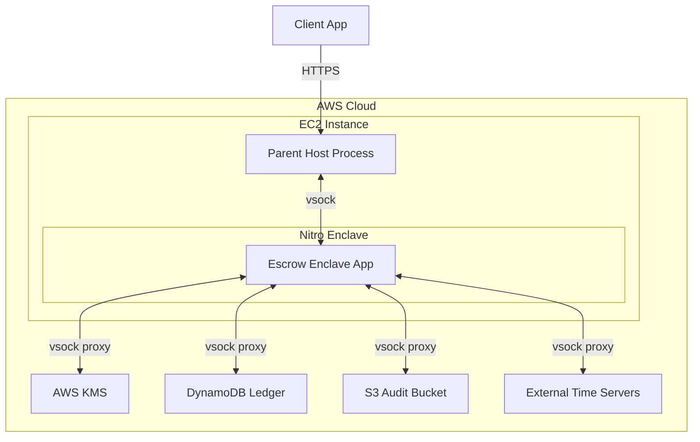

# Security Review Packet: Escrow Enclave

This document provides a comprehensive security overview of the Escrow Enclave system, detailing its trust boundaries, threat model, cryptographic guarantees, and known limitations. It is intended for external security reviewers and internal auditors.

## System Overview and Trust Boundaries

The Escrow Enclave is a hardware-isolated environment (AWS Nitro Enclaves) responsible for securely holding and releasing encrypted account recovery keys. It enforces a strict release policy (7-day delay or PIN) that cannot be bypassed by the host operating system, the parent application (`lca-api`), or human operators.


```mermaid
flowchart TD
    subgraph AWS Cloud
        subgraph EC2 Instance
            Parent[Parent Host Process]
            subgraph Nitro Enclave
                Enclave[Escrow Enclave App]
            end
        end
        KMS[AWS KMS]
        DynamoDB[DynamoDB Ledger]
        S3[S3 Audit Bucket]
        Time[External Time Servers]
    end

    Client[Client App] -->|HTTPS| Parent
    Parent <-->|vsock| Enclave
    Enclave <-->|vsock proxy| KMS
    Enclave <-->|vsock proxy| DynamoDB
    Enclave <-->|vsock proxy| S3
    Enclave <-->|vsock proxy| Time
```

**Trust Boundaries:**

- **Trusted:** The measured enclave code (`services/escrow-enclave-app/`), AWS Nitro hypervisor isolation, AWS KMS (for key sealing), and pinned external time authorities (Roughtime).
- **Untrusted:** The parent EC2 host (`services/escrow-enclave-host/`), the `lca-api` service, the network, and human operators (including database administrators).

## Assets

1. **Escrow Private Key:** An ECDSA P-256 private key generated inside the enclave at first boot. It never leaves the enclave in plaintext. It is sealed via AWS KMS and stored by the parent.
2. **User Recovery Pieces:** Encrypted blobs submitted by clients. The enclave decrypts these only when the release policy is satisfied.
3. **PIN Budgets:** The remaining number of PIN attempts (max 10) for a given enrollment.
4. **Ledger State:** The history of holds, cancellations, and releases, ensuring a hold cannot be replayed or a PIN budget bypassed.

## Adversaries

- **Compromised Host/Parent:** Can drop, delay, or reorder messages. Can deny service by refusing to persist data or route traffic. Cannot read enclave memory or forge enclave signatures.
- **Compromised `lca-api`:** Can submit malicious requests or attempt to brute-force PINs. Constrained by the enclave's PIN budget and cryptographic verification.
- **Malicious Operator / Key Admin:** Can delete infrastructure or modify IAM policies. A key admin with MFA can theoretically rewrite the KMS key policy (see Residual Risk below).
- **Network Attacker:** Can observe or tamper with traffic between the client and the parent, or the parent and external services. Mitigated by TLS and enclave-verified signatures.
- **Malicious Client:** Can submit malformed requests or attempt to exploit parsing vulnerabilities. Mitigated by strict input validation and memory-safe Rust code.

## Design Decisions

- **D1 (Instance Size):** The enclave requires an `m6i.xlarge` instance. AWS requires at least 2 vCPUs for the parent host, so a 2-vCPU enclave necessitates a 4-vCPU parent instance.
- **D2 (Time Sources):** The enclave clock is host-influenced and untrusted. Time evidence must come from ≥2 independent signed sources (Roughtime) checked inside the enclave. Non-overlapping intervals fail closed.
- **D3 (Rollback Detection):** The anti-replay ledger provides rollback _detection_, not prevention. A fresh-booted enclave cannot know the true head (Trust On First Use). Strict prevention requires quorum replicas, which is deferred.
- **D4 (KMS Recipient Flow):** The enclave generates a boot-time RSA-2048 keypair for the KMS recipient. KMS decrypts the sealed escrow key using this recipient key, returning CMS EnvelopedData which the enclave unwraps.
- **D7 (KMS Key Policy):** The KMS key policy uses one statement per released measurement tuple. It requires an exact match on PCR0, PCR1, and PCR2 simultaneously to prevent cross-combination of measurements.
- **D10 (Key Admin Residual Risk):** An MFA-authenticated key admin can theoretically rewrite the KMS key policy to remove attestation gates. This residual risk is mitigated by mandatory two-person PR review and CloudTrail alarms, rather than an immutable key policy.
- **D11 (RSA/Marvin Rationale):** The `rsa` crate has a known timing side-channel (Marvin). This is accepted because the CMS blob only arrives inside the enclave's own TLS session to KMS, meaning the host cannot submit chosen ciphertexts.
- **D12 (Software Mode Blocked in Production):** The client guard (`getEscrowStrategyConfig` in `packages/learn-card-base/src/config/authConfig.ts`) downgrades `software` mode to `off` for production tenants (`learncard`, `vetpass`, `scoutpass`) whenever the resolved tenant config's deploy `stage` is `production` — which is also the fail-closed default for a missing or unrecognized stage. The guard keys on this deploy `stage`, not the Vite build mode (`IS_PRODUCTION`, i.e. `mode === 'production'`): staging deployments are Vite production-mode builds too (`apps/learn-card-app`'s `build` script runs `vite build` under `STAGE=staging`), so `IS_PRODUCTION` alone can't tell a staging deploy from production. Staging deliberately runs the software enclave (host-trusted, dev/test only) per #1565, with `stage: 'staging'` baked into the tenant config by `prepare-native-config.ts --stage staging` (learn-card-app) or the equivalent `VITE_NODE_ENV`-driven overlay (scouts). Independently, the enclave binary enforces this server-side: `--emulate` (software mode) is feature-gated behind `fake-nsm`/`fake-kms`/`fake-time`/`fake-ledger`, which a production `--features nitro,kms` build excludes, so that compiled binary refuses `--emulate` before binding.
- **D13 (Ledger Design):** The ledger uses one bounded chain per enrollment epoch. PIN reservations consume an attempt before verification. Readback does not prove durable storage, as a malicious parent can retain signed bytes only in RAM. Time intervals describe signed processing events, not an authenticated upper bound on receipt time.
- **D14 (Release Replay Refused & Enrollment Boundary):** Release replay is explicitly refused after a `Released` state is observed. A crash or lost response after append but before returning ciphertext burns the hold. Additionally, current enrollment is a required trust boundary: the production enclave currently wires in `UnavailableEnrollment`, so every mutating operation fails closed until an authenticated, fresh enrollment source is integrated.
- **D15 (Cancel-Link Token Primitive):** Cancel-link tokens (`services/learn-card-network/lca-api/src/helpers/escrowCancelToken.ts`) are 256-bit random values stored as SHA-256 hashes and compared in constant time — the same primitive as resume tokens. They are single-use and valid only while the hold is `pending`. An HMAC was considered and rejected: the token is random and never derived from other data, so a keyed hash would add no security over a plain hash of a high-entropy secret.
- **D18 (Enclave key stability and rotation):** The escrow key is generated once and KMS-sealed (`services/escrow-enclave-app/src/kms.rs`); any build whose PCRs are in the key policy unseals the same key, so new builds and redeploys keep the same `keyId` and all existing copies stay readable (measurement rotation ≠ key rotation). The `keyId` changes only by deliberate rotation or if the host loses the sealed key. Previous keys (up to 3) are read-only, advertised and bound in the signed attestation, and new copies are always sealed with the current key. PIN carry and re-seal preserve the attempt count (D17/P8.3). Honest limits: (a) **lost sealed key** — if the host loses the sealed key object and first boot generates a new one, every copy under the old key is unrecoverable by escrow (users fall back to other recovery methods); mitigations = the sealed key lives under a create-only `sealed-keys/` prefix in the versioned artifacts bucket, where the enclave-host IAM role can create but never overwrite or delete an existing sealed key object (`infra/escrow-enclave/iam.tf`'s scoped `s3:PutObject`, `storage.tf`'s bucket policy denying any unconditional `sealed-keys/*` write, no `s3:DeleteObject`/`s3:DeleteObjectVersion` grant anywhere), the bucket's versioning preserves prior object versions if an admin ever does replace one, and `ESCROW_ALLOW_FIRST_BOOT` stays off in steady state (`services/escrow-enclave-host/README.md`); (b) **re-seal vs. a recovery starting at the same moment** — the rewrap job (`services/learn-card-network/lca-api/src/jobs/escrowBlobRewrap.ts`) skips accounts with a pending hold, but a hold started between that check and the write refers to the old copy, and its release will then be refused; this is rare (once per user per rotation), fails safe, and the user starts a new recovery.

## Guarantees vs. Non-Guarantees

We are scrupulously honest about the limits of this system. The following table outlines what the system enforces versus what it only detects or relies on operational controls for.

| Threat                          | Prevention / Detection Boundary                                                                                                                                                                                                                                                                                                                                                                                                                         | Citation                                                                                 |
| :------------------------------ | :------------------------------------------------------------------------------------------------------------------------------------------------------------------------------------------------------------------------------------------------------------------------------------------------------------------------------------------------------------------------------------------------------------------------------------------------------ | :--------------------------------------------------------------------------------------- |
| Forged/modified ledger record   | **Prevented** by enclave signature and sequence verification.                                                                                                                                                                                                                                                                                                                                                                                           | `services/escrow-enclave-app/README.md`                                                  |
| Ledger rollback / stale history | **Detected**, not prevented. A fresh enclave cannot distinguish the true latest head from an old valid head supplied by the parent. Requires independent monitor.                                                                                                                                                                                                                                                                                       | `services/escrow-enclave-app/README.md`, [Design Decisions](#design-decisions) (D3, D13) |
| Release replay                  | **Prevented**. Once `Released` is observed, every retry is refused. A crash after append but before returning ciphertext burns the hold. (Note: Today, all production releases fail closed due to the enrollment blocker).                                                                                                                                                                                                                              | `services/escrow-enclave-app/README.md`, [Design Decisions](#design-decisions) (D14)     |
| Enclave clock manipulation      | **Enforced** by requiring ≥2 agreeing signed Roughtime sources; fails closed otherwise. **Today releases fail closed** because only one usable production source exists. Time intervals describe signed processing events, not an authenticated upper bound on receipt time.                                                                                                                                                                            | `services/escrow-enclave-app/README.md`, [Design Decisions](#design-decisions) (D2, D13) |
| PIN attempt budget bypass       | **Enforced** by the enclave ledger per enrollment epoch, with the consumed budget carried forward across a rotation via `pinAttemptsFloor` so a carry never resets it (P8.3). Rollback of the ledger head, or of the source epoch presented to a carry, is detection-only, so the budget is only as strong as rollback detection.                                                                                                                       | [Design Decisions](#design-decisions) (D13)                                              |
| Key Admin policy rewrite        | **Residual Risk**. An MFA-authenticated admin can rewrite the KMS policy to remove attestation gates. Mitigated by PR review and CloudTrail alarms.                                                                                                                                                                                                                                                                                                     | `infra/escrow-enclave/README.md`, [Design Decisions](#design-decisions) (D10)            |
| RSA timing side-channels        | **Accepted Risk**. The `rsa` crate has a known timing side-channel (Marvin). Exploitation requires chosen ciphertexts, which the enclave does not accept from the host (only via verified KMS TLS).                                                                                                                                                                                                                                                     | [Design Decisions](#design-decisions) (D11)                                              |
| Software mode in production     | **Prevented**. The client guard downgrades software mode to `off` for production tenants whenever the deploy `stage` is `production` (the fail-closed default). Staging deliberately runs the software enclave (host-trusted, dev/test only) — the guard keys on deploy stage, not Vite build mode, since staging is a production-mode build too. The enclave binary separately excludes the software-mode emulator from `nitro,kms` production builds. | [Design Decisions](#design-decisions) (D12)                                              |
| Lost sealed key                 | **Accepted Risk**. If the host loses the sealed key object and generates a new one, all existing copies under the old key are unrecoverable by escrow. Mitigated by the create-only `sealed-keys/` prefix in the versioned artifacts bucket (the host role can create but never overwrite or delete an existing sealed key) and keeping `ESCROW_ALLOW_FIRST_BOOT` off in steady state.                                                                  | [Design Decisions](#design-decisions) (D18)                                              |
| Re-seal vs. concurrent recovery | **Fails Safe**. A recovery hold started between the rewrap job's check and its write refers to the old copy, and its release will be refused. The user must start a new recovery.                                                                                                                                                                                                                                                                       | [Design Decisions](#design-decisions) (D18)                                              |

## KMS Key Policy Summary

The AWS KMS Customer Master Key (CMK) policy (`infra/escrow-enclave/kms.tf`) is the primary security boundary enforcing attestation.

- **Per-Tuple PCR Statements:** `kms:Decrypt` is granted via individual statements for each approved measurement tuple (PCR0, PCR1, PCR2). Conditions use `StringEqualsIgnoreCase` and require all three PCRs to match simultaneously.
- **Grant Ban:** `kms:CreateGrant` is explicitly denied for all principals to prevent bypassing the policy via grants.
- **Debug-PCR Deny:** `kms:Decrypt` is explicitly denied if the attestation document contains the all-zero debug-mode PCR values.
- **MFA on Policy Changes:** `kms:PutKeyPolicy` is denied unless the caller's session is MFA-authenticated (`aws:MultiFactorAuthPresent`).

## Measurement Rotation Procedure (N / N+1)

When the enclave code changes, the EIF measurements (PCRs) change. To rotate without downtime (`infra/escrow-enclave/README.md`):

1. **Build N+1:** The CI workflow (`.github/workflows/escrow-enclave-eif.yml`) builds the EIF twice and verifies reproducibility. The resulting `measurements.json` is committed to `security/escrow-measurements.json`.
2. **Add N+1:** Update `infra/escrow-enclave/variables.tf` (or tfvars) to include both N and N+1 measurements. Apply the Terraform change (requires two-person review and MFA).
3. **Roll ASG:** Update the ASG to deploy the N+1 image.
4. **Update Clients:** Publish the new measurements to the tenant config so clients accept N+1 attestations.
5. **Retire N:** Once all instances and clients are updated, remove the N measurement from the Terraform configuration and apply.

## Key Rotation Procedure

To deliberately rotate the escrow key (e.g., periodic rotation or suspected compromise):

1. **Generate New Key:** Configure a new `ESCROW_KEY_ID` and a new `ESCROW_SEALED_KEY_OBJECT` under an unused path in the `sealed-keys/` prefix (e.g. `sealed-keys/escrow-enclave-key-v2` if `v1` is current) — this path must not already exist, since both the host's own conditional write and Terraform's bucket policy (`infra/escrow-enclave/storage.tf`) refuse to overwrite an existing object at it. Temporarily set `ESCROW_ALLOW_FIRST_BOOT=true` on **both** the host and the enclave to allow the enclave to generate and seal the new key at that new path.
2. **Turn Off First Boot:** As soon as the new key is sealed, set `ESCROW_ALLOW_FIRST_BOOT` back to `false` (or unset it) on both the host and the enclave and restart. Confirm the new sealed object exists under `sealed-keys/` (e.g. `aws s3api head-object --bucket <artifacts-bucket> --key sealed-keys/escrow-enclave-key-v2`) before proceeding. Leaving the flag on is a standing risk — see "Lost sealed key" above.
3. **Configure Previous Key:** Move the OLD key ID to `ESCROW_PREVIOUS_KEY_IDS` and its OLD sealed object path (e.g. `sealed-keys/escrow-enclave-key-v1`) to `ESCROW_PREVIOUS_KEY_OBJECTS` on the host. Apply these config changes (requires two-person review).
4. **Verify Attestation:** Confirm the signed attestation lists the new key as current and the old key as previous.
5. **Migrate Blobs:** Let sign-in re-enrolls and the hourly rewrap job (`escrowBlobRewrap`) migrate existing blobs to the new key.
6. **Monitor Progress:** Watch migration progress using `bun scripts/escrow-blob-mode-report.ts --current-key-id=<new> --previous-key-ids=<old>`.
7. **Retire Previous Key:** Once the report shows 0 copies under the old key (or after deciding the remainder falls back to other recovery methods), remove it from the host configuration.

## Incident Response Pointers

- **Monitor Alarms:** The independent ledger monitor (`services/escrow-ledger-monitor/`) runs every 15 minutes. It alarms on DynamoDB/S3 divergence, invalid signatures, or unexpected `MODIFY`/`REMOVE` events on the append-only ledger.
- **Kill Switch:** If tampering is suspected, operators must manually set `ESCROW_RELEASE_KILL_SWITCH=true` in the `lca-api` environment and redeploy. This refuses starting and completing recovery; cancellation and notifications keep working. The monitor does not auto-flip this switch to prevent denial-of-service attacks. (`services/escrow-ledger-monitor/README.md`, `services/learn-card-network/lca-api/src/routes/escrow.ts`)

## Open Items / Launch Blockers

- **BLOCKER-TIME:** The system requires ≥2 independent Roughtime sources. Currently, only Cloudflare is viable (Google's sandbox is unreachable/unsupported). A second production-grade source must be identified and pinned before launch. ([Design Decisions](#design-decisions) D2)
- **BLOCKER-ENROLLMENT:** The production enclave has no authenticated `EnrollmentSource`. `src/server/parent/nitro.rs` wires in `UnavailableEnrollment`, so every mutating operation (create hold, release, cancel) fails closed with `Unavailable` in a Nitro build. `EnrollmentSource::current(tenant, did)` must independently authenticate the current `{epoch, shareVersion, blobHash}` and serialize rotation with policy operations; a host-database lookup or replayable signed snapshot is not acceptable (anyone can encrypt to the enclave's public key, so a blob proves neither ownership nor currentness). A protocol design and separate security review are required. ([Design Decisions](#design-decisions) D14). **Exception:** `carryPinVerifier` (P8.1/P8.3, `Policy::carry_pin_verifier`) is a decrypt/validate/reseal that calls neither `EnrollmentSource` nor `TimeSource` — so it is not gated by this blocker and works in a Nitro build today. P8.3 added a READ-ONLY ledger chain lookup (verifying the source epoch's chain with the same checks `release_pin` uses, to carry the spent PIN attempt budget forward — see RESOLVED-PIN-EPOCH-CARRY below); it still never appends/mutates a chain, so this exception still holds.
- **RESOLVED-PIN-EPOCH-CARRY (P8.3):** the enclave ledger's PIN attempt budget is keyed by `(tenant, enrollment, epoch)` (D13), and every successful blob write bumps `escrowBlob.enrollmentEpoch` — including a PIN carry — so a naive carry handed the new epoch's chain a fresh ten-attempt budget for an unchanged PIN. Fixed by adding an optional `pinAttemptsFloor` (0..=10) to the escrow blob plaintext (`EscrowBlobPlaintext`, absent means 0, stripped before any release plaintext reaches the client exactly like `pinVerifier`). `carryPinVerifier`'s wire request gained `sourceEnrollmentEpoch` (threaded from the old blob's `enrollmentEpoch`, which lca-api already has at the enroll call site) so the enclave can locate the source epoch's ledger chain; it verifies that chain with the same signature/sequence/binding checks `release_pin` uses (`Ledger::verify_chain`, read-only — a failure is a fail-closed `Ledger`/`Unavailable` error, never silently treated as empty), and writes `pinAttemptsFloor = source.pinAttemptsFloor.unwrap_or(0) + source_chain.attempts_used` (capped at ten) into the re-sealed target. `release_pin` then refuses once `chain.attempts_used + floor >= 10`, so a carried PIN gets only `10 - floor` further local reservations — a carry of a carry accumulates (never resets), and a carry never lowers a floor the source blob already had.
    - **Deliberate deviation from a literal `max(chain.attempts_used, floor)`:** the ledger's own `ChainState.attempts_used` stays a purely LOCAL, per-epoch-chain counter (`ledger.rs`/`Enrollment` are otherwise unchanged) — the floor is combined with it only at the `policy.rs` call sites (`release_pin`'s budget/lock-timing check, `carry_pin_verifier`'s floor computation), never baked into the ledger's own replay/validation logic. This was a deliberate choice, not an oversight: seeding `ChainState`'s replay from an externally-supplied floor would require the independent **ledger monitor** (`services/escrow-ledger-monitor/`) — which has no blob-decryption capability and therefore no way to learn the true floor — to also know it, or it would false-positive-alarm (`LedgerIntegrityFailure`) on every post-carry chain. Keeping the ledger's own chain encoding and validation untouched preserves the monitor's independent verification unmodified (confirmed: `cargo test` for `escrow-ledger-monitor` is unaffected by this change) and needed no change to the canonical CBOR record schema (golden bytes test `ledger::tests::golden_cbor_and_strict_bounded_decode` is unmodified and still passes). One side effect: the enclave-signed `PinAttemptReserved`/`PinLocked` ledger events for a post-carry epoch are numbered LOCALLY (1, 2, 3, …) rather than showing the true cumulative attempt number, and the explicit `PinLocked` audit record is only written when the ledger's own local count reaches ten — with a nonzero floor the account can lock with a lower local count (`floor + local >= 10`), in which case no `PinLocked` marker is written (the lock is still fully enforced by the `>= 10` check on the next attempt; `PinLocked` is documented as an audit convenience, not the enforcement boundary, both before and after this change).
    - **Software mode (`softwareEnclave.ts`):** accepts `sourceEnrollmentEpoch` but ignores it. Software mode has no enclave ledger to reset in the first place — its PIN attempt budget is the host's `escrowPin.failedAttempts`/`verifiedFailedAttempts` counters in MongoDB, which `routes/escrow.ts`'s enroll route already copies forward unchanged on every carry, independent of `enrollmentEpoch`. Software mode therefore never had this bug; `pinAttemptsFloor` is a remote/nitro-mode-only concept, not implemented for software-mode enforcement (documented in `softwareEnclave.ts`).
    - **Rollback caveat (unchanged from D3):** the host chooses which source epoch's chain to present to `carryPinVerifier`. Presenting an older/emptier chain than the truth yields a lower floor than reality — the same rollback exposure the ledger already has everywhere else (detection-only via the independent monitor, never a strict prevention guarantee; see D3/D13).

## How to Verify

To verify the components locally (requires Rust 1.93 and Node.js):

**Enclave App (`services/escrow-enclave-app/`):**

```bash
cargo fmt --check
cargo clippy -- -D warnings
cargo test
cargo clippy --features fake-ledger,fake-time,fake-kms,fake-nsm -- -D warnings
cargo check --features nitro,kms
```

**Enclave Host (`services/escrow-enclave-host/`):**

```bash
cargo fmt --check
cargo clippy -- -D warnings
cargo test
```

**Ledger Monitor (`services/escrow-ledger-monitor/`):**

```bash
cargo fmt --check
cargo clippy --all-targets -- -D warnings
cargo test
```

**Infrastructure (`infra/escrow-enclave/`):**

```bash
terraform fmt -check -recursive
terraform init -backend=false
terraform validate
```
