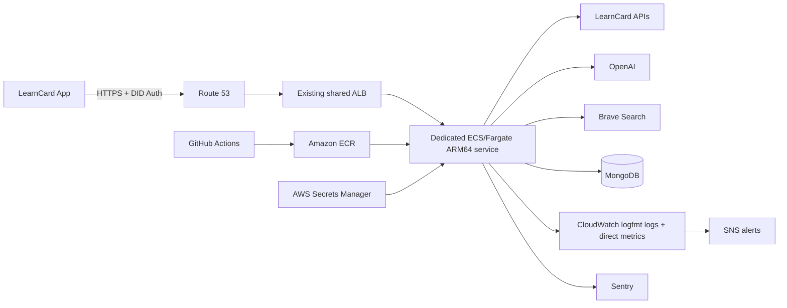

# LearnCard AI Agent AWS runbook

This runbook operates the HTTP AI Agent service from `services/learn-card-network/ai-agent`. Staging and production schedules use separate Trigger.dev projects and fail-closed LaunchDarkly gates. Production deploys with targeting off; access is enabled only through an explicit flag rollout.

## Architecture



The service uses ordinary Amazon ECS on Fargate rather than ECS Express Mode or Lambda. Agent runs can legitimately exceed API Gateway's normal synchronous timeout, and the HTTP handler awaits post-response trace persistence and self-improvement before it becomes idle. A continuously running task preserves those semantics without adding a second durable work queue.

The stack imports an existing cluster, VPC, private subnets, Application Load Balancer, HTTPS listener, listener security group, and Route 53 hosted zone as parameters. It does not own or delete them. It creates only the AI Agent's ARM64 task definition and service, task security group, target group, host listener rule, dedicated ACM certificate and listener attachment, DNS record, ECR repository, logs, autoscaling, dashboard, alarms, SNS topic, and execution role.

This shape reuses the account's fixed-cost ALB, NAT, DNS, and cluster infrastructure. The task has no public IP; outbound provider traffic exits through the selected private subnets' existing NAT gateway.

## Production boundary

The deployed process enforces these invariants at startup:

- `NODE_ENV=production`.
- MongoDB, wallet encryption seed, OpenAI provider, DID Auth domain, LearnCard endpoints, and ConsentFlow contract are explicit.
- Model input/output prices are explicit so estimated cost is not silently guessed.
- Debug routes are disabled. Production refuses to start when `AI_AGENT_DEBUG_ENABLED=true`.
- Local autonomy is disabled. Trigger.dev requires matching deployment environment labels, its runtime secret, and the environment's LaunchDarkly server SDK key.
- Every run is bounded by tool rounds, wall-clock time, output tokens, measured total tokens, and estimated model cost.

The load balancer calls `/api/health/ready`; a missing provider or unavailable MongoDB keeps a new task out of service. The ECS deployment circuit breaker rolls back a failed replacement while `MinimumHealthyPercent=100` preserves the working task.

## One-time AWS bootstrap

Create separate CloudFormation stacks for `staging` and `production`. The template is `infra/aws/template.yml`.

### 1. Create runtime secrets

Create one AWS Secrets Manager secret for each environment variable below. Store the raw value as the secret value, not a JSON object.

- `OPENAI_API_KEY`
- `BRAVE_SEARCH_API_KEY` when `WebSearchProvider=brave`
- `AI_AGENT_WALLET_SEED`
- `AI_AGENT_MONGO_URI`
- `SENTRY_DSN`
- the matching LaunchDarkly environment server-side SDK key used as `LAUNCHDARKLY_SDK_KEY`
- the dedicated Trigger.dev project's **PROD** secret used as `TRIGGER_SECRET_KEY`

Do not put secret values in parameter files, CloudFormation, shell history, GitHub variables, or logs. CloudFormation receives only secret ARNs.

The wallet seed is the encryption identity for persisted agent data. Back it up in the team's approved secret-recovery system before first use. Losing or replacing it makes existing encrypted records unreadable.

For an existing contract owned by a service profile, set the optional CloudFormation
`WalletDidWeb` parameter to that profile's DID. ECS exposes it as `AI_AGENT_WALLET_DID_WEB`.
For the production LearnCloud-owned LearnCard AI contract, use
`did:web:network.learncard.com:users:learn-cloud`. The seed's profile must already have
authorized access to act as that service profile; this setting does not grant permissions.
The service passes it to `initLearnCard` as `didWeb` for ConsentFlow and wallet tools.
Leave it blank to keep the existing seed-based network identity. Mongo persistence uses a
separate seed-only wallet, so selecting a service profile does not change encryption recipients.
Set the same `AI_AGENT_WALLET_DID_WEB` in the corresponding Trigger.dev environment when
using scheduled workers; CloudFormation does not populate Trigger.dev environment variables.

If a secret uses a customer-managed KMS key, grant the generated task execution role `kms:Decrypt` for that key before enabling the service. Secrets encrypted with the default Secrets Manager key need no additional KMS statement.

### 2. Select shared infrastructure

Fill these parameters from existing resources in one VPC:

- `ClusterName`
- `VpcId`
- `PrivateSubnetIds`, with NAT egress to OpenAI, Brave, Sentry, and public LearnCard APIs
- `LoadBalancerSecurityGroupId`
- `HttpsListenerArn`
- `LoadBalancerFullName`
- `LoadBalancerDnsName`
- `LoadBalancerCanonicalHostedZoneId`
- `HostedZoneId`

The stack references those resources but never owns them. Deleting the AI Agent stack cannot delete the shared cluster, VPC, subnets, NAT gateway, ALB, HTTPS listener, listener security group, or hosted zone.

Choose a listener-rule priority unused on the selected listener. The task security group allows port 3000 only from the selected ALB security group.

### 3. Validate the template

From the repository root:

```bash
uvx cfn-lint services/learn-card-network/ai-agent/infra/aws/template.yml

aws cloudformation validate-template \
  --region us-east-1 \
  --template-body file://services/learn-card-network/ai-agent/infra/aws/template.yml
```

Do not create or execute a change set unless both checks succeed.

### 4. Configure service parameters

```bash
cd services/learn-card-network/ai-agent/infra/aws
cp staging.parameters.example.json staging.parameters.json
```

Replace every placeholder. Parameter files contain secret ARNs, not secret values, but still describe internal infrastructure and are ignored by git.

Set `Hostname` and `AuthDomain` to the same origin, with `https://` present only in `AuthDomain`. Set model prices from the provider's official pricing page for the exact model.

### 5. Bootstrap ECR

The service needs its first image before CloudFormation can create its task definition. Temporarily set `CreateService=false` in `staging.parameters.json`, then create and review the ECR-only change set:

```bash
CHANGE_SET="bootstrap-$(date +%s)"

aws cloudformation create-change-set \
  --stack-name learncard-ai-agent-staging \
  --change-set-name "$CHANGE_SET" \
  --change-set-type CREATE \
  --template-body file://template.yml \
  --capabilities CAPABILITY_NAMED_IAM \
  --parameters file://staging.parameters.json

aws cloudformation wait change-set-create-complete \
  --stack-name learncard-ai-agent-staging \
  --change-set-name "$CHANGE_SET"

aws cloudformation describe-change-set \
  --stack-name learncard-ai-agent-staging \
  --change-set-name "$CHANGE_SET" \
  --query 'Changes[].{Action:Action,LogicalResourceId:LogicalResourceId,ResourceType:ResourceChange.ResourceType,Replacement:ResourceChange.Replacement}' \
  --output table
```

The bootstrap change set must contain only `AWS::ECR::Repository`. After review:

```bash
aws cloudformation execute-change-set \
  --stack-name learncard-ai-agent-staging \
  --change-set-name "$CHANGE_SET"

aws cloudformation wait stack-create-complete \
  --stack-name learncard-ai-agent-staging

ECR_REPOSITORY_URL="$(aws cloudformation describe-stacks \
  --stack-name learncard-ai-agent-staging \
  --query "Stacks[0].Outputs[?OutputKey=='EcrRepositoryUrl'].OutputValue" \
  --output text)"
```

### 6. Build and push the first ARM64 image

From the repository root:

```bash
SHA="$(git rev-parse HEAD)"
AWS_ACCOUNT_REGISTRY="${ECR_REPOSITORY_URL%%/*}"

aws ecr get-login-password --region us-east-1 \
  | docker login --username AWS --password-stdin "$AWS_ACCOUNT_REGISTRY"

docker buildx build \
  --platform linux/arm64 \
  -f services/learn-card-network/ai-agent/Dockerfile \
  --build-arg GIT_SHA="$SHA" \
  -t "$ECR_REPOSITORY_URL:sha-$SHA" \
  --push .
```

The root `.dockerignore` excludes `.env` and `**/.env.*`; confirm those rules remain before any production build. On an x86 workstation, install QEMU/binfmt before the local build. GitHub Actions configures QEMU automatically. The Docker build runs a runtime-image smoke that initializes two LearnCard wallets, issues a DID Auth VP, and verifies it through the packaged WASM; treat any failure as a blocked release.

### 7. Review and enable the service

Set `CreateService=true` and `ImageTag=sha-<git-sha>` in `staging.parameters.json`. Create an update change set:

```bash
CHANGE_SET="enable-service-$(date +%s)"

aws cloudformation create-change-set \
  --stack-name learncard-ai-agent-staging \
  --change-set-name "$CHANGE_SET" \
  --change-set-type UPDATE \
  --template-body file://template.yml \
  --capabilities CAPABILITY_NAMED_IAM \
  --parameters file://staging.parameters.json

aws cloudformation wait change-set-create-complete \
  --stack-name learncard-ai-agent-staging \
  --change-set-name "$CHANGE_SET"

aws cloudformation describe-change-set \
  --stack-name learncard-ai-agent-staging \
  --change-set-name "$CHANGE_SET" \
  --query 'Changes[].{Action:Action,LogicalResourceId:LogicalResourceId,ResourceType:ResourceChange.ResourceType,Replacement:ResourceChange.Replacement}' \
  --output table
```

Verify that the change set contains only the AI Agent resources listed below. It must not create, replace, or delete the imported cluster, VPC, subnets, NAT gateway, ALB, HTTPS listener, listener security group, or hosted zone. After review:

```bash
aws cloudformation execute-change-set \
  --stack-name learncard-ai-agent-staging \
  --change-set-name "$CHANGE_SET"

aws cloudformation wait stack-update-complete \
  --stack-name learncard-ai-agent-staging
```

The stack creates:

- retained ECR repository;
- ARM64 ECS/Fargate task definition and service on the imported cluster;
- task security group, target group, host-header rule, dedicated ACM certificate, listener certificate attachment, and Route 53 alias;
- request-count target-tracking autoscaling;
- 30-day CloudWatch log group;
- custom CloudWatch dashboard and alarms;
- SNS operations topic and optional email subscription.

Confirm the email subscription AWS sends to `AlertEmail`.

Get the public endpoint:

```bash
aws cloudformation describe-stacks \
  --stack-name learncard-ai-agent-staging \
  --query "Stacks[0].Outputs[?OutputKey=='ServiceEndpoint'].OutputValue" \
  --output text
```

The ACM certificate is validated through Route 53 and attached to the imported HTTPS listener before the host rule is created. `AuthDomain` must exactly match this final public HTTPS origin; DID Auth rejects mismatched domains.

### 8. Configure GitHub environments

Create `learn-card-ai-agent-staging` and `learn-card-ai-agent-production` GitHub environments.

Environment variables:

- `AWS_REGION`
- `AI_AGENT_AWS_ROLE_ARN`, an AWS role trusted only by the two AI Agent GitHub environments
- `AI_AGENT_ECR_REPOSITORY_URL` from the stack's `EcrRepositoryUrl` output
- `AI_AGENT_CLOUDFORMATION_STACK`
- `AI_AGENT_BASE_URL`, the final public HTTPS origin
- `AI_AGENT_TRIGGER_PROJECT_REF`, the environment's dedicated Trigger.dev project ref
- `AI_AGENT_TRIGGER_SECRET_KEY_SECRET_ARN`, the ARN of the AWS secret containing that project's PROD secret
- `AI_AGENT_LAUNCHDARKLY_SDK_KEY_SECRET_ARN`, the ARN of the AWS secret containing the matching LaunchDarkly environment's server-side SDK key

Environment secrets:

- `AI_AGENT_SMOKE_SEED` for staging only
- `TRIGGER_ACCESS_TOKEN` in both environments, containing a Trigger.dev personal access token
  beginning with `tr_pat_`; this deploys task code and is not the runtime project secret

Grant the workflow `id-token: write` and use GitHub OIDC; do not create long-lived AWS access keys. Scope the role trust policy to `repo:learningeconomy/LearnCard:environment:learn-card-ai-agent-staging` and `repo:learningeconomy/LearnCard:environment:learn-card-ai-agent-production`. Restrict its policy to the two AI Agent ECR repositories, CloudFormation stacks, and resource types the template manages. The service stack attaches only `logs:FilterLogEvents` for its own application log group so deployment can verify readable logs. Set `DeploymentRoleName` if the existing role is not named `learncard-ai-agent-github-deploy`. Require a non-self production approval and protected-branch deployment.

### 9. Configure the isolated Trigger.dev projects

The Learning Economy Trigger.dev plan does not expose a STAGING environment. Both deployments
use a project's **PROD** environment, but they must use different projects:

| LearnCard environment | Trigger project   | Project ref                 | `SENTRY_ENV` / `AI_AGENT_TRIGGER_ENVIRONMENT` |
| --------------------- | ----------------- | --------------------------- | --------------------------------------------- |
| Staging               | LearnCard Staging | `proj_lhgapsbwrnrqrszcpgzn` | `staging`                                     |
| Production            | LearnCard         | `proj_lyfepdqcmztsyzcqmcvx` | `production`                                  |

The workflow rejects an incorrect project/environment pairing and checks the CloudFormation
stack's environment before deploying any tasks. `trigger.config.ts` keeps the original LearnCard
project as the local-development default.

Configure each project's **Prod** environment with the same runtime values used by its ECS task:

- `NODE_ENV=production`, `SENTRY_ENV` and `AI_AGENT_TRIGGER_ENVIRONMENT` from the table,
  `AI_AGENT_TRIGGER_ENABLED=true`, `AI_AGENT_AUTONOMY_DEV_ENABLED=false`,
  `AI_AGENT_DEBUG_ENABLED=false`, and `AI_AGENT_SELF_IMPROVEMENT_ENABLED=true`
- `LAUNCHDARKLY_SDK_KEY` from the matching LearnCard LaunchDarkly environment
- `OPENAI_API_KEY`, `AI_AGENT_WALLET_SEED`, `AI_AGENT_MONGO_URI`, `SENTRY_DSN`, and
  `BRAVE_SEARCH_API_KEY` when Brave is enabled
- `AI_AGENT_WALLET_DID_WEB` when ECS uses a service profile, with the same value as ECS
- `AI_AGENT_AUTH_DOMAIN`, `AI_AGENT_CLOUD_URL`, `AI_AGENT_NETWORK_URL`,
  `AI_AGENT_CONSENT_FLOW_CONTRACT_URI`, and `AI_AGENT_CONSENT_FLOW_APP_URL`
- `AI_AGENT_MONGO_DB_NAME`, `AI_AGENT_ENCRYPTION_KEY_ID`, and the same
  run/budget/web-search settings as ECS

`trigger.config.ts` synchronizes GPT-5.6 Luna with its configured token prices, the trace
sample rate (`1` for staging, `0.1` for production), and the Git commit release. The workflow
passes `AI_AGENT_TRIGGER_ENVIRONMENT` into the CLI; set that variable explicitly for manual
Trigger deployments too. The remaining runtime variables above are pre-provisioned and must
be updated when their ECS counterparts rotate.

Trigger.dev injects that project's PROD `TRIGGER_SECRET_KEY` into task runs. Do not add the
personal access token to the task environment. The deployment workflow uses that PAT only for
`trigger deploy --env prod`, then enables ECS schedule synchronization with the AWS-stored
dedicated-project secret. CloudFormation requires both the Trigger and LaunchDarkly secret
references when enabling schedules, in staging or production.

## Staging test-account setup

`AI_AGENT_SMOKE_SEED` must belong to a dedicated, non-human staging profile that has accepted the configured ConsentFlow contract. Give it minimal synthetic credentials only.

The automated smoke test:

1. requests a DID Auth challenge;
2. creates a signed VP from the smoke seed;
3. runs the agent as that DID;
4. requires `getConsentedUserData`, `getUserMemoryManifest`, and `webSearch` to complete without a tool error; and
5. verifies a final response and run ID.

It explicitly tells the agent not to write user data. A missing grant, unavailable memory store, disabled Brave provider, or model failure fails deployment verification.

### Scheduled-job staging smoke

1. In the LearnCard LaunchDarkly staging environment—the environment with client-side ID
   `6a07749c1380120a8213715a`—create the boolean flag `ai-agent-autonomy-enabled`. Keep its
   default variation `false` and make it available to client-side SDKs.
2. Target the dedicated staging profile's DID with variation `true`. The service and app both
   evaluate the authenticated DID as the existing LaunchDarkly `user` context key, so individual
   targets and reusable segments work consistently. The Assistant page shows an unavailable
   schedules callout instead of controls when the client receives `false`.
3. Deploy the exact branch commit with the `Deploy` workflow command below.
4. The deployment smoke creates an enabled schedule two or three minutes ahead, confirms both
   Trigger.dev tasks complete, verifies the Assistant feed receives a card with a scheduled
   `sourceRunId`, and deletes the temporary schedule.

Any DID receiving the flag's `false` variation must fail schedule creation before Trigger.dev
creates a schedule. A missing flag or LaunchDarkly evaluation failure also fails closed and emits
an operational error. Keep prompts read-only during this staging gate because autonomous tools can
perform irreversible effects.

## Deploy

- Pull requests affecting the AI Agent or its shared dependencies run the **AI Agent CI**
  job: service tests, the Bun service build, and CloudFormation lint. This job has read-only
  repository permissions, no deployment environment or secrets, and never deploys.
  The repository also runs its required **Test** and **E2E** checks. Adding this workflow
  does not automatically make its new check required in branch protection.
- Pushes and manual deployments rerun **AI Agent CI** before the deployment job can start.
  Trigger.dev packaging, AWS validation, image scanning, and live smoke checks remain
  deployment-time gates, not PR checks.
- Every merge to `main` that changes the AI Agent, shared packages, lockfile, or container base
  deploys Trigger.dev staging tasks and ECS staging through
  `.github/workflows/deploy-ai-agent.yml`.
- Before that workflow exists on the default branch, dispatch the already-registered
  `.github/workflows/deploy.yml` from the feature ref:

    ```bash
    gh workflow run deploy.yml \
      --ref ai-agent-foundation \
      -f target-environment=staging \
      -f deploy-ai-agent=true
    ```

- Production is a manual workflow dispatch targeting `production`, deploys its separate Trigger
  project and enables schedule synchronization, and should require GitHub environment approval.
  Keep the production LaunchDarkly flag off throughout the initial deployment.
- Images receive an immutable `sha-<git-sha>` tag. Workflow retries reuse the existing image rather than overwriting it.
- The workflow rejects ARM64 images with critical or high ECR findings, updates the CloudFormation image tag and deployment ID, waits for the ECS rolling deployment with circuit-breaker rollback, checks readiness, and runs the authenticated smoke test in staging.

Before production dispatch:

1. Confirm the staging smoke test passed on the exact commit.
2. Inspect the CloudWatch dashboard and Sentry for staging errors.
3. Confirm current model prices and budget thresholds.
4. Confirm the ECR scan completed with no critical or high findings.
5. Record the current production `ImageTag` parameter for rollback.

After production dispatch, use the dedicated synthetic production test account for one read-only authenticated run. Do not use a real learner account for deployment verification.

### Controlled production schedule rollout

1. Keep production `ai-agent-autonomy-enabled` targeting **Off**, its off variation `false`,
   and its default rule `false`. Make the flag available to client-side SDKs as well.
2. Deploy the approved staging-tested commit. The production workflow intentionally skips the
   staging scheduled smoke: it must not open targeting or create a production schedule.
3. Using a dedicated synthetic production account, verify schedule API access is denied while
   the flag is off. The frontend alone is not an access-control boundary.
4. When ready for an internal trial, target only the synthetic account's production `did:web`
   with `true` and turn targeting on. Exercise a read-only scheduled run and inspect its run
   record, Assistant card, and telemetry before expanding access.
5. Turning targeting off blocks future schedule API calls, dispatches, and executions at their
   next access check, including queued work. It does not cancel an already-running agent.

Schedule occurrence deduplication and owner leases remain in place. They do not provide
tool-level idempotency or a reduced tool capability set; broad rollout requires separate
review of irreversible tool effects.

## Trace and troubleshoot one run

Every HTTP response includes `X-Request-ID`. The agent response includes `runId`.

The application log group is `/ecs/learncard-ai-agent-<environment>`. Filter logfmt messages by either correlation value:

```text
fields @timestamp, @message, @logStream
| filter @message like /runId=<run-id>/ or @message like /correlationId=<request-id>/
| sort @timestamp asc
```

The correlated event sequence is:

1. `http.request.completed`
2. `agent.run.started`
3. one or more `agent.model.completed` / `agent.model.failed`
4. zero or more `agent.tool.completed`
5. `agent.run.succeeded` / `agent.run.failed`
6. `agent.post-run.succeeded` / `agent.post-run.failed`

Autonomous development executions additionally emit `autonomy.cycle.completed` and `autonomy.occurrence.completed`.

Application logs are concise logfmt lines such as `INFO agent.run.succeeded runId=... durationMs=...`.
They contain hashed owner IDs, tool names, durations, outcomes, token counts, provider request IDs,
and cost estimates. They do not contain DIDs, prompts, model responses, tool arguments/results,
credentials, memory contents, or exception messages. Metrics use the CloudWatch `PutMetricData`
API and therefore do not add EMF JSON records to the application log stream. Ordinary application
logs are not forwarded to Sentry. Sentry receives a verified deployment event, sanitized
operational exceptions, and `ai.agent.run` transactions with `ai.model` and `ai.tool` child spans.
Staging samples all traces; production defaults to `0.1`.

## Common failures

| Symptom                                     | Check                                                                                                                                            |
| ------------------------------------------- | ------------------------------------------------------------------------------------------------------------------------------------------------ |
| ECS service cannot place a task             | Private subnet capacity, Fargate ARM64 availability, task security group, and execution-role permissions                                         |
| Listener rule or certificate creation fails | Listener ARN, unused priority, hosted-zone ownership, ACM validation records, and ELB permissions                                                |
| New task never becomes healthy              | `/api/health/ready`, Mongo connectivity, NAT/VPC routing, required secret ARNs, OpenAI secret                                                    |
| DID Auth always returns 401                 | `AI_AGENT_AUTH_DOMAIN` exactly matches the public origin; clocks are correct; challenge Mongo writes succeed                                     |
| `getConsentedUserData` fails                | Contract URI, test-account grant, LearnCard network/cloud URLs, agent wallet seed                                                                |
| Web search tool is missing                  | `AI_AGENT_WEB_SEARCH_PROVIDER=brave` and `BRAVE_SEARCH_API_KEY` secret are present                                                               |
| Sentry has no events                        | `/api/health` reports `observability.sentry.delivery=delivered`; verify the raw-URL `SENTRY_DSN`, NAT egress, and Sentry staging environment     |
| CloudWatch custom metrics are absent        | ECS task role permits `cloudwatch:PutMetricData`, `AI_AGENT_CLOUDWATCH_METRICS_ENABLED=true`, and the configured namespace matches the dashboard |
| Estimated cost is zero or implausible       | Model name and both current per-million token prices                                                                                             |
| Requests stop near two minutes              | `RunTimeoutMs`, client timeout, model/provider latency                                                                                           |
| ECS cannot read a secret                    | Secret ARN, execution-role resource policy, and `kms:Decrypt` for customer-managed keys                                                          |

## Secret and key rotation

- **OpenAI, Brave, or Sentry:** create a new provider credential, update the existing Secrets Manager value, run the deployment workflow to force a new ECS revision, verify, then revoke the old credential.
- **LaunchDarkly:** rotate the matching environment's server SDK key in both AWS Secrets Manager
  and its dedicated Trigger.dev project, deploy and verify, then revoke the old key.
- **MongoDB:** create a second database user, update `AI_AGENT_MONGO_URI`, deploy and verify, then remove the old user.
- **AI Agent wallet seed:** do not rotate in place. It is required to decrypt existing DAG-JWE records. Build and verify an explicit decrypt/re-encrypt migration with both identities before changing the secret.
- **`AI_AGENT_ENCRYPTION_KEY_ID`:** do not change it casually; it is part of the persisted encryption envelope/AAD contract. Treat a change as a data migration.

The workflow changes `DeploymentId` on every run so ECS replaces tasks and resolves current secret values even when the image SHA is unchanged.

## Rollback

Turn the affected environment's autonomy flag off first, then roll back CloudFormation to a
known-good immutable image. Disable schedule synchronization during rollback, including when
returning to an image that predates production Trigger support. Turning the flag off does not
cancel already-running Trigger tasks; handle those explicitly in the Trigger dashboard.

```bash
STACK_NAME="learncard-ai-agent-staging" # or production
GOOD_SHA="<known-good-git-sha>"

aws cloudformation deploy \
  --stack-name "$STACK_NAME" \
  --template-file services/learn-card-network/ai-agent/infra/aws/template.yml \
  --capabilities CAPABILITY_NAMED_IAM \
  --parameter-overrides \
    CreateService=true \
    EnableTriggerSchedules=false \
    ImageTag="sha-$GOOD_SHA" \
    DeploymentId="rollback-$(date +%s)"
```

CloudFormation preserves every unspecified existing parameter. Wait for the ECS rolling update, verify `/api/health/ready`, then perform the safe authenticated verification. A code rollback does not roll back MongoDB data. Schema/encryption changes therefore require backward-compatible rollout or a separately tested data rollback plan.
