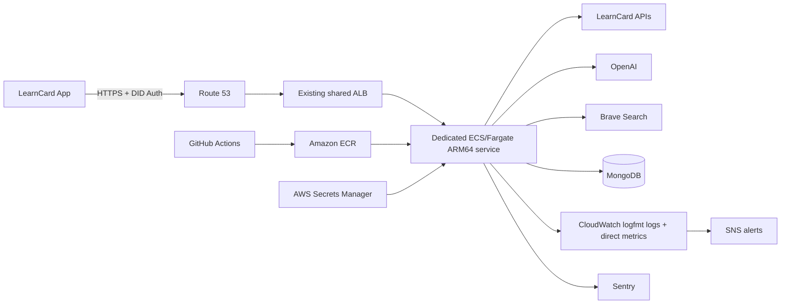

# LearnCard AI Agent AWS runbook

This runbook operates the HTTP AI Agent service from `services/learn-card-network/ai-agent`. Staging and production schedules use separate Trigger.dev projects and fail-closed LaunchDarkly gates. Production deploys with targeting off; access is enabled only through an explicit flag rollout.

## Architecture


```mermaid
flowchart LR
    LCA[LearnCard App] -->|HTTPS + DID Auth| R53[Route 53]
    R53 --> ALB[Existing shared ALB]
    ALB --> ECS[Dedicated ECS/Fargate ARM64 service]
    ECS --> LC[LearnCard APIs]
    ECS --> OA[OpenAI]
    ECS --> BS[Brave Search]
    ECS --> DB[(MongoDB)]
    ECS --> CW[CloudWatch logfmt logs + direct metrics]
    ECS --> SE[Sentry]
    GH[GitHub Actions] --> ECR[Amazon ECR]
    ECR --> ECS
    SM[AWS Secrets Manager] --> ECS
    CW --> SNS[SNS alerts]
```

The service uses ordinary Amazon ECS on Fargate rather than ECS Express Mode or Lambda. Agent runs can legitimately exceed API Gateway's normal synchronous timeout, and the HTTP handler awaits post-response trace persistence and self-improvement before it becomes idle. A continuously running task preserves those semantics without adding a second durable work queue.

The stack imports an existing cluster, VPC, private subnets, Application Load Balancer, HTTPS listener, listener security group, and Route 53 hosted zone as parameters. It does not own or delete them. It creates only the AI Agent's ARM64 task definition and service, task security group, target group, host listener rule, dedicated ACM certificate and listener attachment, DNS record, ECR repository, logs, autoscaling, dashboard, alarms, SNS topic, and execution role.

This shape reuses the account's fixed-cost ALB, NAT, DNS, and cluster infrastructure. The task has no public IP; outbound provider traffic exits through the selected private subnets' existing NAT gateway.

## Production boundary

The deployed process enforces these invariants at startup:

- `NODE_ENV=production`.
- MongoDB, wallet encryption seed, OpenAI provider, DID Auth domain, LearnCard endpoints, and ConsentFlow contract are explicit.
- Model input/output prices are explicit so estimated cost is not silently guessed.
- Debug routes are disabled. Production refuses to start when `AI_AGENT_DEBUG_ENABLED=true`.
- Local autonomy is disabled. Trigger.dev requires matching deployment environment labels, its runtime secret, and the environment's LaunchDarkly server SDK key.
- Every run is bounded by tool rounds, wall-clock time, output tokens, measured total tokens, and estimated model cost.

The load balancer calls `/api/health/ready`; a missing provider or unavailable MongoDB keeps a new task out of service. The ECS deployment circuit breaker rolls back a failed replacement while `MinimumHealthyPercent=100` preserves the working task.

## One-time AWS bootstrap

Create separate CloudFormation stacks for `staging` and `production`. The template is `infra/aws/template.yml`.

### 1. Create runtime secrets

Create one AWS Secrets Manager secret for each environment variable below. Store the raw value as the secret value, not a JSON object.

- `OPENAI_API_KEY`
- `BRAVE_SEARCH_API_KEY` when `WebSearchProvider=brave`
- `AI_AGENT_WALLET_SEED`
- `AI_AGENT_MONGO_URI`
- `SENTRY_DSN`
- the matching LaunchDarkly environment server-side SDK key used as `LAUNCHDARKLY_SDK_KEY`
- the dedicated Trigger.dev project's **PROD** secret used as `TRIGGER_SECRET_KEY`

Do not put secret values in parameter files, CloudFormation, shell history, GitHub variables, or logs. CloudFormation receives only secret ARNs.

The wallet seed is the encryption identity for persisted agent data. Back it up in the team's approved secret-recovery system before first use. Losing or replacing it makes existing encrypted records unreadable.

For an existing contract owned by a service profile, set the optional CloudFormation
`WalletDidWeb` parameter to that profile's DID. ECS exposes it as `AI_AGENT_WALLET_DID_WEB`.
For the production LearnCloud-owned LearnCard AI contract, use
`did:web:network.learncard.com:users:learn-cloud`. The seed's profile must already have
authorized access to act as that service profile; this setting does not grant permissions.
The service passes it to `initLearnCard` as `didWeb` for ConsentFlow and wallet tools.
Leave it blank to keep the existing seed-based network identity. Mongo persistence uses a
separate seed-only wallet, so selecting a service profile does not change encryption recipients.
Set the same `AI_AGENT_WALLET_DID_WEB` in the corresponding Trigger.dev environment when
using scheduled workers; CloudFormation does not populate Trigger.dev environment variables.

If a secret uses a customer-managed KMS key, grant the generated task execution role `kms:Decrypt` for that key before enabling the service. Secrets encrypted with the default Secrets Manager key need no additional KMS statement.

### 2. Select shared infrastructure

Fill these parameters from existing resources in one VPC:

- `ClusterName`
- `VpcId`
- `PrivateSubnetIds`, with NAT egress to OpenAI, Brave, Sentry, and public LearnCard APIs
- `LoadBalancerSecurityGroupId`
- `HttpsListenerArn`
- `LoadBalancerFullName`
- `LoadBalancerDnsName`
- `LoadBalancerCanonicalHostedZoneId`
- `HostedZoneId`

The stack references those resources but never owns them. Deleting the AI Agent stack cannot delete the shared cluster, VPC, subnets, NAT gateway, ALB, HTTPS listener, listener security group, or hosted zone.

Choose a listener-rule priority unused on the selected listener. The task security group allows port 3000 only from the selected ALB security group.

### 3. Validate the template

From the repository root:

```bash
uvx cfn-lint services/learn-card-network/ai-agent/infra/aws/template.yml

aws cloudformation validate-template \
  --region us-east-1 \
  --template-body file://services/learn-card-network/ai-agent/infra/aws/template.yml
```

Do not create or execute a change set unless both checks succeed.

### 4. Configure service parameters

```bash
cd services/learn-card-network/ai-agent/infra/aws
cp staging.parameters.example.json staging.parameters.json
```

Replace every placeholder. Parameter files contain secret ARNs, not secret values, but still describe internal infrastructure and are ignored by git.

Set `Hostname` and `AuthDomain` to the same origin, with `https://` present only in `AuthDomain`. Set model prices from the provider's official pricing page for the exact model.

### 5. Bootstrap ECR

The service needs its first image before CloudFormation can create its task definition. Temporarily set `CreateService=false` in `staging.parameters.json`, then create and review the ECR-only change set:

```bash
CHANGE_SET="bootstrap-$(date +%s)"

aws cloudformation create-change-set \
  --stack-name learncard-ai-agent-staging \
  --change-set-name "$CHANGE_SET" \
  --change-set-type CREATE \
  --template-body file://template.yml \
  --capabilities CAPABILITY_NAMED_IAM \
  --parameters file://staging.parameters.json

aws cloudformation wait change-set-create-complete \
  --stack-name learncard-ai-agent-staging \
  --change-set-name "$CHANGE_SET"

aws cloudformation describe-change-set \
  --stack-name learncard-ai-agent-staging \
  --change-set-name "$CHANGE_SET" \
  --query 'Changes[].{Action:Action,LogicalResourceId:LogicalResourceId,ResourceType:ResourceChange.ResourceType,Replacement:ResourceChange.Replacement}' \
  --output table
```

The bootstrap change set must contain only `AWS::ECR::Repository`. After review:

```bash
aws cloudformation execute-change-set \
  --stack-name learncard-ai-agent-staging \
  --change-set-name "$CHANGE_SET"

aws cloudformation wait stack-create-complete \
  --stack-name learncard-ai-agent-staging

ECR_REPOSITORY_URL="$(aws cloudformation describe-stacks \
  --stack-name learncard-ai-agent-staging \
  --query "Stacks[0].Outputs[?OutputKey=='EcrRepositoryUrl'].OutputValue" \
  --output text)"
```

### 6. Build and push the first ARM64 image

From the repository root:

```bash
SHA="$(git rev-parse HEAD)"
AWS_ACCOUNT_REGISTRY="${ECR_REPOSITORY_URL%%/*}"

aws ecr get-login-password --region us-east-1 \
  | docker login --username AWS --password-stdin "$AWS_ACCOUNT_REGISTRY"

docker buildx build \
  --platform linux/arm64 \
  -f services/learn-card-network/ai-agent/Dockerfile \
  --build-arg GIT_SHA="$SHA" \
  -t "$ECR_REPOSITORY_URL:sha-$SHA" \
  --push .
```

The root `.dockerignore` excludes `.env` and `**/.env.*`; confirm those rules remain before any production build. On an x86 workstation, install QEMU/binfmt before the local build. GitHub Actions configures QEMU automatically. The Docker build runs a runtime-image smoke that initializes two LearnCard wallets, issues a DID Auth VP, and verifies it through the packaged WASM; treat any failure as a blocked release.

### 7. Review and enable the service

Set `CreateService=true` and `ImageTag=sha-<git-sha>` in `staging.parameters.json`. Create an update change set:

```bash
CHANGE_SET="enable-service-$(date +%s)"

aws cloudformation create-change-set \
  --stack-name learncard-ai-agent-staging \
  --change-set-name "$CHANGE_SET" \
  --change-set-type UPDATE \
  --template-body file://template.yml \
  --capabilities CAPABILITY_NAMED_IAM \
  --parameters file://staging.parameters.json

aws cloudformation wait change-set-create-complete \
  --stack-name learncard-ai-agent-staging \
  --change-set-name "$CHANGE_SET"

aws cloudformation describe-change-set \
  --stack-name learncard-ai-agent-staging \
  --change-set-name "$CHANGE_SET" \
  --query 'Changes[].{Action:Action,LogicalResourceId:LogicalResourceId,ResourceType:ResourceChange.ResourceType,Replacement:ResourceChange.Replacement}' \
  --output table
```

Verify that the change set contains only the AI Agent resources listed below. It must not create, replace, or delete the imported cluster, VPC, subnets, NAT gateway, ALB, HTTPS listener, listener security group, or hosted zone. After review:

```bash
aws cloudformation execute-change-set \
  --stack-name learncard-ai-agent-staging \
  --change-set-name "$CHANGE_SET"

aws cloudformation wait stack-update-complete \
  --stack-name learncard-ai-agent-staging
```

The stack creates:

- retained ECR repository;
- ARM64 ECS/Fargate task definition and service on the imported cluster;
- task security group, target group, host-header rule, dedicated ACM certificate, listener certificate attachment, and Route 53 alias;
- request-count target-tracking autoscaling;
- 30-day CloudWatch log group;
- custom CloudWatch dashboard and alarms;
- SNS operations topic and optional email subscription.

Confirm the email subscription AWS sends to `AlertEmail`.

Get the public endpoint:

```bash
aws cloudformation describe-stacks \
  --stack-name learncard-ai-agent-staging \
  --query "Stacks[0].Outputs[?OutputKey=='ServiceEndpoint'].OutputValue" \
  --output text
```

The ACM certificate is validated through Route 53 and attached to the imported HTTPS listener before the host rule is created. `AuthDomain` must exactly match this final public HTTPS origin; DID Auth rejects mismatched domains.

### 8. Configure GitHub environments

Create `learn-card-ai-agent-staging` and `learn-card-ai-agent-production` GitHub environments.

Environment variables:

- `AWS_REGION`
- `AI_AGENT_AWS_ROLE_ARN`, an AWS role trusted only by the two AI Agent GitHub environments
- `AI_AGENT_ECR_REPOSITORY_URL` from the stack's `EcrRepositoryUrl` output
- `AI_AGENT_CLOUDFORMATION_STACK`
- `AI_AGENT_BASE_URL`, the final public HTTPS origin
- `AI_AGENT_TRIGGER_PROJECT_REF`, the environment's dedicated Trigger.dev project ref
- `AI_AGENT_TRIGGER_SECRET_KEY_SECRET_ARN`, the ARN of the AWS secret containing that project's PROD secret
- `AI_AGENT_LAUNCHDARKLY_SDK_KEY_SECRET_ARN`, the ARN of the AWS secret containing the matching LaunchDarkly environment's server-side SDK key

Environment secrets:

- `AI_AGENT_SMOKE_SEED` for staging only
- `TRIGGER_ACCESS_TOKEN` in both environments, containing a Trigger.dev personal access token
  beginning with `tr_pat_`; this deploys task code and is not the runtime project secret

Grant the workflow `id-token: write` and use GitHub OIDC; do not create long-lived AWS access keys. Scope the role trust policy to `repo:learningeconomy/LearnCard:environment:learn-card-ai-agent-staging` and `repo:learningeconomy/LearnCard:environment:learn-card-ai-agent-production`. Restrict its policy to the two AI Agent ECR repositories, CloudFormation stacks, and resource types the template manages. The service stack attaches only `logs:FilterLogEvents` for its own application log group so deployment can verify readable logs. Set `DeploymentRoleName` if the existing role is not named `learncard-ai-agent-github-deploy`. Require a non-self production approval and protected-branch deployment.

### 9. Configure the isolated Trigger.dev projects

The Learning Economy Trigger.dev plan does not expose a STAGING environment. Both deployments
use a project's **PROD** environment, but they must use different projects:

| LearnCard environment | Trigger project   | Project ref                 | `SENTRY_ENV` / `AI_AGENT_TRIGGER_ENVIRONMENT` |
| --------------------- | ----------------- | --------------------------- | --------------------------------------------- |
| Staging               | LearnCard Staging | `proj_lhgapsbwrnrqrszcpgzn` | `staging`                                     |
| Production            | LearnCard         | `proj_lyfepdqcmztsyzcqmcvx` | `production`                                  |

The workflow rejects an incorrect project/environment pairing and checks the CloudFormation
stack's environment before deploying any tasks. `trigger.config.ts` keeps the original LearnCard
project as the local-development default.

Configure each project's **Prod** environment with the same runtime values used by its ECS task:

- `NODE_ENV=production`, `SENTRY_ENV` and `AI_AGENT_TRIGGER_ENVIRONMENT` from the table,
  `AI_AGENT_TRIGGER_ENABLED=true`, `AI_AGENT_AUTONOMY_DEV_ENABLED=false`,
  `AI_AGENT_DEBUG_ENABLED=false`, and `AI_AGENT_SELF_IMPROVEMENT_ENABLED=true`
- `LAUNCHDARKLY_SDK_KEY` from the matching LearnCard LaunchDarkly environment
- `OPENAI_API_KEY`, `AI_AGENT_WALLET_SEED`, `AI_AGENT_MONGO_URI`, `SENTRY_DSN`, and
  `BRAVE_SEARCH_API_KEY` when Brave is enabled
- `AI_AGENT_WALLET_DID_WEB` when ECS uses a service profile, with the same value as ECS
- `AI_AGENT_AUTH_DOMAIN`, `AI_AGENT_CLOUD_URL`, `AI_AGENT_NETWORK_URL`,
  `AI_AGENT_CONSENT_FLOW_CONTRACT_URI`, and `AI_AGENT_CONSENT_FLOW_APP_URL`
- `AI_AGENT_MONGO_DB_NAME`, `AI_AGENT_ENCRYPTION_KEY_ID`, and the same
  run/budget/web-search settings as ECS

`trigger.config.ts` synchronizes GPT-5.6 Luna with its configured token prices, the trace
sample rate (`1` for staging, `0.1` for production), and the Git commit release. The workflow
passes `AI_AGENT_TRIGGER_ENVIRONMENT` into the CLI; set that variable explicitly for manual
Trigger deployments too. The remaining runtime variables above are pre-provisioned and must
be updated when their ECS counterparts rotate.

Trigger.dev injects that project's PROD `TRIGGER_SECRET_KEY` into task runs. Do not add the
personal access token to the task environment. The deployment workflow uses that PAT only for
`trigger deploy --env prod`, then enables ECS schedule synchronization with the AWS-stored
dedicated-project secret. CloudFormation requires both the Trigger and LaunchDarkly secret
references when enabling schedules, in staging or production.

## Staging test-account setup

`AI_AGENT_SMOKE_SEED` must belong to a dedicated, non-human staging profile that has accepted the configured ConsentFlow contract. Give it minimal synthetic credentials only.

The automated smoke test:

1. requests a DID Auth challenge;
2. creates a signed VP from the smoke seed;
3. runs the agent as that DID;
4. requires `getConsentedUserData`, `getUserMemoryManifest`, and `webSearch` to complete without a tool error; and
5. verifies a final response and run ID.

It explicitly tells the agent not to write user data. A missing grant, unavailable memory store, disabled Brave provider, or model failure fails deployment verification.

### Scheduled-job staging smoke

1. In the LearnCard LaunchDarkly staging environment—the environment with client-side ID
   `6a07749c1380120a8213715a`—create the boolean flag `ai-agent-autonomy-enabled`. Keep its
   default variation `false` and make it available to client-side SDKs.
2. Target the dedicated staging profile's DID with variation `true`. The service and app both
   evaluate the authenticated DID as the existing LaunchDarkly `user` context key, so individual
   targets and reusable segments work consistently. The Assistant page shows an unavailable
   schedules callout instead of controls when the client receives `false`.
3. Deploy the exact branch commit with the `Deploy` workflow command below.
4. The deployment smoke creates an enabled schedule two or three minutes ahead, confirms both
   Trigger.dev tasks complete, verifies the Assistant feed receives a card with a scheduled
   `sourceRunId`, and deletes the temporary schedule.

Any DID receiving the flag's `false` variation must fail schedule creation before Trigger.dev
creates a schedule. A missing flag or LaunchDarkly evaluation failure also fails closed and emits
an operational error. Keep prompts read-only during this staging gate because autonomous tools can
perform irreversible effects.

## Deploy

- Every pull request runs the **AI Agent CI** job: service tests, offline real-WASM feed
  and in-memory Sentry transport regressions, the Bun service build, and CloudFormation
  lint. This job has read-only repository permissions, no deployment environment or
  secrets, and never deploys. It also reports on unrelated PRs so making it a required
  check will not leave those PRs waiting for a path-filtered workflow.
  The repository also runs its required **Test** and **E2E** checks; branch protection
  must be configured separately to require **AI Agent CI**.
- The main **Deploy** workflow (`.github/workflows/deploy.yml`) owns deployment selection,
  just like the other services:
    - Ordinary `main` pushes deploy **staging** when Nx reports `ai-agent-service` affected
      and **Test Affected Projects** succeeds.
    - Changesets release pushes (`chore(release):`) deploy **production** when the AI Agent
      package manifest changes in the release commit. Releases without an AI Agent package
      change skip its production deployment.
    - Manual component overrides remain available in **Deploy** for operational reruns,
      but are not part of the normal release flow. ScoutPass selections do not deploy AI Agent.
- Include a changeset for `@learncard/ai-agent-service` with deployable changes. The package
  is private and is not published to npm, but Changesets still versions it and includes
  its bump in the usual release PR.
- All AI Agent deployment logic lives in `deploy.yml`: validation, Trigger.dev deployment,
  image build/scan, ECS rollout, and live checks. Its **AI Agent CI** job runs before the
  environment-protected deployment job starts.
- The existing `test.yml` workflow runs the PR-only **AI Agent CI** job with read-only
  permissions and no deployment environment. There are no separate AI Agent workflow files.
- Production begins automatically from the Changesets release; existing GitHub environment
  approval still applies. No separate action needs to be dispatched. Keep the production
  LaunchDarkly flag off throughout the initial deployment; workflows never open targeting.
- Trigger.dev packaging, AWS validation, image scanning, and live smoke checks remain
  deployment-time gates, not PR checks.
- Trigger SDK/build/CLI 4.5.7 explicitly selects `node-24` (Node 24.18.0); the service-local
  `.nvmrc`, engines, and AI Agent CI/deployment Node setup agree. Node 24 became a stable
  Trigger runtime in [4.5.7](https://trigger.dev/changelog/v4-5-7); the
  [runtime matrix](https://trigger.dev/docs/config/config-file#nodejs-versions) lists its
  exact version. Do not fall back to `runtime: 'node'`, which selects obsolete Node 21.
  ECS continues to use the independently pinned Bun 1.3.14 image.
- Images receive an immutable `sha-<git-sha>` tag. Workflow retries reuse the existing image rather than overwriting it.
- The workflow rejects ARM64 images with critical or high ECR findings, updates the CloudFormation image tag and deployment ID, waits for the ECS rolling deployment with circuit-breaker rollback, checks readiness, and runs the authenticated smoke test in staging.

Before merging the release PR and approving production:

1. Confirm the code being released passed staging smoke and the release PR passed CI.
   The Changesets version commit has a new SHA; the normal release flow does not deploy
   that version-only commit to staging before production.
2. Inspect the CloudWatch dashboard and Sentry for staging errors.
3. Confirm current model prices and budget thresholds.
4. Confirm the staging ECR scan completed with no critical or high findings.
5. Record the current production `ImageTag` parameter for rollback.

After production deployment, use the dedicated synthetic production test account for one read-only authenticated run. Do not use a real learner account for deployment verification.

### Controlled production schedule rollout

1. Keep production `ai-agent-autonomy-enabled` targeting **Off**, its off variation `false`,
   and its default rule `false`. Make the flag available to client-side SDKs as well.
2. Approve the Changesets-triggered deployment after staging and release CI pass. The production
   workflow intentionally skips the staging scheduled smoke: it must not open targeting or
   create a production schedule.
3. Using a dedicated synthetic production account, verify schedule API access is denied while
   the flag is off. The frontend alone is not an access-control boundary.
4. When ready for an internal trial, target only the synthetic account's production `did:web`
   with `true` and turn targeting on. Exercise a read-only scheduled run and inspect its run
   record, Assistant card, and telemetry before expanding access.
5. Turning targeting off blocks future schedule API calls, dispatches, and executions at their
   next access check, including queued work. It does not cancel an already-running agent.

Schedule occurrence deduplication and owner leases remain in place. A missed, unclaimed occurrence
can resume at the latest valid tick of the current schedule; previously claimed effects are not
replayed. The explicit wallet capability policy does not make permitted writes idempotent, so
broad rollout still requires review of irreversible tool effects.

Primary and retrospective work share the configured run deadline, token allowance, and cost
allowance. A separate retrospective model requires its own input/output prices; the default
retrospective model reuses the primary model and prices. Inspect both model dimensions when
troubleshooting cost, or the aggregate metric for total spend. Do not add the aggregate and
per-model views together.

## Trace and troubleshoot one run

Every HTTP response includes `X-Request-ID`. The agent response includes `runId`.

The application log group is `/ecs/learncard-ai-agent-<environment>`. Filter agent-phase logfmt messages by the returned `runId`:

```text
fields @timestamp, @message, @logStream
| filter @message like /runId=<run-id>/
| sort @timestamp asc
```

HTTP logs hash external `requestId`; agent-phase logs and Sentry hash correlation/provider IDs, even when UUID-shaped. To search by `X-Request-ID`, use `requestId=sha256:<first 24 hex characters of SHA-256(request ID)>` for HTTP logs and the same hash under `correlationId` for agent/Sentry records. The response header itself is unchanged. Service-generated UUID run IDs remain directly searchable.

The correlated records include:

1. `agent.run.started`
2. interleaved `agent.model.completed` / `agent.model.failed` and `agent.tool.completed`
3. `agent.run.succeeded` / `agent.run.failed`
4. retrospective model outcomes, when enabled
5. `agent.post-run.succeeded` / `agent.post-run.failed`

Autonomous development executions additionally emit `autonomy.cycle.completed` and `autonomy.occurrence.completed`.

Application logs are concise logfmt lines such as `INFO agent.run.succeeded runId=... durationMs=...`.
They contain hashed owner/correlation/provider identifiers, configured tool names (unknown names
are hashed), durations, outcomes, token counts, and cost estimates. Custom error-class metadata
is hashed in application logs. They do not contain DIDs, prompts, model responses, tool
arguments/results, credentials, memory contents, or exception messages. Metrics use the CloudWatch `PutMetricData`
API and therefore do not add EMF JSON records to the application log stream.

With Sentry configured, **all ordinary safe log records with a run ID are sent to both
CloudWatch and Sentry**, including the sequence above, contextual `service.error`, and
`autonomy.occurrence.completed` records with a run ID. Forwarding is confined to existing
sanitized per-run `writeLog` producers, never global console/stdout capture. HTTP completion
has no added run-ID propagation and stays CloudWatch-only, along with startup/delivery log
lines, autonomy cycle summaries, and occurrences without a run ID. A service error without run context still has its
existing separate Sentry operational exception, but not a forwarded run-log record.

The installed SDK 7.61.0 has no native structured Logs transport. Each forwarded record is
one bounded event with `recordKind=application-log`, `component=application-log`, and
`extra.logRecord` containing the original event name, log level, Unix timestamp, process-local
monotonic sequence, and capped primitive log fields. Warning records retain `level=warn`
inside the record and use Sentry's `warning` event severity. The existing 256-character string
limit applies. There is no whole-run list buffer or tail cap: long runs retain every emitted
safe record as separate events. Query by `recordKind=application-log` and `runId`; inspect
`extra.logRecord`. These are legacy Sentry events, not native Logs-product records. Ordering
uses timestamp and sequence within a process; sequence is not globally comparable across
workers or restarts.

Run-log tags have an explicit bounded allowlist: `component`, `recordKind`, `runId`,
hashed `correlationId`/`ownerId`, `triggerType`, `phase`, and `status`, when present. All
sanitized fields remain in `extra.logRecord.fields`. Counters, tool/model/runtime values,
budgets, provider IDs, schedule IDs, and timestamps are not indexed as run-log tags.
Existing lifecycle/error metadata is unchanged.

Sentry additionally receives the deployment check and the existing unsampled lifecycle/error
events for run start/success/failure, model outcomes, tool outcomes, and post-run outcomes.
`agent.post-run.started` remains a lifecycle event only: no ordinary log line is invented.
Events carry main/post-run phase, trigger type, budgets, duration, observed cumulative token
usage, completed model calls, and tool success/failure counts. Exception events preserve
privacy-safe original types, diagnostic text, up to five causes, and sanitized stack frames.
Primary and retrospective failures retain the original error/cause rather than replacing it
with an operational placeholder.

Performance transactions and child spans are separate: staging samples all traces and
production defaults to `0.1`; `SENTRY_TRACES_SAMPLE_RATE=0` still emits all safe run logs and
lifecycle/error events. Filter lifecycle/error events by run ID, environment, release, phase,
and status. A failed tool can coexist with a successful main run; post-run failure is also
distinct from the HTTP/main-run result.

Sensitive-content registration is bounded and local only. It covers request context, provider
responses before tool JSON parsing, tool arguments/results, and retrospective inputs/output.
Credential registration explicitly includes configured OpenAI/Brave keys, wallet seed, debug
token, Sentry DSN, Trigger secret, LaunchDarkly SDK key, and Mongo URI, including raw and
percent-decoded URI username/password. Environment credential values are additional inputs,
not the sole credential boundary. Malformed encoded userinfo fails closed.
When that registry is unavailable or exceeds its limits, uncertain diagnostic content is
withheld; known internal token/cost/deadline errors remain useful. Raw request/user contexts,
prompts, outputs, tool payloads, secrets, arbitrary error properties, and breadcrumbs are never
forwarded. Approved event snapshots remain private behind opaque SDK hint tokens; the final
SDK callback reconstructs only approved payloads and drops unapproved events.

Common-word masking is intentional. For example, a prompt mentioning "retry the connection"
masks "connection" in an external "Provider exhausted connection pool" diagnostic. Without
trusted provenance, the same word could be private content echoed by a provider or tool.
No stopword exemption or weaker token matching is introduced. Non-overlapping diagnostic
text, error type, sanitized frames, and existing known-safe internal literals remain useful;
overlapping external diagnostic detail is sacrificed to preserve prompt/output/tool privacy.

**Volume/cost:** each emitted safe run log adds one unsampled Sentry event, in addition to the
existing lifecycle/error event stream. A completed run adds `3 + M + T` log events for run
start/end, post-run end, model outcome records (`M`), and tool records (`T`), plus contextual
service-error and autonomy-occurrence records. HTTP completion adds no Sentry event.
A basic completed run with one model call and no tools is approximately 9 events rather
than 5 (5 lifecycle + 4 log records), for both HTTP and direct invocation: 80% more event
traffic with correspondingly higher ingestion/quota/storage cost. Static fingerprints group log events by event name, not by run.
Lower trace sampling does not lower this volume. Delivery remains subject to the configured
SDK transport, Sentry availability, quotas, and rate limits.

Offline regression commands (no live Sentry transport, production calls, or environment sync):

```bash
cd services/learn-card-network/ai-agent
bun run smoke:feed-wasm
bun run smoke:sentry
```

## Common failures

| Symptom                                     | Check                                                                                                                                            |
| ------------------------------------------- | ------------------------------------------------------------------------------------------------------------------------------------------------ |
| ECS service cannot place a task             | Private subnet capacity, Fargate ARM64 availability, task security group, and execution-role permissions                                         |
| Listener rule or certificate creation fails | Listener ARN, unused priority, hosted-zone ownership, ACM validation records, and ELB permissions                                                |
| New task never becomes healthy              | `/api/health/ready`, Mongo connectivity, NAT/VPC routing, required secret ARNs, OpenAI secret                                                    |
| DID Auth always returns 401                 | `AI_AGENT_AUTH_DOMAIN` exactly matches the public origin; clocks are correct; challenge Mongo writes succeed                                     |
| `getConsentedUserData` fails                | Contract URI, test-account grant, LearnCard network/cloud URLs, agent wallet seed                                                                |
| Web search tool is missing                  | `AI_AGENT_WEB_SEARCH_PROVIDER=brave` and `BRAVE_SEARCH_API_KEY` secret are present                                                               |
| Sentry has no events                        | `/api/health` reports `observability.sentry.delivery=delivered`; verify the raw-URL `SENTRY_DSN`, NAT egress, and Sentry staging environment     |
| CloudWatch custom metrics are absent        | ECS task role permits `cloudwatch:PutMetricData`, `AI_AGENT_CLOUDWATCH_METRICS_ENABLED=true`, and the configured namespace matches the dashboard |
| Estimated cost is zero or implausible       | Model name and both current per-million token prices                                                                                             |
| Requests stop near two minutes              | `RunTimeoutMs`, client timeout, model/provider latency                                                                                           |
| ECS cannot read a secret                    | Secret ARN, execution-role resource policy, and `kms:Decrypt` for customer-managed keys                                                          |

## Secret and key rotation

- **OpenAI, Brave, or Sentry:** create a new provider credential, update the existing Secrets Manager value, run the deployment workflow to force a new ECS revision, verify, then revoke the old credential.
- **LaunchDarkly:** rotate the matching environment's server SDK key in both AWS Secrets Manager
  and its dedicated Trigger.dev project, deploy and verify, then revoke the old key.
- **MongoDB:** create a second database user, update `AI_AGENT_MONGO_URI`, deploy and verify, then remove the old user.
- **AI Agent wallet seed:** do not rotate in place. It is required to decrypt existing DAG-JWE records. Build and verify an explicit decrypt/re-encrypt migration with both identities before changing the secret.
- **`AI_AGENT_ENCRYPTION_KEY_ID`:** do not change it casually; it is part of the persisted encryption envelope/AAD contract. Treat a change as a data migration.

The workflow changes `DeploymentId` on every run so ECS replaces tasks and resolves current secret values even when the image SHA is unchanged.

## Rollback

Turn the affected environment's autonomy flag off first, then roll back CloudFormation to a
known-good immutable image. Disable schedule synchronization during rollback, including when
returning to an image that predates production Trigger support. Turning the flag off does not
cancel already-running Trigger tasks; handle those explicitly in the Trigger dashboard.

```bash
STACK_NAME="learncard-ai-agent-staging" # or production
GOOD_SHA="<known-good-git-sha>"

aws cloudformation deploy \
  --stack-name "$STACK_NAME" \
  --template-file services/learn-card-network/ai-agent/infra/aws/template.yml \
  --capabilities CAPABILITY_NAMED_IAM \
  --parameter-overrides \
    CreateService=true \
    EnableTriggerSchedules=false \
    ImageTag="sha-$GOOD_SHA" \
    DeploymentId="rollback-$(date +%s)"
```

CloudFormation preserves every unspecified existing parameter. Wait for the ECS rolling update, verify `/api/health/ready`, then perform the safe authenticated verification. A code rollback does not roll back MongoDB data. Schema/encryption changes therefore require backward-compatible rollout or a separately tested data rollback plan.
